# EA Repository

**A generic, metamodel-driven enterprise architecture repository for the
ontology and agent era — DuckDB on a laptop today, Databricks tomorrow, the
same code.** Built first as a proof of concept for a university's data and
analytics unit, on its TOGAF-based metamodel and the curriculum domain; built so any enterprise can
bring its own metamodel.

The repository treats enterprise architecture as what it has become: a data
integration problem. Elements and relationships are rows in a graph you can
query, not shapes in a drawing tool. The metamodel is data, so a new element
type is a row rather than a migration. Everything a person can do in the app
an agent can do through tools, and every answer the agent gives cites the
element identifiers it came from.

## What it does today

| Deliverable | Where |
| ----------- | ----- |
| **Metamodel manager** — the type graph, editable tables for element types, relationship types and attributes, save, export as a YAML pack, reload | Metamodel page |
| **Browse and edit elements** — search by type, text and status; Markdown descriptions, links, typed attributes, relationships in and out, neighbourhood graph, history; optimistic concurrency | Browse and Element pages |
| **CSV ingestion** — `elements.csv`, `relationships.csv`, `links.csv`, an optional mapping for a tool's export (a one-CSV-per-type example included), a validation report, idempotent load | Import page, `ea import` |
| **Impact and traces** — upstream and downstream closure of any element, by type, with completeness hints | Impact page, `ea impact`, `ea trace` |
| **Ask** — questions answered by an agent through tools over the model and composed into a document: the answer, the elements involved, generated architecture diagrams, the tool trace; ungrounded identifiers flagged; downloadable as Markdown; a stub provider runs without any model key | Ask page |
| **Generated architecture views** — any neighbourhood, impact or answer as an architecture diagram in the notation of this repository's own architecture documents (Mermaid, ArchiMate layers and stereotypes from the pack), downloadable as Markdown or as a draft draw.io file with ArchiMate stencils and the element identifier on every shape. Shapes can be dragged to arrange a view (never saved) and the draw.io export follows. Nothing is drawn by hand | Element and Impact pages, Ask page, `ea view` |
| **Graphs with grouping** — every network graph groups its nodes by domain, layer, type, status or source system in labelled boxes, with a grouped grid or an organic layout, coloured from the pack | Element, Impact and Metamodel pages |
| **Notation editor** — how each domain and type is drawn (layer, glyph, stereotype, ArchiMate element, shape, colour) edited in the app with a live preview, saved into the pack | Metamodel page, Notation tab |
| **Branches** — several architects draft on their own branch of the model (an overlay on `main`, on the same DuckDB file), edit, import and ask on it as if it were the model, then merge item by item from a merge log: every element and relationship ticked to go to `main` or left on the branch, every conflict (a row `main` changed meanwhile) resolved for the branch or for `main`; abandon discards | Header branch selector, Branches page, `ea branch …`, `--branch` on every command |
| **Target state** — every element and relationship carries what is true today (`proposed`, `planned`, `in_implementation`, `live`, `retired`, `non_existent`) and what is intended (`undecided`, `keep`, `new`, `change`, `decommission`, `merge`) under a work package; derived from the source's lifecycle text on import; analysed per work package with a current-by-target matrix and a generated view whose shapes carry the markers, in Mermaid and draw.io | Target state page, Element page (State card, Edit tab), `ea target` |
| **Propose** — hand in a design page (pasted text, Markdown, text or CSV files, links); a reader identifies the elements it names, links the ones that exist, adopts the new ones as proposed, and pushes back with the minimum to add when the sources are insufficient; the result is an editable merge log (include ticks, cells editable, rows added by hand, usable without any model) applied to a branch and kept with it; a downloadable Proposal Template | Propose page, `templates/proposal-template.md` |
| **Search, bulk edit, health** — search word by word across names, identifiers, descriptions and attributes, ranked, with the matching passage shown; tick many rows and set their status, states, work package, lifecycle or an attribute in one audited pass; a Health page with freshness per source system (last load, rows stale for 30, 90 and 180 days, never-updated rows, weekly change activity) and completeness per type (descriptions, links, relationships, required attributes, decided targets), every figure a link to the rows behind it | Browse and Health pages, `ea find`, `ea set`, `ea health` |
| **Roles and review before merge** — five roles enforced (Reader, Reviewer, Architect, Admin, Agent), derived from workspace groups on the platform and picked from a debug persona switcher locally (Admin by default); an architect requests a review, the reviewers assigned to each element type the branch touches approve or send it back, and only an approved branch merges (an admin may merge without a review, and the log says so) | Header persona switcher, Branches page (review panel), Metamodel page (Reviewers tab), `--as` and `ea branch review/approve/send-back`, `ea reviewers` |

The first pack is an anonymised **higher-education** metamodel (59 element types, 27 active; 54
relationship types with provenance, `ANY` targets and stewardship qualifiers).
The sample content is a fictional university's curriculum slice so the demo
runs without any institutional data.

## A quick look

Every screen below runs on the sample model — a fictional university's
curriculum slice — seeded by `make seed`.

| | |
| --- | --- |
| **Home** — the sample model at a glance, with counts by type and relationship 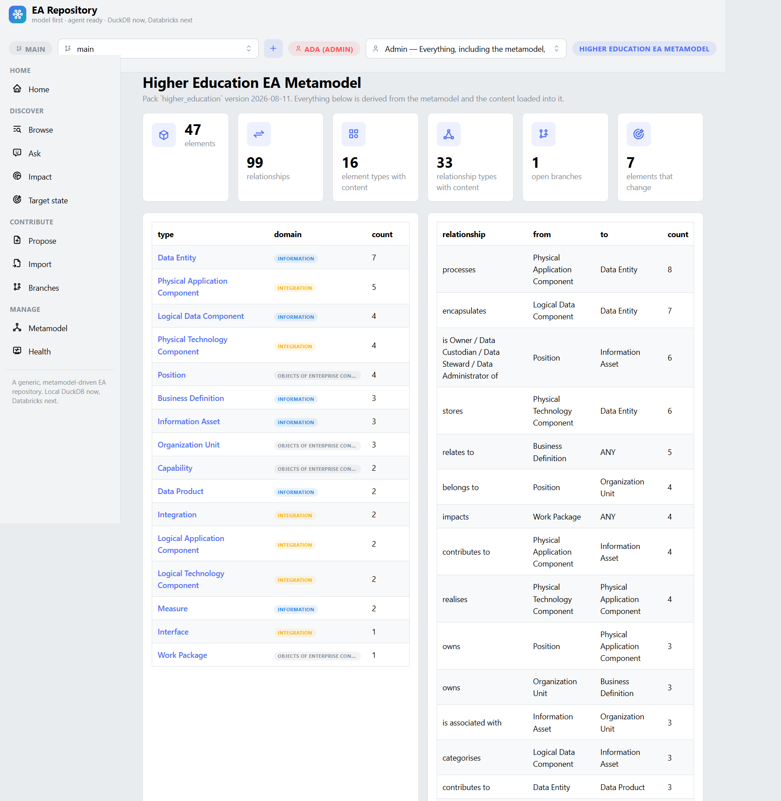 | **Browse** — ranked word search with bulk edit and a matched-in passage 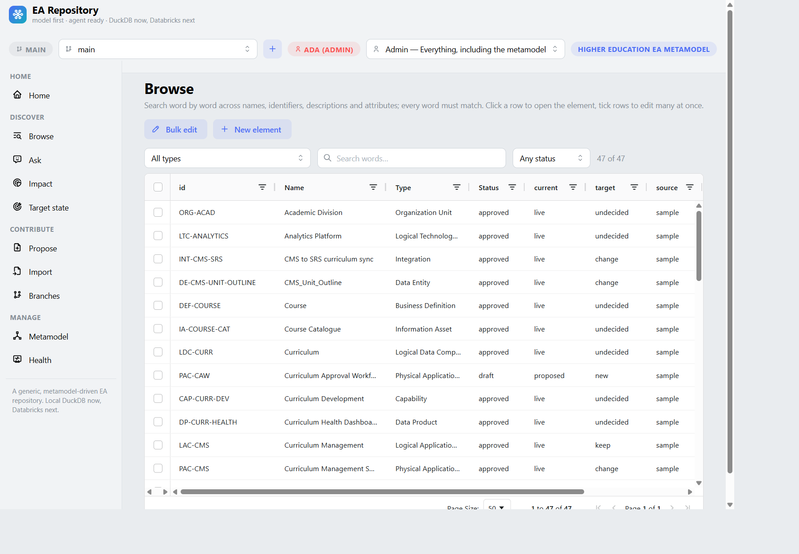 |

### Discover

| | |
| --- | --- |
| **Element** — Markdown description, attributes, links, state card 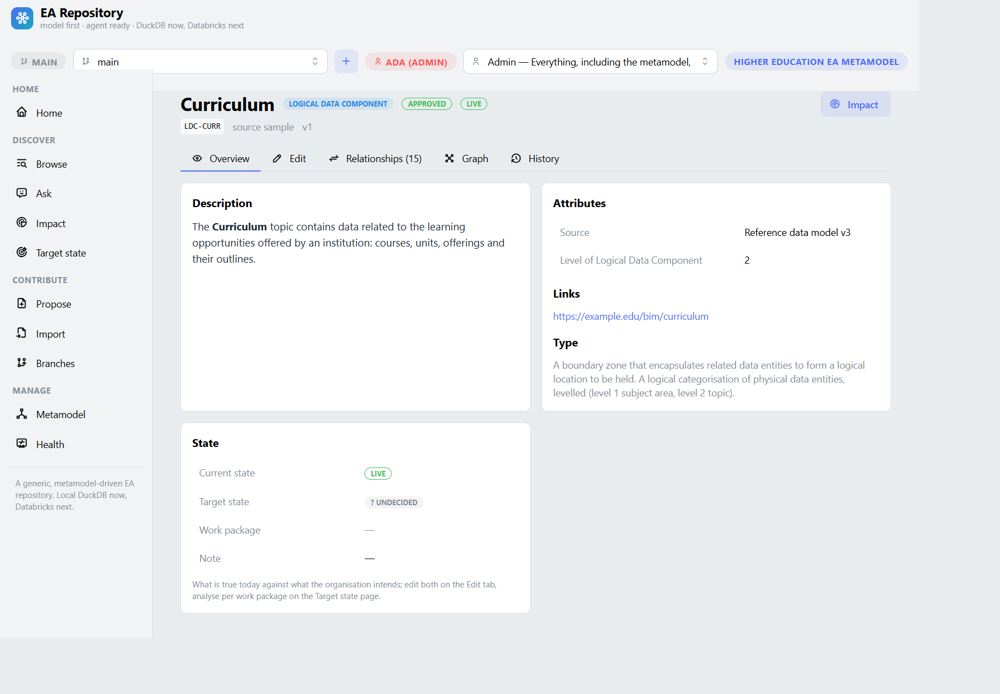 | **Ask** — an answer as a document: view first, cited identifiers, tool trace 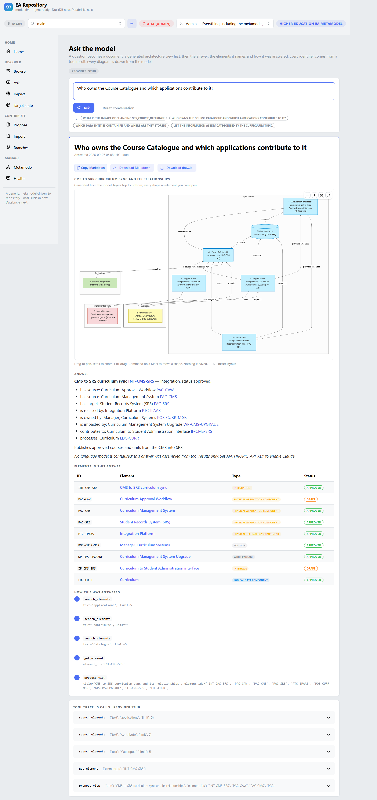 |
| **Impact** — upstream and downstream closure with completeness hints 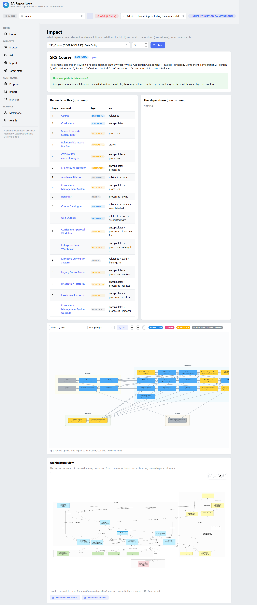 | **Generated architecture view** — drawn from the model, every shape an element, pan/zoom/arrange 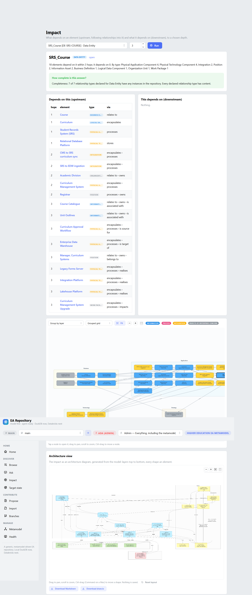 |
| **Target state** — current against intended, per work package 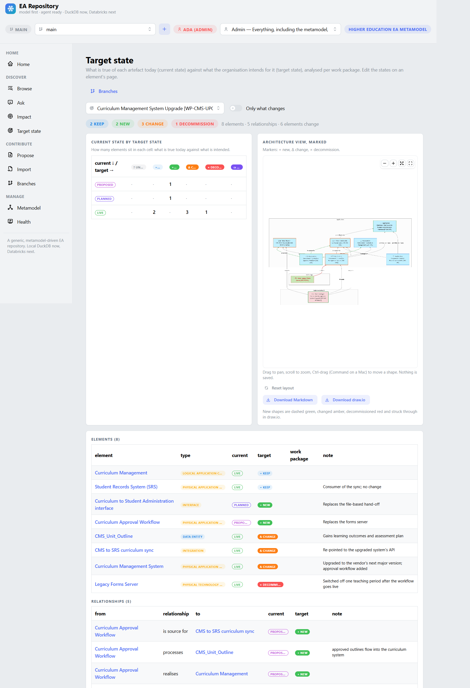 | |

### Contribute

| | |
| --- | --- |
| **Propose** — destination first, then the proposal; the reader turns it into a merge log 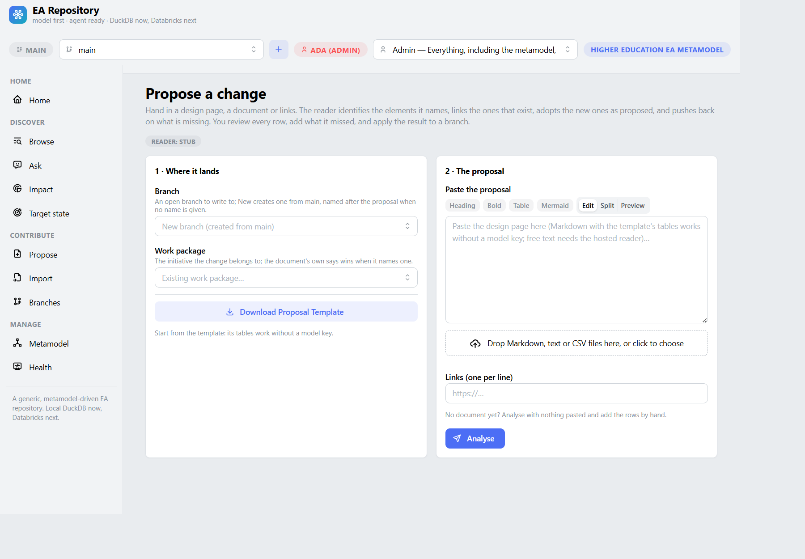 | **Markdown editing** — one editor everywhere: insert actions, Edit/Split/Preview, Mermaid rendered live 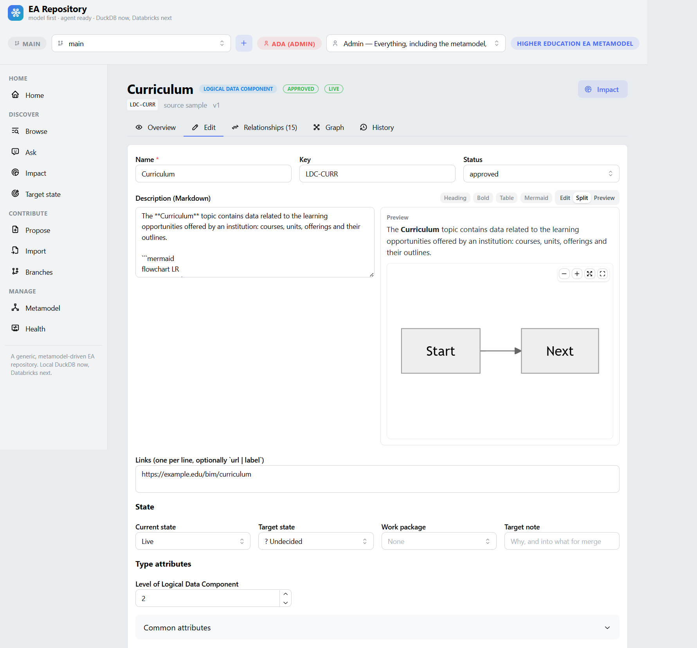 |
| **Import** — template download, validation report, idempotent load 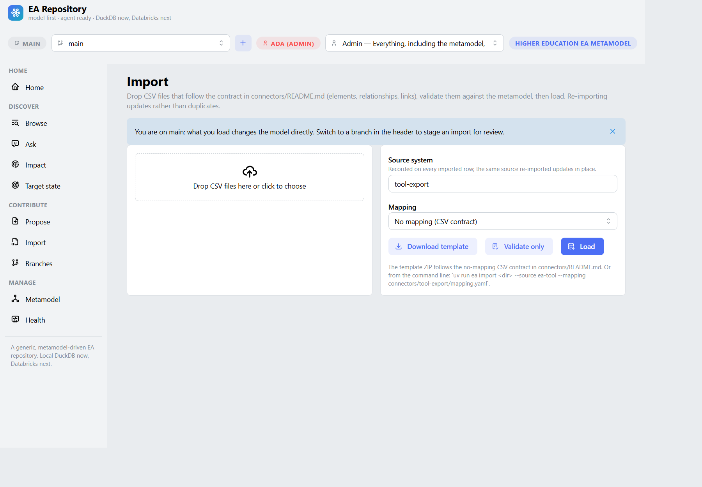 | **Branches** — overlays on main with a merge log and review before merge 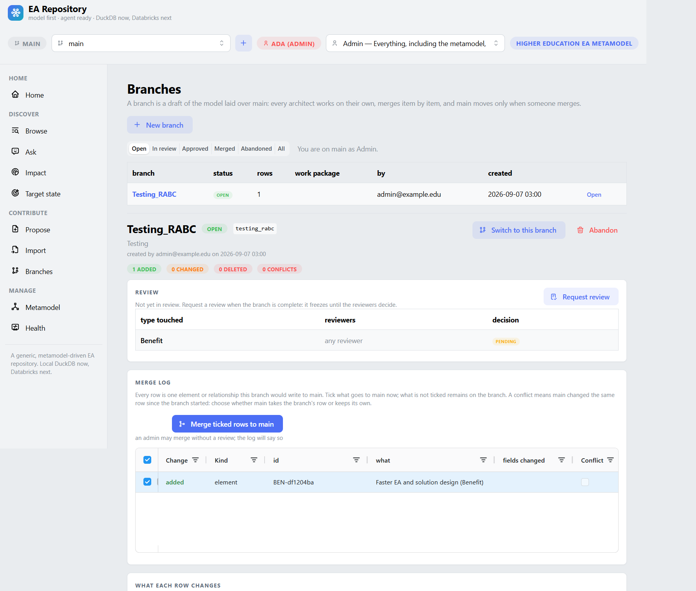 |

### Manage

| | |
| --- | --- |
| **Metamodel** — the type graph as data, editable and exportable as a pack 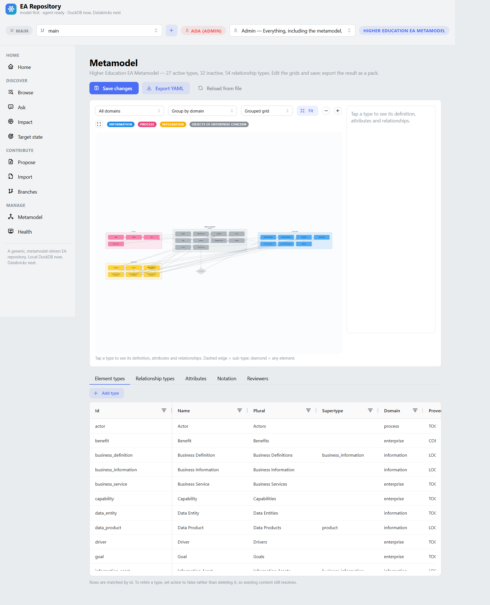 | **Health** — freshness per source, completeness per type, every figure a link 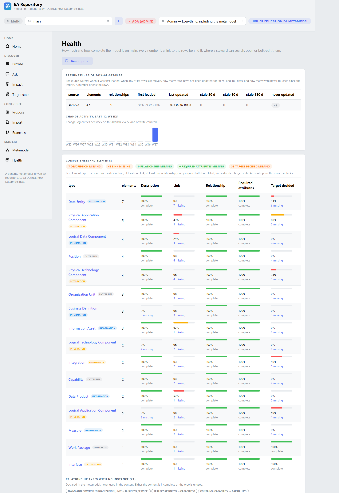 |

## Quick start

Requires Python 3.11+ and [uv](https://docs.astral.sh/uv/).

```bash
make install    # .venv with runtime and dev dependencies
make seed       # data/ea.duckdb with the higher-education pack and the sample model
make run        # http://localhost:8050
```

Without a browser:

```bash
uv run ea stats
uv run ea find "course"
uv run ea get LDC-CURR
uv run ea impact DE-SRS-COURSE --depth 3
uv run ea view LDC-CURR --depth 2                    # Mermaid, archreator notation
uv run ea view DE-SRS-COURSE --impact --fmt drawio --out impact.drawio
uv run ea sql "select type_id, count(*) n from element group by 1 order by 2 desc"
uv run ea validate data/sample            # the validation report without loading
uv run ea import path/to/export --source ea-tool --mapping connectors/tool-export/mapping.yaml
uv run ea target -w WP-CMS-UPGRADE        # current against target state of one work package (--fmt md for the marked view)
uv run ea branch create "CMS upgrade phase 2" -w WP-CMS-UPGRADE
uv run ea --branch cms-upgrade-phase-2 import path/to/export --source ea-tool   # loads onto the branch, main untouched
uv run ea branch diff cms-upgrade-phase-2 # the merge log: added, changed, deleted, conflicts
uv run ea branch merge cms-upgrade-phase-2 -i element:PAC-CMS -r element:PAC-CMS=branch
```

Every command reads and writes `main` unless `--branch` (or `EA_BRANCH`) names
a branch; in the app the header selector does the same for the session. Every
command runs as Admin unless `--as` (or `EA_ROLE`) names a role; `ea --as
architect import …` behaves exactly as an architect in the app would.

Stop the app before running the CLI against the same DuckDB file (one writer
per file), or set `EA_DB_PATH` to another file.

After editing a pack file, load it again (`uv run ea load-pack packs/higher_education/metamodel.yaml`
or **Reload from file** on the Metamodel page): the store holds the pack the app
uses, and the file is only read when asked.

To use a hosted model on the Ask and Propose pages, set `ANTHROPIC_API_KEY` in
the environment (or a `.env` file); otherwise the stub provider runs the same
tools without a model (on Propose, the stub reads the Proposal Template's tables
and nothing else). `EA_AGENT_PROVIDER` forces `anthropic` or `stub`.

## Working on a branch

`main` is the model. A branch is a named overlay on it: reading on a branch
shows `main` with the branch's rows laid over (changed rows replace, new rows
appear, deleted rows disappear); writing on a branch touches only the overlay.
Pick a branch in the header (or create one with the `+`), work as usual, then
open **Branches**: the change set is a merge log with one row per element and
relationship, the fields that differ, and a conflict flag wherever `main`
changed the same row since the branch took its copy. Tick what goes to `main`
now, choose the branch's row or `main`'s for each conflict, merge; what is not
ticked remains on the branch, which closes only when nothing remains. The same
overlay is a `MERGE` on Delta, so nothing here is DuckDB-specific.

## Roles, and who approves a merge

Five roles, cumulative from Reader: **Reader** browses, asks and downloads;
**Reviewer** approves or sends back branches for the element types assigned to
them; **Architect** drafts on branches, imports, proposes, requests reviews and
merges approved branches; **Admin** does everything, including the metamodel,
`main` and merging without a review; **Agent** is what the assistant may do
through its tools (read). On the platform the role comes from the forwarded
identity and its workspace groups through `EA_ROLE_GROUPS`
(`admin=ea-admins;architect=ea-architects;reviewer=ea-reviewers`); locally,
with mock authentication, the header carries a **debug persona switcher** with
Admin, Architect, Reviewer and Reader, so every user path can be walked
without a workspace (the Agent role belongs to the assistant's tools, not to
a person).

A branch goes `open → in review → approved → merged`. The author requests the
review; the branch freezes; the Branches page names, per element type the
change set touches, who must approve (the Reviewers tab of the Metamodel page
assigns users or groups to types; a type with nobody assigned takes any
reviewer); each reviewer approves their types or sends the branch back with a
comment; the author merges once every type is approved. Every decision is a row
in the store and an entry in the change log.

## Proposing a change from a document

**Propose** takes a design page: paste it, upload Markdown, text or CSV files,
or list links. Download the **Proposal Template** for the shape that works
without any model key: a front table naming the work package, an Elements
table (type, name, existing id, description, current state, target state) and a
Relationships table (source, relationship, target, note). The reader links
elements that exist (by identifier, then by exact name; near-matches are
flagged, never linked silently), adopts the rest as `proposed` with target
`new`, resolves every relationship against the metamodel, and lists what is
missing as pushback (a type the metamodel lacks, a description shorter than a
sentence, a relationship the pair of types does not allow, no work package).
The preview is an editable merge log: correct cells, untick rows, add rows by
hand, re-check, then **Apply to branch**. Review and merge on the Branches
page; the proposal itself stays with the branch.

## Loading your own export

1. Export elements and relationships from your current tool as CSV.
2. Either write them in the contract documented in
   [`connectors/README.md`](./connectors/README.md), or add a mapping under
   `connectors/<tool>/mapping.yaml` that renames your columns and type names
   (see [`connectors/tool-export/mapping.yaml`](./connectors/tool-export/mapping.yaml)).
3. `uv run ea validate <dir> --mapping <mapping>` shows what would be rejected
   or flagged; `uv run ea import` loads it. Unknown or inactive types and
   disallowed relationship pairs are flagged, not silently dropped;
   relationships whose ends do not exist are skipped and listed.

## Bringing your own metamodel

A pack is one YAML file: domains, element types (with supertypes, active
flags, attributes, provenance, source of record and owners) and relationship
types (source and target or `ANY`, inverse, qualifiers, provenance). See
[`packs/README.md`](./packs/README.md). Load it with
`uv run ea init --pack packs/<name>/metamodel.yaml`, or edit any pack in the
Metamodel page and export it.

## Configuration

| Variable | Default | Meaning |
| -------- | ------- | ------- |
| `EA_BACKEND` | `duckdb` | Storage engine (`databricks` once the Delta backend lands) |
| `EA_DB_PATH` | `data/ea.duckdb` | DuckDB file |
| `EA_PACK` | `packs/higher_education/metamodel.yaml` | Pack loaded by `ea init` and offered by "Reload from file" |
| `EA_AUTH` | `mock` | `mock` persona locally; `databricks` reads the identity headers Databricks Apps adds |
| `EA_AGENT_PROVIDER` | `auto` | `anthropic` when a key is present, else `stub` |
| `EA_AGENT_MODEL` | (provider default) | Model identifier for the hosted provider |
| `EA_MAX_ROWS` | `5000` | Row cap for Browse and read-only SQL |
| `EA_BRANCH` | `main` | The branch the CLI works on (same as `--branch`) |
| `EA_SECRET_KEY` | (random per start) | Signs the session cookie that remembers a reader's branch and debug persona; set it so sessions survive a restart |
| `EA_ROLE` | `admin` | The role the CLI runs as (same as `--as`) |
| `EA_ROLE_GROUPS` | (empty: everyone a reader) | On the platform, which workspace group grants which role: `admin=g1,g2;architect=g3;reviewer=g4` |

## Running on Databricks Apps

`app.yaml` starts the app with `uv run --frozen --no-dev python app.py`,
which binds `0.0.0.0:$DATABRICKS_APP_PORT` under gunicorn with a graceful
timeout under the platform's 15-second SIGTERM budget and logs to stdout. Until
the Delta backend exists the store is a DuckDB file in `/tmp` (ephemeral);
the Delta backend on the same DDL is the first roadmap item
([`architecture/6_transition/`](./architecture/6_transition/README.md)).

## The model of this project

What this project knows about itself lives in
[`architecture/`](./architecture/README.md): why it exists, what information
it manages, which component does what, and where it is going. It is written
with [archreator](https://github.com/roanboc/archreator), an enterprise
architecture method that lives in git as Markdown, with humans approving at
gates and agents doing the modelling and the building in between.
[`AGENTS.md`](./AGENTS.md) states the rule every change follows.

The business case that started this and its review are held privately by the
product owner; [`architecture/reference/`](./architecture/reference/README.md)
says what was derived from them.

## Development

```bash
make check      # ruff, pytest, the two archreator validators — CI runs the same
make lint
make test
```

The archreator plugin is enabled for this repository (`.claude/settings.json`);
a coding agent that opens it gets the method's skills, and `AGENTS.md` says
which skill to load at which step. The two validators under `scripts/` are the
plugin's scaffold scripts, copied so CI runs them without the plugin.

Layering: `models → metamodel → backend → services → importer / agent → ui`.
SQL only in `backend/`; framework and institution names only in `packs/` and
`connectors/`; the UI holds no logic the CLI does not also have.

## Licence

Apache-2.0 for the engine ([`LICENSE`](./LICENSE)). The higher-education pack
is a university's metamodel, anonymised and expressed as configuration; the
bundled icons are Tabler Icons (MIT) and the bundled diagram renderer is
Mermaid (MIT). See [`NOTICE`](./NOTICE).
