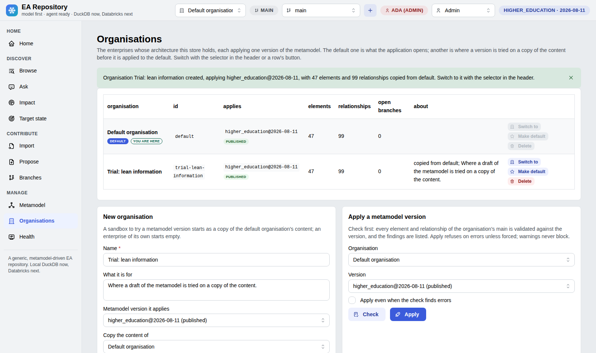

# EA Repository

**A generic, metamodel-driven enterprise architecture repository for the
ontology and agent era — DuckDB on a laptop, Databricks on the platform, the
same code.** Built first for a data and analytics unit on its TOGAF-based
metamodel; built so any enterprise can bring its own.

Enterprise architecture is **both a modelling problem and a data problem**, and
the tools on offer solve one half each. A modelling repository holds a
metamodel and drawings, but its metamodel is a schema only its vendor changes
and what it knows leaves as an export. A metadata catalogue holds the flow of
data, but has no metamodel of the enterprise, no traversal across layers and no
governed change. So this one is built on the halves they leave out: elements
and relationships are rows in a graph you can query, the metamodel is data so a
new element type is a row rather than a migration, content is ingested through
one validated pipeline whatever it arrives on, and the model is meant to be
served — to people, to other solutions on the data platform, and to agents that
call tools rather than open files. Everything a person can do in the app an
agent can do through tools, and every answer the agent gives cites the element
identifiers it came from.

## What it does today

| Deliverable | Where |
| ----------- | ----- |
| **Metamodel manager** — one version at a time under six tabs: five editable lists (domains, element types, relationship types, attributes, attribute groups) where rows are added, edited and deleted with whatever depended on them; the type graph; the metamodel drawn as an architecture view; the notation editor; the versions and their lifecycle; and who reviews what. Export as a YAML pack, load one back | Metamodel page |
| **A metamodel in versions** — a pack is stored per version, drafted from another, compared with another row by row, published (and then frozen, so what was validated against it stays validated) or retired. Every part of a pack — the pack, a domain, a type, a relationship type, an attribute — carries a `properties` bag the engine keeps and never interprets, and an attribute declares its own rules: a default, several values, a unit, a pattern, bounds, a group and help | Metamodel page (Versions tab), `ea metamodel …` |
| **Organisations** — the store holds more than one enterprise, one of them the default: each has its own elements, relationships, branches and reviews, and applies exactly one metamodel version. A change to the metamodel is tried in an organisation copied from the default, on the real content, and applied to the default when it is right — no second environment, and the check before applying says what the change would leave invalid | Organisations page, header selector, `ea org …`, `--org` on every command |
| **Browse and edit elements** — search by type, text and status; Markdown descriptions, links, typed attributes read and edited in the groups the metamodel declares, relationships in and out with the attributes their type carries, neighbourhood graph, history; optimistic concurrency | Browse and Element pages |
| **CSV ingestion** — `elements.csv`, `relationships.csv`, `links.csv`, an optional mapping for a tool's export (a one-CSV-per-type example included), a validation report, idempotent load | Import page, `ea import` |
| **Impact and traces** — upstream and downstream closure of any element, by type, with completeness hints | Impact page, `ea impact`, `ea trace` |
| **Ask** — questions answered by an agent through tools over the model and composed into a document: the answer, the elements involved, generated architecture diagrams, the tool trace; ungrounded identifiers flagged; downloadable as Markdown; a stub provider runs without any model key | Ask page |
| **Generated architecture views** — any neighbourhood, impact or answer as an architecture diagram in the notation of this repository's own architecture documents (Mermaid, stereotypes from the pack, every shape filled by its ArchiMate layer, with a chip per layer above the diagram in that layer's colour), downloadable as Markdown or as a draft draw.io file with ArchiMate stencils and the element identifier on every shape. Shapes can be dragged to arrange a view (never saved) and the draw.io export follows. Nothing is drawn by hand | Element and Impact pages, Ask page, `ea view` |
| **Graphs with grouping** — every network graph groups its nodes by domain, layer, type, status or source system in labelled boxes, with a grouped grid or an organic layout, coloured from the pack | Element, Impact and Metamodel pages |
| **Notation editor** — how each domain and type is drawn (layer, glyph, stereotype, ArchiMate element, shape, colour) edited in the app with a live preview, saved into the pack | Metamodel page, Notation tab |
| **Branches** — several architects draft on their own branch of the model (an overlay on `main`, on the same DuckDB file), edit, import and ask on it as if it were the model, then merge item by item from a merge log: every element and relationship ticked to go to `main` or left on the branch, every conflict (a row `main` changed meanwhile) resolved for the branch or for `main`; abandon discards | Header branch selector, Branches page, `ea branch …`, `--branch` on every command |
| **Target state** — every element and relationship carries what is true today (`proposed`, `planned`, `in_implementation`, `live`, `retired`, `non_existent`) and what is intended (`undecided`, `keep`, `new`, `change`, `decommission`, `merge`) under a work package; derived from the source's lifecycle text on import; analysed per work package with a current-by-target matrix and a generated view whose shapes carry the markers, in Mermaid and draw.io | Target state page, Element page (State card, Edit tab), `ea target` |
| **Propose** — hand in a design page (pasted text, Markdown, text or CSV files, links) in any template: the organisation's own, the ArchiMate reference, or none; a reader identifies the elements it names, links the ones that exist on the branch it is for, adopts the new ones as proposed, and pushes back with the minimum to add; before Apply the change's impact (what depends on what it alters or retires, what it leaves dangling, who must review it) and the change drawn; the result is an editable merge log (include ticks, cells editable, rows added by hand, usable without any model) applied to a branch, where a revised page updates the last pass rather than duplicating it; the reviewer reads the page, its passes, its impact and the view beside the merge log | Propose page, Branches page, `ea propose`, `ea templates`, `packs/*/proposal-template.md` |
| **Search, bulk edit, health** — search word by word across names, identifiers, descriptions and attributes, ranked, with the matching passage shown; tick many rows and set their status, states, work package, lifecycle or an attribute in one audited pass; a Health page with freshness per source system (last load, rows stale for 30, 90 and 180 days, never-updated rows, weekly change activity) and completeness per type (descriptions, links, relationships, required attributes, decided targets), every figure a link to the rows behind it | Browse and Health pages, `ea find`, `ea set`, `ea health` |
| **DuckDB or Lakebase, the same code** — the store is written once on SQL; a DuckDB file locally, a schema in a Lakebase database (the platform's Postgres) on Databricks, the same tests on both; a deployment bundle creates the instance and the app, and the role of the signed-in user comes from their workspace groups | `EA_BACKEND`, `databricks.yml`, `make deploy` |
| **Roles and review before merge** — five roles enforced (Reader, Reviewer, Architect, Admin, Agent), derived from workspace groups on the platform and picked from a debug persona switcher locally (Admin by default); an architect requests a review, the reviewers assigned to each element type the branch touches approve or send it back, and only an approved branch merges (an admin may merge without a review, and the log says so) | Header persona switcher, Branches page (review panel), Metamodel page (Reviewers tab), `--as` and `ea branch review/approve/send-back`, `ea reviewers` |

The first pack is an anonymised **higher-education** metamodel (59 element types, 27 active; 54
relationship types with provenance, `ANY` targets and stewardship qualifiers;
its attributes grouped into Identification, Governance, Classification,
Standard dates, Risk ratings and Data platform).
The sample content is a small fictional model so the demo runs without any
real data.

## A quick look

Every screen below runs on the sample model — a small fictional model —
seeded by `make seed`.

| | |
| --- | --- |
| **Home** — the sample model at a glance, with counts by type and relationship  | **Browse** — ranked word search with bulk edit and a matched-in passage  |

### Discover

| | |
| --- | --- |
| **Element** — Markdown description, attributes, links, state card  | **Ask** — an answer as a document: view first, cited identifiers, tool trace  |
| **Impact** — upstream and downstream closure with completeness hints  | **Generated architecture view** — drawn from the model, every shape an element, pan/zoom/arrange  |
| **Target state** — current against intended, per work package  | |

### Contribute

| | |
| --- | --- |
| **Propose** — destination first, then the proposal; the reader turns it into a merge log  | **Markdown editing** — one editor everywhere: insert actions, Edit/Split/Preview, Mermaid rendered live  |
| **Import** — template download, validation report, idempotent load  | **Branches** — overlays on main with a merge log and review before merge  |

### Manage

| | |
| --- | --- |
| **Metamodel** — one version at a time: five editable lists, the type graph, the architecture view, the notation, the versions and the reviewers  | **Organisations** — who applies which version of the metamodel, and where a change is tried before it reaches the default  |
| **Health** — freshness per source, completeness per type, every figure a link  | |

## Quick start

Requires Python 3.11+ and [uv](https://docs.astral.sh/uv/).

```bash
make install    # .venv with runtime and dev dependencies
make seed       # data/ea.duckdb with the higher-education pack and the sample model
make run        # http://localhost:8050
```

Without a browser:

```bash
uv run ea stats
uv run ea find "course"
uv run ea get LDC-CURR
uv run ea impact DE-SRS-COURSE --depth 3
uv run ea view LDC-CURR --depth 2                    # Mermaid, archreator notation
uv run ea view DE-SRS-COURSE --impact --fmt drawio --out impact.drawio
uv run ea sql "select type_id, count(*) n from element group by 1 order by 2 desc"
uv run ea validate data/sample            # the validation report without loading
uv run ea import path/to/export --source ea-tool --mapping connectors/tool-export/mapping.yaml
uv run ea target -w WP-CMS-UPGRADE        # current against target state of one work package (--fmt md for the marked view)
uv run ea branch create "CMS upgrade phase 2" -w WP-CMS-UPGRADE
uv run ea --branch cms-upgrade-phase-2 import path/to/export --source ea-tool   # loads onto the branch, main untouched
uv run ea branch diff cms-upgrade-phase-2 # the merge log: added, changed, deleted, conflicts
uv run ea branch merge cms-upgrade-phase-2 -i element:PAC-CMS -r element:PAC-CMS=branch
```

Every command reads and writes `main` unless `--branch` (or `EA_BRANCH`) names
a branch; in the app the header selector does the same for the session. Every
command runs as Admin unless `--as` (or `EA_ROLE`) names a role; `ea --as
architect import …` behaves exactly as an architect in the app would.

Stop the app before running the CLI against the same DuckDB file (one writer
per file), or set `EA_DB_PATH` to another file.

After editing a pack file, load it again (`uv run ea load-pack packs/higher_education/metamodel.yaml`
or **Reload from file** on the Metamodel page): the store holds the pack the app
uses, and the file is only read when asked.

To use a hosted model on the Ask and Propose pages, set `ANTHROPIC_API_KEY` in
the environment (or a `.env` file); otherwise the stub provider runs the same
tools without a model (on Propose, the stub reads a proposal template's tables
and nothing else). `EA_AGENT_PROVIDER` forces `anthropic` or `stub`.

## Working on a branch

`main` is the model. A branch is a named overlay on it: reading on a branch
shows `main` with the branch's rows laid over (changed rows replace, new rows
appear, deleted rows disappear); writing on a branch touches only the overlay.
Pick a branch in the header (or create one with the `+`), work as usual, then
open **Branches**: the change set is a merge log with one row per element and
relationship, the fields that differ, and a conflict flag wherever `main`
changed the same row since the branch took its copy. Tick what goes to `main`
now, choose the branch's row or `main`'s for each conflict, merge; what is not
ticked remains on the branch, which closes only when nothing remains. The same
overlay runs unchanged on Lakebase, so nothing here is DuckDB-specific.

## Roles, and who approves a merge

Five roles, cumulative from Reader: **Reader** browses, asks and downloads;
**Reviewer** approves or sends back branches for the element types assigned to
them; **Architect** drafts on branches, imports, proposes, requests reviews and
merges approved branches; **Admin** does everything, including the metamodel,
`main` and merging without a review; **Agent** is what the assistant may do
through its tools (read). On the platform the role comes from the forwarded
identity and its workspace groups through `EA_ROLE_GROUPS`
(`admin=ea-admins;architect=ea-architects;reviewer=ea-reviewers`); locally,
with mock authentication, the header carries a **debug persona switcher** with
Admin, Architect, Reviewer and Reader, so every user path can be walked
without a workspace (the Agent role belongs to the assistant's tools, not to
a person).

A branch goes `open → in review → approved → merged`. The author requests the
review; the branch freezes; the Branches page names, per element type the
change set touches, who must approve (the Reviewers tab of the Metamodel page
assigns users or groups to types; a type with nobody assigned takes any
reviewer); each reviewer approves their types or sends the branch back with a
comment; the author merges once every type is approved. Every decision is a row
in the store and an entry in the change log.

## Proposing a change from a document

**Propose** takes a design page: paste it, upload Markdown, text or CSV files,
or list links. Download a **proposal template** for the shape that works without
any model key. The repository ships two beside their packs — the ArchiMate
reference (`packs/archimate_core/proposal-template.md`, a section per layer) and
the higher-education template — and an admin keeps the organisation's own on the
Propose page or with `ea templates keep`. A template is read against the
metamodel's own names: a table under a heading that names an element type
(*Application components*) holds that type, a column named after an attribute
(*Owner*) fills it, and the template's front matter declares only what it names
differently:

```yaml
---
proposal_template:
  name: Our solution design
  metamodel: mm_j20ftrptcdf8h0za   # the metamodel it is typed in, by identifier
  sections: {Systems: Application component}
  columns: {Business owner: owner}
---
```

The Relationships table (source, relationship, target, qualifier, target state,
note) may retire an existing relationship with `decommission`. The reader links
elements that exist (by identifier, then by exact name; near-matches are
flagged, never linked silently), adopts the rest as `proposed` with target
`new`, resolves every relationship against the metamodel, and lists what is
missing as pushback (a type the metamodel lacks, a description shorter than a
sentence, a relationship the pair of types does not allow, no work package).
The preview is an editable merge log: correct cells, untick rows, add rows by
hand, re-check, then **Apply to branch**. Before you apply, the preview shows
what the change touches on `main` and draws it. Hand a revised page to the same
branch and it revises the last pass: what that pass created is updated, a blank
cell empties nothing, and what the page no longer carries is listed. Review and
merge on the Branches page, where the reviewer reads the page as handed in, pass
by pass, beside the merge log. From the command line:
`uv run ea --branch <b> propose page.md [--apply]`, or `--new-branch <name>`.

## Loading your own export

1. Export elements and relationships from your current tool as CSV.
2. Either write them in the contract documented in
   [`connectors/README.md`](./connectors/README.md), or add a mapping under
   `connectors/<tool>/mapping.yaml` that renames your columns and type names
   (see [`connectors/tool-export/mapping.yaml`](./connectors/tool-export/mapping.yaml)).
3. `uv run ea validate <dir> --mapping <mapping>` shows what would be rejected
   or flagged; `uv run ea import` loads it. Unknown or inactive types and
   disallowed relationship pairs are flagged, not silently dropped;
   relationships whose ends do not exist are skipped and listed.

## Bringing your own metamodel

A pack is one YAML file: domains, element types (with supertypes, active and
abstract flags, attributes, provenance, source of record and owners) and
relationship types (source and target or `ANY`, inverse, qualifiers,
provenance, attributes of their own). Anything the format does not name is kept
in a `properties` bag rather than dropped. See
[`packs/README.md`](./packs/README.md). Load it with
`uv run ea init --pack packs/<name>/metamodel.yaml`, or edit any pack in the
Metamodel page and export it. The two packs that ship are also offered on the
Organisations page: pick one and it starts a new, empty organisation typed
against it.

A pack's `id:` is opaque and permanent, so its `name:` is a label that is
corrected at any point in a version's life, a published one included. Name a
version on the command line by its name or by the first few characters of its
identifier.

A pack is stored under a version, and a version is a draft until it is
published, after which it is frozen. To try a change: draft a version from the
one in use, create an organisation copied from the default one, apply the draft
there, work in it, compare the two versions, then publish the draft and apply
it to the default organisation.

```bash
uv run ea metamodel versions                       # what the store holds, and who applies what
uv run ea metamodel draft higher_education@2026-08-11 --version trial
uv run ea org create "Trial" --copy-from default   # a sandbox on a copy of the content
uv run ea org apply trial higher_education@trial   # checked against that content first
uv run ea --org trial stats                        # every command reads the organisation named
uv run ea metamodel diff higher_education@2026-08-11 higher_education@trial
uv run ea metamodel publish higher_education@trial
uv run ea org apply default higher_education@trial
```

## Configuration

| Variable | Default | Meaning |
| -------- | ------- | ------- |
| `EA_BACKEND` | `duckdb` | Storage engine: `duckdb` (a file) or `lakebase` (a schema in a Postgres database: the platform's Lakebase, or any Postgres) |
| `EA_DB_PATH` | `data/ea.duckdb` | DuckDB file |
| `EA_LAKEBASE_INSTANCE` | (none) | On `lakebase`: the Lakebase instance to sign in to through the Databricks SDK — its host looked up, an OAuth token generated as the password, the app's service principal (`DATABRICKS_CLIENT_ID`) or the SDK's own identity as the user; the bundle sets it from the instance it creates |
| `EA_POSTGRES_DSN`, `PGHOST`, `PGPORT`, `PGDATABASE`, `PGUSER`, `PGPASSWORD`, `PGSSLMODE` | (none; `databricks_postgres` and `require` with an instance) | On `lakebase`: any Postgres instead, or the host and user the platform names, as libpq reads them |
| `EA_SCHEMA` | `ea` | On `lakebase`: the schema that holds the tables, created on the first start |
| `DATABRICKS_HOST` and credentials | (from the SDK) | With an instance named, and for the workspace groups: the workspace and how to sign in, read the way every Databricks SDK client reads them — the app's service principal on Databricks Apps, `DATABRICKS_TOKEN` or a profile on a workstation |
| `EA_PACK` | `packs/higher_education/metamodel.yaml` | Pack loaded by `ea init` and offered by "Reload from file" |
| `EA_AUTH` | `mock` | `mock` persona locally; `databricks` reads the identity headers Databricks Apps adds |
| `EA_AGENT_PROVIDER` | `auto` | `anthropic` when a key is present, else `stub` |
| `EA_AGENT_MODEL` | (provider default) | Model identifier for the hosted provider |
| `EA_MAX_ROWS` | `5000` | Row cap for Browse and read-only SQL |
| `EA_BRANCH` | `main` | The branch the CLI works on (same as `--branch`) |
| `EA_ORG` | `default` | The organisation the CLI reads and writes (same as `--org`) |
| `EA_SECRET_KEY` | (random per start) | Signs the session cookie that remembers a reader's branch and debug persona; set it so sessions survive a restart |
| `EA_ROLE` | `admin` | The role the CLI runs as (same as `--as`) |
| `EA_ROLE_GROUPS` | (empty: everyone a reader) | On the platform, which workspace group grants which role: `admin=g1,g2;architect=g3;reviewer=g4` |
| `EA_TRUST_GROUPS_HEADER` | (off) | Believe an `X-Forwarded-Groups` header instead of reading the workspace; only behind a proxy of your own that sets it, never on Databricks Apps |

## Running on Databricks

The same application runs as a Databricks App over a schema in a Lakebase
database, the platform's Postgres. The store is written once on SQL
(`src/ea/backend/sql_backend.py`); the Lakebase engine
(`src/ea/backend/lakebase_backend.py`) adds the connection and the statements
— the driver's markers, bulk loads as bound multi-row inserts, a replace in
one transaction, a reader's query run read-only on the server, the schema
entered on every connection, a connection the platform closed reopened once
with a fresh token — and nothing else. The unit suite runs every test on both
engines, the Lakebase one on a real Postgres: one the run starts for itself
where `initdb` and `pg_ctl` are installed, or the server `EA_TEST_POSTGRES`
names (CI runs a service container); a workstation with neither runs the
store tests on DuckDB alone and is told so. `make test-live` runs the suite a
third time on a Lakebase instance, in a schema of its own.

The deployment bundle, [`databricks.yml`](./databricks.yml), creates the
Lakebase instance and the app with a database resource on it, and owns the
app's configuration (`uv run --frozen --no-dev --extra databricks python
app.py`, which binds `0.0.0.0:$DATABRICKS_APP_PORT` under gunicorn with a
graceful timeout under the platform's 15-second SIGTERM budget). The database
resource gives the app's service principal a Postgres role that connects to
the database and creates in it, which is all the store needs — it creates its
schema on the first start — so nothing follows the deploy but the start:

```bash
make deploy       # validate and deploy the dev target: the instance and the app, not yet running (TARGET=prod for prod)
make deploy-run   # start the app
```

The dev target deploys in development mode, which prefixes what it creates
with the deployer's name; the app's environment names the instance by its
deployed resource, so it follows. On the platform the engine looks the
instance's host up through the SDK and signs in as the app's service principal
with an OAuth token it generates for the instance (`EA_LAKEBASE_INSTANCE`).
From a workstation the same engine signs in as whoever the SDK signs in as,
who needs a Postgres role on the instance from its owner, or reaches any
Postgres through the standard `PG*` variables or `EA_POSTGRES_DSN`.

On the platform the signed-in user arrives as forwarded headers; their
workspace groups are read once and kept for five minutes (with the user's own
token when the app is granted the `iam.current-user:read` scope, otherwise as
the app's service principal), and `EA_ROLE_GROUPS` turns the groups into a
role. A groups header in the request is never believed unless
`EA_TRUST_GROUPS_HEADER=1` says a proxy of your own sets it: behind Databricks
Apps a client could send one and pick its own role. Running the same tests
against a Lakebase instance is what reaches plateau `PLAT2` on the roadmap
([`architecture/6_transition/`](./architecture/6_transition/README.md)).

## The model of this project

What this project knows about itself lives in
[`architecture/`](./architecture/README.md): why it exists, what information
it manages, which component does what, and where it is going. It is written
with [archreator](https://github.com/roanboc/archreator), an enterprise
architecture method that lives in git as Markdown, with humans approving at
gates and agents doing the modelling and the building in between.
[`AGENTS.md`](./AGENTS.md) states the rule every change follows.

The business case that started this and its review are held privately by the
product owner; [`architecture/reference/`](./architecture/reference/README.md)
says what was derived from them.

## Development

```bash
make check      # ruff, pytest, the two archreator validators — CI runs the same
make lint
make test       # every store test runs twice: on DuckDB, and on the Lakebase engine over a Postgres started for the run (or the one EA_TEST_POSTGRES names)
make test-live  # and a third time on a Lakebase instance (EA_LAKEBASE_INSTANCE, DATABRICKS_HOST and the SDK's credentials)
```

### The application test round

```bash
make gui-install   # once: the browser driver and its browser
make gui           # drives every screen and every command, writes .testrun/<stamp>/report.md
```

A round opens the application in a browser on a database of its own, works every
screen and every command-line command, reads each screen against a fixed
usability checklist and the axe-core rule engine, and writes one document with
the screenshots that evidence it — so a reviewer reads the report and one page
of key screens instead of clicking through eleven screens. It runs on demand,
before a demo or a release, and ends with a triaged list of findings; every
behavioural fix is guarded by a unit test in `make check`, which also runs the
command-line scenarios. The scenarios are committed under
[`tests/ui/`](./tests/ui/README.md); a run is not, and lands in a gitignored
folder beside its own screenshots. The browser driver is a non-default
dependency group.

The archreator plugin is enabled for this repository (`.claude/settings.json`);
a coding agent that opens it gets the method's skills, and `AGENTS.md` says
which skill to load at which step. The two validators under `scripts/` are the
plugin's scaffold scripts, copied so CI runs them without the plugin.

Layering: `models → metamodel → backend → services → importer / agent → ui`.
SQL only in `backend/`, where the store is written once (`sql_backend.py`) and
an engine (`duckdb_backend.py`, `lakebase_backend.py`) adds only how it
connects, runs a statement and lands rows; framework and institution names
only in `packs/` and `connectors/`; the UI holds no logic the CLI does not
also have.

## Licence

Apache-2.0 for the engine ([`LICENSE`](./LICENSE)). The higher-education pack
is one enterprise's metamodel, anonymised and expressed as configuration; the
bundled icons are Tabler Icons (MIT) and the bundled diagram renderer is
Mermaid (MIT). See [`NOTICE`](./NOTICE).
