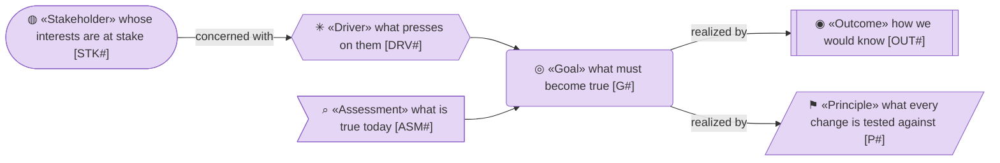
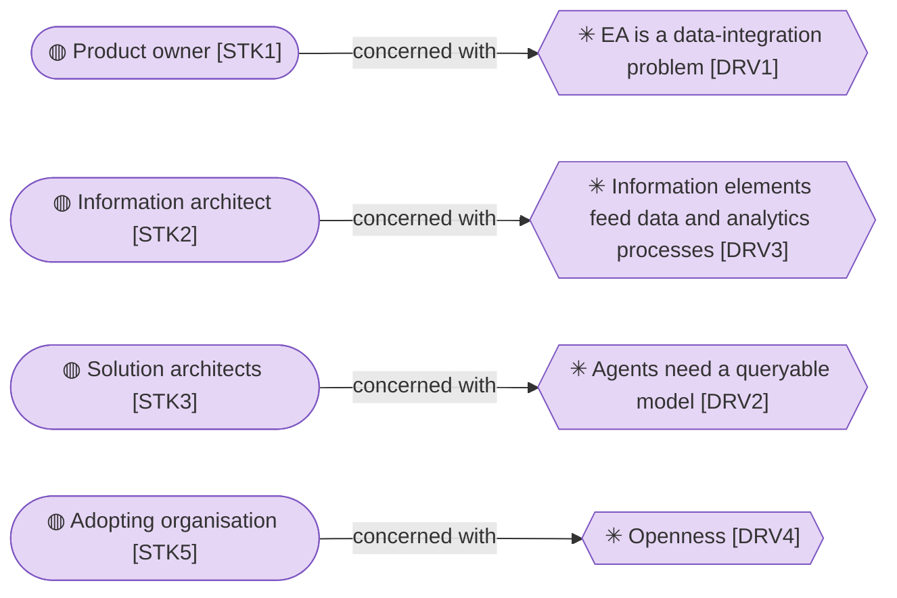
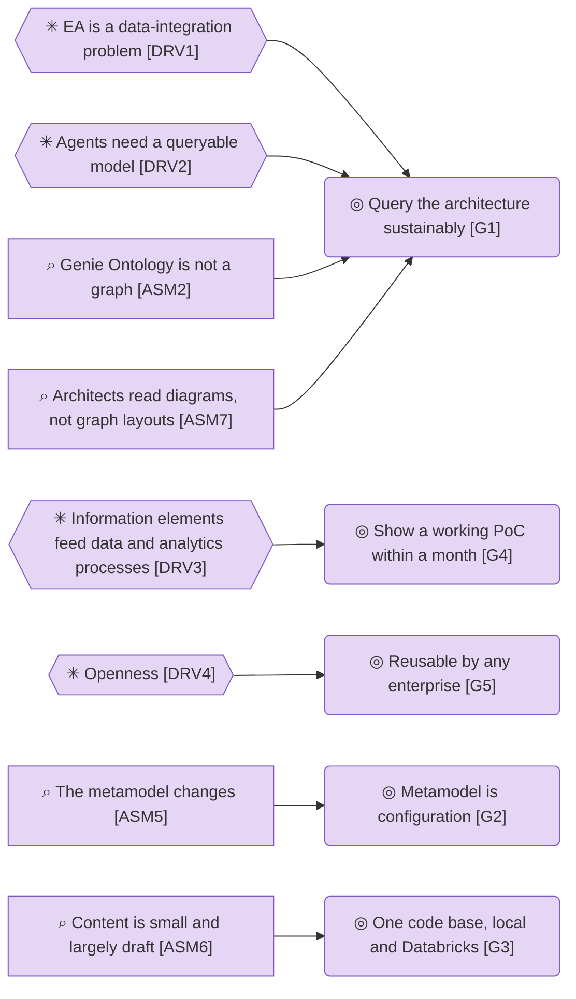
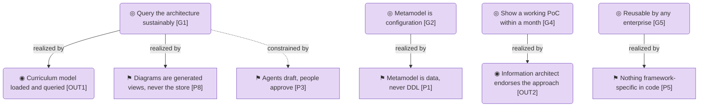

# Motivation

_[← Strategy layer](./README.md) · [EA home](../README.md)_

**Status: `◐` draft catalogue** — written from the owner's business case, the
review of 2026-09-05 and the owner's decisions in that conversation; `ASM7` and
`P8` added by initiative 2 on the same day; the views moved to the top on
2026-09-06. It is
validated at the **Direction** gate with the owner and the information
architect (see [scope/1_curriculum-poc.md](../scope/1_curriculum-poc.md)).

**Source:** the owner's business case of 2026-09-05 and its review, both held
privately by the product owner (see [reference/](../reference/README.md)).

## How to read this document

## Stakeholders

| ID | Stakeholder | Concern |
| -- | ----------- | ------- |
| `STK1` | **Product owner** — the university's data and analytics unit, who asked for the repository and approves the gates | Wants an EA repository that is a data product, queryable by people and agents, and a working demonstration within a month |
| `STK2` | **Information architect** — defines the curriculum scope and validates the information elements | Needs the information/data elements right first, because the data and analytics unit's other processes (glossary, stewardship, lineage) build on them |
| `STK3` | **Solution architects** — the consumers of the model | Need to query dependencies and impact directly, not through a drawing tool |
| `STK4` | **IT division's enterprise architecture team** — owner of the institution's metamodel and of the current EA tool today | Expects the metamodel respected and the content not forked silently; decides when the current EA tool can be retired |
| `STK5` | **Adopting organisation** — any other enterprise that picks the engine up | Needs nothing institution-specific in the code and a way to bring its own metamodel |

## Drivers

| ID | Driver | Evidence |
| -- | ------ | -------- |
| `DRV1` | **EA is a data-integration problem** — most architecture facts are mastered in other systems (the CMDB, the HR system, the project portfolio tool, the information asset register, the data platform's metadata catalogue) and only mirrored into the current EA tool | Business case §2; review finding on source of record |
| `DRV2` | **Agents need a queryable model** — an architecture locked behind a visual tool cannot be read by an AI agent, and impact assessment stays manual | Business case §2 and §3 |
| `DRV3` | **Information elements feed data and analytics processes** — glossary, stewardship and data-product work in the university's data and analytics unit need the information layer of the model today | Owner's request of 2026-09-05 |
| `DRV4` | **Openness** — the approach must be adoptable by other enterprises with other frameworks | Owner's request; licence decisions in `NOTICE` |

## Assessments

| ID | Assessment | Consequence |
| -- | ---------- | ----------- |
| `ASM1` | **The current EA tool cannot host integration** — it is a diagram-centric visualisation engine fed from other systems, not a data hub | The graph moves to the data platform; the current tool stays a source until it is retired |
| `ASM2` | **Genie Ontology is not a graph** — it is an NL-to-SQL context layer over Unity Catalog semantics, with no traversal or export API | The repository owns an explicit graph; Genie becomes a later front door over a generated projection |
| `ASM3` | **Clone and OCC are not git** — Delta clones cannot be merged back and optimistic concurrency only detects same-table races | Proposals need an explicit change-set model with base versions and recorded approval, deferred past the PoC |
| `ASM4` | **Most types are mastered elsewhere** — about 80 % of the institution's active types are mirrored or enriched, not authored | Every type will carry a source-of-record and mirrored / authored / enriched semantics; the PoC treats the institution's existing content as the source for everything |
| `ASM5` | **The metamodel changes** — 27 active and 32 inactive types, instances still present for inactive ones, ANY-targeted and role-qualified relationships | The metamodel is data (a pack), never a fixed schema |
| `ASM6` | **Content is small and largely draft** — about 4,600 elements across 59 types, many not approved | DuckDB and an in-process graph are enough; no warehouse traversal per click |
| `ASM7` | **Architects read diagrams, not graph layouts** — a force-directed graph answers a query but is not an architecture diagram; a hand-drawn diagram that is the store is the current EA tool's problem | Views are generated from the model in an architecture notation; diagram editors are at most an export format (initiative 2) |

## Goals and outcomes

| ID | Goal | Measured by |
| -- | ---- | ----------- |
| `G1` | **Query the architecture sustainably** — people and agents get answers about elements, relationships and impact without drawing tools | The three reference questions (ownership, entities behind a data product, impact of an entity change) answered from the loaded model with cited identifiers |
| `G2` | **Metamodel is configuration** — element types, relationship types and attributes are edited as data and exported as a pack | The institution's metamodel loads from `packs/higher_education/metamodel.yaml`, is edited in the app and round-trips to YAML |
| `G3` | **One code base, local and Databricks** — the same code runs on a DuckDB file and on Delta tables | One SQL implementation of the store with a DuckDB engine and a Databricks engine on the same DDL; the unit suite passes on both (the Databricks engine over a warehouse played by DuckDB on every change, and on a real warehouse on demand) |
| `G4` | **Show a working PoC within a month** — something the owner can show and sell to the information architect and sponsors | A demo of the four deliverables on the curriculum slice of the institution's content |
| `G5` | **Reusable by any enterprise** — no framework- or institution-specific code | The engine is Apache-2.0; the higher-education pack is one pack among possible others |

| ID | Outcome | State |
| -- | ------- | ----- |
| `OUT1` | **Curriculum model loaded and queried** — the curriculum export from the current EA tool is loaded through the CSV contract and browsed and asked about in the app | Pending the export (the sample model stands in) |
| `OUT2` | **Information architect endorses the approach** — the information elements and their relationships are judged right | Pending the Understanding gate |

## Principles

| ID | Principle | Test |
| -- | --------- | ---- |
| `P1` | **Metamodel is data, never DDL** — a new element type is a row, not a migration | Adding a type needs no code change |
| `P2` | **Every element carries provenance** — source system, source reference and origin on every element and relationship | No row without `source_system` and `origin` |
| `P3` | **Agents draft, people approve** — an agent proposes and explains; a person records the approval | No agent path writes an approved status |
| `P4` | **One schema, two engines** — the DDL is portable between DuckDB and Delta; engine-specific SQL lives in the backend only | Services and UI contain no SQL dialect |
| `P5` | **Nothing framework-specific in code** — the institution's own, TOGAF or ArchiMate type names appear only in packs and mappings | `grep` for a type name finds it in `packs/` and `connectors/` only |
| `P6` | **Answers cite element identifiers** — every claim in an agent answer names the elements it came from, and an identifier that no tool returned is flagged | Ungrounded identifiers are reported on every answer |
| `P7` | **Fail fast, keep the long-term goal** — the PoC is allowed to be thrown away; the roadmap is not | Every shortcut is listed as a gap in [6_transition](../6_transition/1_target-state.md) |
| `P8` | **Diagrams are generated views, never the store** — every diagram is rendered from the model and every shape carries an element identifier; nothing is drawn by hand into the repository | No relationship is created from a drawing without a recorded human decision; every generated shape links to an element |

## Relationships

| From | | To | | Relationship | Note |
| ---- | - | -- | - | ------------ | ---- |
| `STK1` | ◍ «Stakeholder» Product owner | `DRV1` | ✳ «Driver» EA is a data-integration problem | concerned with | |
| `STK2` | ◍ «Stakeholder» Information architect | `DRV3` | ✳ «Driver» Information elements feed data and analytics processes | concerned with | |
| `STK3` | ◍ «Stakeholder» Solution architects | `DRV2` | ✳ «Driver» Agents need a queryable model | concerned with | |
| `STK5` | ◍ «Stakeholder» Adopting organisation | `DRV4` | ✳ «Driver» Openness | concerned with | |
| `DRV1` | ✳ «Driver» EA is a data-integration problem | `G1` | ◎ «Goal» Query the architecture sustainably | influences | |
| `DRV2` | ✳ «Driver» Agents need a queryable model | `G1` | ◎ «Goal» Query the architecture sustainably | influences | |
| `DRV3` | ✳ «Driver» Information elements feed data and analytics processes | `G4` | ◎ «Goal» Show a working PoC within a month | influences | curriculum first |
| `DRV4` | ✳ «Driver» Openness | `G5` | ◎ «Goal» Reusable by any enterprise | influences | |
| `ASM2` | ⚖ «Assessment» Genie Ontology is not a graph | `G1` | ◎ «Goal» Query the architecture sustainably | influences | the graph is explicit |
| `ASM5` | ⚖ «Assessment» The metamodel changes | `G2` | ◎ «Goal» Metamodel is configuration | influences | |
| `ASM6` | ⚖ «Assessment» Content is small and largely draft | `G3` | ◎ «Goal» One code base, local and Databricks | influences | DuckDB is enough to start |
| `G1` | ◎ «Goal» Query the architecture sustainably | `OUT1` | ◎ «Outcome» Curriculum model loaded and queried | realized by | |
| `G4` | ◎ «Goal» Show a working PoC within a month | `OUT2` | ◎ «Outcome» Information architect endorses the approach | realized by | |
| `G2` | ◎ «Goal» Metamodel is configuration | `P1` | ▣ «Principle» Metamodel is data, never DDL | realized by | |
| `G5` | ◎ «Goal» Reusable by any enterprise | `P5` | ▣ «Principle» Nothing framework-specific in code | realized by | |
| `ASM7` | ⚖ «Assessment» Architects read diagrams, not graph layouts | `G1` | ◎ «Goal» Query the architecture sustainably | influences | an answer needs a picture |
| `G1` | ◎ «Goal» Query the architecture sustainably | `P8` | ▣ «Principle» Diagrams are generated views, never the store | realized by | |
