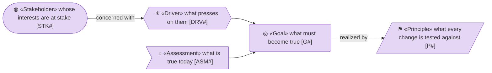
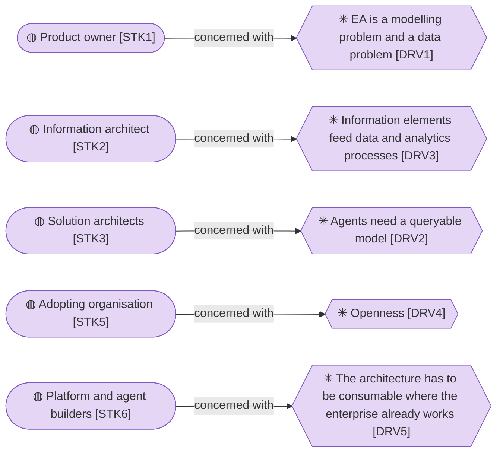
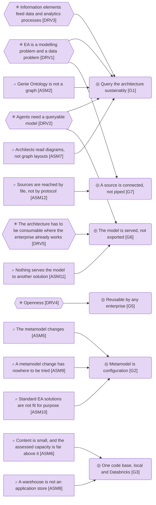
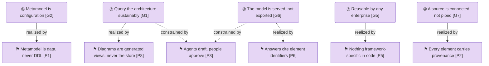

# Motivation

_[← Strategy layer](./README.md) · [EA home](../README.md)_

**Status: `◐` draft catalogue** — written from the owner's business case, the
review of 2026-09-05 and the owner's decisions in that conversation; `ASM7` and
`P8` added by initiative 2 on the same day; `ASM9` by initiative 15; `ASM6`
restated with its horizon by initiative 16; the views moved to the top on
2026-09-06; restated as the motivation of the product rather than of a phase by
[initiative 19](../scope/19_the-product-not-the-phase.md), which corrected
`DRV1`, added `DRV5`, `ASM10` to `ASM12`, `G6` and `G7`, and retired `G4`,
`OUT1` and `OUT2`. It is validated at the **Direction** gate with the owner and
the information architect.

**Source:** the owner's business case of 2026-09-05 and its review, both held
privately by the product owner (see [reference/](../reference/README.md)), and
the Requester's direction of 2026-09-21.

## How to read this document

## Stakeholders

| ID | Stakeholder | Concern |
| -- | ----------- | ------- |
| `STK1` | **Product owner** — the enterprise's data and analytics unit, who asked for the repository and approves the gates | Wants an EA repository that is a data product, queryable by people and agents |
| `STK2` | **Information architect** — validates the information elements and the scope of content loaded | Needs the information and data elements right first, because the data and analytics unit's other processes (glossary, stewardship, lineage) build on them |
| `STK3` | **Solution architects** — the consumers of the model | Need to query dependencies and impact directly, not through a drawing tool |
| `STK4` | **Enterprise architecture team** — owner of the enterprise's metamodel and of the current EA tool today | Expects the metamodel respected and the content not forked silently; decides when the current EA tool can be retired |
| `STK5` | **Adopting organisation** — any other enterprise that picks the engine up | Needs nothing organisation-specific in the code and a way to bring its own metamodel |
| `STK6` | **Platform and agent builders** — the teams whose data products, pipelines and agents would read the architecture | Need the model as governed data they can join to the rest of the platform and reach from an agent, without asking a person for an export |

## Drivers

| ID | Driver | Evidence |
| -- | ------ | -------- |
| `DRV1` | **EA is a modelling problem and a data problem** — the model has to be right, *and* it has to be fed: most architecture facts are mastered in other systems (the CMDB, the HR system, the project portfolio tool, the information asset register, the data platform's metadata catalogue) and only mirrored into an EA tool. Calling it integration alone excuses a model nobody validated; calling it modelling alone excuses a model nobody can feed or read. Both halves are the problem, and the second is why the answer is better mechanisms for ingesting and serving rather than a better drawing surface (adopted — the Requester's correction of 2026-09-21, which replaced the earlier *EA is a data-integration problem*) | Business case §2; review finding on source of record; the Requester's correction of 2026-09-21 |
| `DRV2` | **Agents need a queryable model** — an architecture locked behind a visual tool cannot be read by an agent, and impact assessment stays manual. An agent reaches a model through tools over a protocol, never through a file somebody exported for it | Business case §2 and §3 |
| `DRV3` | **Information elements feed data and analytics processes** — glossary, stewardship and data-product work in the data and analytics unit need the information layer of the model today | Owner's request of 2026-09-05 |
| `DRV4` | **Openness** — the approach must be adoptable by other enterprises with other frameworks | Owner's request; licence decisions in `NOTICE` |
| `DRV5` | **The architecture has to be consumable where the enterprise already works** — a data product, a pipeline or an agent that needs to know what depends on what should read the architecture from the data platform on the same terms as any other governed data, rather than asking a person for an export and holding a copy that ages (adopted — the Requester's direction of 2026-09-21) | The Requester's direction of 2026-09-21 |

## Assessments

| ID | Assessment | Consequence |
| -- | ---------- | ----------- |
| `ASM1` | **The current EA tool cannot host integration** — it is a diagram-centric visualisation engine fed from other systems, not a data hub | The graph moves to the data platform; the current tool stays a source until it is retired |
| `ASM2` | **Genie Ontology is not a graph** — it is an NL-to-SQL context layer over Unity Catalog semantics, with no traversal or export API | The repository owns an explicit graph; Genie becomes a later front door over a generated projection |
| `ASM3` | **Clone and OCC are not git** — Delta clones cannot be merged back and optimistic concurrency only detects same-table races | A change set is explicit: a branch as an overlay with base versions, reviewed and approved before it merges (decisions 0006 and 0009) |
| `ASM4` | **Most types are mastered elsewhere** — about 80 % of the enterprise's active types are mirrored or enriched, not authored | Every type carries a source-of-record and mirrored / authored / enriched semantics; until that table is agreed, the current EA tool's export is the source for everything |
| `ASM5` | **The metamodel changes** — 27 active and 32 inactive types, instances still present for inactive ones, ANY-targeted and role-qualified relationships | The metamodel is data (a pack), never a fixed schema |
| `ASM6` | **Content is small, and the assessed capacity is far above it** — the first slice of enterprise content is about 4,600 elements across 59 types, many not approved, and the sample is 47; every answer below holds comfortably at that size. The store has been **measured** at a hundred thousand elements and six hundred thousand relationships (decisions 0016 to 0018). That figure is assessed capacity, not a forecast: the enterprise is not at that size and may never be (adopted — the Requester's correction of 2026-09-20) | DuckDB and an in-process graph are enough at today's size. The capacity the application has been assessed for is **declared in one place** (`src/ea/capacity.py`) and read wherever a service would otherwise read the whole model, so the assessment is held by a test rather than remembered (decision 0019); a traversal is answered by the store (decisions 0016 to 0018) |
| `ASM7` | **Architects read diagrams, not graph layouts** — a force-directed graph answers a query but is not an architecture diagram; a hand-drawn diagram that is the store is the current EA tool's problem | Views are generated from the model in an architecture notation; diagram editors are at most an export format (initiative 2) |
| `ASM8` | **A warehouse is not an application store** — a SQL warehouse answers a statement in a round trip of seconds, binds a few hundred values, holds no constraints and no transaction across statements; an application that writes on every click needs the platform's transactional database (adopted — the reading behind the owner's instruction of 2026-09-11, Lakebase and not the lakehouse) | The store on Databricks is Lakebase, the platform's Postgres (decision 0013); the lakehouse reads it through Unity Catalog where a projection is wanted (plateau `PLAT5`) |
| `ASM9` | **A metamodel change has nowhere to be tried** — one definition of the metamodel is edited in place, so a new type or a new attribute reaches every reader the moment it is saved; the alternative is a second environment, a platform cost architecture work does not carry (adopted — the reading of how a type or an attribute is changed today) | The metamodel is kept in versions with a lifecycle, and the content is partitioned into organisations, so a version is tried on a copy and applied once it checks out (decisions 0014 and 0015) |
| `ASM10` | **Standard EA solutions are not fit for purpose** — the products on offer each solve one half of `DRV1` and leave the other outside the tool. A modelling repository holds a metamodel and drawings, but its metamodel is a schema only its vendor changes, it is fed by hand or by a per-source connector somebody maintains, and what it knows leaves as an export. A metadata catalogue holds the flow of data, but it has no metamodel of the enterprise, no traversal across layers and no governed change. Neither answers an agent, and integrating around either rebuilds the missing half outside the product, where it belongs to nobody (adopted — the Requester's direction of 2026-09-21; the model argued the pieces of this in `ASM1`, `ASM2` and `ASM7` without ever stating it) | The repository is built rather than bought, and what it must do that a bought tool does not is exactly what `G2`, `G6` and `G7` name: the metamodel as data, the model served, the sources connected |
| `ASM11` | **Nothing serves the model to another solution** — the model leaves the repository only as a file a person downloads: CSV, Markdown or draw.io. An external agent has no tools to call, the platform has no table to join to, and every consumer therefore keeps a copy that is wrong the day after it was taken | The model is served from the platform rather than exported: a generated, typed projection to join to and a tool server an agent connects to over the Model Context Protocol (`G6`; gaps `GAP6` and `GAP7` under plateau `PLAT5`) |
| `ASM12` | **Sources are reached by file, not by protocol** — content arrives as an uploaded file or as a staging table somebody else fills (initiative 18). A system that already answers an API, or that the platform can already reach on behalf of a user, still waits for a pipeline to be written and maintained for it | A source is connected rather than piped: reached over a protocol the platform already speaks, and put through the same validation, provenance and review an uploaded file gets (`G7`; gap `GAP20` under plateau `PLAT3`) |

## Goals

| ID | Goal | Measured by |
| -- | ---- | ----------- |
| `G1` | **Query the architecture sustainably** — people and agents get answers about elements, relationships and impact without drawing tools | The three reference questions (ownership, the entities behind a data product, the impact of an entity change) answered from the loaded model with cited identifiers |
| `G2` | **Metamodel is configuration** — element types, relationship types and attributes are edited as data and exported as a pack | A pack in `packs/` loads, is edited in the app and round-trips to YAML; adding a type needs no code change |
| `G3` | **One code base, local and Databricks** — the same code runs on a DuckDB file and on Lakebase, the platform's Postgres database | One SQL implementation of the store with a DuckDB engine and a Lakebase engine on the same DDL; the unit suite passes on both (the Lakebase engine on a Postgres started for the run on every change, and on a Lakebase instance on demand) |
| `G5` | **Reusable by any enterprise** — no framework- or organisation-specific code | The engine is Apache-2.0; every pack in `packs/` is one configuration among possible others |
| `G6` | **The model is served, not exported** — a data product, a pipeline or an agent reads the current architecture where it already works, and holds no copy of it | The three reference questions answered by an external agent through the tool server and by a query against the platform projection, returning the same identifiers the application gives. **Pending — future initiative:** gaps `GAP6` and `GAP7` under plateau `PLAT5` |
| `G7` | **A source is connected, not piped** — a system that masters architecture facts is configured as a source and read over a protocol, with the same validation, provenance and review an uploaded file gets | A new source is added by configuration alone, and its rows carry source system, source reference and origin. Half reached: a staging feed is already configuration rather than code (`src/ea/importer/feeds.py`, initiative 18). A source reached over a protocol is **Pending — future initiative:** gap `GAP20` under plateau `PLAT3` |

## Principles

| ID | Principle | Test |
| -- | --------- | ---- |
| `P1` | **Metamodel is data, never DDL** — a new element type is a row, not a migration | Adding a type needs no code change |
| `P2` | **Every element carries provenance** — source system, source reference and origin on every element and relationship | No row without `source_system` and `origin` |
| `P3` | **Agents draft, people approve** — an agent proposes and explains; a person records the approval | No agent path writes an approved status |
| `P4` | **One schema, two engines** — the DDL is portable between DuckDB and Postgres; engine-specific SQL lives in the backend only | Services and UI contain no SQL dialect |
| `P5` | **Nothing framework-specific in code** — the enterprise's own, TOGAF or ArchiMate type names appear only in packs and mappings | `grep` for a type name finds it in `packs/` and `connectors/` only |
| `P6` | **Answers cite element identifiers** — every claim in an agent answer names the elements it came from, and an identifier that no tool returned is flagged | Ungrounded identifiers are reported on every answer |
| `P7` | **Every shortcut is a recorded gap** — a shortcut is allowed; forgetting it is not, so it is written into the roadmap on the day it is taken rather than remembered | Every shortcut is listed as a gap in [6_transition](../6_transition/1_target-state.md) |
| `P8` | **Diagrams are generated views, never the store** — every diagram is rendered from the model and every shape carries an element identifier; nothing is drawn by hand into the repository | No relationship is created from a drawing without a recorded human decision; every generated shape links to an element |

## Retired

Elements that were live and no longer are. Their identifiers stay retired;
nothing reuses them.

| ID | Element | Retired in | Why |
| -- | ------- | ---------- | --- |
| `G4` | Show a working PoC within a month | [initiative 19](../scope/19_the-product-not-the-phase.md) | A phase of delivery rather than a property of the product. What the product must be is `G1`, `G2`, `G3`, `G5`, `G6` and `G7`; when each part arrives belongs to [6_transition/](../6_transition/README.md), the only place in the model permitted to describe a future |
| `OUT1` | Curriculum model loaded and queried | [initiative 19](../scope/19_the-product-not-the-phase.md) | Made one organisation's first content slice the measure of the model. Each goal's own `Measured by` cell carries the measure instead, and no outcome remains |
| `OUT2` | Information architect endorses the approach | [initiative 19](../scope/19_the-product-not-the-phase.md) | The granting of one gate, written as an outcome of the architecture. A gate granted is recorded in the scope document that asked for it |

## Relationships

| From | | To | | Relationship | Note |
| ---- | - | -- | - | ------------ | ---- |
| `STK1` | ◍ «Stakeholder» Product owner | `DRV1` | ✳ «Driver» EA is a modelling problem and a data problem | concerned with | |
| `STK2` | ◍ «Stakeholder» Information architect | `DRV3` | ✳ «Driver» Information elements feed data and analytics processes | concerned with | |
| `STK3` | ◍ «Stakeholder» Solution architects | `DRV2` | ✳ «Driver» Agents need a queryable model | concerned with | |
| `STK5` | ◍ «Stakeholder» Adopting organisation | `DRV4` | ✳ «Driver» Openness | concerned with | |
| `STK6` | ◍ «Stakeholder» Platform and agent builders | `DRV5` | ✳ «Driver» The architecture has to be consumable where the enterprise already works | concerned with | |
| `DRV1` | ✳ «Driver» EA is a modelling problem and a data problem | `G1` | ◎ «Goal» Query the architecture sustainably | influences | the modelling half |
| `DRV1` | ✳ «Driver» EA is a modelling problem and a data problem | `G7` | ◎ «Goal» A source is connected, not piped | influences | the data half |
| `DRV2` | ✳ «Driver» Agents need a queryable model | `G1` | ◎ «Goal» Query the architecture sustainably | influences | |
| `DRV2` | ✳ «Driver» Agents need a queryable model | `G6` | ◎ «Goal» The model is served, not exported | influences | an agent calls tools, it does not open a file |
| `DRV3` | ✳ «Driver» Information elements feed data and analytics processes | `G1` | ◎ «Goal» Query the architecture sustainably | influences | the information layer first |
| `DRV4` | ✳ «Driver» Openness | `G5` | ◎ «Goal» Reusable by any enterprise | influences | |
| `DRV5` | ✳ «Driver» The architecture has to be consumable where the enterprise already works | `G6` | ◎ «Goal» The model is served, not exported | influences | |
| `ASM2` | ⌕ «Assessment» Genie Ontology is not a graph | `G1` | ◎ «Goal» Query the architecture sustainably | influences | the graph is explicit |
| `ASM5` | ⌕ «Assessment» The metamodel changes | `G2` | ◎ «Goal» Metamodel is configuration | influences | |
| `ASM6` | ⌕ «Assessment» Content is small, and the assessed capacity is far above it | `G3` | ◎ «Goal» One code base, local and Databricks | influences | DuckDB is enough to start, at a stated size |
| `ASM7` | ⌕ «Assessment» Architects read diagrams, not graph layouts | `G1` | ◎ «Goal» Query the architecture sustainably | influences | an answer needs a picture |
| `ASM8` | ⌕ «Assessment» A warehouse is not an application store | `G3` | ◎ «Goal» One code base, local and Databricks | influences | Lakebase, not the lakehouse, on the platform |
| `ASM9` | ⌕ «Assessment» A metamodel change has nowhere to be tried | `G2` | ◎ «Goal» Metamodel is configuration | influences | a version is tried on a copy before it is applied |
| `ASM10` | ⌕ «Assessment» Standard EA solutions are not fit for purpose | `G2` | ◎ «Goal» Metamodel is configuration | influences | the half a bought repository cannot give |
| `ASM11` | ⌕ «Assessment» Nothing serves the model to another solution | `G6` | ◎ «Goal» The model is served, not exported | influences | |
| `ASM12` | ⌕ «Assessment» Sources are reached by file, not by protocol | `G7` | ◎ «Goal» A source is connected, not piped | influences | |
| `G1` | ◎ «Goal» Query the architecture sustainably | `P8` | ⚑ «Principle» Diagrams are generated views, never the store | realized by | |
| `G2` | ◎ «Goal» Metamodel is configuration | `P1` | ⚑ «Principle» Metamodel is data, never DDL | realized by | |
| `G5` | ◎ «Goal» Reusable by any enterprise | `P5` | ⚑ «Principle» Nothing framework-specific in code | realized by | |
| `G6` | ◎ «Goal» The model is served, not exported | `P6` | ⚑ «Principle» Answers cite element identifiers | realized by | what is served is cited the same way the app cites it |
| `G7` | ◎ «Goal» A source is connected, not piped | `P2` | ⚑ «Principle» Every element carries provenance | realized by | a connected source is still a named source |
| `G1` | ◎ «Goal» Query the architecture sustainably | `P3` | ⚑ «Principle» Agents draft, people approve | constrained by | an agent answers; it does not approve what it found |
| `G6` | ◎ «Goal» The model is served, not exported | `P3` | ⚑ «Principle» Agents draft, people approve | constrained by | serving the model widens who reads it, never who approves it |
