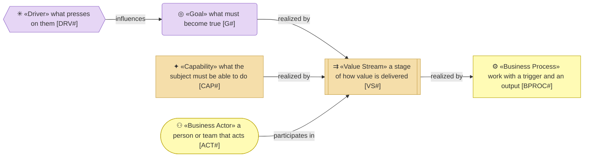
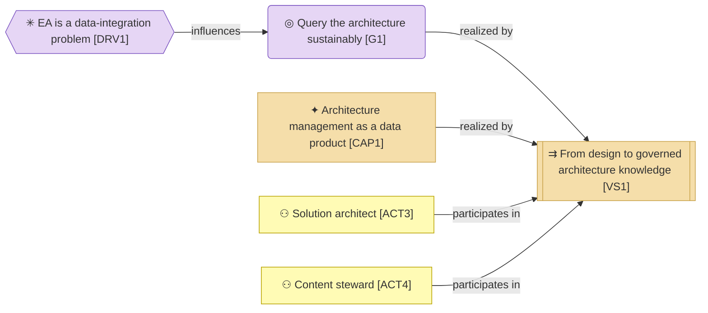
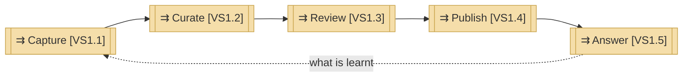

# Value stream

_[← Strategy layer](./README.md) · [EA home](../README.md)_

**Status: `◐` draft catalogue** — the one value stream the repository serves,
written on 2026-09-06 once its stages had processes behind them (initiatives
1 to 7). Validated at the **Direction** gate with the owner.

## How to read this document

## Capability

| ID | Capability | Realised by |
| -- | ---------- | ----------- |
| `CAP1` | **Architecture management as a data product** — the ability to hold the enterprise's architecture as governed, queryable, cited data rather than as drawings | The value stream below, on the repository (`ASVC1` to `ASVC10`) |

## Value stream

| ID | Stage | Value added | Realised by |
| -- | ----- | ----------- | ----------- |
| `VS1` | **From design to governed architecture knowledge** — how a fact about the enterprise's architecture enters the model, is made trustworthy, and answers a question | The enterprise can rely on what the model says and act on it | The stages below |
| `VS1.1` | **Capture** — a fact enters: an export from a source system, or a design page handed in as a proposal | Nothing is retyped; provenance is kept | `BPROC1`, `BPROC2.2` |
| `VS1.2` | **Curate** — the fact is placed, typed, described and given its states, apart from `main` | The fact is complete and consistent with the metamodel | `BPROC2.1`, `BPROC6` |
| `VS1.3` | **Review** — the people who own the types the change touches decide | A second person has read every row that will change | `BPROC2.4` |
| `VS1.4` | **Publish** — the approved rows land on `main`, views are generated from them | One truth, drawn from the same data everywhere | `BPROC2.5` |
| `VS1.5` | **Answer** — people and agents ask, analyse impact and target state | Decisions are made on cited facts, not on drawings | `BPROC3`, `BPROC4` |

## Stages and the processes that realise them

```mermaid
flowchart TB
  s1[["⇉ Capture [VS1.1]"]]:::strategy
  s2[["⇉ Curate [VS1.2]"]]:::strategy
  s3[["⇉ Review [VS1.3]"]]:::strategy
  s4[["⇉ Publish [VS1.4]"]]:::strategy
  s5[["⇉ Answer [VS1.5]"]]:::strategy
  p1("⚙ Load content from a source [BPROC1]"):::business
  p22("⚙ Hand in a proposal [BPROC2.2]"):::business
  p21("⚙ Draft on a branch [BPROC2.1]"):::business
  p6("⚙ Watch the model's health [BPROC6]"):::business
  p24("⚙ Review a branch [BPROC2.4]"):::business
  p25("⚙ Merge to main [BPROC2.5]"):::business
  p3("⚙ Answer an architecture question [BPROC3]"):::business
  p4("⚙ Analyse a work package [BPROC4]"):::business
  s1 -->|realized by| p1
  s1 -->|realized by| p22
  s2 -->|realized by| p21
  s2 -->|realized by| p6
  s3 -->|realized by| p24
  s4 -->|realized by| p25
  s5 -->|realized by| p3
  s5 -->|realized by| p4

  classDef strategy fill:#f5deaa,stroke:#c8a24a,color:#333
  classDef business fill:#fffbb5,stroke:#b8a200,color:#333
```

## Relationships

| From | | To | | Relationship | Note |
| ---- | - | -- | - | ------------ | ---- |
| `VS1.1` | ⇉ «Value Stream» Capture | `VS1.2` | ⇉ «Value Stream» Curate | triggers | |
| `VS1.2` | ⇉ «Value Stream» Curate | `VS1.3` | ⇉ «Value Stream» Review | triggers | |
| `VS1.3` | ⇉ «Value Stream» Review | `VS1.4` | ⇉ «Value Stream» Publish | triggers | |
| `VS1.4` | ⇉ «Value Stream» Publish | `VS1.5` | ⇉ «Value Stream» Answer | triggers | |
| `VS1.1` | ⇉ «Value Stream» Capture | `BPROC1` | ⚙ «Business Process» Load content from a source | realized by | |
| `VS1.1` | ⇉ «Value Stream» Capture | `BPROC2.2` | ⚙ «Business Process» Hand in a proposal | realized by | |
| `VS1.2` | ⇉ «Value Stream» Curate | `BPROC2.1` | ⚙ «Business Process» Draft on a branch | realized by | |
| `VS1.2` | ⇉ «Value Stream» Curate | `BPROC6` | ⚙ «Business Process» Watch the model's health | realized by | |
| `VS1.3` | ⇉ «Value Stream» Review | `BPROC2.4` | ⚙ «Business Process» Review a branch | realized by | |
| `VS1.4` | ⇉ «Value Stream» Publish | `BPROC2.5` | ⚙ «Business Process» Merge to main | realized by | |
| `VS1.5` | ⇉ «Value Stream» Answer | `BPROC3` | ⚙ «Business Process» Answer an architecture question | realized by | |
| `VS1.5` | ⇉ «Value Stream» Answer | `BPROC4` | ⚙ «Business Process» Analyse a work package | realized by | |
| `G1` | ◎ «Goal» Query the architecture sustainably | `VS1` | ⇉ «Value Stream» From design to governed architecture knowledge | realized by | |
| `CAP1` | ✦ «Capability» Architecture management as a data product | `VS1` | ⇉ «Value Stream» From design to governed architecture knowledge | realized by | |
| `ACT3` | ◍ «Business Actor» Solution architect | `VS1` | ⇉ «Value Stream» From design to governed architecture knowledge | participates in | captures and curates |
| `ACT4` | ◍ «Business Actor» Content steward | `VS1` | ⇉ «Value Stream» From design to governed architecture knowledge | participates in | reviews |
