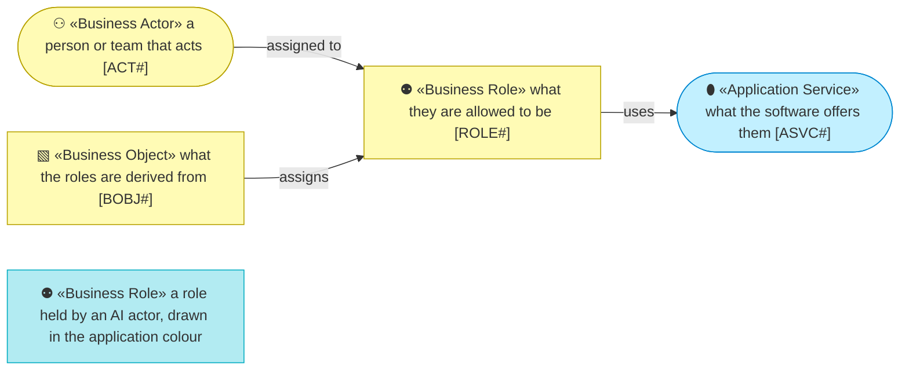
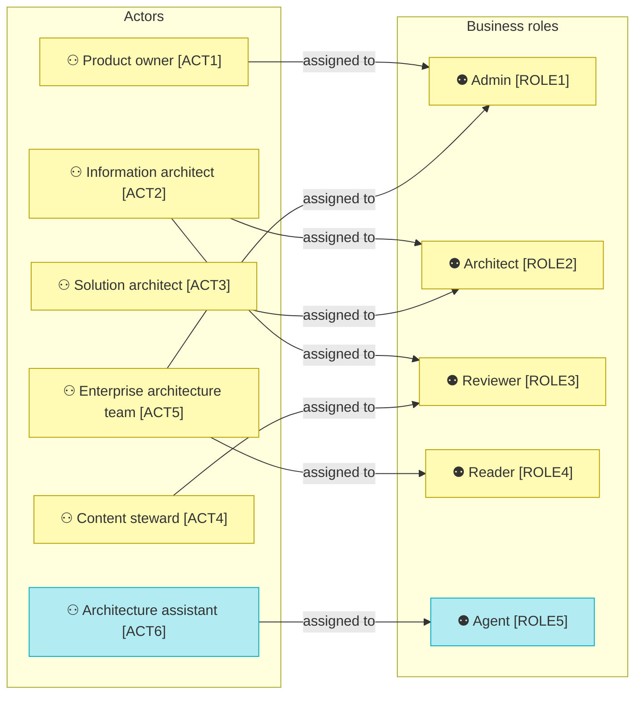
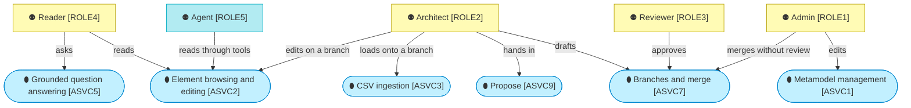
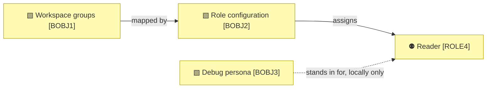

# Actors and roles

_[← Business layer](./README.md) · [EA home](../README.md)_

**Status: `◐` draft catalogue** — the actors named in the owner's business
case and the roles the application enforces since initiative 7 (2026-09-06).
Validated at the **Understanding** gate. `EA_ROLE_GROUPS` names a group per
role, and which groups those are is a deployment value the owner supplies —
the mechanism is built and the names are not this model's to invent.

## How to read this document

## Actors

| ID | Actor | Concern |
| -- | ----- | ------- |
| `ACT1` | **Product owner** — the university's data and analytics unit; commissions the repository, approves the gates and decides what ships (stakeholder `STK1`) | Wants a governed model that stays true, and a demonstration that sells it |
| `ACT2` | **Information architect** — validates the information layer of the metamodel and of the content, and reviews changes to information elements (stakeholder `STK2`) | Needs the information elements right before anything builds on them |
| `ACT3` | **Solution architect** — designs changes to the enterprise and describes them as proposals; the main author of branches (stakeholder `STK3`) | Wants to draft quickly, see the impact of a change, and hand a design page in rather than retype it |
| `ACT4` | **Content steward** — owns the instances of a type on behalf of a domain (the pack's `instance_owner`); reviews changes to the elements of that type | Wants to see exactly what changes before it lands, and nothing else |
| `ACT5` | **Enterprise architecture team** — the IT division's owners of the institution's metamodel and of the current EA tool (stakeholder `STK4`) | Expects the metamodel respected; administers packs |
| `ACT6` | **Architecture assistant** — the AI agent that answers questions and reads proposals through tools (component `ACMP5`, `ACMP10`) | May read everything a reader may; never writes an approval (principle `P3`) |

## Roles

The application enforces these roles since initiative 7. A role is derived
from the signed-in user's workspace groups through the role configuration;
locally, with mock authentication, the header offers a **debug persona
switcher** whose default is Admin, so every path can be exercised without
a workspace. Roles are cumulative from Reader upwards; Reviewer adds to
Reader, Architect adds to Reader, Admin holds everything.

| ID | Role | May | May not |
| -- | ---- | --- | ------- |
| `ROLE1` | **Admin** — the framework owner's role | Everything: edit the metamodel and its notation, load packs, create and abandon any branch, import onto `main`, edit on `main`, merge with or without a review, assign reviewers per type, act as every other role | — |
| `ROLE2` | **Architect** — the author's role | Create branches; edit elements, relationships and links on a branch; import onto a branch; hand in proposals; edit states; request a review of a branch; merge a branch once it is approved; ask | Edit on `main` directly; approve a branch, including their own; edit the metamodel |
| `ROLE3` | **Reviewer** — the approver's role, scoped by element type | Approve or send back a branch for the element types assigned to them (or any type, when no reviewer is assigned to it); leave a review comment; everything a reader may | Edit content; merge; approve a branch they authored |
| `ROLE4` | **Reader** — every signed-in user | Browse, search, open elements, run impact and target-state analyses, ask the assistant, download views and documents, download the Proposal Template | Change anything |
| `ROLE5` | **Agent** — the assistant's role, held by `ACT6` | Read through the tools a reader could use; draft a proposal's change set for an architect to review | Write to `main`; write an approval; write anything an architect has not ticked |

## Business objects

| ID | Business object | Held in |
| -- | --------------- | ------- |
| `BOBJ1` | **Workspace groups** — the identity provider's groups the user belongs to (Databricks workspace groups on the platform) | The workspace's directory, read once per forwarded user and kept for a few minutes (`TSVC5`, decision 0012); a groups header is believed only behind a proxy of the deployment's own |
| `BOBJ2` | **Role configuration** — which group grants which role, and which reviewers cover which element types | `EA_ROLE_GROUPS` in the environment; the reviewer table in the store (`reviewer_assignment`) |
| `BOBJ3` | **Debug persona** — the role a local user impersonates when no identity provider is present | The session, set from the header switcher; mock authentication only |

## Relationships

| From | | To | | Relationship | Note |
| ---- | - | -- | - | ------------ | ---- |
| `ACT1` | ⚇ «Business Actor» Product owner | `ROLE1` | ⚉ «Business Role» Admin | assigned to | |
| `ACT2` | ⚇ «Business Actor» Information architect | `ROLE3` | ⚉ «Business Role» Reviewer | assigned to | reviewer of the information types |
| `ACT2` | ⚇ «Business Actor» Information architect | `ROLE2` | ⚉ «Business Role» Architect | assigned to | also drafts |
| `ACT3` | ⚇ «Business Actor» Solution architect | `ROLE2` | ⚉ «Business Role» Architect | assigned to | |
| `ACT4` | ⚇ «Business Actor» Content steward | `ROLE3` | ⚉ «Business Role» Reviewer | assigned to | for the types they own |
| `ACT5` | ⚇ «Business Actor» Enterprise architecture team | `ROLE1` | ⚉ «Business Role» Admin | assigned to | administers the pack |
| `ACT6` | ⚇ «Business Actor» Architecture assistant | `ROLE5` | ⚉ «Business Role» Agent | assigned to | cyan: an AI actor |
| `ROLE4` | ⚉ «Business Role» Reader | `ASVC2` | ⬮ «Application Service» Element browsing and editing | uses | reading only |
| `ROLE4` | ⚉ «Business Role» Reader | `ASVC5` | ⬮ «Application Service» Grounded question answering | uses | |
| `ROLE4` | ⚉ «Business Role» Reader | `ASVC8` | ⬮ «Application Service» Target state | uses | |
| `ROLE2` | ⚉ «Business Role» Architect | `ASVC2` | ⬮ «Application Service» Element browsing and editing | uses | writes on a branch |
| `ROLE2` | ⚉ «Business Role» Architect | `ASVC7` | ⬮ «Application Service» Branches and merge | uses | creates, drafts, requests review, merges when approved |
| `ROLE2` | ⚉ «Business Role» Architect | `ASVC9` | ⬮ «Application Service» Propose | uses | |
| `ROLE2` | ⚉ «Business Role» Architect | `ASVC3` | ⬮ «Application Service» CSV ingestion | uses | onto a branch |
| `ROLE3` | ⚉ «Business Role» Reviewer | `ASVC7` | ⬮ «Application Service» Branches and merge | uses | approves or sends back |
| `ROLE1` | ⚉ «Business Role» Admin | `ASVC1` | ⬮ «Application Service» Metamodel management | uses | |
| `ROLE5` | ⚉ «Business Role» Agent | `ASVC4` | ⬮ «Application Service» Graph query | uses | through the tools |
| `BOBJ1` | ▧ «Business Object» Workspace groups | `BOBJ2` | ▧ «Business Object» Role configuration | mapped by | |
| `BOBJ2` | ▧ «Business Object» Role configuration | `ROLE4` | ⚉ «Business Role» Reader | assigns | and every other role |
| `BOBJ3` | ▧ «Business Object» Debug persona | `ROLE4` | ⚉ «Business Role» Reader | stands in for | locally only, never on the platform |
