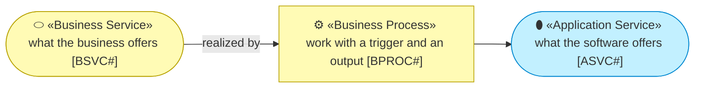
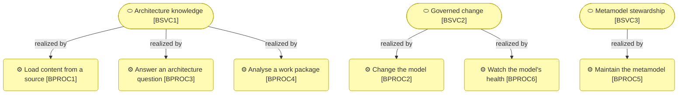
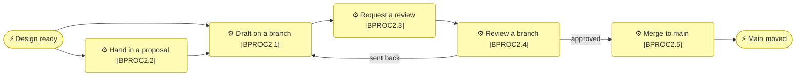
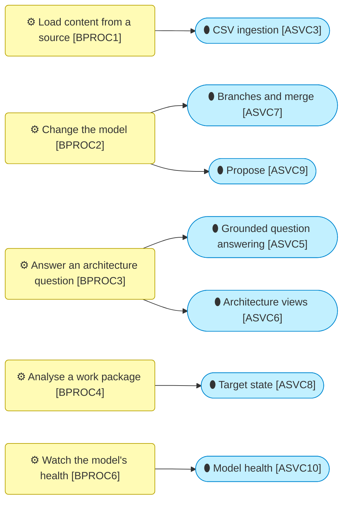

# Processes and services

_[← Business layer](./README.md) · [EA home](../README.md)_

**Status: `◐` draft catalogue** — the services the repository offers the
enterprise and the processes that deliver them, as they run since initiative 7
(2026-09-06). Validated at the **Understanding** gate.

## How to read this document

## Business services

| ID | Service | Offered to | Delivered by |
| -- | ------- | ---------- | ------------ |
| `BSVC1` | **Architecture knowledge** — the enterprise's architecture as a queryable, cited, drawn body of knowledge: what exists, who owns it, what depends on what, what a work package changes | Solution architects, stewards, the data and analytics unit, and any agent | Loading (`BPROC1`), answering (`BPROC3`), analysing (`BPROC4`) |
| `BSVC2` | **Governed change** — a change to the model is drafted apart from the truth, reviewed by the people who own the types it touches, and lands with a record of who decided what | Architects and stewards | Changing the model (`BPROC2`) and watching its health (`BPROC6`) |
| `BSVC3` | **Metamodel stewardship** — the enterprise's own framework kept as configuration: types, relationships, attributes, notation, reviewers per type | The enterprise architecture team | Maintaining the metamodel (`BPROC5`) |

## Business processes

| ID | Process | Trigger | Steps | Outcome |
| -- | ------- | ------- | ----- | ------- |
| `BPROC1` | **Load content from a source** — bring an export of the current tool or of any system into the model | An export is available | Export as CSV; map columns; validate against the metamodel; load onto a branch (or `main`, an admin) | Content with provenance, states derived from lifecycle text, a report of what was rejected |
| `BPROC2` | **Change the model** — the governed path from a design to `main` | A design is ready, or a fact is found wrong | The sub-processes below, in order; nothing reaches `main` without a review unless an admin merges | `main` moved, the change log naming the branch, the reviewers and the merger |
| `BPROC2.1` | **Draft on a branch** — an architect works apart from `main` | A branch exists or is created | Edit elements, relationships, links and states; import; apply a proposal; see the merge log grow | A branch with a change set |
| `BPROC2.2` | **Hand in a proposal** — a design page becomes a change set | A design page in the Proposal Template, a file or a link | The assistant identifies elements and relationships, links what exists, adopts what is new, pushes back on what is missing; the architect reviews the merge log and applies it | Rows on a branch, the proposal kept with it |
| `BPROC2.3` | **Request a review** — the author asks for approval | The branch is complete | The author requests review; the branch is read-only until it is decided; the reviewers of every type it touches are named | A branch in review |
| `BPROC2.4` | **Review a branch** — the second person decides | A review is requested | Each reviewer reads the merge log for their types, approves or sends back with a comment; a branch is approved when every touched type has an approval from one of its reviewers | Approved, or back to draft |
| `BPROC2.5` | **Merge to main** — the approved rows land | The branch is approved | The author or an admin merges item by item; conflicts are resolved; what remains stays on the branch | `main` moved |
| `BPROC3` | **Answer an architecture question** — a question about ownership, dependencies or impact | Somebody asks | The assistant runs tools over the model and composes a document with a generated view; identifiers are checked | A cited answer with a diagram |
| `BPROC4` | **Analyse a work package** — current state against target state | A work package needs a picture | Pick the work package; read the counts, the matrix and the marked view; edit states on the elements | The organisation sees what the initiative creates, changes and retires |
| `BPROC5` | **Maintain the metamodel** — the framework as data | The framework owner changes a type, a relationship, an attribute, a notation or a reviewer | Edit in the app; save; export the pack; reload from file | A new pack version, the app reflecting it |
| `BPROC6` | **Watch the model's health** — freshness and completeness | A weekly look, or before a review | Read the freshness per source and the completeness per type; bulk-edit what is stale or empty; search descriptions for what is wrong | Stale and incomplete content found and fixed |

## Processes and the application services that serve them

## Relationships

| From | | To | | Relationship | Note |
| ---- | - | -- | - | ------------ | ---- |
| `BSVC1` | ⚙ «Business Service» Architecture knowledge | `BPROC1` | ⚙ «Business Process» Load content from a source | realized by | |
| `BSVC1` | ⚙ «Business Service» Architecture knowledge | `BPROC3` | ⚙ «Business Process» Answer an architecture question | realized by | |
| `BSVC1` | ⚙ «Business Service» Architecture knowledge | `BPROC4` | ⚙ «Business Process» Analyse a work package | realized by | |
| `BSVC2` | ⚙ «Business Service» Governed change | `BPROC2` | ⚙ «Business Process» Change the model | realized by | |
| `BSVC2` | ⚙ «Business Service» Governed change | `BPROC6` | ⚙ «Business Process» Watch the model's health | realized by | |
| `BSVC3` | ⚙ «Business Service» Metamodel stewardship | `BPROC5` | ⚙ «Business Process» Maintain the metamodel | realized by | |
| `BPROC2.1` | ⚙ «Business Process» Draft on a branch | `BPROC2.3` | ⚙ «Business Process» Request a review | triggers | |
| `BPROC2.2` | ⚙ «Business Process» Hand in a proposal | `BPROC2.1` | ⚙ «Business Process» Draft on a branch | triggers | a proposal lands on a branch |
| `BPROC2.3` | ⚙ «Business Process» Request a review | `BPROC2.4` | ⚙ «Business Process» Review a branch | triggers | |
| `BPROC2.4` | ⚙ «Business Process» Review a branch | `BPROC2.5` | ⚙ «Business Process» Merge to main | triggers | when approved |
| `BPROC2.4` | ⚙ «Business Process» Review a branch | `BPROC2.1` | ⚙ «Business Process» Draft on a branch | triggers | when sent back |
| `BPROC1` | ⚙ «Business Process» Load content from a source | `ASVC3` | ⚙ «Application Service» CSV ingestion | served by | |
| `BPROC2` | ⚙ «Business Process» Change the model | `ASVC7` | ⚙ «Application Service» Branches and merge | served by | |
| `BPROC2.2` | ⚙ «Business Process» Hand in a proposal | `ASVC9` | ⚙ «Application Service» Propose | served by | |
| `BPROC2.4` | ⚙ «Business Process» Review a branch | `ASVC7` | ⚙ «Application Service» Branches and merge | served by | the review is part of the branch service |
| `BPROC3` | ⚙ «Business Process» Answer an architecture question | `ASVC5` | ⚙ «Application Service» Grounded question answering | served by | |
| `BPROC3` | ⚙ «Business Process» Answer an architecture question | `ASVC6` | ⚙ «Application Service» Architecture views | served by | |
| `BPROC4` | ⚙ «Business Process» Analyse a work package | `ASVC8` | ⚙ «Application Service» Target state | served by | |
| `BPROC5` | ⚙ «Business Process» Maintain the metamodel | `ASVC1` | ⚙ «Application Service» Metamodel management | served by | |
| `BPROC6` | ⚙ «Business Process» Watch the model's health | `ASVC10` | ⚙ «Application Service» Model health | served by | |
| `BPROC6` | ⚙ «Business Process» Watch the model's health | `ASVC2` | ⚙ «Application Service» Element browsing and editing | served by | search and bulk edit |
| `ROLE2` | ◍ «Business Role» Architect | `BPROC2.1` | ⚙ «Business Process» Draft on a branch | performs | |
| `ROLE2` | ◍ «Business Role» Architect | `BPROC2.3` | ⚙ «Business Process» Request a review | performs | |
| `ROLE3` | ◍ «Business Role» Reviewer | `BPROC2.4` | ⚙ «Business Process» Review a branch | performs | for the types assigned |
| `ROLE1` | ◍ «Business Role» Admin | `BPROC5` | ⚙ «Business Process» Maintain the metamodel | performs | |
| `ROLE5` | ◍ «Business Role» Agent | `BPROC2.2` | ⚙ «Business Process» Hand in a proposal | performs | drafts; the architect decides |
| `ROLE5` | ◍ «Business Role» Agent | `BPROC3` | ⚙ «Business Process» Answer an architecture question | performs | |
