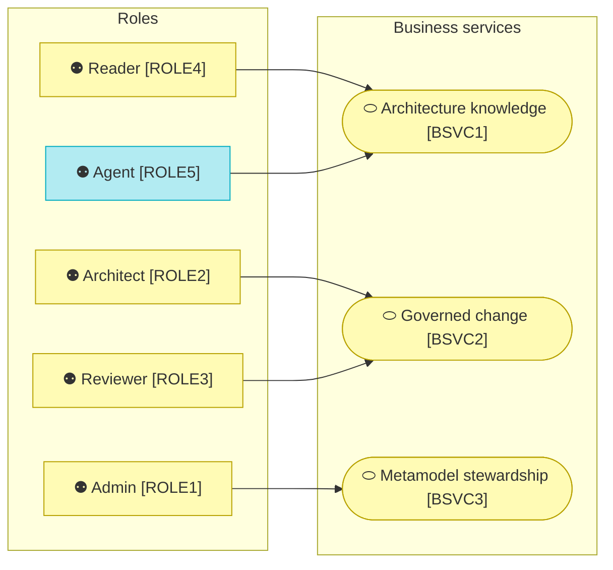

# Business Layer

_[← EA home](../README.md)_

The people and the work around the repository: who plays which role, what
the repository offers them as a service, and the processes through which
content enters, is curated, reviewed and answered from. At Depth 1 this layer
is about the application's own users and its own processes; the enterprise's
business architecture is content *inside* the repository, not this model.

## How to read this document

## Analysis order

| #   | Document | Elements | Question it answers |
| --- | -------- | -------- | ------------------- |
| 1   | [1_actors-and-roles.md](./1_actors-and-roles.md) | Actors, Business Roles | Who works with the repository, in which role, and what may each role do? |
| 2   | [2_processes-and-services.md](./2_processes-and-services.md) | Business Services, Business Processes | What does the repository offer the enterprise, and through which processes is it delivered? |

The value stream the processes realise lives in the strategy layer
([1_strategy/2_value-stream.md](../1_strategy/2_value-stream.md)), where
archreator keeps value streams; each of its stages names the processes here
that realise it.

## Layer view

