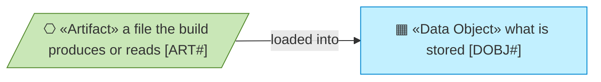
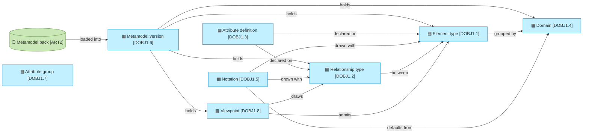
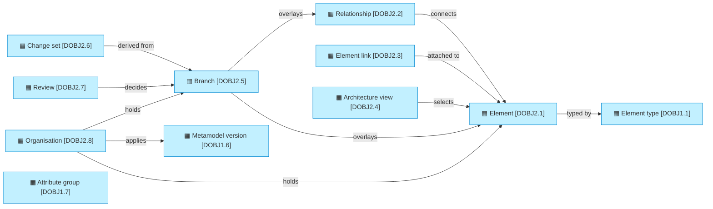
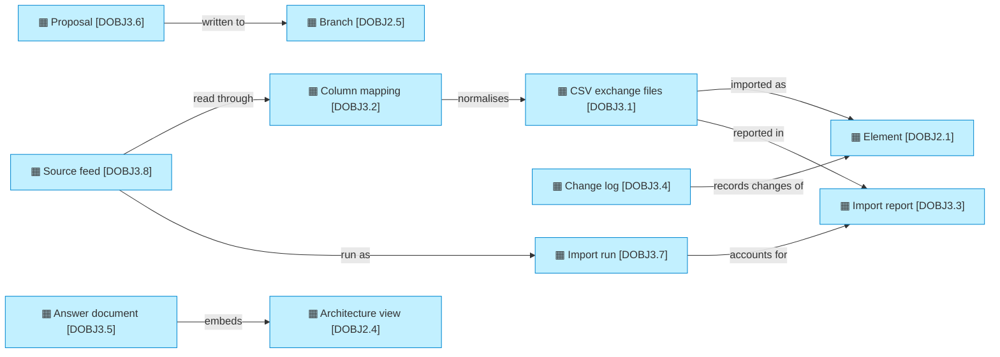

# Data domains and objects

_[← Information layer](./README.md) · [EA home](../README.md)_

**Status: `◐` draft catalogue** — written from the code as it runs today
(`src/ea/models.py`, `src/ea/backend/sql.py`, `src/ea/metamodel/`,
`src/ea/views/`) and from the owner's decisions of 2026-09-05 and 2026-09-06
(initiatives 1 to 7). Validated at the **Understanding** gate with the
information architect.

## How to read this document

## Domains

| ID | Domain | Owner | Holds |
| -- | ------ | ----- | ----- |
| `DOBJ1` | **Metamodel** — what may exist, in versions: element types, relationship types, attributes, attribute groups, domains, viewpoints, provenance tags | The framework owner (for the first pack, the enterprise architecture team; the pack is their metamodel as data) | One pack per framework, in as many versions as that framework has had, each under an identifier that outlives every name given to it (decision 0021); two ship as starters — the Higher Education EA Metamodel and the ArchiMate Core, a second framework carried by the same engine — and either one begins an organisation of its own |
| `DOBJ2` | **Architecture graph** — what does exist: elements, relationships, links, and the organisations they are partitioned into | The content owners (everything is sourced from the current EA tool until the source-of-record table is agreed) | About 4,600 elements in the first slice loaded and 47 in the sample; the store is assessed to hold and answer a hundred thousand elements and six hundred thousand relationships, which is headroom rather than a forecast (assessment `ASM6`, decisions 0016 to 0018) |
| `DOBJ3` | **Exchange and audit** — how content arrives and how every change is remembered | The repository itself | CSV exchange files, column mappings, import reports, the change log, answer documents, proposals, the history of every import and the feeds content arrives on |

## Objects

Every part of a metamodel carries a properties bag: what a framework declares
and the engine keeps without reading. The version, a domain, an element type,
a relationship type and an attribute each have one.

| ID | Object | Code | Persisted as | Classification |
| -- | ------ | ---- | ------------ | -------------- |
| `DOBJ1.1` | **Element type** — id, name, plural, supertype, active flag and deactivation reason, domain, provenance (TOGAF, CORE_EA, LOCAL), identifier prefix, source of record, type and instance owner, attributes, and an abstract flag for a type that only groups its sub-types and that no element may be | `ElementType` in `src/ea/models.py`; loaded by `src/ea/metamodel/loader.py` | table `meta_element_type` | internal |
| `DOBJ1.2` | **Relationship type** — id `<source>__<verb>__<target>`, name and inverse, source and target type or `ANY`, qualifiers (for role-qualified edges such as stewardship), cardinality hints, provenance, the diagrams it appears on, attributes of its own that every relationship of the type may carry, and its notation (`DOBJ1.5`): the ArchiMate relationship it is drawn as, and whether the standard's direction runs from the target end, which is what gives an exported edge its arrowhead | `RelationshipType` in `src/ea/models.py`; `Registry.rel_notation()` in `src/ea/metamodel/registry.py` | table `meta_relationship_type`; the notation in its `notation` JSON column | internal |
| `DOBJ1.3` | **Attribute definition** — name, label, type (`string`, `text`, `integer`, `number`, `boolean`, `date`, `url`, `json`), required flag, enum values, sensitivity, the element type it belongs to (`common` for every type, or a relationship type instead), the attribute group it is read and edited under (`DOBJ1.7`), and the rules a value is held to: a default, one value or several, a unit, a pattern, a minimum and a maximum | `AttributeDef` in `src/ea/models.py`; a value checked against the rules by `Registry` in `src/ea/metamodel/registry.py` | table `meta_attribute`; the rules in its `extra` JSON column | internal |
| `DOBJ1.4` | **Domain** — a grouping of element types for colouring and filtering (information, process, integration, enterprise) | `Domain` in `src/ea/models.py` | table `meta_domain`; the pack header in `meta_pack` | internal |
| `DOBJ1.5` | **Notation** — per element type, how it is drawn: glyph, stereotype, ArchiMate element, shape; a type without one inherits its domain's default; a domain also declares the colour the app uses for its badges and graphs. Per relationship type, the ArchiMate relationship it is drawn as and its direction; a type that names none is drawn as a plain directed line | `notation` block in the pack schema (`packs/README.md`), `Registry.notation()` and `Registry.rel_notation()` in `src/ea/metamodel/registry.py` | tables `meta_element_type`, `meta_domain` and `meta_relationship_type` (`notation` JSON column) | internal |
| `DOBJ1.6` | **Metamodel version** — one stored definition of a pack, keyed `<pack id>@<version>`, where the pack identifier is opaque and permanent: minted once when a framework is first stored, carried unchanged by every version of it, and never derived from anything that can move — not from the name, and not from the content, which would change the key whenever a draft was edited (decision 0021). Beside that key it carries a **name**, which is a label for a reader and nothing keys off, so it is corrected at any point in a version's life, a published one included (decision 0022); its status (`draft`, `published`, `retired`), the version it was derived from, notes, who created it and when, who published it and when. A draft is edited in place, a published version is frozen in everything it *defines* and changes only by being copied into a new draft, and a retired one stays readable for whoever applied it | `Pack` and `PackVersion` in `src/ea/models.py`; `MetamodelService` in `src/ea/services/metamodel.py`; the difference between two versions in `src/ea/metamodel/diff.py` | table `meta_pack`; the domains, types and attributes of the version in the other `meta_` tables | internal |
| `DOBJ1.7` | **Attribute group** — id, name, description and the order it is read in: the section an element's attributes are shown and edited under. An attribute names one by its identifier, so a version carries the vocabulary of its own sections; a group written as a label still resolves by name, and one nothing declares is added to the version rather than dropped, which turns a typo into a visible row instead of an invisible section | `AttributeGroup` in `src/ea/models.py`; `resolve_attribute_groups()` in `src/ea/metamodel/loader.py`; `Registry.groups_in_order()` | table `meta_attribute_group` | internal |
| `DOBJ1.8` | **Viewpoint** — what a diagram is for: id, name, description; the element types and relationship types it admits, none named meaning every one; what it bands by, which is the architecture layer, the element type, or an element of a named type reached through named relationship types; the order of the bands from the top; the relationship types drawn as one shape inside another, the whole end holding the part end; the relationship types drawn as a bar across the shapes they relate; and the band that takes an element the rule cannot place, `Other` unless the viewpoint names it. A pack declares its viewpoints, a published version freezes them with its types, the version diff reports a change to them, and one that names a type the version does not declare is refused on load (decision 0023). The application knows this grammar and no viewpoint by name; a pack that declares none exports the layered drawing | `Viewpoint` in `src/ea/models.py`; read by `Registry.viewpoints()` and `Registry.viewpoint()` in `src/ea/metamodel/registry.py`; compared in `src/ea/metamodel/diff.py` | table `meta_pack` (`viewpoints` JSON column) | internal |
| `DOBJ2.1` | **Element** — identifier, type, name, key, Markdown description, status (`draft`, `approved`, `retired`), lifecycle status, source system and reference, external ids, typed attributes as JSON, origin, version and audit fields; a current state (`proposed`, `planned`, `in_implementation`, `live`, `retired`, `non_existent`), a target state (`undecided`, `keep`, `new`, `change`, `decommission`, `merge`), the target work package and a note (decision 0007) | `Element` in `src/ea/models.py`; `RepositoryService` in `src/ea/services/repository.py` | table `element`; `_version` for optimistic concurrency | internal; attributes flagged `sensitivity: restricted` in the pack (Information Asset CIA ratings) and PII flags (Data Entity) are restricted |
| `DOBJ2.2` | **Relationship** — deterministic identifier from source system, type, ends and qualifier; source and target element, qualifier, attributes, status, origin, provenance, version; the same current state, target state, work package and note as an element | `Relationship` in `src/ea/models.py`; `relationship_key()` in `src/ea/services/repository.py` | table `relationship` | internal |
| `DOBJ2.3` | **Element link** — a URL with a label attached to an element (the current tool's "Links" column, documents, catalogues) | `Link` in `src/ea/models.py` | table `element_link` | internal |
| `DOBJ2.5` | **Branch** — a named line of work started from `main`: description, work package, status (open, in review, approved, merged, abandoned), who and when; its changes live in overlay tables that mirror the main ones with the branch, the base version, the operation and **the row as `main` held it when the branch first touched it** on every row — the base is what lets a merge tell what the branch changed apart from what `main` changed, so only a field both sides moved is a conflict. The three open statuses accept writes and the two closed ones refuse them, because a row written into a closed branch could reach neither main nor an abandon | `Branch` in `src/ea/models.py`; `BranchService` and `refusal_for_writing` in `src/ea/services/branches.py`; the current branch in `src/ea/backend/branching.py` | tables `branch`, `branch_element`, `branch_relationship`, `branch_link` (decision 0006) | internal |
| `DOBJ2.6` | **Change set** — a branch's difference against `main` today: rows added, changed and deleted, each with the main row before and the branch row after, and a conflict flag where `main` moved since the base version | `ChangeSet`, `ChangeItem` and `MergeResult` in `src/ea/models.py`; `diff_branch()` and `merge_branch()` in the store | not persisted; computed on demand, the merge recorded in the change log with the branch as origin | as the content it shows |
| `DOBJ2.7` | **Review** — a reviewer's decision on a branch: approve or send back, for which element types, with a comment, who and when; a branch is approved when every type its change set touches has an approval from one of that type's reviewers | `Review` in `src/ea/models.py`; `ReviewService` in `src/ea/services/reviews.py` | table `branch_review`; the reviewer assignments in `reviewer_assignment` | internal |
| `DOBJ2.4` | **Architecture view** — a subgraph selected from the model: a focus, the elements, the relationships among them, a title, and a note naming what was left out; produced by a query or an agent answer and rendered to Mermaid or draw.io. A view is exported through a viewpoint the reader picks, with the focus, the depth and the layers, and the file is laid out by the application's own code: the bands the viewpoint defines, the order within a band, nesting, spans and a port per edge (decision 0024). The layout is computed on export and never stored (principle `P8`); the reader may instead arrange the shapes in the browser, an arrangement that is never stored either and that the export honours | `View` and `apply_viewpoint()` in `src/ea/views/model.py`; the layout `src/ea/views/layout.py`; renderers `src/ea/views/mermaid.py`, `src/ea/views/drawio.py` | not persisted; rendered on demand | as the content it shows |
| `DOBJ2.8` | **Organisation** — the enterprise whose architecture one body of content describes: identifier, name, description, the metamodel version it applies, whether it is the default the application opens, the organisation its content was copied from, who created it and when. Every element, relationship, link, branch, proposal and review belongs to exactly one, and a copy of the default is where a metamodel version is tried before the default applies it (decision 0014) | `Organisation` in `src/ea/models.py`; `OrganisationService` in `src/ea/services/organisations.py`; the current organisation in `src/ea/backend/organisations.py` | table `organisation`; `org_id` on every content table | internal |
| `DOBJ3.1` | **CSV exchange files** — `elements.csv`, `relationships.csv`, `links.csv` in the contract documented in `connectors/README.md`; one directory per export | `src/ea/importer/csv_import.py` | not persisted; read once per import | as the content they carry |
| `DOBJ3.2` | **Column mapping** — renames export columns and type names onto the contract and the pack (`connectors/tool-export/mapping.yaml` for the current tool's export) | `Mapping` in `src/ea/importer/mapping.py` | YAML file under `connectors/` | internal |
| `DOBJ3.3` | **Import report** — counts read, loaded and skipped, plus every issue with level, code, row and entity | `ImportReport` and `Issue` in `src/ea/models.py` | not persisted; shown in the CLI and the Import page | internal |
| `DOBJ3.4` | **Change log** — who changed what, when, from which version to which, with the before and after payload | `history()` in `src/ea/backend/base.py` | table `change_log` | internal |
| `DOBJ3.5` | **Answer document** — a Markdown document composed from an agent answer: question, answer, elements involved, views as Mermaid, identifiers returned by the tools, ungrounded identifiers, tool trace | `AnswerDocument` and `compose()` in `src/ea/agent/document.py` | not persisted; downloadable as Markdown (question 10, resolved: answer documents are not stored in the repository) | as the content it cites |
| `DOBJ3.6` | **Proposal** — the sources an architect handed in (text, files, links), the change set the agent derived from them (elements linked or new, relationships, states, work package), the pushback when the sources were insufficient, who proposed and when, and the branch it went to | `Proposal` in `src/ea/models.py`; `ProposalResult` and `ProposalService` in `src/ea/agent/proposal.py`; the Proposal Template in `templates/proposal-template.md` | table `proposal`, kept with the branch | as the content it carries |
| `DOBJ3.7` | **Import run** — one execution of an import: what started it (an upload, a command, a feed), who by, the organisation and branch it wrote to, the mapping it used, the files or staging tables it read, the counts of what it created, updated, left unchanged and retired, a bounded sample of its issues and the complete count of them by code, and whether it finished or stopped and why. It does **not** hold the before-image of any row it changed, so it is an account of a run rather than the means to reverse one (`GAP19`) | `ImportRun` in `src/ea/models.py`; `recorded()` in `src/ea/importer/runs.py`; `ASVC12` | table `import_run`; deleted with its organisation, unlike the change log — an `org_id` may be taken again, and a run carries the actor names, file names, issue messages and whole mapping of the organisation that is gone | internal |
| `DOBJ3.8` | **Source feed** — a configured source: the staging tables that are its, the mapping it reads them with (stored inline, so a source's columns cannot change underneath it), the branch it writes to or `main`, whether it empties what it loaded, its schedule and the zone that schedule is written in, and how its last run went | `SourceFeed` in `src/ea/models.py`; `src/ea/importer/feeds.py` | table `source_feed` | internal |

## Exchange, audit and intake

## Persistence

One schema, two engines (principle `P4`). The DDL in `src/ea/backend/sql.py`
uses four types both engines read as written; JSON is stored as text. Locally
the schema lives in one DuckDB file (`data/ea.duckdb`). On Databricks the same
tables live in a Lakebase database — one schema per group of tables, named from
`EA_SCHEMA` (`ea_metamodel`, `ea_content`, `ea_branch`, `ea_governance`,
`ea_audit`, and `ea_staging`, which the store creates and never fills) — the
platform's Postgres, reached over the Postgres protocol with the app's own
identity — in an instance the deployment bundle creates (decision 0013). The
lakehouse reads that database through Unity Catalog once it is registered
there as a catalog, which is where the typed projection and the business
glossary of plateau `PLAT5` are published (adopted: the platform's own
catalogue publishes the glossary). The store is written once on SQL
(`src/ea/backend/sql_backend.py`); an engine adds only how it connects, runs a
statement and lands rows (decision 0011).

Every row of content carries `org_id`: the element, the relationship, the
link, the change log, the branch and everything that hangs off a branch. A
read and a write are scoped to the organisation the session is in, the way
they are scoped to the branch, and a reader's own SQL is answered inside that
scope. The metamodel tables are shared by every organisation and keyed by the
pack identifier and the version, so each version stands beside the others and
the one an organisation applies is loaded by that key. The key is opaque, so
renaming a framework moves no row in the six `meta_` tables and breaks no
`organisation.pack_id` (decision 0021).

Traversals (`neighbours`, `trace`, `impact`) are one recursive query over
`relationship` that visits a node once rather than once per path that reaches
it — so a cycle ends of itself and a hub does not multiply — over both ends of
an edge indexed; no traversal builds the in-process graph. The app still keeps
one for the callers that want the whole model at once, and builds it only below
the size it is assessed to hold in one request, refusing past it rather than
spending the memory (assessment `ASM6`, decision 0019).

## Classification and retention

- The repository content is **internal** by default. Two attribute families are
  **restricted**: the confidentiality, integrity and availability ratings of an
  Information Asset (`sensitivity: restricted` in the pack) and the PII flag of
  a Data Entity. Today they are shown to every signed-in user; column-level
  grants on the projection are a plateau `PLAT4` concern.
- Nothing is deleted: an element is retired (`status = retired`), a relationship
  removal is logged, and the change log is append-only. The change log is kept
  for 2 years on the platform once it runs on Databricks.
- **Import runs are kept and nothing prunes them.** A run is a few kilobytes and
  a nightly feed writes one a day, so the table grows slowly — but it does grow,
  and no retention is enforced today. Deciding the period is the same decision
  as the change log's, and it is open (`GAP19` names the larger part of it).
  What bounds it meanwhile is who may write one: a run is recorded only for a
  caller the application would let import, so neither of the two roles
  `allowed()` denies every write to — a reader and the agent — can fill the
  table by being refused over and over. A refusal
  of *state* — a frozen branch, `main` where the role may not edit it — is a run
  and is kept; a refusal at the door is not.

## Relationships

| From | | To | | Relationship | Note |
| ---- | - | -- | - | ------------ | ---- |
| `DOBJ2.1` | ▤ «Data Object» Element | `DOBJ1.1` | ▤ «Data Object» Element type | typed by | validation in `Registry.validate_element` |
| `DOBJ2.2` | ▤ «Data Object» Relationship | `DOBJ1.2` | ▤ «Data Object» Relationship type | typed by | allowed source and target pairs, qualifiers |
| `DOBJ2.2` | ▤ «Data Object» Relationship | `DOBJ2.1` | ▤ «Data Object» Element | connects | source and target ends |
| `DOBJ2.3` | ▤ «Data Object» Element link | `DOBJ2.1` | ▤ «Data Object» Element | attached to | |
| `DOBJ1.3` | ▤ «Data Object» Attribute definition | `DOBJ1.1` | ▤ «Data Object» Element type | declared on | or on `common` for every type |
| `DOBJ1.3` | ▤ «Data Object» Attribute definition | `DOBJ1.2` | ▤ «Data Object» Relationship type | declared on | what a relationship of the type may carry |
| `DOBJ1.6` | ▤ «Data Object» Metamodel version | `DOBJ1.1` | ▤ «Data Object» Element type | holds | with the relationship types, attributes and domains of the same version |
| `DOBJ3.1` | ▤ «Data Object» CSV exchange files | `DOBJ2.1` | ▤ «Data Object» Element | imported as | idempotent on source system and reference |
| `DOBJ3.2` | ▤ «Data Object» Column mapping | `DOBJ3.1` | ▤ «Data Object» CSV exchange files | normalises | |
| `DOBJ3.1` | ▤ «Data Object» CSV exchange files | `DOBJ3.3` | ▤ «Data Object» Import report | reported in | counts read, loaded and skipped, and every issue |
| `DOBJ3.4` | ▤ «Data Object» Change log | `DOBJ2.1` | ▤ «Data Object» Element | records changes of | and of relationships and the pack |
| `DOBJ3.7` | ▤ «Data Object» Import run | `DOBJ3.3` | ▤ «Data Object» Import report | accounts for | the report is what a run said while somebody watched; the run is what it was afterwards |
| `DOBJ3.8` | ▤ «Data Object» Source feed | `DOBJ3.7` | ▤ «Data Object» Import run | run as | one run per execution; the run outlives the feed, keeping its name |
| `DOBJ3.8` | ▤ «Data Object» Source feed | `DOBJ3.2` | ▤ «Data Object» Column mapping | read through | stored inline with the feed, not as a path |
| `DOBJ2.4` | ▤ «Data Object» Architecture view | `DOBJ2.1` | ▤ «Data Object» Element | selects | every node is an element, focus marked |
| `DOBJ2.4` | ▤ «Data Object» Architecture view | `DOBJ1.5` | ▤ «Data Object» Notation | drawn with | layer, glyph, stereotype and shape per element type; the arrowhead per relationship type |
| `DOBJ2.4` | ▤ «Data Object» Architecture view | `DOBJ1.8` | ▤ «Data Object» Viewpoint | drawn under | what the exported file admits, bands by, nests and spans; the layered viewpoint when the pack declares none |
| `DOBJ1.6` | ▤ «Data Object» Metamodel version | `DOBJ1.8` | ▤ «Data Object» Viewpoint | holds | frozen with the version once it is published; compared by the version diff |
| `DOBJ1.8` | ▤ «Data Object» Viewpoint | `DOBJ1.1` | ▤ «Data Object» Element type | admits | none named means every type; a sub-type counts as its supertype |
| `DOBJ1.8` | ▤ «Data Object» Viewpoint | `DOBJ1.2` | ▤ «Data Object» Relationship type | draws | as a line, as one shape inside another, or as a bar across the shapes it relates; bands by a related element are reached through named types |
| `DOBJ1.2` | ▤ «Data Object» Relationship type | `DOBJ1.5` | ▤ «Data Object» Notation | drawn with | the ArchiMate relationship and its direction; a type that names none is a plain directed line |
| `DOBJ3.5` | ▤ «Data Object» Answer document | `DOBJ2.4` | ▤ «Data Object» Architecture view | embeds | one per `propose_view` call, or one from the cited elements |
| `DOBJ2.5` | ▤ «Data Object» Branch | `DOBJ2.1` | ▤ «Data Object» Element | overlays | a row on the branch replaces, adds or hides the main row |
| `DOBJ2.5` | ▤ «Data Object» Branch | `DOBJ2.2` | ▤ «Data Object» Relationship | overlays | |
| `DOBJ2.6` | ▤ «Data Object» Change set | `DOBJ2.5` | ▤ «Data Object» Branch | derived from | the merge log the Branches page shows |
| `DOBJ3.6` | ▤ «Data Object» Proposal | `DOBJ2.5` | ▤ «Data Object» Branch | written to | the reviewed rows become the branch's rows; the proposal record stays with the branch |
| `DOBJ2.7` | ▤ «Data Object» Review | `DOBJ2.5` | ▤ «Data Object» Branch | decides | approve or send back; a branch merges only when approved, unless an admin merges |
| `DOBJ2.7` | ▤ «Data Object» Review | `DOBJ1.1` | ▤ «Data Object» Element type | scoped by | the reviewers assigned to the type |
| `DOBJ2.8` | ▤ «Data Object» Organisation | `DOBJ1.6` | ▤ «Data Object» Metamodel version | applies | one at a time; the content is checked against the version before it is applied |
| `DOBJ2.8` | ▤ «Data Object» Organisation | `DOBJ2.1` | ▤ «Data Object» Element | holds | and its relationships and links; `org_id` on every row |
| `DOBJ2.8` | ▤ «Data Object» Organisation | `DOBJ2.5` | ▤ «Data Object» Branch | holds | a branch is opened in one organisation and merges there |
