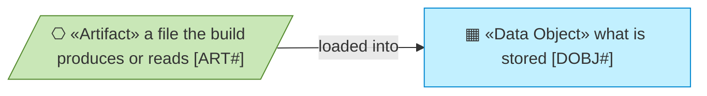
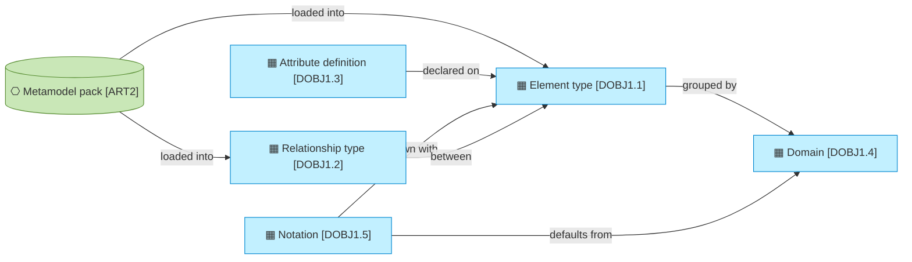
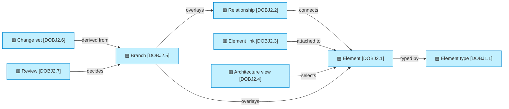
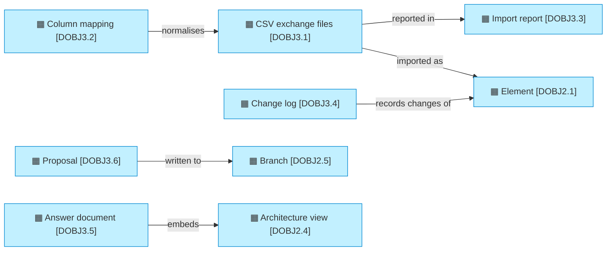

# Data domains and objects

_[← Information layer](./README.md) · [EA home](../README.md)_

**Status: `◐` draft catalogue** — written from the code as it runs today
(`src/ea/models.py`, `src/ea/backend/sql.py`, `src/ea/views/`) and from the owner's
decisions of 2026-09-05 and 2026-09-06 (initiatives 1 to 7). Validated at the
**Understanding** gate with the information architect.

## How to read this document

## Domains

| ID | Domain | Owner | Holds |
| -- | ------ | ----- | ----- |
| `DOBJ1` | **Metamodel** — what may exist: element types, relationship types, attributes, domains, provenance tags | The framework owner (for the first pack, the IT division's enterprise architecture team; the pack is their metamodel as data) | One pack per framework; `higher_education` today |
| `DOBJ2` | **Architecture graph** — what does exist: elements, relationships, links | The content owners (for the PoC, everything is sourced from the current EA tool) | About 4,600 elements once the institution's full export is loaded; 45 in the sample |
| `DOBJ3` | **Exchange and audit** — how content arrives and how every change is remembered | The repository itself | CSV exchange files, column mappings, import reports, the change log |

## Objects

| ID | Object | Code | Persisted as | Classification |
| -- | ------ | ---- | ------------ | -------------- |
| `DOBJ1.1` | **Element type** — id, name, plural, supertype, active flag and deactivation reason, domain, provenance (TOGAF, CORE_EA, LOCAL), identifier prefix, source of record, type and instance owner, attributes | `ElementType` in `src/ea/models.py`; loaded by `src/ea/metamodel/loader.py` | table `meta_element_type` | internal |
| `DOBJ1.2` | **Relationship type** — id `<source>__<verb>__<target>`, name and inverse, source and target type or `ANY`, qualifiers (for role-qualified edges such as stewardship), cardinality hints, provenance, the diagrams it appears on | `RelationshipType` in `src/ea/models.py` | table `meta_relationship_type` | internal |
| `DOBJ1.3` | **Attribute definition** — name, label, type (`string`, `text`, `int`, `date`, `bool`, `enum`), required flag, enum values, sensitivity, the type it belongs to (or `common`) | `AttributeDef` in `src/ea/models.py` | table `meta_attribute` | internal |
| `DOBJ1.4` | **Domain** — a grouping of element types for colouring and filtering (information, process, integration, enterprise) | `Domain` in `src/ea/models.py` | table `meta_domain`; the pack header in `meta_pack` | internal |
| `DOBJ1.5` | **Notation** — per element type, how it is drawn: glyph, stereotype, ArchiMate element, shape; a type without one inherits its domain's default; a domain also declares the colour the app uses for its badges and graphs | `notation` block in the pack schema (`packs/README.md`), `Registry.notation()` in `src/ea/metamodel/registry.py` | table `meta_element_type` and `meta_domain` (`notation` JSON column) | internal |
| `DOBJ2.1` | **Element** — identifier, type, name, key, Markdown description, status (`draft`, `approved`, `retired`), lifecycle status, source system and reference, external ids, typed attributes as JSON, origin, version and audit fields; a current state (`proposed`, `planned`, `in_implementation`, `live`, `retired`, `non_existent`), a target state (`undecided`, `keep`, `new`, `change`, `decommission`, `merge`), the target work package and a note (decision 0007) | `Element` in `src/ea/models.py`; `RepositoryService` in `src/ea/services/repository.py` | table `element`; `_version` for optimistic concurrency | internal; attributes flagged `sensitivity: restricted` in the pack (Information Asset CIA ratings) and PII flags (Data Entity) are restricted |
| `DOBJ2.2` | **Relationship** — deterministic identifier from source system, type, ends and qualifier; source and target element, qualifier, attributes, status, origin, provenance, version; the same current state, target state, work package and note as an element | `Relationship` in `src/ea/models.py`; `relationship_key()` in `src/ea/services/repository.py` | table `relationship` | internal |
| `DOBJ2.3` | **Element link** — a URL with a label attached to an element (the current tool's "Links" column, documents, catalogues) | `Link` in `src/ea/models.py` | table `element_link` | internal |
| `DOBJ2.5` | **Branch** — a named line of work started from `main`: description, work package, status (open, merged, abandoned), who and when; its changes live in overlay tables that mirror the main ones with the branch, the base version and the operation on every row | `Branch` in `src/ea/models.py`; `BranchService` in `src/ea/services/branches.py`; the current branch in `src/ea/backend/branching.py` | tables `branch`, `branch_element`, `branch_relationship`, `branch_link` (decision 0006) | internal |
| `DOBJ2.6` | **Change set** — a branch's difference against `main` today: rows added, changed and deleted, each with the main row before and the branch row after, and a conflict flag where `main` moved since the base version | `ChangeSet`, `ChangeItem` and `MergeResult` in `src/ea/models.py`; `diff_branch()` and `merge_branch()` in the store | not persisted; computed on demand, the merge recorded in the change log with the branch as origin | as the content it shows |
| `DOBJ2.7` | **Review** — a reviewer's decision on a branch: approve or send back, for which element types, with a comment, who and when; a branch is approved when every type its change set touches has an approval from one of that type's reviewers | `Review` in `src/ea/models.py`; `ReviewService` in `src/ea/services/reviews.py` | table `branch_review`; the reviewer assignments in `reviewer_assignment` | internal |
| `DOBJ2.4` | **Architecture view** — a subgraph selected from the model: a focus, the elements, the relationships among them, a title; produced by a query or an agent answer and rendered to Mermaid or draw.io; the reader may arrange its shapes in the browser, an arrangement that is never stored but that the draw.io export honours | `View` in `src/ea/views/model.py`; renderers `src/ea/views/mermaid.py`, `src/ea/views/drawio.py` | not persisted; rendered on demand | as the content it shows |
| `DOBJ3.1` | **CSV exchange files** — `elements.csv`, `relationships.csv`, `links.csv` in the contract documented in `connectors/README.md`; one directory per export | `src/ea/importer/csv_import.py` | not persisted; read once per import | as the content they carry |
| `DOBJ3.2` | **Column mapping** — renames export columns and type names onto the contract and the pack (`connectors/tool-export/mapping.yaml` for the current tool's export) | `Mapping` in `src/ea/importer/mapping.py` | YAML file under `connectors/` | internal |
| `DOBJ3.3` | **Import report** — counts read, loaded and skipped, plus every issue with level, code, row and entity | `ImportReport` and `Issue` in `src/ea/models.py` | not persisted; shown in the CLI and the Import page | internal |
| `DOBJ3.4` | **Change log** — who changed what, when, from which version to which, with the before and after payload | `history()` in `src/ea/backend/base.py` | table `change_log` | internal |
| `DOBJ3.5` | **Answer document** — a Markdown document composed from an agent answer: question, answer, elements involved, views as Mermaid, identifiers returned by the tools, ungrounded identifiers, tool trace | `AnswerDocument` and `compose()` in `src/ea/agent/document.py` | not persisted; downloadable as Markdown (question 10, resolved: answer documents are not stored in the repository) | as the content it cites |
| `DOBJ3.6` | **Proposal** — the sources an architect handed in (text, files, links), the change set the agent derived from them (elements linked or new, relationships, states, work package), the pushback when the sources were insufficient, who proposed and when, and the branch it went to | `Proposal` in `src/ea/models.py`; `ProposalResult` and `ProposalService` in `src/ea/agent/proposal.py`; the Proposal Template in `templates/proposal-template.md` | table `proposal`, kept with the branch | as the content it carries |

## Exchange, audit and intake

## Persistence

One schema, two engines (principle `P4`). The DDL in `src/ea/backend/sql.py`
uses only types both engines share; JSON is stored as text. Locally the schema
lives in one DuckDB file (`data/ea.duckdb`; `/tmp/ea.duckdb` on Databricks
Apps while the Delta backend is pending). On Databricks the same tables land in
one Unity Catalog schema (`EA_CATALOG.EA_SCHEMA`), where Unity Catalog's own
lineage, comments and grants apply and where the business glossary is published
(adopted: the platform's own catalogue publishes the glossary).

Traversals (`neighbours`, `trace`, `impact`) are recursive queries over
`relationship` with a cycle guard, plus an in-process cache of the graph for
the app; the whole institutional graph fits in memory (assessment `ASM6`).

## Classification and retention

- The repository content is **internal** by default. Two attribute families are
  **restricted**: the confidentiality, integrity and availability ratings of an
  Information Asset (`sensitivity: restricted` in the pack) and the PII flag of
  a Data Entity. The PoC shows them to every signed-in user; column-level grants
  on the projection are a plateau `PLAT4` concern.
- Nothing is deleted: an element is retired (`status = retired`), a relationship
  removal is logged, and the change log is append-only. The change log is kept
  for 2 years on the platform once it runs on Databricks.

## Relationships

| From | | To | | Relationship | Note |
| ---- | - | -- | - | ------------ | ---- |
| `DOBJ2.1` | ▤ «Data Object» Element | `DOBJ1.1` | ▤ «Data Object» Element type | typed by | validation in `Registry.validate_element` |
| `DOBJ2.2` | ▤ «Data Object» Relationship | `DOBJ1.2` | ▤ «Data Object» Relationship type | typed by | allowed source and target pairs, qualifiers |
| `DOBJ2.2` | ▤ «Data Object» Relationship | `DOBJ2.1` | ▤ «Data Object» Element | connects | source and target ends |
| `DOBJ2.3` | ▤ «Data Object» Element link | `DOBJ2.1` | ▤ «Data Object» Element | attached to | |
| `DOBJ1.3` | ▤ «Data Object» Attribute definition | `DOBJ1.1` | ▤ «Data Object» Element type | declared on | or on `common` for every type |
| `DOBJ3.1` | ▤ «Data Object» CSV exchange files | `DOBJ2.1` | ▤ «Data Object» Element | imported as | idempotent on source system and reference |
| `DOBJ3.2` | ▤ «Data Object» Column mapping | `DOBJ3.1` | ▤ «Data Object» CSV exchange files | normalises | |
| `DOBJ3.4` | ▤ «Data Object» Change log | `DOBJ2.1` | ▤ «Data Object» Element | records changes of | and of relationships and the pack |
| `DOBJ2.4` | ▤ «Data Object» Architecture view | `DOBJ2.1` | ▤ «Data Object» Element | selects | every node is an element, focus marked |
| `DOBJ2.4` | ▤ «Data Object» Architecture view | `DOBJ1.5` | ▤ «Data Object» Notation | drawn with | layer, glyph, stereotype, shape per type |
| `DOBJ3.5` | ▤ «Data Object» Answer document | `DOBJ2.4` | ▤ «Data Object» Architecture view | embeds | one per `propose_view` call, or one from the cited elements |
| `DOBJ2.5` | ▤ «Data Object» Branch | `DOBJ2.1` | ▤ «Data Object» Element | overlays | a row on the branch replaces, adds or hides the main row |
| `DOBJ2.5` | ▤ «Data Object» Branch | `DOBJ2.2` | ▤ «Data Object» Relationship | overlays | |
| `DOBJ2.6` | ▤ «Data Object» Change set | `DOBJ2.5` | ▤ «Data Object» Branch | derived from | the merge log the Branches page shows |
| `DOBJ3.6` | ▤ «Data Object» Proposal | `DOBJ2.5` | ▤ «Data Object» Branch | written to | the reviewed rows become the branch's rows; the proposal record stays with the branch |
| `DOBJ2.7` | ▤ «Data Object» Review | `DOBJ2.5` | ▤ «Data Object» Branch | decides | approve or send back; a branch merges only when approved, unless an admin merges |
| `DOBJ2.7` | ▤ «Data Object» Review | `DOBJ1.1` | ▤ «Data Object» Element type | scoped by | the reviewers assigned to the type |
