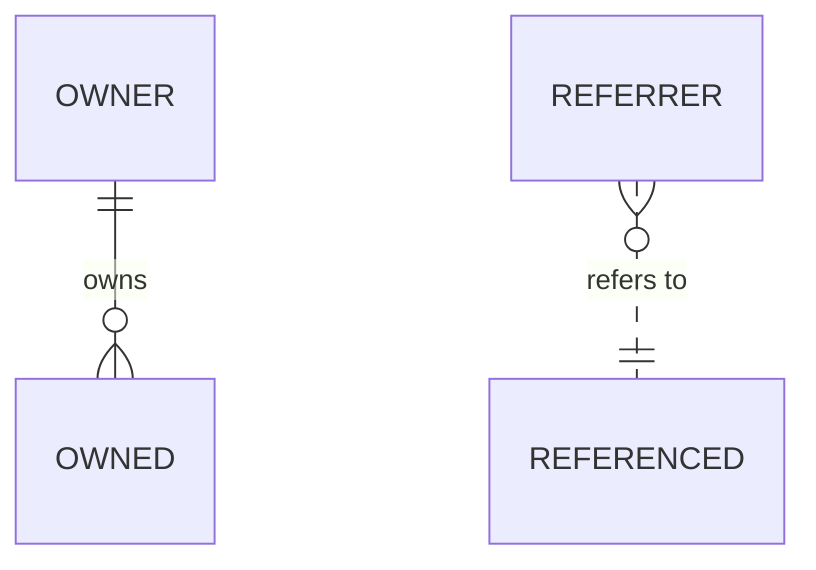
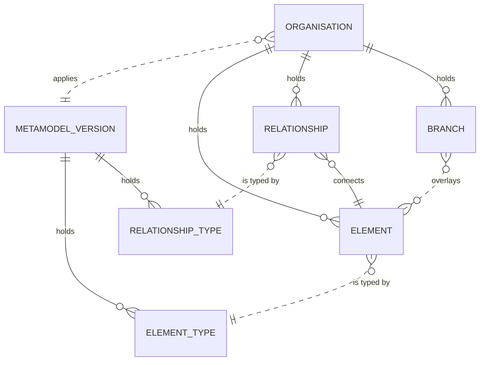
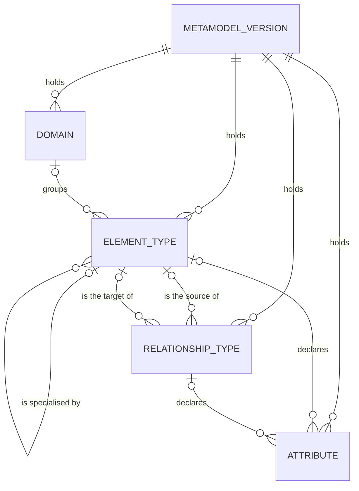
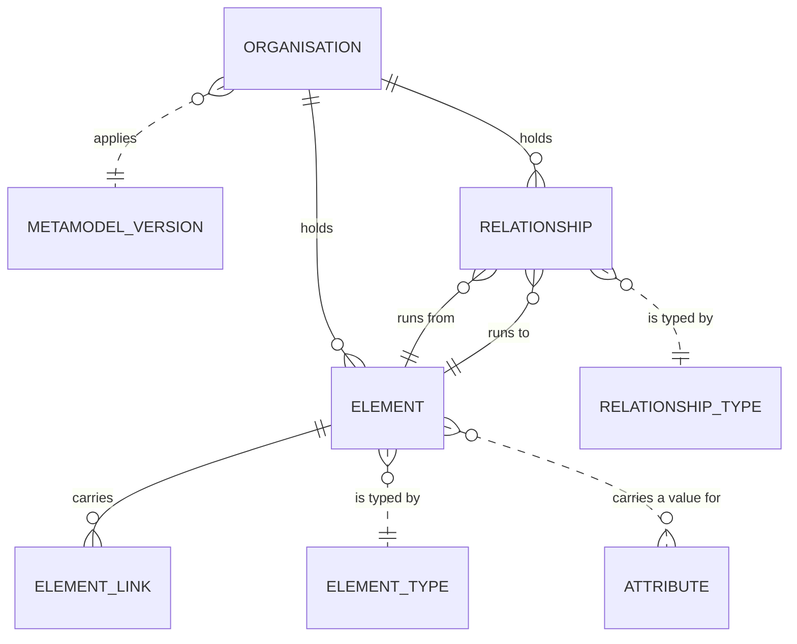
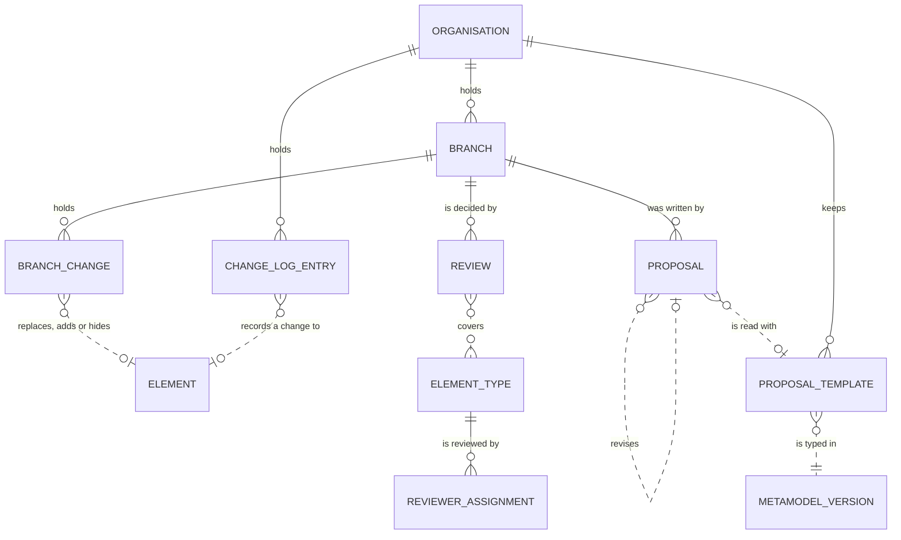

# Conceptual data model

_[← Information layer](./README.md) · [EA home](../README.md)_

**ArchiMate viewpoint:** Information structure — the data objects of
[1_data-objects.md](./1_data-objects.md) read as entities: what one of each is,
and how many of it may hang off another. The catalogue says what information
exists; this document says how it is shaped, and
[3_logical-data-model.md](./3_logical-data-model.md) says how it is stored.

**Status: `◐` draft** — read from the code as it runs today (`src/ea/models.py`,
`src/ea/backend/sql.py`) and from decisions 0006, 0007, 0014, 0015, 0021 and 0022. It defines
no element of its own: every entity below names the data object it belongs to,
and that catalogue owns the name.

## How to read this document

Entity-relationship notation rather than the flowcharts the rest of the model is
drawn in, because how many is the question this document answers and a flowchart
cannot carry it.

| Mark | Reads |
| ---- | ----- |
| `\|\|` | exactly one |
| `\|o` | none or one |
| `o{` | none or many |
| `\|{` | one or many |
| solid line | the entity at the crow's foot belongs to the one at the other end: it has no life without it and goes when it goes |
| dotted line | a reference — the two stand on their own, and one is deleted only when nothing points at it |

Entity names are drawn in capitals and written in prose the way the catalogue
writes them: `ELEMENT_TYPE` on a diagram is the data object [`DOBJ1.1`] Element
type.

## The two halves

Two halves joined at two points. The metamodel half says what may exist and is
owned by the framework; the content half says what does exist and is owned by the
organisation. An organisation applies one version of the metamodel, and every
element it holds is typed by that version — those are the only two joints, which
is what lets a version be tried in one organisation without touching another
(decision 0015).

| Entity | One of them is | Data object | Realized by |
| ------ | -------------- | ----------- | ----------- |
| **METAMODEL_VERSION** | one stored version of one framework's metamodel, keyed `<pack>@<version>` on an identifier that is minted once and never recomputed, in a lifecycle of draft, published and retired; its name stands beside that key as a label | [`DOBJ1.6`] Metamodel version | `Pack` in `src/ea/models.py`, `MetamodelService` |
| **DOMAIN** | a grouping of element types, for colour and filter | [`DOBJ1.4`] Domain | `Domain` in `src/ea/models.py` |
| **ELEMENT_TYPE** | a kind of thing the model may hold — an application, a data entity, a course | [`DOBJ1.1`] Element type | `ElementType` in `src/ea/models.py` |
| **RELATIONSHIP_TYPE** | a kind of edge, with the types allowed at each end | [`DOBJ1.2`] Relationship type | `RelationshipType` in `src/ea/models.py` |
| **ATTRIBUTE** | one named, typed field an element or a relationship of one type may carry, with the rules a value is held to | [`DOBJ1.3`] Attribute definition | `AttributeDef` in `src/ea/models.py`, checked by `Registry` |
| **ORGANISATION** | the enterprise one body of content describes, one of them the default | [`DOBJ2.8`] Organisation | `Organisation` in `src/ea/models.py`, `OrganisationService` |
| **ELEMENT** | one thing that exists, of one type, with its attribute values and its two states | [`DOBJ2.1`] Element | `Element` in `src/ea/models.py`, `RepositoryService` |
| **RELATIONSHIP** | one edge between two elements, of one type | [`DOBJ2.2`] Relationship | `Relationship` in `src/ea/models.py` |
| **ELEMENT_LINK** | a labelled URL hanging off an element | [`DOBJ2.3`] Element link | `Link` in `src/ea/models.py` |
| **BRANCH** | a named line of work on one organisation's content | [`DOBJ2.5`] Branch | `Branch` in `src/ea/models.py`, `BranchService` |
| **BRANCH_CHANGE** | one element, relationship or link as one branch has it, with the operation and the version it was taken from | part of [`DOBJ2.5`] Branch | the overlay tables (decision 0006) |
| **REVIEW** | one reviewer's decision on one branch, for the types they cover | [`DOBJ2.7`] Review | `Review` in `src/ea/models.py`, `ReviewService` |
| **REVIEWER_ASSIGNMENT** | a person who may approve changes to one element type | part of [`DOBJ2.7`] Review | `ReviewService` |
| **PROPOSAL** | what an architect handed in, what the agent derived from it, and where it went; one pass of a design onto a branch, revising the pass before it | [`DOBJ3.6`] Proposal | `Proposal` in `src/ea/models.py`, `ProposalService`; the revision **Pending — future initiative:** [initiative 22](../scope/22_proposal-templates-revisions-and-impact.md) |
| **PROPOSAL_TEMPLATE** | one document shape an organisation proposes in, typed in one metamodel | [`DOBJ3.9`] Proposal template | **Pending — future initiative:** [initiative 22](../scope/22_proposal-templates-revisions-and-impact.md) |
| **CHANGE_LOG_ENTRY** | one change to one thing: who, when, before and after | [`DOBJ3.4`] Change log | `history()` in `src/ea/backend/base.py` |

## What may exist — the metamodel

| From | Relationship | To | How many | Rule |
| ---- | ------------ | -- | -------- | ---- |
| METAMODEL_VERSION | holds | DOMAIN, ELEMENT_TYPE, RELATIONSHIP_TYPE, ATTRIBUTE | one to many | every part of a metamodel belongs to exactly one version; the same type in two versions is two of them, and a published version is frozen in what it defines; its name is not part of that and is corrected in place (decision 0022) |
| DOMAIN | groups | ELEMENT_TYPE | none or one, to many | the domain is where a type's colour and default shape come from; a type without one falls back to the engine's defaults and filters under none |
| ELEMENT_TYPE | is specialised by | ELEMENT_TYPE | none or one, to many | the supertype is a type of the same version; an abstract type only groups its sub-types and no element may be one |
| ELEMENT_TYPE | declares | ATTRIBUTE | none or one, to many | the reserved type `common` declares an attribute on every type |
| RELATIONSHIP_TYPE | declares | ATTRIBUTE | none or one, to many | an attribute is declared on an element type or on a relationship type, never both |
| ELEMENT_TYPE | is the source of, is the target of | RELATIONSHIP_TYPE | none or one, to many | `ANY` leaves that end open to every type |

The metamodel is extensible in every part: a version may add a type, an edge, an
attribute or a domain, and nothing in the application knows the names (principles
`P1` and `P5`). What a framework declares beyond these fields is kept in a
properties bag on the version, the domain, the type, the relationship type and
the attribute, carried and never read.

## What does exist — the architecture graph

| From | Relationship | To | How many | Rule |
| ---- | ------------ | -- | -------- | ---- |
| ORGANISATION | applies | METAMODEL_VERSION | many to exactly one | one version at a time; the content is checked against the version before it is applied, and the check is what makes trying a draft safe |
| ORGANISATION | holds | ELEMENT, RELATIONSHIP, ELEMENT_LINK, BRANCH | one to many | every row of content belongs to exactly one organisation, and no read crosses the boundary (decision 0014) |
| ELEMENT | is typed by | ELEMENT_TYPE | many to exactly one | of the version the organisation applies; an element of a type that version does not have is what the compatibility check reports |
| RELATIONSHIP | is typed by | RELATIONSHIP_TYPE | many to exactly one | the type fixes what may sit at each end and the qualifiers the edge may carry |
| RELATIONSHIP | runs from, runs to | ELEMENT | many to exactly one, each | both ends in the same organisation; the identifier is derived from the ends, so re-importing the same edge is an update |
| ELEMENT | carries a value for | ATTRIBUTE | many to many | only the attributes its type declares, and a required one must have a value |
| ELEMENT_LINK | hangs off | ELEMENT | many to exactly one | goes when the element goes |

## Change, review and provenance

| From | Relationship | To | How many | Rule |
| ---- | ------------ | -- | -------- | ---- |
| BRANCH | holds | BRANCH_CHANGE | one to many | one per element, relationship or link the branch touched, carrying the operation and the version it was taken from, so a merge can tell a conflict from a clean change |
| BRANCH_CHANGE | replaces, adds or hides | ELEMENT, RELATIONSHIP, ELEMENT_LINK | none or one, to one | a branch is an overlay, not a copy: what it does not touch it reads from the organisation's own rows (decision 0006) |
| REVIEW | decides | BRANCH | many to exactly one | approve or send back, with the element types it covers; a branch is approved when every type its changes touch has an approval |
| REVIEWER_ASSIGNMENT | may approve | ELEMENT_TYPE | many to exactly one | per organisation, so the same person may review one type here and not there |
| PROPOSAL | was written to | BRANCH | many to exactly one | the agent writes only to a branch and only what the architect ticked |
| PROPOSAL | revises | PROPOSAL | none or one, to none or one | the pass before it on the same branch; the first pass revises nothing. **Pending — future initiative:** [initiative 22](../scope/22_proposal-templates-revisions-and-impact.md) |
| PROPOSAL | is read with | PROPOSAL_TEMPLATE | many to none or one | none when the page was read as free text; a template deleted later leaves the proposal standing, naming it. **Pending — future initiative:** [initiative 22](../scope/22_proposal-templates-revisions-and-impact.md) |
| ORGANISATION | keeps | PROPOSAL_TEMPLATE | one to many | an organisation's templates are its own; the starters the repository ships become one of them when picked. **Pending — future initiative:** [initiative 22](../scope/22_proposal-templates-revisions-and-impact.md) |
| PROPOSAL_TEMPLATE | is typed in | METAMODEL_VERSION | many to exactly one | by the pack's identifier; a template naming a type the applied version lacks says so when it is checked, and is not refused. **Pending — future initiative:** [initiative 22](../scope/22_proposal-templates-revisions-and-impact.md) |
| CHANGE_LOG_ENTRY | records a change to | ELEMENT, RELATIONSHIP, METAMODEL_VERSION, ORGANISATION, BRANCH | many to one | by kind and identifier rather than by a reference, because the log outlives what it records |

## The rules that hold across the model

- **Two scopes, always.** Every content entity is in exactly one organisation;
  every metamodel entity is in exactly one version. Nothing reads across either
  boundary, and a reader's own SQL is answered inside both.
- **A branch is a third scope, and it is temporary.** A read is answered from the
  organisation's rows unless the branch has its own, and a merge folds the
  branch's rows in and closes it.
- **The attributes are open.** What an element may carry is whatever its type
  declares in the version its organisation applies, so adding an attribute is a
  metamodel change and never a change to this model.
- **Every element and every relationship carries two states**: where it is today
  and what is meant to become of it, with the work package that will do it
  (decision 0007). The vocabularies are fixed by the application, not by the
  framework.
- **Nothing is deleted.** An element is retired, a relationship removal is
  logged, and the change log is append-only. Deleting an organisation is the one
  exception, and it takes everything in it.

## What this model leaves out

Seven of the catalogue's data objects are not entities here, because nothing keeps
them. The architecture view [`DOBJ2.4`] and the change set [`DOBJ2.6`] are
computed on demand, and so is the change impact [`DOBJ3.10`], which is kept only
inside the proposal it was assessed for; the import report [`DOBJ3.3`] and the answer document
[`DOBJ3.5`] are produced and handed over; the CSV exchange files [`DOBJ3.1`] and
the column mapping [`DOBJ3.2`] are read at the door and never land. The notation
[`DOBJ1.5`] is an entity's worth of information carried inside the element type
and the domain rather than standing on its own, which is why it has no box above.
