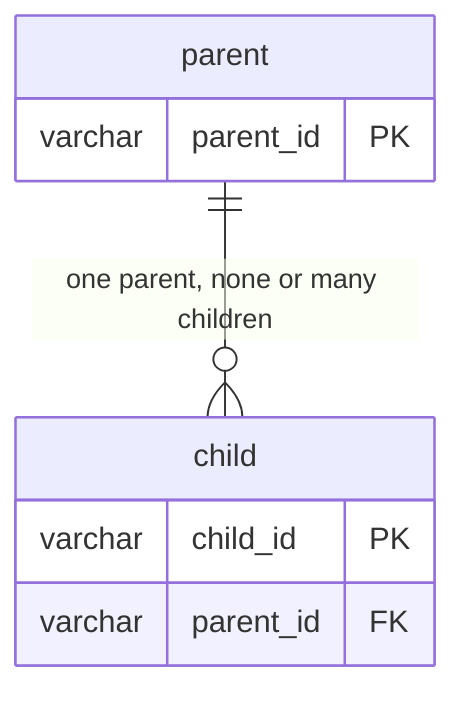
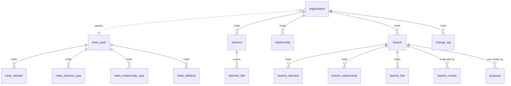
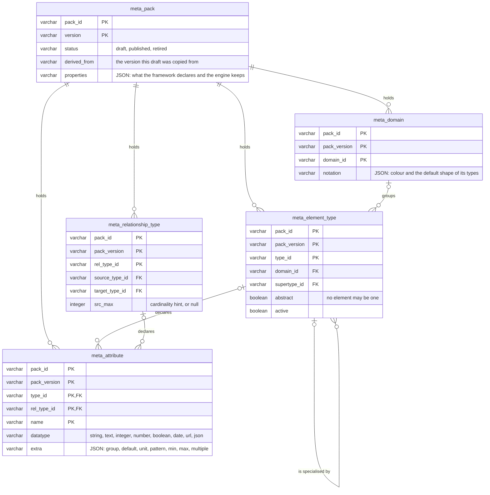
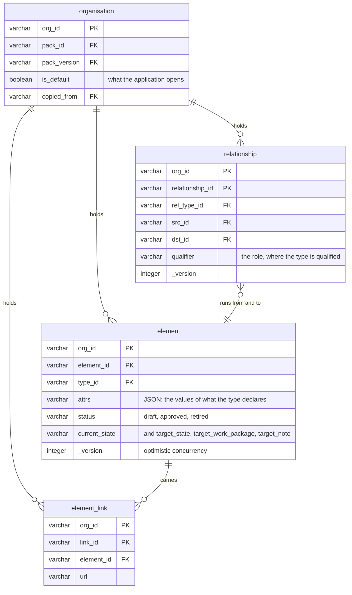
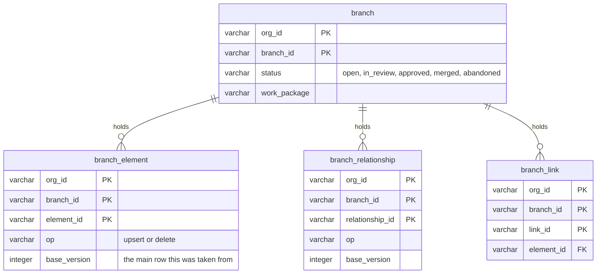
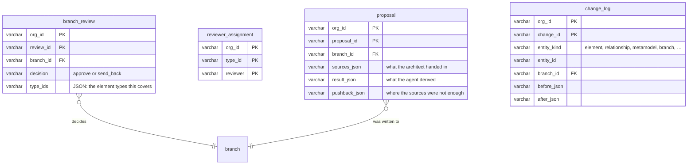

# Logical data model

_[← Information layer](./README.md) · [EA home](../README.md)_

**ArchiMate viewpoint:** Information structure — the entities of
[2_conceptual-data-model.md](./2_conceptual-data-model.md) as the tables the
store creates, with the columns that carry them, the keys that tell one row from
another and the references between them. The source of truth is the DDL in
`src/ea/backend/sql.py`; this document is that DDL read as a model, and a change
to one changes the other in the same commit.

**Status: `◐` draft** — read from `src/ea/backend/sql.py` and
`src/ea/backend/sql_backend.py` as they run today, and from decisions 0006,
0011, 0014 and 0015. It defines no element of its own.

## How to read this document

| Mark | Reads |
| ---- | ----- |
| `PK` | part of the logical key: what tells one row from another |
| `FK` | a logical reference to another table's key |
| `\|\|`, `\|o`, `o{`, `\|{` | exactly one, none or one, none or many, one or many |

**Logical, because nothing is declared.** The DDL creates columns and no
constraints: no primary key, no foreign key, no unique index. Every key below is
enforced by `src/ea/backend/sql_backend.py`, the only writer: it reads by the
key before it writes, carries the whole key in the `WHERE` clause of an update
or a delete, and replaces a set of rows — a version's types, an element's links
— by deleting on the key and inserting. Every reference is checked by the
services before the write. The reason is the one schema on two engines
(decision 0011): tables are created with `CREATE TABLE IF NOT EXISTS` and grown
with `ADD COLUMN IF NOT EXISTS`, both of which read the same on DuckDB and on
Postgres, while a constraint added to a live table does not. The cost is that a
second writer — a hand-written `INSERT` against the file — would not be caught;
the store is single-writer today, so nothing holds one.

## The tables at a glance

Seventeen tables in one schema. The five `meta_` tables are shared by every
organisation and keyed by pack and version, and so is the `organisation` table
itself; the eleven others carry `org_id` and belong to exactly one organisation
(decision 0014).

| Table | Holds | Logical key | Scoped by |
| ----- | ----- | ----------- | --------- |
| `meta_pack` | one version of one metamodel, with its lifecycle | `pack_id`, `version` | the version itself |
| `meta_domain` | the domains of that version | `pack_id`, `pack_version`, `domain_id` | `pack_id`, `pack_version` |
| `meta_element_type` | the element types of that version | `pack_id`, `pack_version`, `type_id` | `pack_id`, `pack_version` |
| `meta_relationship_type` | the relationship types of that version | `pack_id`, `pack_version`, `rel_type_id` | `pack_id`, `pack_version` |
| `meta_attribute` | the attributes of that version, of an element type or of a relationship type | `pack_id`, `pack_version`, `type_id`, `rel_type_id`, `name` | `pack_id`, `pack_version` |
| `organisation` | the enterprises this store holds | `org_id` | shared |
| `element` | the elements of one organisation's main | `org_id`, `element_id` | `org_id` |
| `relationship` | its relationships | `org_id`, `relationship_id` | `org_id` |
| `element_link` | the links hanging off its elements | `org_id`, `link_id` | `org_id` |
| `branch` | its branches | `org_id`, `branch_id` | `org_id` |
| `branch_element` | an element as one branch has it | `org_id`, `branch_id`, `element_id` | `org_id`, `branch_id` |
| `branch_relationship` | a relationship as one branch has it | `org_id`, `branch_id`, `relationship_id` | `org_id`, `branch_id` |
| `branch_link` | a link as one branch has it | `org_id`, `branch_id`, `link_id` | `org_id`, `branch_id` |
| `branch_review` | a reviewer's decision on a branch | `org_id`, `review_id` | `org_id` |
| `reviewer_assignment` | who may approve changes to a type | `org_id`, `type_id`, `reviewer` | `org_id` |
| `proposal` | what an architect handed in and what came of it | `org_id`, `proposal_id` | `org_id` |
| `change_log` | every change, append-only | `org_id`, `change_id` | `org_id` |

## The metamodel tables

| Table | Its other columns | References | Notes |
| ----- | ----------------- | ---------- | ----- |
| `meta_pack` | `name`, `description`, `source`, `provenance_values`, `loaded_at`, `notes`, `created_by`, `created_at`, `published_by`, `published_at` | `derived_from` names another version of the same pack | the version column is called `version` here and `pack_version` everywhere else, which is the one naming seam in the schema |
| `meta_domain` | `name`, `description`, `sort_order`, `properties` | — | |
| `meta_element_type` | `name`, `plural`, `deactivation_reason`, `provenance`, `prefix`, `description`, `examples`, `source_of_record`, `type_owner`, `instance_owner`, `sort_order`, `notation`, `properties` | `domain_id` → `meta_domain`; `supertype_id` → `meta_element_type`, of the same version | a deactivated type keeps its rows: `active` is false and `deactivation_reason` says why |
| `meta_relationship_type` | `name`, `inverse_name`, `provenance`, `qualifiers`, `diagrams`, `description`, `dst_max`, `sort_order`, `properties` | `source_type_id`, `target_type_id` → `meta_element_type`, or the literal `ANY` | the identifier is `<source>__<verb>__<target>`, so it is unique without a surrogate |
| `meta_attribute` | `label`, `required`, `enum_values`, `description`, `sensitivity`, `sort_order` | `type_id` → `meta_element_type` or the reserved `common`; `rel_type_id` → `meta_relationship_type` | exactly one of the two is set; `extra` carries the rules a value is held to, so a new rule is not a migration |

Adding an element type, an edge or an attribute is a row in one of these tables
and no change to any other table (principle `P1`). Loading a version replaces
every row of that `pack_id` and `pack_version` and touches no other version.

## The content tables

| Table | Its other columns | References | Notes |
| ----- | ----------------- | ---------- | ----- |
| `organisation` | `name`, `description`, `is_default`, `created_by`, `created_at`, `updated_at` | `pack_id`, `pack_version` → `meta_pack`; `copied_from` → `organisation` | exactly one row has `is_default`; the store makes the others false when one is named |
| `element` | `key`, `name`, `description_md`, `lifecycle_status`, `source_system`, `source_ref`, `external_ids`, `origin`, `created_at`, `created_by`, `updated_at`, `updated_by`, `target_state`, `target_work_package`, `target_note` | `type_id` → `meta_element_type`, of the version the organisation applies | `_version` is raised on every write and a stale one is refused; `attrs` and `external_ids` are JSON text |
| `relationship` | `attrs`, `status`, `origin`, `source_system`, `source_ref`, the four audit columns, `current_state`, `target_state`, `target_work_package`, `target_note` | `rel_type_id` → `meta_relationship_type`; `src_id`, `dst_id` → `element`, both in the same organisation | `relationship_id` is derived from the source system, the type, the two ends and the qualifier, so re-importing the same edge updates rather than duplicates |
| `element_link` | `label`, `sort_order` | `element_id` → `element` | rewritten whole when an element's links are saved |

An element's own fields are fixed by the application; everything the framework
adds lands in `attrs` as JSON text, which is why a new attribute is a row in
`meta_attribute` and never a column here.

## The branch overlay tables

`branch_element` and `branch_relationship` carry every column of `element` and
`relationship` and three of their own — `branch_id`, `base_version` and `op`. A
read on a branch is the main table minus the identifiers the branch has, unioned
with the branch's rows (decision 0006), which is why the overlay has to repeat
the columns rather than store a delta. `base_version` against the main row's
`_version` is what tells a clean merge from a conflict, and `op` is what lets a
branch hide a row without deleting it.

## Review, proposal and audit

| Table | Its other columns | References | Notes |
| ----- | ----------------- | ---------- | ----- |
| `branch_review` | `reviewer`, `comment`, `decided_at` | `branch_id` → `branch` | one row per decision, never overwritten, so a branch's review history stays readable |
| `reviewer_assignment` | `added_by`, `added_at` | `type_id` → `meta_element_type` | the whole set for a type is rewritten when it is saved |
| `proposal` | `title`, `status`, `created_by`, `created_at` | `branch_id` → `branch` | kept with the branch; the three JSON columns are the record of what was asked and what came back |
| `change_log` | `op`, `actor`, `changed_at`, `version` | `branch_id` → `branch`, where the change was made on one | `entity_kind` is one of `element`, `relationship`, `metamodel`, `organisation`, `branch`, `reviewers` and `import`, with `entity_id` rather than a column per table: the log outlives what it records, and a retired element's history stays |

## Types, JSON and growing the schema

Four column types, chosen because both engines read them as written:
`VARCHAR`, `INTEGER`, `BOOLEAN`, `TIMESTAMP`. There is no JSON type and no
array: every structured value is JSON in a `VARCHAR`, parsed in Python. That
keeps the DDL identical on DuckDB and Lakebase and keeps a row readable from any
SQL client (principle `P4`).

| Column | In | Carries |
| ------ | -- | ------- |
| `attrs` | `element`, `relationship` | the values of the attributes the type declares |
| `external_ids` | `element` | the identifiers the element has in other systems |
| `notation` | `meta_element_type`, `meta_domain` | glyph, stereotype, ArchiMate element, shape, colour |
| `properties` | the five `meta_` tables | what a framework declares beyond the fields above, kept and never read |
| `extra` | `meta_attribute` | the group the attribute is read in, and the rules a value is held to |
| `enum_values`, `examples`, `qualifiers`, `diagrams`, `provenance_values`, `type_ids` | the metamodel tables and `branch_review` | lists |
| `before_json`, `after_json` | `change_log` | the whole row before and after |
| `sources_json`, `result_json`, `pushback_json` | `proposal` | what was handed in, derived and pushed back |

A column added after a table first shipped is listed in `MIGRATIONS` in
`src/ea/backend/sql.py` and applied on start-up with `ADD COLUMN IF NOT EXISTS`,
so an older store keeps working. New columns go at the end, because the inserts
are positional — that is the one rule to remember when the schema grows.

## From entity to table

| Entity of the conceptual model | Table | Data object |
| ------------------------------ | ----- | ----------- |
| METAMODEL_VERSION | `meta_pack` | [`DOBJ1.6`] Metamodel version |
| DOMAIN | `meta_domain` | [`DOBJ1.4`] Domain |
| ELEMENT_TYPE | `meta_element_type` | [`DOBJ1.1`] Element type |
| RELATIONSHIP_TYPE | `meta_relationship_type` | [`DOBJ1.2`] Relationship type |
| ATTRIBUTE | `meta_attribute` | [`DOBJ1.3`] Attribute definition |
| ORGANISATION | `organisation` | [`DOBJ2.8`] Organisation |
| ELEMENT | `element`, and `branch_element` on a branch | [`DOBJ2.1`] Element |
| RELATIONSHIP | `relationship`, and `branch_relationship` on a branch | [`DOBJ2.2`] Relationship |
| ELEMENT_LINK | `element_link`, and `branch_link` on a branch | [`DOBJ2.3`] Element link |
| BRANCH | `branch` | [`DOBJ2.5`] Branch |
| BRANCH_CHANGE | `branch_element`, `branch_relationship`, `branch_link` | part of [`DOBJ2.5`] Branch |
| REVIEW | `branch_review` | [`DOBJ2.7`] Review |
| REVIEWER_ASSIGNMENT | `reviewer_assignment` | part of [`DOBJ2.7`] Review |
| PROPOSAL | `proposal` | [`DOBJ3.6`] Proposal |
| CHANGE_LOG_ENTRY | `change_log` | [`DOBJ3.4`] Change log |

The notation [`DOBJ1.5`] has no table: it is the `notation` column of
`meta_element_type` and `meta_domain`. The architecture view [`DOBJ2.4`], the
change set [`DOBJ2.6`], the import report [`DOBJ3.3`] and the answer document
[`DOBJ3.5`] have none either — they are computed, never stored.
