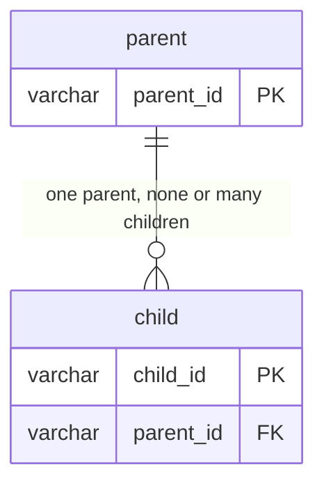
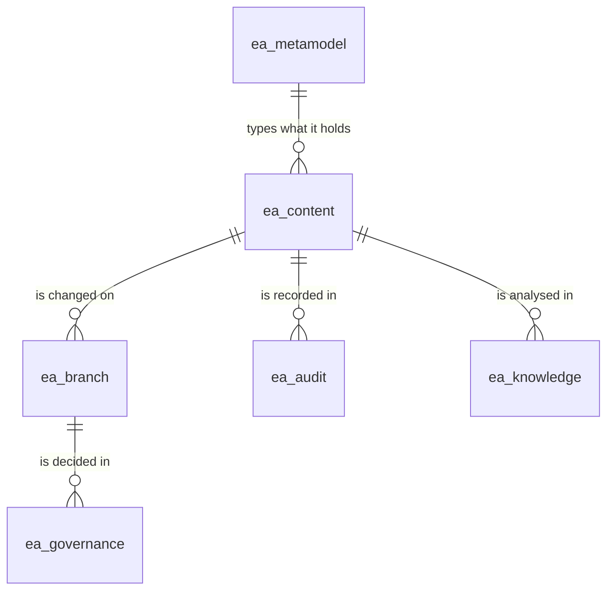
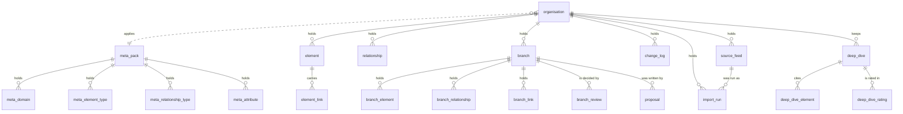
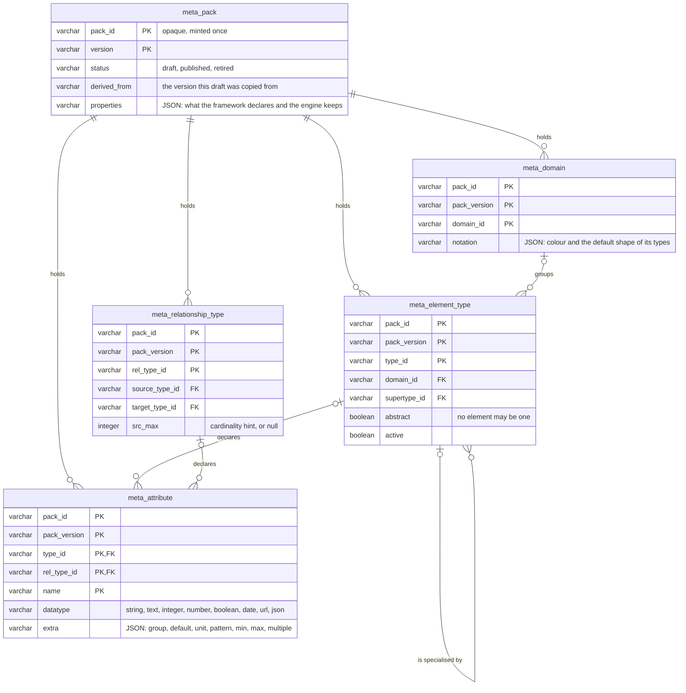
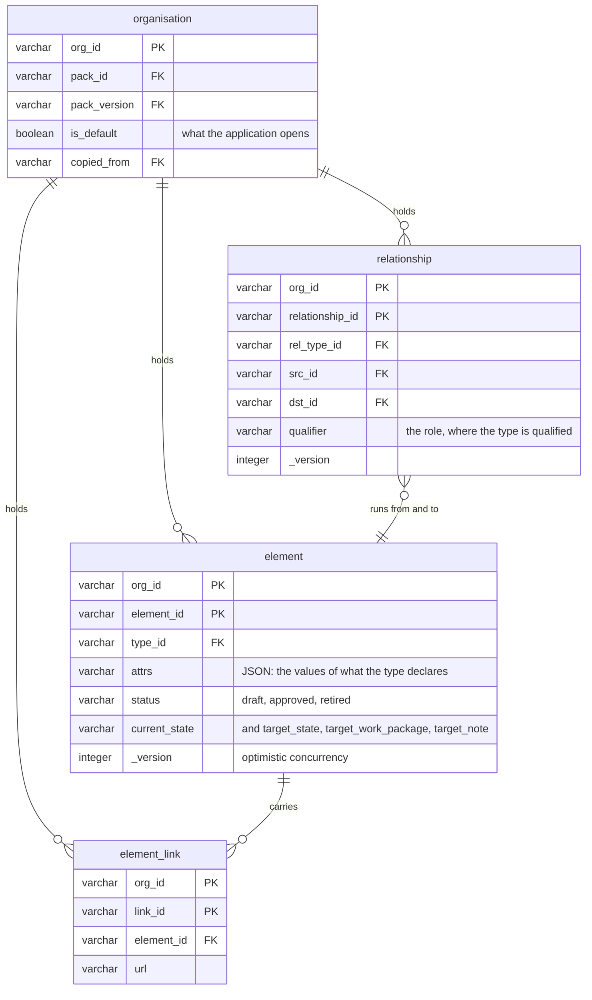
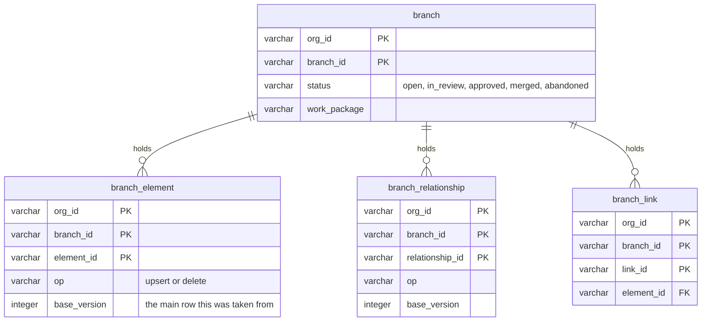
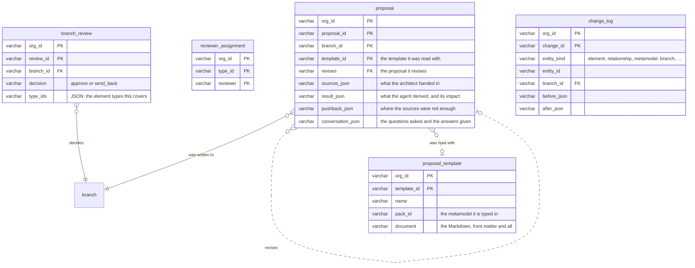
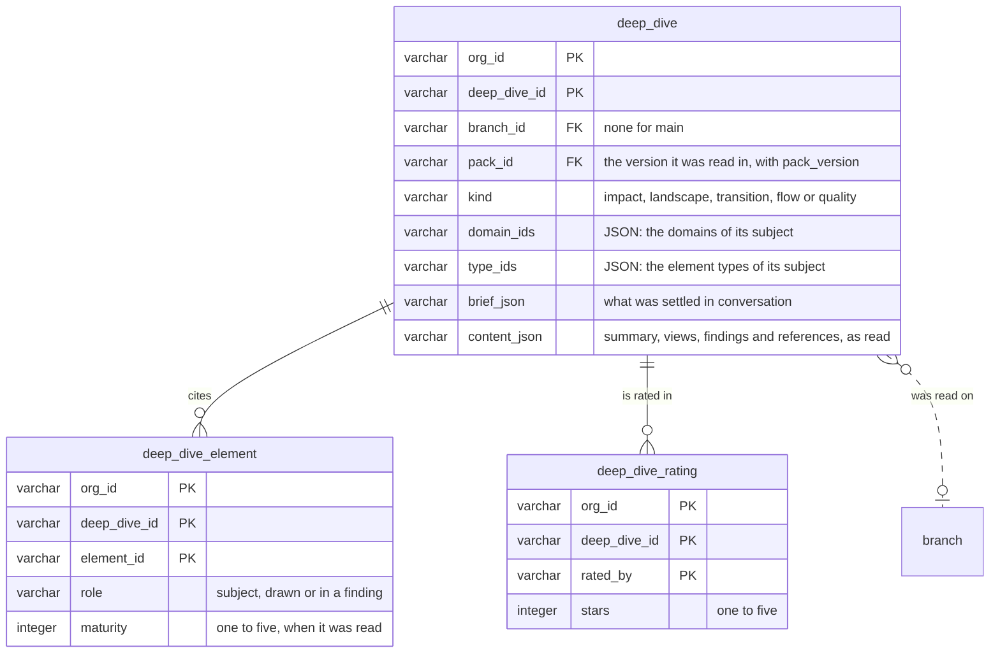
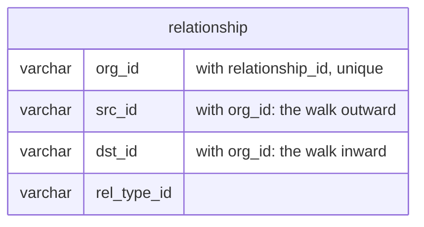

# Logical data model

_[← Information layer](./README.md) · [EA home](../README.md)_

**ArchiMate viewpoint:** Information structure — the entities of
[2_conceptual-data-model.md](./2_conceptual-data-model.md) as the tables the
store creates, with the columns that carry them, the keys that tell one row from
another and the references between them. The source of truth is the DDL in
`src/ea/backend/sql.py`; this document is that DDL read as a model, and a change
to one changes the other in the same commit.

**Status: `◐` draft** — read from `src/ea/backend/sql.py` and
`src/ea/backend/sql_backend.py` as they run today, and from decisions 0006,
0011, 0014, 0015, 0021 and 0022. It defines no element of its own.

## How to read this document

| Mark | Reads |
| ---- | ----- |
| `PK` | part of the logical key: what tells one row from another |
| `FK` | a logical reference to another table's key |
| `\|\|`, `\|o`, `o{`, `\|{` | exactly one, none or one, none or many, one or many |

**The database holds the keys; it does not hold the references** (decision 0017). Every key
below is a unique index (`INDEXES` in `src/ea/backend/sql.py`), created on
start-up and each one on its own: a store that already holds a duplicate keeps
the row and logs the refusal rather than failing to open. The store enforced
these keys in Python long before the database knew them —
`src/ea/backend/sql_backend.py` is the only writer, it reads by the key before
it writes and carries the whole key in every update and delete — so the index is
a second lock on the same door, and it is what a second writer would meet.

**Foreign keys are deliberately absent.** An element points at the element type
of the version its organisation applies, and a version may be retired or a type
deleted while the content that used it stays exactly where it is; the
compatibility check reports it instead (decision 0015). A foreign key would
forbid that, and the metamodel would stop being data. References are checked by
the services on the way in, which is where a person can be told what is wrong.

Everything here is created the same way on both engines (decision 0011):
`CREATE TABLE IF NOT EXISTS`, `ADD COLUMN IF NOT EXISTS` and
`CREATE INDEX IF NOT EXISTS` all read the same on DuckDB and on Postgres.

## The schemas

The groups below are not a way of reading the document: they are the schemas the
store creates (decision 0018). `EA_SCHEMA` names the prefix (`ea` by default) and each group is a
schema of its own, so two deployments can share one database and a grant can be
given per group.

| Schema | Holds | Read by |
| ------ | ----- | ------- |
| `ea_metamodel` | the six `meta_` tables: what may exist, in versions | everyone; written by whoever may edit a version |
| `ea_content` | the organisations and their elements, relationships and links | everyone |
| `ea_branch` | a branch and the rows it lays over the content | whoever works on a branch |
| `ea_governance` | reviews, reviewer assignments, proposals and the templates they are written in, and the feeds that say where content comes from | reviewers and admins |
| `ea_audit` | the change log and the history of every import | anyone who may read the content; never updated, only appended |
| `ea_knowledge` | the deep dives kept on the content, the elements each cites and the ratings people gave them | anyone who may read the content; written by whoever may ask, and rated by anyone who may read |
| `ea_staging` | **nothing the store makes.** The one schema it creates and never fills: a source leaves rows here in the contract's own shape and a feed reads them (decision 0020) | the store reads it; whatever writes it is outside the application |

Every statement that makes or alters a table names its schema; everything else
names the table alone and lets the search path find it, which is why the rest of
this document — and the store's own SQL — reads the same as it did when there
was one schema. A store made before the split keeps its tables in one schema,
and the first start moves each one, with its rows, into the schema of its group.

## The tables at a glance

Twenty-three tables. The six `meta_` tables are shared by every organisation and keyed
by pack and version, and so is the `organisation` table itself; the sixteen
others carry `org_id` and belong to exactly one organisation (decision 0014).
A run names the feed it was of and keeps that feed's name beside the identifier,
so the history survives the feed being deleted — the line above is what a run
*was* run as, not a key it is read through.

| Table | Holds | Key (a unique index) | Scoped by |
| ----- | ----- | ----------- | --------- |
| `meta_pack` | one version of one metamodel, with its lifecycle | `pack_id`, `version` — the pack identifier minted once and never read for meaning | the version itself |
| `meta_domain` | the domains of that version | `pack_id`, `pack_version`, `domain_id` | `pack_id`, `pack_version` |
| `meta_element_type` | the element types of that version | `pack_id`, `pack_version`, `type_id` | `pack_id`, `pack_version` |
| `meta_relationship_type` | the relationship types of that version | `pack_id`, `pack_version`, `rel_type_id` | `pack_id`, `pack_version` |
| `meta_attribute` | the attributes of that version, of an element type or of a relationship type | `pack_id`, `pack_version`, `type_id`, `rel_type_id`, `name` | `pack_id`, `pack_version` |
| `organisation` | the enterprises this store holds | `org_id` | shared |
| `element` | the elements of one organisation's main | `org_id`, `element_id` | `org_id` |
| `relationship` | its relationships | `org_id`, `relationship_id` | `org_id` |
| `element_link` | the links hanging off its elements | `org_id`, `link_id` | `org_id` |
| `branch` | its branches | `org_id`, `branch_id` | `org_id` |
| `branch_element` | an element as one branch has it | `org_id`, `branch_id`, `element_id` | `org_id`, `branch_id` |
| `branch_relationship` | a relationship as one branch has it | `org_id`, `branch_id`, `relationship_id` | `org_id`, `branch_id` |
| `branch_link` | a link as one branch has it | `org_id`, `branch_id`, `link_id` | `org_id`, `branch_id` |
| `branch_review` | a reviewer's decision on a branch | `org_id`, `review_id` | `org_id` |
| `reviewer_assignment` | who may approve changes to a type | `org_id`, `type_id`, `reviewer` | `org_id` |
| `proposal` | what an architect handed in and what came of it | `org_id`, `proposal_id` | `org_id` |
| `proposal_template` | a document shape the organisation proposes in, and how it is read | `org_id`, `template_id` | `org_id` |
| `source_feed` | a configured source: its staging tables, its mapping inline, where it writes and when it is meant to run | `org_id`, `feed_id` | `org_id` |
| `change_log` | every change, append-only | `org_id`, `change_id` | `org_id` |
| `import_run` | what one import was: what it read, where it wrote, what it changed, a bounded sample of its issues and the complete count of them, and why it stopped. Written once and never updated | `org_id`, `run_id`; read newest first on `org_id`, `started_at`, and per feed on `org_id`, `feed_id`, `started_at` | `org_id` |
| `deep_dive` | one analysis a reader settled with the assistant: its brief, catalogue entry, views, findings and references | `org_id`, `deep_dive_id` | `org_id` |
| `deep_dive_element` | an element one deep dive cites, how, and the maturity it had then | `org_id`, `deep_dive_id`, `element_id` | `org_id` |
| `deep_dive_rating` | one person's stars for one deep dive | `org_id`, `deep_dive_id`, `rated_by` | `org_id` |

## The metamodel tables

| Table | Its other columns | References | Notes |
| ----- | ----------------- | ---------- | ----- |
| `meta_pack` | `name`, `description`, `source`, `provenance_values`, `loaded_at`, `notes`, `created_by`, `created_at`, `published_by`, `published_at` | `derived_from` names another version of the same pack | `name` is a label, and it is the one column of a published version an update may still touch (decision 0022); the version column is called `version` here and `pack_version` everywhere else, which is the one naming seam in the schema |
| `meta_domain` | `name`, `description`, `sort_order`, `properties` | — | |
| `meta_element_type` | `name`, `plural`, `deactivation_reason`, `provenance`, `prefix`, `description`, `examples`, `source_of_record`, `type_owner`, `instance_owner`, `sort_order`, `notation`, `properties`; `level` (`enterprise` or `solution`) | `domain_id` → `meta_domain`; `supertype_id` → `meta_element_type`, of the same version | a deactivated type keeps its rows: `active` is false and `deactivation_reason` says why |
| `meta_relationship_type` | `name`, `inverse_name`, `provenance`, `qualifiers`, `diagrams`, `description`, `dst_max`, `sort_order`, `properties` | `source_type_id`, `target_type_id` → `meta_element_type`, or the literal `ANY` | the identifier is `<source>__<verb>__<target>`, so it is unique without a surrogate |
| `meta_attribute` | `label`, `required`, `enum_values`, `description`, `sensitivity`, `sort_order` | `type_id` → `meta_element_type` or the reserved `common`; `rel_type_id` → `meta_relationship_type` | exactly one of the two is set; `extra` carries the rules a value is held to, so a new rule is not a migration |

Adding an element type, an edge or an attribute is a row in one of these tables
and no change to any other table (principle `P1`). Loading a version replaces
every row of that `pack_id` and `pack_version` and touches no other version.

## The content tables

| Table | Its other columns | References | Notes |
| ----- | ----------------- | ---------- | ----- |
| `organisation` | `name`, `description`, `is_default`, `created_by`, `created_at`, `updated_at` | `pack_id`, `pack_version` → `meta_pack`; `copied_from` → `organisation` | exactly one row has `is_default`; the store makes the others false when one is named |
| `element` | `key`, `name`, `description_md`, `lifecycle_status`, `source_system`, `source_ref`, `external_ids`, `origin`, `created_at`, `created_by`, `updated_at`, `updated_by`, `target_state`, `target_work_package`, `target_note` | `type_id` → `meta_element_type`, of the version the organisation applies | `_version` is raised on every write and a stale one is refused; `attrs` and `external_ids` are JSON text |
| `relationship` | `attrs`, `status`, `origin`, `source_system`, `source_ref`, the four audit columns, `current_state`, `target_state`, `target_work_package`, `target_note` | `rel_type_id` → `meta_relationship_type`; `src_id`, `dst_id` → `element`, both in the same organisation | `relationship_id` is derived from the source system, the type, the two ends and the qualifier, so re-importing the same edge updates rather than duplicates |
| `element_link` | `label`, `sort_order` | `element_id` → `element` | rewritten whole when an element's links are saved |

An element's own fields are fixed by the application; everything the framework
adds lands in `attrs` as JSON text, which is why a new attribute is a row in
`meta_attribute` and never a column here.

## The branch overlay tables

`branch_element` and `branch_relationship` carry every column of `element` and
`relationship` and three of their own — `branch_id`, `base_version` and `op`. A
read on a branch is the main table minus the identifiers the branch has, unioned
with the branch's rows (decision 0006), which is why the overlay has to repeat
the columns rather than store a delta. `base_version` against the main row's
`_version` is what tells a clean merge from a conflict, and `op` is what lets a
branch hide a row without deleting it.

## Review, proposal and audit

| Table | Its other columns | References | Notes |
| ----- | ----------------- | ---------- | ----- |
| `branch_review` | `reviewer`, `comment`, `decided_at` | `branch_id` → `branch` | one row per decision, never overwritten, so a branch's review history stays readable |
| `reviewer_assignment` | `added_by`, `added_at` | `type_id` → `meta_element_type` | the whole set for a type is rewritten when it is saved |
| `proposal` | `title`, `status` (`draft` or `applied`), `created_by`, `created_at`, `updated_at` | `branch_id` → `branch`; `template_id` → `proposal_template`; `revises` → `proposal` | kept with the branch; the JSON columns are the record of what was asked and what came back, the impact assessed at Apply inside `result_json`, the conversation that refined a draft in `conversation_json`. A draft for a branch not yet created carries an empty `branch_id`. A template or an earlier revision is referred to, never required: a proposal outlives both |
| `proposal_template` | `description`, `created_by`, `created_at`, `updated_at` | `pack_id` → `meta_pack` | The document is stored whole, because the reading is in its front matter and the architect downloads exactly what was uploaded |
| `change_log` | `op`, `actor`, `changed_at`, `version` | `branch_id` → `branch`, where the change was made on one | `entity_kind` is one of `element`, `relationship`, `metamodel`, `organisation`, `branch`, `reviewers`, `import` and `template`, with `entity_id` rather than a column per table: the log outlives what it records, and a retired element's history stays |

## Deep dives

| Table | Its other columns | References | Notes |
| ----- | ----------------- | ---------- | ----- |
| `deep_dive` | `title`, `work_package`, `status` (`kept` or `withdrawn`), `pack_version`, `created_by`, `created_at` | `branch_id` → `branch`; `pack_id`, `pack_version` → `meta_pack` | the pack is generated from `content_json` when it is downloaded, so what is kept is the analysis as it was read, never a file; a withdrawn one keeps its row |
| `deep_dive_element` | none | `element_id` → `element`, by identifier, so an element retired later keeps the deep dives that cited it | what the element page reads to list the deep dives on an element |
| `deep_dive_rating` | `comment`, `rated_at` | `deep_dive_id` → `deep_dive` | one row per person, rewritten when they change it |

## Types, JSON and growing the schema

Four column types, chosen because both engines read them as written:
`VARCHAR`, `INTEGER`, `BOOLEAN`, `TIMESTAMP`. There is no JSON type and no
array: every structured value is JSON in a `VARCHAR`, parsed in Python. That
keeps the DDL identical on DuckDB and Lakebase and keeps a row readable from any
SQL client (principle `P4`).

| Column | In | Carries |
| ------ | -- | ------- |
| `attrs` | `element`, `relationship` | the values of the attributes the type declares |
| `external_ids` | `element` | the identifiers the element has in other systems |
| `notation` | `meta_element_type`, `meta_domain` | glyph, stereotype, ArchiMate element, shape, colour |
| `properties` | the five `meta_` tables | what a framework declares beyond the fields above, kept and never read |
| `extra` | `meta_attribute` | the group the attribute is read in, and the rules a value is held to |
| `enum_values`, `examples`, `qualifiers`, `diagrams`, `provenance_values`, `type_ids` | the metamodel tables and `branch_review` | lists |
| `before_json`, `after_json` | `change_log` | the whole row before and after |
| `sources_json`, `result_json`, `pushback_json`, `conversation_json` | `proposal` | what was handed in, derived — with the reader's own finding and the impact — pushed back, and asked and answered |
| `domain_ids`, `type_ids`, `brief_json`, `content_json` | `deep_dive` | its catalogue entry, what the reader settled, and what the analysis read and found |

A column added after a table first shipped is listed in `MIGRATIONS` in
`src/ea/backend/sql.py` and applied on start-up with `ADD COLUMN IF NOT EXISTS`,
so an older store keeps working. It may be declared anywhere in the DDL: a store
that gained it by migration holds it physically last, and every write names its
columns rather than counting on their order.

## The indexes

Two kinds, both in `INDEXES` in `src/ea/backend/sql.py`.

| Index | On | Why |
| ----- | -- | --- |
| the key of each table | every table above | what tells one row from another, now held by the database as well as by the store |
| `relationship (org_id, src_id)`, `(org_id, dst_id)` | both ends of an edge | a traversal follows one end per hop; without them every hop reads the whole table |
| `branch_relationship (org_id, branch_id, src_id)`, `(… dst_id)` | the same on a branch | a walk on a branch reads the overlay the same way |
| `element (org_id, type_id)` | the elements of a type | the counts per type, and browsing by type |
| `element_link (org_id, element_id)`, `branch_link (org_id, branch_id, element_id)` | the links of an element | read and rewritten whole, per element |
| `change_log (org_id, entity_id)` | the history of one thing | the log grows without bound and is read one element at a time |
| `deep_dive_element (org_id, element_id)` | the deep dives that cite an element | read on every element page, and by every deep dive for the earlier ones on its elements |
| `meta_attribute (pack_id, pack_version)` | the attributes of a version | the one metamodel table with no unique key: its key holds `type_id` or `rel_type_id` and never both, and the two engines do not agree on whether two NULLs are the same value |

The two traversal indexes are what decides whether the graph stays usable as the
model grows (decision 0016). Measured on Postgres with 100,000 elements and 600,000
relationships, a five-hop walk out of an ordinary element took 608 ms without
them and 44 ms with them; the walk the store runs today, which carries the edge
that reached each node instead of enumerating paths, takes 9 ms, and 27 ms out
of a hub that every element depends on.

## From entity to table

| Entity of the conceptual model | Table | Data object |
| ------------------------------ | ----- | ----------- |
| METAMODEL_VERSION | `meta_pack` | [`DOBJ1.6`] Metamodel version |
| DOMAIN | `meta_domain` | [`DOBJ1.4`] Domain |
| ELEMENT_TYPE | `meta_element_type` | [`DOBJ1.1`] Element type |
| RELATIONSHIP_TYPE | `meta_relationship_type` | [`DOBJ1.2`] Relationship type |
| ATTRIBUTE | `meta_attribute` | [`DOBJ1.3`] Attribute definition |
| ORGANISATION | `organisation` | [`DOBJ2.8`] Organisation |
| ELEMENT | `element`, and `branch_element` on a branch | [`DOBJ2.1`] Element |
| RELATIONSHIP | `relationship`, and `branch_relationship` on a branch | [`DOBJ2.2`] Relationship |
| ELEMENT_LINK | `element_link`, and `branch_link` on a branch | [`DOBJ2.3`] Element link |
| BRANCH | `branch` | [`DOBJ2.5`] Branch |
| BRANCH_CHANGE | `branch_element`, `branch_relationship`, `branch_link` | part of [`DOBJ2.5`] Branch |
| REVIEW | `branch_review` | [`DOBJ2.7`] Review |
| REVIEWER_ASSIGNMENT | `reviewer_assignment` | part of [`DOBJ2.7`] Review |
| PROPOSAL | `proposal` | [`DOBJ3.6`] Proposal |
| PROPOSAL_TEMPLATE | `proposal_template` | [`DOBJ3.9`] Proposal template |
| CHANGE_LOG_ENTRY | `change_log` | [`DOBJ3.4`] Change log |
| DEEP_DIVE | `deep_dive`, `deep_dive_element` | [`DOBJ3.11`] Deep dive |
| DEEP_DIVE_RATING | `deep_dive_rating` | part of [`DOBJ3.11`] Deep dive |

The notation [`DOBJ1.5`] has no table: it is the `notation` column of
`meta_element_type` and `meta_domain`. The architecture view [`DOBJ2.4`], the
change set [`DOBJ2.6`], the import report [`DOBJ3.3`], the answer document
[`DOBJ3.5`] and the change impact [`DOBJ3.10`] have none either — they are
computed, never stored, the impact kept only inside the proposal it was assessed
for.
