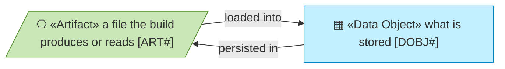
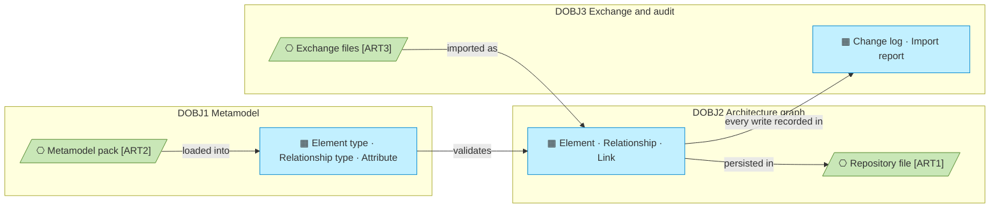

# Information Layer

_[← EA home](../README.md)_

The passive structure of the repository: the metamodel that says what may
exist, the architecture graph that holds what does exist, and the exchange
files and audit trail around them. This layer describes the repository's
*own* information; the enterprise content it holds (the enterprise's own elements) is data
inside `DOBJ2`, not elements of this model.

## How to read this document

## Analysis order

| #   | Document | Elements | Question it answers |
| --- | -------- | -------- | ------------------- |
| 1   | [1_data-objects.md](./1_data-objects.md) | Data domains, the Data Objects inside them, their code locations, persistence and classification | What information exists, in which domain, where does it live, how sensitive is it? |
| 2   | [2_conceptual-data-model.md](./2_conceptual-data-model.md) | The same data objects as entities — no new element | What are the entities, and how many of one hangs off another? |
| 3   | [3_logical-data-model.md](./3_logical-data-model.md) | The same entities as tables — no new element | Which table holds what, keyed how, referencing what? |
| 4   | Data flows | — | Folded into document 1 (one flow: pack → registry → tables; CSV → importer → tables → app and agent) |
| 5   | Data architecture | — | Folded into document 1: one DuckDB file locally, one Lakebase schema later, same DDL |

**Every data object belongs to a domain, and the identifier carries it.** The
three domains are the level-1 rows of the catalogue (`DOBJ1` the metamodel,
`DOBJ2` the architecture graph, `DOBJ3` exchange and audit) and their objects
extend them (`DOBJ2.1`).

**The catalogue is the only document that defines an element here.** Documents 2
and 3 read the same objects at two more levels of detail — the entities and
their cardinalities, then the tables, their keys and their references — because
a catalogue row says what an object is and not how much of it may exist or what
it is stored as.

## Layer view

