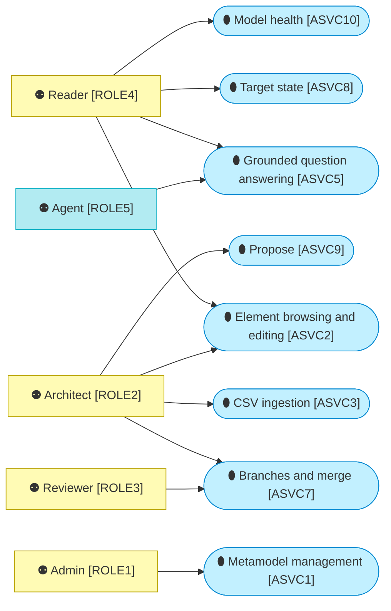
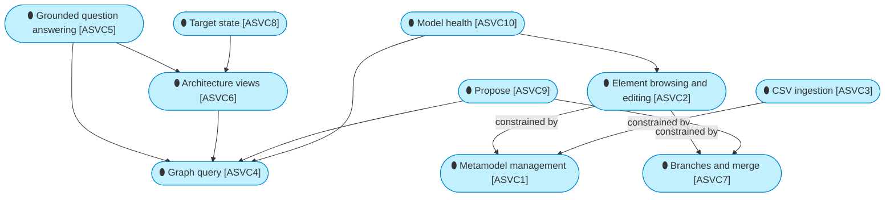
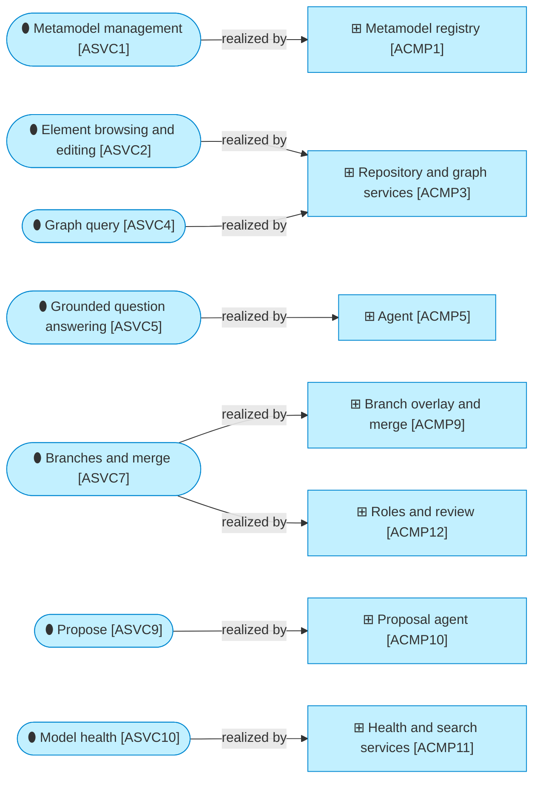

# Application services

_[← Application layer](./README.md) · [EA home](../README.md)_

**Status: `◐` draft catalogue** — the services the running code offers today,
named after the deliverables the owner asked for on 2026-09-05 and 2026-09-06
(initiatives 1 to 7). Validated at the **Understanding** gate.

## How to read this document

## Services

| ID | Service | Offered to | Where |
| -- | ------- | ---------- | ----- |
| `ASVC1` | **Metamodel management** — see the type graph, edit element types, relationship types, attributes and notation in tables, save to the store, export the result as a YAML pack, reload from file; the Notation tab edits how every domain and type is drawn, with a live preview; an Admin's service — the page hides its writes from every other role, and the command line refuses them | The framework owner, the information architect | Metamodel page; `ea init`, `ea load-pack`, `ea export-pack`, `ea summary` |
| `ASVC2` | **Element browsing and editing** — search by type, status and text over names, identifiers, descriptions and attributes (every word must match; hits in a name rank first and the matching passage is shown); open an element with its Markdown description, links, typed attributes, relationships in and out, neighbourhood graph and history; edit and save with conflict detection; add or remove relationships; create a new element; select many rows and bulk-edit their status, states, work package, lifecycle or an attribute on the current branch | Readers (reading), architects (writing) | Browse and Element pages; `ea find`, `ea get`, `ea set` |
| `ASVC3` | **CSV ingestion** — validate and load `elements.csv`, `relationships.csv` and `links.csv` against the metamodel, with an optional column mapping for a tool's export format, producing a report of errors and warnings; idempotent on source system and reference | Whoever exports from the current tool (a diagram-centric tool today) | Import page; `ea import`, `ea validate` |
| `ASVC4` | **Graph query** — neighbours to a depth, upstream and downstream traces, impact summary by type and completeness, read-only SQL over the schema | Architects, the agent | Impact page and the Graph tab; `ea neighbours`, `ea trace`, `ea impact`, `ea sql` |
| `ASVC5` | **Grounded question answering** — natural-language questions answered through tools over the model, with the tool trace shown and every identifier in the answer checked against what the tools returned; the answer is composed into a document with the elements involved, generated views and the tool trace, downloadable as Markdown. On Databricks the target is a Genie-based agent, or whichever agent framework the platform offers, that traverses the graph and answers in Markdown, with questions, answers and user feedback logged (plateau `PLAT5`) | Architects, and any user who would rather ask than browse | Ask page |
| `ASVC6` | **Architecture views** — a neighbourhood, an impact or an answer rendered as an architecture diagram in the notation of this repository's own documents (Mermaid), copied or downloaded as Markdown; the same view as a draft draw.io file with ArchiMate stencils and a link on every shape; shapes can be moved on the canvas and the draw.io export follows the arrangement, which is never saved | Architects, the agent | Element (Graph tab), Impact and Ask pages; `ea view` |
| `ASVC7` | **Branches and merge** — start a branch from `main`, work on it (edit, import, ask, propose) as if it were the model, see its change set against `main` as a merge log with conflicts; request a review, which freezes the branch and names the reviewers of every element type it touches; reviewers approve their types or send the branch back with a comment; once every touched type is approved (or by an admin at any time), merge it item by item (what is not ticked remains on the branch, a conflict takes the branch's row or `main`'s), or abandon it; the branch closes only when nothing remains | Architects, reviewers | Header branch selector and New branch modal, Branches page (merge log, review panel); `ea branch list/create/diff/review/approve/merge/abandon`, `--branch` on every command |
| `ASVC8` | **Target state** — current state against target state for every element and relationship, counted and listed per work package with a current-by-target matrix, drawn as a generated view with state markers (new dashed green, change amber, decommission red, merge violet) in Mermaid and draw.io; derived from lifecycle text on import | Architects, the organisation | Target state page, the State card and Edit fields on the Element page, the state columns on Browse; `ea target` |
| `ASVC9` | **Propose** — hand in a document (text, files, links) describing a change; a reader derives the change set, links what exists (by identifier, then by name, with near-matches flagged rather than linked), adopts what is new as proposed, pushes back with the minimum to add when the sources are insufficient; the architect reviews the result as an editable merge log with include ticks and manual rows, and applies it to a branch (a new one, or an open one); the proposal is kept with the branch | Architects | Propose page, the downloadable Proposal Template (`templates/proposal-template.md`); the stub reader parses the template's tables, the hosted reader reads free text |
| `ASVC10` | **Model health** — freshness per source system (when each last loaded, how many rows have not moved in 30, 90 and 180 days, the change activity of the last weeks) and completeness per element type (descriptions, links, relationships, required attributes, decided target states), each with the rows behind the number one click away | Readers, stewards | Health page; `ea health` |

## How the services lean on each other

## Which component realises which service

## Relationships

| From | | To | | Relationship | Note |
| ---- | - | -- | - | ------------ | ---- |
| `ASVC5` | ⚙ «Application Service» Grounded question answering | `ASVC4` | ⚙ «Application Service» Graph query | uses | the agent's tools are the query service |
| `ASVC2` | ⚙ «Application Service» Element browsing and editing | `ASVC1` | ⚙ «Application Service» Metamodel management | constrained by | allowed types, attributes and relationship pairs come from the metamodel |
| `ASVC3` | ⚙ «Application Service» CSV ingestion | `ASVC1` | ⚙ «Application Service» Metamodel management | constrained by | validation report against the pack |
| `ASVC5` | ⚙ «Application Service» Grounded question answering | `ASVC6` | ⚙ «Application Service» Architecture views | uses | every answer document carries at least one view |
| `ASVC6` | ⚙ «Application Service» Architecture views | `ASVC4` | ⚙ «Application Service» Graph query | uses | a view is a rendered query |
| `ASVC9` | ⚙ «Application Service» Propose | `ASVC7` | ⚙ «Application Service» Branches and merge | uses | a proposal always lands on a branch |
| `ASVC9` | ⚙ «Application Service» Propose | `ASVC4` | ⚙ «Application Service» Graph query | uses | the reader resolves names and identifiers against the model |
| `ASVC8` | ⚙ «Application Service» Target state | `ASVC6` | ⚙ «Application Service» Architecture views | uses | the work package view carries state markers |
| `ASVC10` | ⚙ «Application Service» Model health | `ASVC4` | ⚙ «Application Service» Graph query | uses | counts over the store |
| `ASVC10` | ⚙ «Application Service» Model health | `ASVC2` | ⚙ «Application Service» Element browsing and editing | uses | every number opens the rows behind it in Browse |
| `ASVC1` | ⚙ «Application Service» Metamodel management | `ACMP1` | ▭ «Application Component» Metamodel registry | realized by | |
| `ASVC2` | ⚙ «Application Service» Element browsing and editing | `ACMP3` | ▭ «Application Component» Repository and graph services | realized by | |
| `ASVC4` | ⚙ «Application Service» Graph query | `ACMP3` | ▭ «Application Component» Repository and graph services | realized by | |
| `ASVC5` | ⚙ «Application Service» Grounded question answering | `ACMP5` | ▭ «Application Component» Agent | realized by | |
| `ASVC7` | ⚙ «Application Service» Branches and merge | `ACMP9` | ▭ «Application Component» Branch overlay and merge | realized by | |
| `ASVC7` | ⚙ «Application Service» Branches and merge | `ACMP12` | ▭ «Application Component» Roles and review | realized by | the review and who may merge |
| `ASVC9` | ⚙ «Application Service» Propose | `ACMP10` | ▭ «Application Component» Proposal agent | realized by | |
| `ASVC10` | ⚙ «Application Service» Model health | `ACMP11` | ▭ «Application Component» Health and search services | realized by | |
| `ASVC2` | ⚙ «Application Service» Element browsing and editing | `ASVC7` | ⚙ «Application Service» Branches and merge | constrained by | edits, imports and applied proposals land on the current branch |
