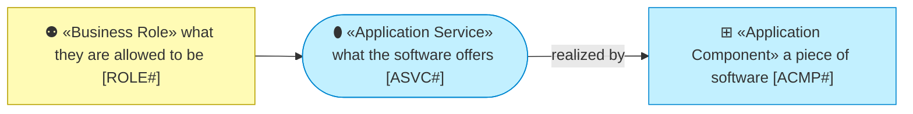
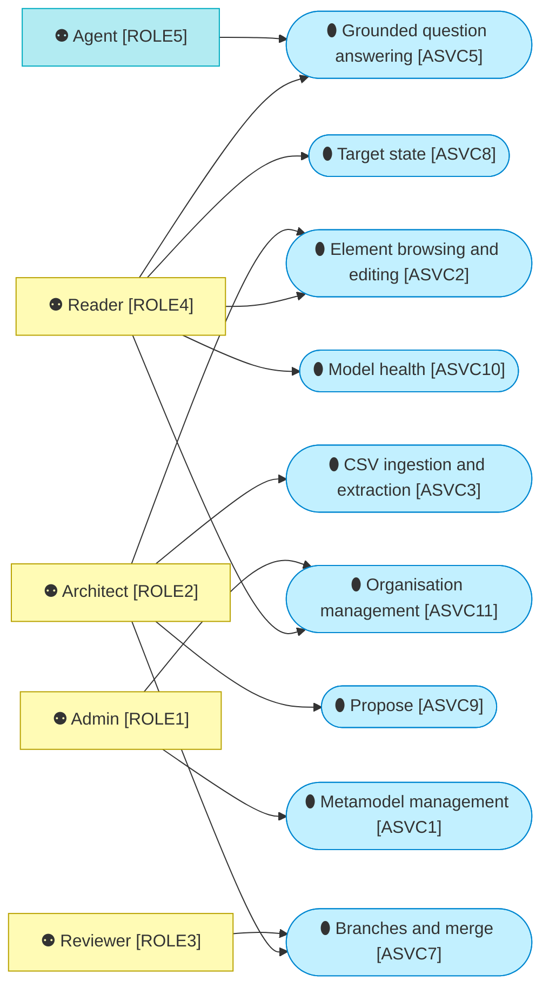
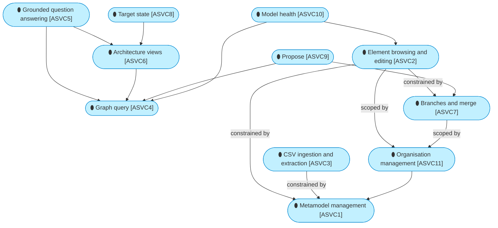
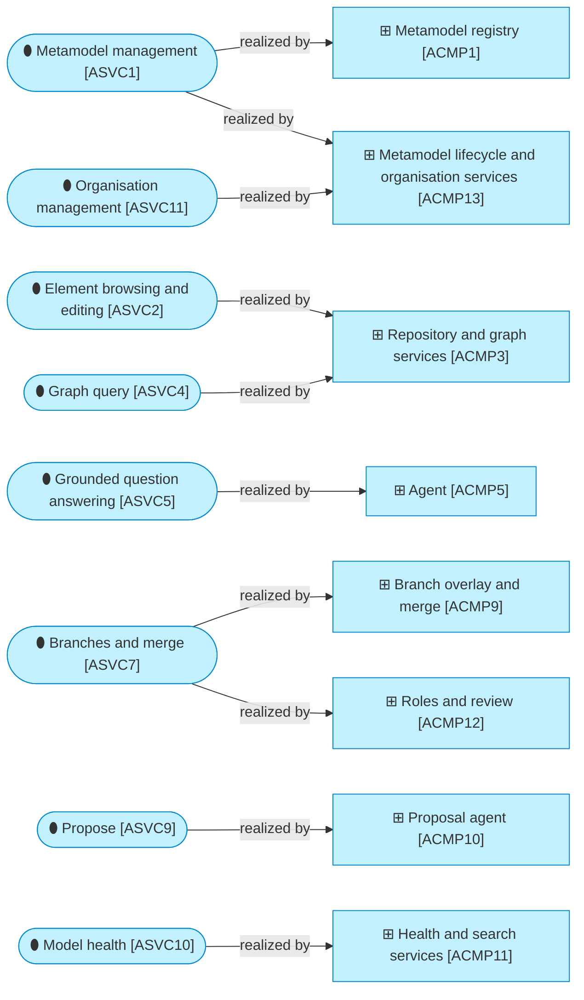

# Application services

_[← Application layer](./README.md) · [EA home](../README.md)_

**Status: `◐` draft catalogue** — the services the running code offers today,
named after the deliverables the owner asked for on 2026-09-05 and 2026-09-06
(initiatives 1 to 7). Validated at the **Understanding** gate.

## How to read this document

## Services

| ID | Service | Offered to | Where |
| -- | ------- | ---------- | ----- |
| `ASVC1` | **Metamodel management** — see the type graph, edit domains, element types, relationship types, attributes and attribute groups in grids — in that order, the order a metamodel is read — and save them as one version; declare an attribute's type, default, unit, range, pattern, help text and whether it takes many values, and the section it is read under, picked from the attribute groups the version declares rather than typed, mark an element type abstract, and give a relationship type attributes of its own; what the framework declares and the engine does not read is kept and handed back unchanged; delete a type, an attribute or a domain, and what the metamodel could not hold without it goes with it; hold several versions of a framework, each a draft edited in place or a published version that is frozen, retire one and delete a draft nobody applies; read the difference between two versions field by field; check an organisation's content against a version before it is applied; export the result as a YAML pack, reload from file; the Notation tab edits how every domain and type is drawn, with a live preview; an Admin's service — the page hides its writes from every other role, and the command line refuses them | The framework owner, the information architect | Metamodel page (Manage, Graph, Architecture view, Notation, Versions and Reviewers tabs); `ea metamodel versions/draft/publish/retire/delete/diff/check`, `ea init`, `ea load-pack`, `ea export-pack`, `ea summary` |
| `ASVC2` | **Element browsing and editing** — narrow the model by text over names, identifiers, descriptions and attributes (every word must match) and by any field an element carries: several types, several statuses, current and target state, work package, source system, lifecycle, an attribute by name and value, and an updated-since date, all narrowing together. The store ranks the whole result set before it pages, so the best match is on the first page whatever the model's size, and the count is the result set rather than the page; the criteria in force are named on the screen and carried in the address, so a search can be sent to somebody; the result set comes out as CSV. Open an element with its Markdown description, links, typed attributes in the groups the metamodel declares, relationships in and out, neighbourhood graph and history; edit and save with conflict detection; add or remove relationships, with the attributes their type declares; create a new element; select many rows and bulk-edit their status, states, work package, lifecycle or an attribute on the current branch | Readers (reading), architects (writing) | Browse and Element pages; `ea find`, `ea get`, `ea set` |
| `ASVC3` | **CSV ingestion and extraction** — validate and load `elements.csv`, `relationships.csv` and `links.csv` against the metamodel, with an optional column mapping (its files, columns, type and relationship vocabulary, encoding, field separator, the prefix that keeps one source's identifiers apart from another's, and whether the source is merged on its `id` or on the key its own system knows the row by) for a tool's export format, producing a report that counts every issue and lists the first two thousand, and says how many rows were new and how many overwrote something; idempotent on source system and reference, and a links file loaded on its own adds to what an element has rather than replacing it; a row may say it is deleted, which retires what it names and keeps its relationships and its history, reversibly; and the inverse — write the organisation and branch back out as the same three files, elements as one wide file carrying every attribute any element holds, so an export edited in a spreadsheet re-imports onto the same elements and the same edges, beside a schema file naming every column, its parent, its data type and what the applied version says it means | Whoever exports from the current tool (a diagram-centric tool today); an architect correcting many rows at once | Import page (upload, a mapping of your own, Download current content); `ea import`, `ea validate`, `ea export` |
| `ASVC4` | **Graph query** — neighbours to a depth, upstream and downstream traces, impact summary by type and completeness, read-only SQL over the schema, answering for the organisation the reader is in; a trace answers with the elements reached and one shortest path to each, not with every path between two of them (decision 0016); a neighbourhood is the same walk ignoring direction, and every answer is labelled from the store in one read per page rather than from a graph held in memory (decision 0019) | Architects, the agent | Impact page and the Graph tab; `ea neighbours`, `ea trace`, `ea impact`, `ea sql` |
| `ASVC5` | **Grounded question answering** — natural-language questions answered through tools over the model, with the tool trace shown and every identifier in the answer checked against what the tools returned; the answer is composed into a document with the elements involved, generated views and the tool trace, downloadable as Markdown. On Databricks the target is a Genie-based agent, or whichever agent framework the platform offers, that traverses the graph and answers in Markdown, with questions, answers and user feedback logged (plateau `PLAT5`) | Architects, and any user who would rather ask than browse | Ask page |
| `ASVC6` | **Architecture views** — a neighbourhood, an impact or an answer rendered as an architecture diagram in the notation of this repository's own documents (Mermaid), every shape filled by its architecture layer and a chip per layer above the diagram in that layer's colour, copied or downloaded as Markdown; the same view as a draft draw.io file with ArchiMate stencils and a link on every shape; shapes can be moved on the canvas and the draw.io export follows the arrangement, which is never saved | Architects, the agent | Element (Graph tab), Impact and Ask pages; `ea view` |
| `ASVC7` | **Branches and merge** — start a branch from `main`, work on it (edit, import, ask, propose) as if it were the model, see its change set against `main` as a merge log with conflicts; request a review, which freezes the branch and names the reviewers of every element type it touches; reviewers approve their types or send the branch back with a comment; once every touched type is approved (or by an admin at any time), merge it item by item and field by field — what is not ticked remains on the branch, and an applied row is `main`'s current row with the branch's changed fields laid over it, so a branch that moved on does not revert what `main` did to the fields it never touched. **A row is a conflict only where both sides changed the same field**, and each disputed field is settled on its own (the branch's value or `main`'s); a row nobody has decided is held back with the reason, never guessed at — or abandon the branch; it closes only when nothing remains | Architects, reviewers | Header branch selector and New branch modal, Branches page (merge log, review panel); `ea branch list/create/diff/review/approve/merge/abandon`, `--branch` on every command |
| `ASVC8` | **Target state** — current state against target state for every element and relationship, counted and listed per work package with a current-by-target matrix, drawn as a generated view with state markers (new dashed green, change amber, decommission red, merge violet) in Mermaid and draw.io; derived from lifecycle text on import | Architects, the organisation | Target state page, the State card and Edit fields on the Element page, the state columns on Browse; `ea target` |
| `ASVC9` | **Propose** — hand in a document (text, files, links) describing a change; a reader derives the change set, links what exists (by identifier, then by name, with near-matches flagged rather than linked), adopts what is new as proposed, pushes back with the minimum to add when the sources are insufficient; the architect reviews the result as an editable merge log with include ticks and manual rows, and applies it to a branch (a new one, or an open one); the proposal is kept with the branch | Architects | Propose page, the downloadable Proposal Template (`templates/proposal-template.md`); the stub reader parses the template's tables, the hosted reader reads free text |
| `ASVC10` | **Model health** — how large the model is against the capacity the application is assessed for (decision 0019); freshness per source system (when each last loaded, how many rows have not moved in 30, 90 and 180 days, the change activity of the last weeks) and completeness per element type (descriptions, links, relationships, required attributes, decided target states), each with the rows behind the number one click away | Readers, stewards | Health page; `ea health` |
| `ASVC11` | **Organisation management** — every element, relationship, link, branch and review belongs to one organisation, and every read and write honours the one the user is in; create an organisation, copy another's content into it, switch to it from the header, rename it, name one the default, and delete one with everything it holds; apply a metamodel version to an organisation, which first validates all of its content against that version and refuses on errors unless it is forced; the default organisation is what the application opens, and a copy of it is where a version is tried before the default applies it | Admins (every change); every user (the organisation they are in) | Organisations page and the organisation selector in the header; `ea org list/create/rename/default/apply/delete`, `--org` on every command |
| `ASVC12` | **Source feeds** — a source leaves rows in the staging schema of the store's own database and the application loads them through the same validation, report, identity rules and branch targeting a file gets; a feed says which staging table holds its elements, its relationships and its links, and carries the same mapping a file import would use; what was loaded is emptied after the load, so a run that stops repeats itself rather than losing rows, and a feed reading a table something else maintains leaves it alone. The application never reaches into the catalogue (decision 0020) | A platform job, or whatever replicates a catalogue table into the store | Feeds page (configure, run one now, what each reads and where it writes) and `ea feed list/save/run/delete`; a feed's schedule is kept and shown in the zone it was written in, and the application shows it rather than firing it. Configuring a feed is an admin's decision, running one that is configured is an import. **Every import is kept as a run** (`DOBJ3.7`) — a feed's, a file uploaded on the Import page, or one from the command line — with what it read, where it wrote, what it changed, a bounded sample of its issues beside the complete count of them, and the reason when it stopped — including a load that stopped half way, which is recorded with what it had already written rather than with zeros, since the three writes of an import share no transaction. A run is recorded only for a caller who may import: a refusal of state is a run, a refusal at the door is not. Read newest first, a page at a time, on the Feeds page and through `ea runs list/show`. A run is an account and not an undo: **reversing one is not built** (`GAP19`) |

## How the services lean on each other

## Which component realises which service

## Relationships

| From | | To | | Relationship | Note |
| ---- | - | -- | - | ------------ | ---- |
| `ASVC5` | ⚙ «Application Service» Grounded question answering | `ASVC4` | ⚙ «Application Service» Graph query | uses | the agent's tools are the query service |
| `ASVC2` | ⚙ «Application Service» Element browsing and editing | `ASVC1` | ⚙ «Application Service» Metamodel management | constrained by | allowed types, attributes and relationship pairs come from the metamodel |
| `ASVC3` | ⚙ «Application Service» CSV ingestion and extraction | `ASVC1` | ⚙ «Application Service» Metamodel management | constrained by | validation report against the pack |
| `ASVC5` | ⚙ «Application Service» Grounded question answering | `ASVC6` | ⚙ «Application Service» Architecture views | uses | every answer document carries at least one view |
| `ASVC6` | ⚙ «Application Service» Architecture views | `ASVC4` | ⚙ «Application Service» Graph query | uses | a view is a rendered query |
| `ASVC9` | ⚙ «Application Service» Propose | `ASVC7` | ⚙ «Application Service» Branches and merge | uses | a proposal always lands on a branch |
| `ASVC9` | ⚙ «Application Service» Propose | `ASVC4` | ⚙ «Application Service» Graph query | uses | the reader resolves names and identifiers against the model |
| `ASVC8` | ⚙ «Application Service» Target state | `ASVC6` | ⚙ «Application Service» Architecture views | uses | the work package view carries state markers |
| `ASVC10` | ⚙ «Application Service» Model health | `ASVC4` | ⚙ «Application Service» Graph query | uses | counts over the store |
| `ASVC10` | ⚙ «Application Service» Model health | `ASVC2` | ⚙ «Application Service» Element browsing and editing | uses | every number opens the rows behind it in Browse |
| `ASVC11` | ⚙ «Application Service» Organisation management | `ASVC1` | ⚙ «Application Service» Metamodel management | uses | applying a version asks the metamodel for the compatibility check |
| `ASVC2` | ⚙ «Application Service» Element browsing and editing | `ASVC11` | ⚙ «Application Service» Organisation management | scoped by | every element, relationship and link belongs to one organisation |
| `ASVC7` | ⚙ «Application Service» Branches and merge | `ASVC11` | ⚙ «Application Service» Organisation management | scoped by | a branch belongs to the organisation it was opened in |
| `ASVC1` | ⚙ «Application Service» Metamodel management | `ACMP1` | ▭ «Application Component» Metamodel registry | realized by | |
| `ASVC1` | ⚙ «Application Service» Metamodel management | `ACMP13` | ▭ «Application Component» Metamodel lifecycle and organisation services | realized by | the versions, their lifecycle and the compatibility check |
| `ASVC11` | ⚙ «Application Service» Organisation management | `ACMP13` | ▭ «Application Component» Metamodel lifecycle and organisation services | realized by | |
| `ASVC12` | ⚙ «Application Service» Source feeds | `ASVC3` | ⚙ «Application Service» CSV ingestion and extraction | uses | a feed is the same load, from a table rather than a file |
| `ASVC12` | ⚙ «Application Service» Source feeds | `ACMP14` | ▭ «Application Component» Feed runner | realized by | |
| `ASVC2` | ⚙ «Application Service» Element browsing and editing | `ACMP3` | ▭ «Application Component» Repository and graph services | realized by | |
| `ASVC4` | ⚙ «Application Service» Graph query | `ACMP3` | ▭ «Application Component» Repository and graph services | realized by | |
| `ASVC5` | ⚙ «Application Service» Grounded question answering | `ACMP5` | ▭ «Application Component» Agent | realized by | |
| `ASVC7` | ⚙ «Application Service» Branches and merge | `ACMP9` | ▭ «Application Component» Branch overlay and merge | realized by | |
| `ASVC7` | ⚙ «Application Service» Branches and merge | `ACMP12` | ▭ «Application Component» Roles and review | realized by | the review and who may merge |
| `ASVC9` | ⚙ «Application Service» Propose | `ACMP10` | ▭ «Application Component» Proposal agent | realized by | |
| `ASVC10` | ⚙ «Application Service» Model health | `ACMP11` | ▭ «Application Component» Health and search services | realized by | |
| `ASVC2` | ⚙ «Application Service» Element browsing and editing | `ASVC7` | ⚙ «Application Service» Branches and merge | constrained by | edits, imports and applied proposals land on the current branch |
