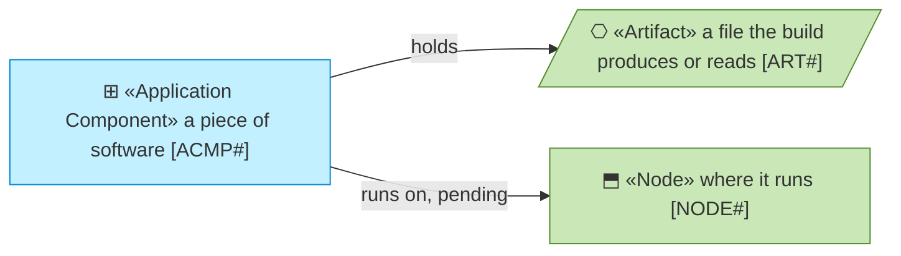
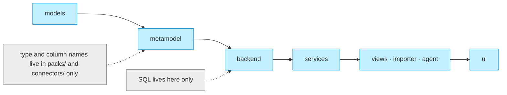
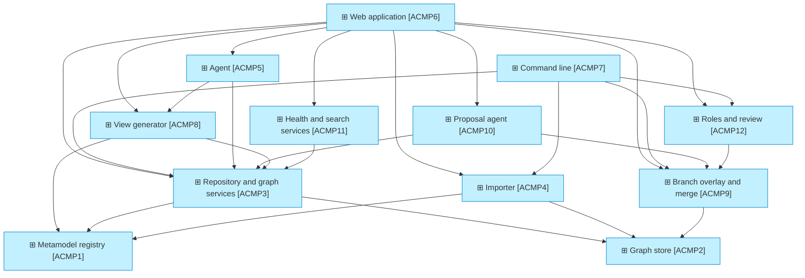
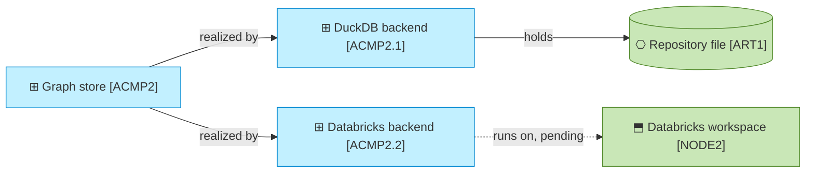

# Application components

_[← Application layer](./README.md) · [EA home](../README.md)_

**Status: `◐` draft catalogue** — the components as they exist in the code on
2026-09-09. A row marked **Pending** names the initiative that will build it.
Validated at the **Understanding** gate.

## How to read this document

## Layering rule

`models → metamodel → backend → services → views / importer / agent → ui`. A module
imports only from layers to its left. SQL lives in `backend/` only
(principle `P4`); framework and institution names live in `packs/` and
`connectors/` only (principle `P5`).

## Components

| ID | Component | Code | Realizes | State |
| -- | --------- | ---- | -------- | ----- |
| `ACMP1` | **Metamodel registry** — loads a pack, validates references and supertype cycles, resolves type and relationship names, computes inherited attributes and allowed pairs, validates elements and relationships, summarises the metamodel for the agent | `src/ea/metamodel/loader.py`, `src/ea/metamodel/registry.py`, `src/ea/models.py` | `ASVC1` | Running |
| `ACMP2` | **Graph store** — the storage interface and its one implementation on SQL: schema, packs, elements, links, relationships, traces, history, read-only SQL; optimistic concurrency on `_version`, a change log on every write (with the branch), upserts that skip rows that change nothing, the branch overlay as `UNION` views over `main` minus the overridden rows (`src/ea/backend/branching.py` names the branch), the diff, the merge and the proposals; an engine adds only how it connects, runs a statement, lands rows and spells a type (decision 0011) | `src/ea/backend/base.py`, `src/ea/backend/sql_backend.py`, `src/ea/backend/sql.py` (portable DDL and recursive trace queries), `src/ea/backend/factory.py` | `ASVC2`, `ASVC4` | Running |
| `ACMP2.1` | **DuckDB backend** — the engine on one DuckDB file: one connection under a lock (the file is single-writer), frames registered as tables for the bulk loads, `ADD COLUMN IF NOT EXISTS` for a file created by an earlier version | `src/ea/backend/duckdb_backend.py` | `ASVC2`, `ASVC4` | Running |
| `ACMP2.2` | **Databricks backend** — the engine on Delta tables in a Unity Catalog schema through a SQL warehouse: the DDL spelt in Delta's types, bulk loads as `MERGE` batches written as literals (the connector allows 255 parameter markers a statement), columns added after `DESCRIBE`, credentials from the environment as every SDK client finds them, a session reopened once, the trace done in process where the warehouse has no recursive queries | `src/ea/backend/databricks_backend.py`; the dialect proved on a warehouse played by DuckDB (`tests/fake_warehouse.py`) in every test run, and on a warehouse by `make test-live` | `ASVC2`, `ASVC4` | Built — initiative 13; not yet run on a workspace (plateau `PLAT2`) |
| `ACMP3` | **Repository and graph services** — element and relationship operations with validation (states and work package included) and identifier minting; a cached in-process graph per branch for neighbours, traces, impact and completeness; Cytoscape-ready subgraphs; the target-state service (work packages from the pack's notation, counts, matrix, view scope) | `src/ea/services/repository.py`, `src/ea/services/graph.py`, `src/ea/services/target.py` | `ASVC2`, `ASVC4`, `ASVC8` | Running |
| `ACMP4` | **Importer** — reads a directory of CSV files through a mapping, builds elements, relationships and links, validates against the registry, reports, loads idempotently into the current branch; derives the current state from the source's lifecycle text (mapping table, then keywords) | `src/ea/importer/csv_import.py`, `src/ea/importer/mapping.py`, `connectors/tool-export/mapping.yaml` | `ASVC3` | Running |
| `ACMP5` | **Agent** — a tool-calling loop with a provider interface: a hosted-model provider when a key is present, a stub provider that runs the tools without a model otherwise; grounding check of every identifier in the answer | `src/ea/agent/agent.py`, `src/ea/agent/tools.py` | `ASVC5` | Running (stub locally; the hosted provider needs a key, see the scope document) |
| `ACMP6` | **Web application** — Dash pages Home, Browse, Element, Metamodel, Impact, Target state, Branches, Health, Import, Ask, Propose on a Mantine shell with the branch selector and, locally, the debug persona switcher in the header (both live in the session),  with AG Grid tables and Cytoscape graphs and Mermaid views rendered in the browser from a bundled library; mock persona locally, the forwarded identity on Databricks Apps with its groups read from the workspace; one graph panel (`src/ea/ui/graph.py`) with grouping, compound-aware layouts and pack-driven colours; the Notation tab; the drag-and-arrange script for generated views (`assets/ea-views.js`) | `src/ea/ui/` (`app.py`, `layout.py`, `context.py`, `components.py`, `pages/`), `app.py`, `assets/`; deployed by `databricks.yml` | `ASVC1`–`ASVC5` | Running |
| `ACMP7` | **Command line** — `ea` with init, load-pack, export-pack, import, validate, stats, find, get, set, neighbours, trace, impact, view, target, health, sql, summary, and `branch list/create/diff/review/approve/merge/abandon`; `--branch` (or `EA_BRANCH`) and `--as` (or `EA_ROLE`) on every command | `src/ea/cli.py` | `ASVC1`–`ASVC4`, `ASVC7`, `ASVC8` | Running |
| `ACMP8` | **View generator** — builds a view (focus, elements, relationships, states) from a query or a set of identifiers and renders it: Mermaid in the archreator notation from the pack's `notation`, draw.io with ArchiMate stencils and the element identifier on every shape, at grid positions or at the positions the browser reports; with state markers when asked (`marked`) | `src/ea/views/model.py`, `src/ea/views/mermaid.py`, `src/ea/views/drawio.py`; the answer composer `src/ea/agent/document.py` | `ASVC6`, `ASVC5` | Running |
| `ACMP9` | **Branch overlay and merge** — the request-scoped current branch (a context variable set from the session or `--branch`), the overlay reads and writes of the store, the diff with base versions and conflicts, the merge item by item with a resolution per conflict, abandon; the merge-log rows the Branches page shows | `src/ea/backend/branching.py`, the overlay in `src/ea/backend/sql_backend.py`, `src/ea/services/branches.py` | `ASVC7` | Running |
| `ACMP10` | **Proposal agent** — reads sources (pasted text, Markdown, text and CSV files, fetched links), resolves elements by identifier and by name and relationships against the metamodel, computes the pushback, applies the reviewed change set to a branch and keeps the proposal; a stub provider parses the Proposal Template's tables, a hosted provider reads free text with the read tools and submits a structured result through a `submit_proposal` tool | `src/ea/agent/proposal.py`, `templates/proposal-template.md` | `ASVC9` | Running (stub locally; the hosted provider needs a key) |
| `ACMP11` | **Health and search services** — the search that reads names, identifiers, descriptions and attributes word by word and ranks the hits; bulk edits of many elements in one audited pass; the freshness and completeness figures the Health page shows, each with the identifiers behind it | `src/ea/services/search.py`, `src/ea/services/health.py`; `bulk_update()` in `src/ea/services/repository.py` | `ASVC2`, `ASVC10` | Running |
| `ACMP12` | **Roles and review** — the role of the signed-in user (from workspace groups through the role configuration, or the debug persona locally), the workspace groups of the forwarded user read once and kept for a few minutes (with the user's own token when the app is granted one, otherwise as the app's service principal; decision 0012), the permission checks every write goes through, and the review of a branch: request, approve per element type, send back, the reviewer assignments per type | `src/ea/services/roles.py`, `src/ea/services/identity.py`, `src/ea/services/reviews.py`; the personas and `user_from_headers()` in `src/ea/ui/context.py` | `ASVC7`, every writing service | Running |

## The store and its engines

## Relationships

| From | | To | | Relationship | Note |
| ---- | - | -- | - | ------------ | ---- |
| `ACMP6` | ▭ «Application Component» Web application | `ACMP3` | ▭ «Application Component» Repository and graph services | uses | every page goes through the services, never the store |
| `ACMP6` | ▭ «Application Component» Web application | `ACMP4` | ▭ «Application Component» Importer | uses | Import page |
| `ACMP6` | ▭ «Application Component» Web application | `ACMP5` | ▭ «Application Component» Agent | uses | Ask page |
| `ACMP7` | ▭ «Application Component» Command line | `ACMP3` | ▭ «Application Component» Repository and graph services | uses | |
| `ACMP7` | ▭ «Application Component» Command line | `ACMP4` | ▭ «Application Component» Importer | uses | |
| `ACMP5` | ▭ «Application Component» Agent | `ACMP3` | ▭ «Application Component» Repository and graph services | uses | tools are thin wrappers over the services and the read-only SQL of the store |
| `ACMP3` | ▭ «Application Component» Repository and graph services | `ACMP1` | ▭ «Application Component» Metamodel registry | uses | validation and identifier prefixes |
| `ACMP4` | ▭ «Application Component» Importer | `ACMP1` | ▭ «Application Component» Metamodel registry | uses | validation report |
| `ACMP3` | ▭ «Application Component» Repository and graph services | `ACMP2` | ▭ «Application Component» Graph store | uses | through the interface only |
| `ACMP2` | ▭ «Application Component» Graph store | `ACMP2.1` | ▭ «Application Component» DuckDB backend | realized by | |
| `ACMP2` | ▭ «Application Component» Graph store | `ACMP2.2` | ▭ «Application Component» Databricks backend | realized by | built by initiative 13 |
| `ACMP6` | ▭ «Application Component» Web application | `ACMP8` | ▭ «Application Component» View generator | uses | Mermaid rendered in the browser from a bundled library |
| `ACMP5` | ▭ «Application Component» Agent | `ACMP8` | ▭ «Application Component» View generator | uses | the answer document embeds views; `propose_view` tool |
| `ACMP8` | ▭ «Application Component» View generator | `ACMP3` | ▭ «Application Component» Repository and graph services | uses | neighbourhood, impact, edges among a set |
| `ACMP8` | ▭ «Application Component» View generator | `ACMP1` | ▭ «Application Component» Metamodel registry | uses | notation per type |
| `ACMP9` | ▭ «Application Component» Branch overlay and merge | `ACMP2` | ▭ «Application Component» Graph store | uses | the overlay tables and the merge are store operations |
| `ACMP6` | ▭ «Application Component» Web application | `ACMP9` | ▭ «Application Component» Branch overlay and merge | uses | branch selector, Branches page |
| `ACMP10` | ▭ «Application Component» Proposal agent | `ACMP3` | ▭ «Application Component» Repository and graph services | uses | name matching, validation, the writes |
| `ACMP10` | ▭ «Application Component» Proposal agent | `ACMP9` | ▭ «Application Component» Branch overlay and merge | uses | writes to a branch |
| `ACMP6` | ▭ «Application Component» Web application | `ACMP10` | ▭ «Application Component» Proposal agent | uses | Propose page |
| `ACMP6` | ▭ «Application Component» Web application | `ACMP11` | ▭ «Application Component» Health and search services | uses | Browse search, bulk edit, Health page |
| `ACMP6` | ▭ «Application Component» Web application | `ACMP12` | ▭ «Application Component» Roles and review | uses | every control the role may not use is hidden or disabled, and every callback checks again |
| `ACMP7` | ▭ «Application Component» Command line | `ACMP12` | ▭ «Application Component» Roles and review | uses | `--as` names the role a command runs as |
| `ACMP11` | ▭ «Application Component» Health and search services | `ACMP3` | ▭ «Application Component» Repository and graph services | uses | |
| `ACMP12` | ▭ «Application Component» Roles and review | `ACMP9` | ▭ «Application Component» Branch overlay and merge | uses | a review decides a branch; the merge asks the review |
| `ACMP2.1` | ▭ «Application Component» DuckDB backend | `ART1` | ▤ «Artifact» Repository file | holds | |
| `ACMP2.2` | ▭ «Application Component» Databricks backend | `NODE2` | ⬒ «Node» Databricks workspace | runs on | **Pending — plateau `PLAT2`** |

## How to add

- **A new element or relationship type**: edit the pack (in the Metamodel page
  or the YAML) and save; no code changes (principle `P1`).
- **A new export format**: add a mapping under `connectors/<tool>/mapping.yaml`;
  the importer needs no change unless the format is not tabular.
- **A new storage engine**: subclass `SqlBackend` in `src/ea/backend/` with
  the engine's hooks (`_execute`, `_fetch_all`, `_fetch_df`, `_insert_rows`,
  `_replace_rows`, `_add_missing_columns`, `close`, and `_create_table` or
  `_bind` where the dialect differs) and register it in `factory.py`; the DDL
  in `sql.py` is the contract, and the unit suite runs on the engine through
  the `backend` fixture in `tests/conftest.py`.
- **A new agent provider**: implement the provider protocol in
  `src/ea/agent/agent.py`; the tools stay the same.
- **A new diagram format**: add a renderer over `View` in `src/ea/views/`;
  the view model and the notation in the pack stay the same.
