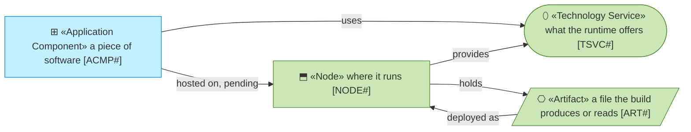
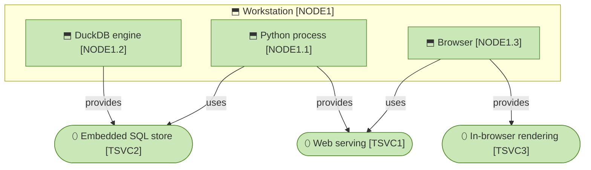
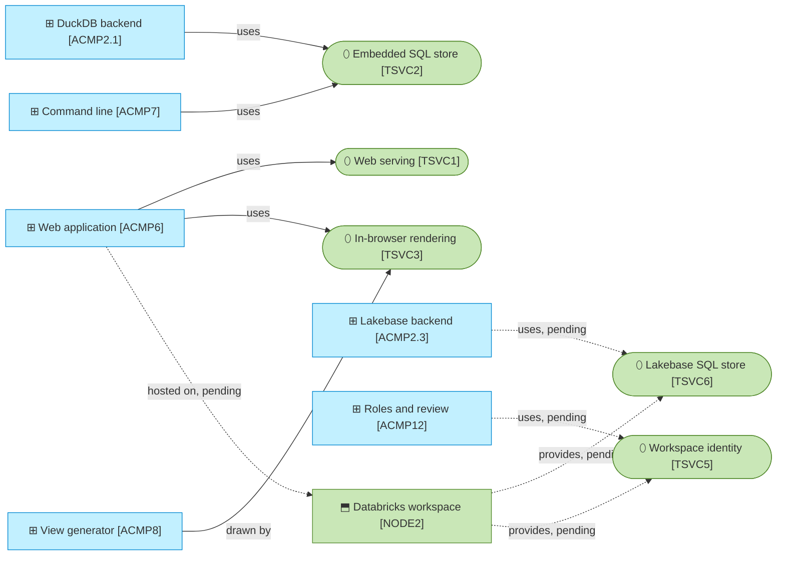
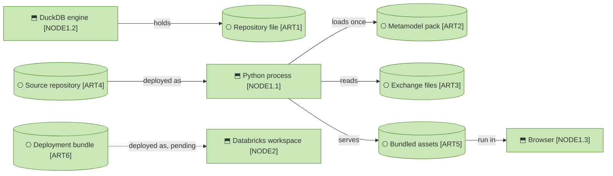

# Runtime

_[← Technology layer](./README.md) · [EA home](../README.md)_

**Status: `◐` draft catalogue** — the runtime as it exists today: a local
process over a DuckDB file, and the Databricks workspace whose store engine and
deployment bundle exist in the code. Validated at the **Understanding** gate.
The Databricks rows are **Pending** (plateau `PLAT2`) until a workspace runs
them, and drawn dashed.

## How to read this document

## Nodes and system software

| ID | Node | Runs | State |
| -- | ---- | ---- | ----- |
| `NODE1` | **Workstation** — the developer's or architect's machine where the PoC runs (`make run`) | Everything below | Running |
| `NODE1.1` | **Python process** — one Python 3.11 process: Flask and Dash serve the pages and callbacks; gunicorn (one worker, four threads) in production mode, the Dash development server locally; the same process hosts the agent and the importer | `app.py`, `src/ea/` | Running |
| `NODE1.2` | **DuckDB engine** — the embedded analytical engine, in-process, one writer per file; recursive queries for the traversals | `src/ea/backend/duckdb_backend.py` | Running |
| `NODE1.3` | **Browser** — where the pages render, the diagrams are drawn and the graph panel is laid out; nothing is fetched from the internet at run time (icons, Mermaid and Cytoscape are bundled) | `assets/` | Running |
| `NODE2` | **Databricks workspace** — Databricks Apps hosting the same process, a Lakebase database instance holding the store, the signed-in user forwarded as headers and their groups read from the workspace's directory | `databricks.yml` deploys it; `src/ea/backend/lakebase_backend.py` is the store on it | **Pending — plateau `PLAT2`**: built by initiatives 13 and 14, Running once a workspace runs it (`make test-live`, `make deploy`) |

## Technology services

| ID | Service | Provided by | Used by | State |
| -- | ------- | ----------- | ------- | ----- |
| `TSVC1` | **Web serving** — HTTP on `0.0.0.0` and the port the platform names (`DATABRICKS_APP_PORT`, `PORT`, or 8050); a signed session cookie carries the reader's branch and, locally, the debug persona | `NODE1.1` | `ACMP6` | Running |
| `TSVC2` | **Embedded SQL store** — SQL over a single file with the portable DDL of `src/ea/backend/sql.py`; the same DDL runs on Lakebase through `TSVC6` | `NODE1.2` | `ACMP2.1`, `ACMP7` | Running |
| `TSVC3` | **In-browser rendering** — Mermaid renders the generated views, Cytoscape lays out the graph panel, AG Grid draws the tables; the arrange-and-export script runs here | `NODE1.3` | `ACMP6`, `ACMP8` | Running |
| `TSVC5` | **Workspace identity** — the signed-in user's e-mail, username and, with the `iam.current-user:read` scope, an access token forwarded on every request; the user's groups read from the workspace's directory with that token, or as the app's service principal | `NODE2` | `ACMP12`, `ACMP6` | **Pending — plateau `PLAT2`**: the lookup exists, the workspace has not run it |
| `TSVC6` | **Lakebase SQL store** — SQL over one schema of a Lakebase database, the platform's Postgres, reached over the Postgres protocol with TLS; the portable DDL read as written, a statement bound with as many values as it needs, a bulk load held in one transaction; the app's service principal signs in with an OAuth token the SDK generates for the instance, good for an hour, under the Postgres role its database resource gives it (connect to the database, create in it) | `NODE2` | `ACMP2.3` | **Pending — plateau `PLAT2`**: the engine exists, an instance has not run it |

## Artifacts

| ID | Artifact | Path | Notes |
| -- | -------- | ---- | ----- |
| `ART1` | **Repository file** — the DuckDB database holding the metamodel tables, the content tables, the branch overlays, the proposals and the change log | `data/ea.duckdb` (`EA_DB_PATH`) | Not committed; rebuilt by `make seed` |
| `ART2` | **Metamodel pack** — the framework as YAML, loaded into the store on `ea init` and on reload | `packs/higher_education/metamodel.yaml` | Committed; the store holds the copy the app uses |
| `ART3` | **Exchange files** — the CSV files of the contract and a source's mapping | `data/sample/`, `connectors/` | The sample is committed; institutional exports are not |
| `ART4` | **Source repository** — the code, the packs, the connectors and this model, in git | the repository root | Apache-2.0; public |
| `ART5` | **Bundled assets** — the Mermaid renderer, the icon set, the styles and the view-arranging script the browser runs | `assets/` | Attributed in `NOTICE` |
| `ART6` | **Deployment bundle** — the Databricks Asset Bundle that creates the Lakebase database instance and the app with the database resource it connects through and the app's configuration; the resource grants the app's service principal what the store needs, so nothing follows the deploy but the start | `databricks.yml` | Committed; `make deploy`, `make deploy-run` |

## Relationships

| From | | To | | Relationship | Note |
| ---- | - | -- | - | ------------ | ---- |
| `NODE1` | ⬒ «Node» Workstation | `NODE1.1` | ⬡ «System Software» Python process | hosts | |
| `NODE1` | ⬒ «Node» Workstation | `NODE1.2` | ⬡ «System Software» DuckDB engine | hosts | in-process |
| `NODE1` | ⬒ «Node» Workstation | `NODE1.3` | ⬡ «System Software» Browser | hosts | |
| `NODE1.1` | ⬡ «System Software» Python process | `TSVC1` | ⚙ «Technology Service» Web serving | provides | |
| `NODE1.2` | ⬡ «System Software» DuckDB engine | `TSVC2` | ⚙ «Technology Service» Embedded SQL store | provides | |
| `NODE1.3` | ⬡ «System Software» Browser | `TSVC3` | ⚙ «Technology Service» In-browser rendering | provides | |
| `NODE1.1` | ⬡ «System Software» Python process | `TSVC2` | ⚙ «Technology Service» Embedded SQL store | uses | |
| `NODE1.2` | ⬡ «System Software» DuckDB engine | `ART1` | ▤ «Artifact» Repository file | holds | one writer per file |
| `NODE1.1` | ⬡ «System Software» Python process | `ART2` | ▤ «Artifact» Metamodel pack | reads | on `ea init` and reload |
| `NODE1.1` | ⬡ «System Software» Python process | `ART3` | ▤ «Artifact» Exchange files | reads | on import |
| `ART4` | ▤ «Artifact» Source repository | `NODE1.1` | ⬡ «System Software» Python process | deployed as | `uv sync`, `app.py` |
| `NODE1.1` | ⬡ «System Software» Python process | `ART5` | ▤ «Artifact» Bundled assets | serves | |
| `ART5` | ▤ «Artifact» Bundled assets | `NODE1.3` | ⬡ «System Software» Browser | runs in | |
| `ACMP6` | ▭ «Application Component» Web application | `TSVC1` | ⚙ «Technology Service» Web serving | uses | |
| `ACMP6` | ▭ «Application Component» Web application | `TSVC3` | ⚙ «Technology Service» In-browser rendering | uses | |
| `ACMP8` | ▭ «Application Component» View generator | `TSVC3` | ⚙ «Technology Service» In-browser rendering | uses | Mermaid draws what the generator writes |
| `ACMP2.1` | ▭ «Application Component» DuckDB backend | `TSVC2` | ⚙ «Technology Service» Embedded SQL store | uses | |
| `ACMP7` | ▭ «Application Component» Command line | `TSVC2` | ⚙ «Technology Service» Embedded SQL store | uses | the same file, one writer at a time |
| `ACMP6` | ▭ «Application Component» Web application | `NODE2` | ⬒ «Node» Databricks workspace | hosted on | **Pending — plateau `PLAT2`** |
| `NODE2` | ⬒ «Node» Databricks workspace | `TSVC6` | ⚙ «Technology Service» Lakebase SQL store | provides | **Pending — plateau `PLAT2`** |
| `NODE2` | ⬒ «Node» Databricks workspace | `TSVC5` | ⚙ «Technology Service» Workspace identity | provides | **Pending — plateau `PLAT2`** |
| `ACMP2.3` | ▭ «Application Component» Lakebase backend | `TSVC6` | ⚙ «Technology Service» Lakebase SQL store | uses | **Pending — plateau `PLAT2`**: the engine exists |
| `ACMP12` | ▭ «Application Component» Roles and review | `TSVC5` | ⚙ «Technology Service» Workspace identity | uses | **Pending — plateau `PLAT2`**: the lookup exists |
| `ACMP6` | ▭ «Application Component» Web application | `TSVC5` | ⚙ «Technology Service» Workspace identity | uses | **Pending — plateau `PLAT2`**: the forwarded headers |
| `ART6` | ▤ «Artifact» Deployment bundle | `NODE2` | ⬒ «Node» Databricks workspace | deployed as | **Pending — plateau `PLAT2`**: `make deploy` |

## Retired

Elements that were live and no longer are. Their IDs stay retired; nothing
reuses them.

| ID | Element | Retired in | Why |
| -- | ------- | ---------- | --- |
| `TSVC4` | Warehouse SQL store | [14_store-on-lakebase.md](../scope/14_store-on-lakebase.md) | SQL over Delta tables through a SQL warehouse, replaced by `TSVC6` when the store on the platform became Lakebase (decision 0013) |
