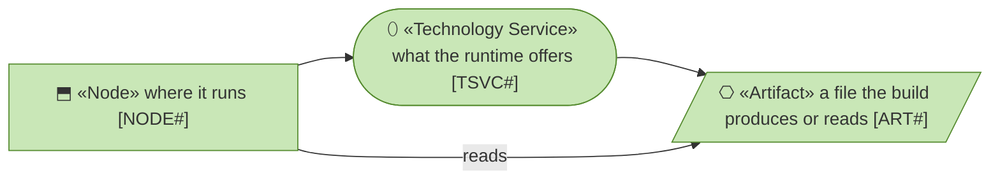
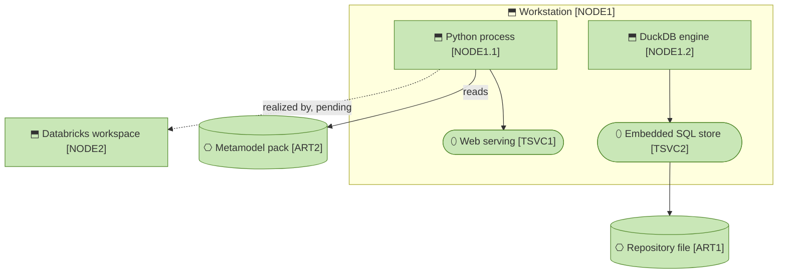

# Technology Layer

_[← EA home](../README.md)_

What runs the application today: one Python process over one DuckDB file on
a workstation, and the artifacts around it. The Databricks runtime the roadmap
targets is drawn dashed where it touches this layer and described as a plateau
in [6_transition/](../6_transition/README.md); it becomes rows here once it
runs.

## How to read this document

## Analysis order

| #   | Document | Elements | Question it answers |
| --- | -------- | -------- | ------------------- |
| 1   | [1_runtime.md](./1_runtime.md) | Nodes, Technology Services, Artifacts | On what does the software run, which services does the runtime offer it, and which files matter? |

## Layer view

