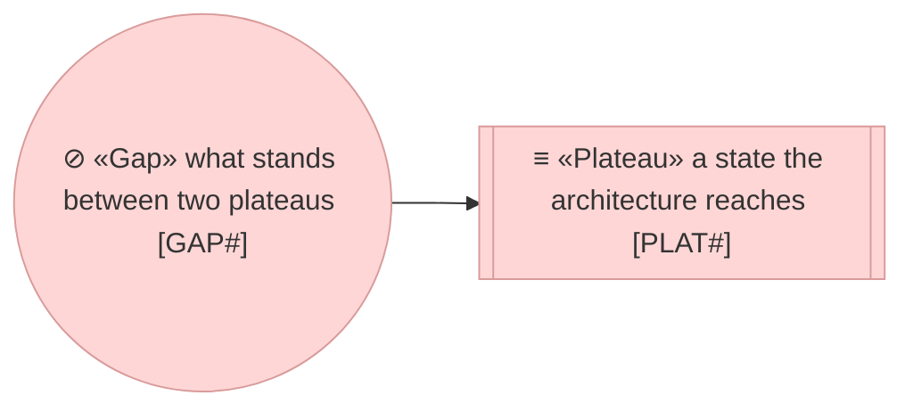
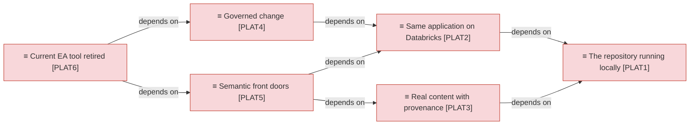
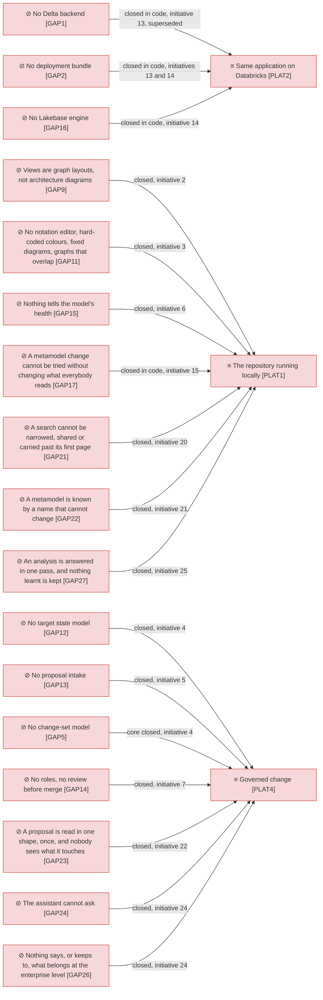

# Target state

_[← Roadmap](./README.md) · [EA home](../README.md)_

**Status: `◐` draft catalogue** — the plateaus and gaps as the owner set them
on 2026-09-05 after the business-case review. Approved at the **Direction**
gate (recorded in [initiative 1](../scope/1_curriculum-poc.md)); `PLAT1` and
`PLAT5` restated and `GAP20` opened by
[initiative 19](../scope/19_the-product-not-the-phase.md), which returns those
two rows to **Direction**; `GAP21` opened and closed by
[initiative 20](../scope/20_browse-filters-and-branch-safety.md); `GAP22`
opened and closed by
[initiative 21](../scope/21_metamodel-identity-renaming-and-starters.md); `GAP23`
opened and closed by [initiative 22](../scope/22_proposal-templates-revisions-and-impact.md); `GAP24`
and `GAP26` opened and closed by [initiative 24](../scope/24_proposals-refined-in-conversation.md), and
`GAP25` opened by it and closed with `PLAT2`'s run on a workspace; `GAP27` and `GAP28` opened by
[initiative 25](../scope/25_deep-dives-settled-in-conversation.md), which closed the first; `GAP7` and
`GAP28` restated and `GAP29` opened by
[initiative 26](../scope/26_drawings-returned-and-the-model-connected.md), pending its
**Understanding**. The gaps beyond `PLAT1` are intent, not work.

## How to read this document

## Plateaus

| ID | Plateau | Status | What is true when it is reached |
| -- | ------- | ------ | ------------------------------- |
| `PLAT1` | **The repository running locally** — the four deliverables (metamodel manager, element browse and edit, CSV ingestion, grounded agent) run on a DuckDB file on one machine, on a pack and on an enterprise's own content; extended by initiative 2 with generated architecture views and answer documents | In flight — initiatives 1 and 2, and initiative 15 (built 2026-09-19: organisations and metamodel versions, on DuckDB) | The model is browsed, edited and asked about on one machine, with no platform underneath it; the information architect has seen it |
| `PLAT2` | **Same application on Databricks** — the app runs on Databricks Apps, the store is a schema in a Lakebase database the bundle creates, identity comes from the workspace, and the assistant's model is one the workspace serves (`GAP25`, initiative 24) | In flight — initiative 13 (built 2026-09-09: the bundle, the workspace identity, an engine on a SQL warehouse) and initiative 14 (built 2026-09-11: the plateau restated on Lakebase, the engine and the bundle rebuilt on it; the run on a workspace pending) | Same tests pass against a Lakebase instance; one deployment bundle |
| `PLAT3` | **Real content with provenance** — every type of the enterprise's metamodel is loaded, every type declares mirrored, authored or enriched semantics, and the mirrored ones are fed from their sources (the CMDB, the HR system, the project portfolio tool, the information asset register, the data platform's metadata catalogue) — by a scheduled job where a source leaves a file or a table, and over a protocol where the platform can reach the source directly (`GAP20`) | Planned | A fact from the CMDB is never edited by hand in the repository; freshness is visible per source |
| `PLAT4` | **Governed change** — proposals are change sets with a base version, an impact assessment and a recorded approval; stewards and owners review in the app; sensitive attributes are granted by role | In flight — initiatives 4 to 7 delivered the change sets, the roles and the review on DuckDB; the platform's identity and grants wait for `PLAT2`; the impact assessment and a proposal in any template are initiative 22 (`GAP23`, built 2026-09-24); a proposal refined in conversation with the assistant is initiative 24 (`GAP24`, built 2026-09-24) | No approved status is written without a recorded human decision |
| `PLAT5` | **Semantic front doors** — a typed, commented projection with keys is generated from the metamodel into Unity Catalog, so any solution on the platform joins the architecture to its own data; Business Definitions and Measures are published to the Unity Catalog business glossary and metric views; Genie-based agents over the projection, or whichever agent framework the platform offers, traverse the graph and answer in Markdown, with questions, answers and user feedback logged for monitoring and improvement; and a tool server exposes the same tools the in-process agent uses to any external agent over the Model Context Protocol | Planned | The three reference questions are answered through a Genie-based agent and through an external agent connected to the tool server, with the same identifiers the application gives; a second solution reads the projection without asking anyone for an export |
| `PLAT6` | **Current EA tool retired** — the repository is the system of record for authored types, the mirror for the rest, and the diagrams architects need are generated from it | Planned | The current tool's licence not renewed; retirement criteria agreed with the enterprise architecture team |

## Gaps

```mermaid
flowchart LR
  p1["≡ The repository running locally [PLAT1]"]:::implementation
  p2["≡ Same application on Databricks [PLAT2]"]:::implementation
  p3["≡ Real content with provenance [PLAT3]"]:::implementation
  p5["≡ Semantic front doors [PLAT5]"]:::implementation
  p6["≡ Current EA tool retired [PLAT6]"]:::implementation
  g1["⊘ No Delta backend [GAP1]"]:::implementation
  g2["⊘ No deployment bundle [GAP2]"]:::implementation
  g16["⊘ No Lakebase engine [GAP16]"]:::implementation
  g3["⊘ No real enterprise content [GAP3]"]:::implementation
  g4["⊘ No source feeds [GAP4]"]:::implementation
  g6["⊘ No projection, glossary or Genie-based agent [GAP6]"]:::implementation
  g7["⊘ No tool server for external agents [GAP7]"]:::implementation
  g8["⊘ No retirement criteria for the current EA tool [GAP8]"]:::implementation
  g18["⊘ The services are sized for today’s content, not for the assessed capacity [GAP18]"]:::implementation
  g19["⊘ A run that landed on main cannot be reversed [GAP19]"]:::implementation
  g20["⊘ No source is reached over a protocol [GAP20]"]:::implementation
  g21["⊘ A search cannot be narrowed, shared or carried past its first page [GAP21]"]:::implementation
  g22["⊘ A metamodel is known by a name that cannot change [GAP22]"]:::implementation
  g23["⊘ A proposal is read in one shape, once, and nobody sees what it touches [GAP23]"]:::implementation
  g24["⊘ The assistant cannot ask [GAP24]"]:::implementation
  g25["⊘ The assistant's model is reached outside the platform [GAP25]"]:::implementation
  g26["⊘ Nothing says, or keeps to, what belongs at the enterprise level [GAP26]"]:::implementation
  g27["⊘ An analysis is answered in one pass, and nothing learnt is kept [GAP27]"]:::implementation
  g28["⊘ What the enterprise's other systems say is not read [GAP28]"]:::implementation
  g29["⊘ A drawing that comes back is read by nobody [GAP29]"]:::implementation
  p4["≡ Governed change [PLAT4]"]:::implementation
  g1 -.-> p2
  g2 -.-> p2
  g16 -.-> p2
  g3 -.-> p3
  g4 -.-> p3
  g6 -.-> p5
  g7 -.-> p5
  g8 -.-> p6
  g18 -.-> p3
  g19 -.-> p3
  g20 -.-> p3
  g21 -.-> p3
  g22 -.-> p1
  g23 -.-> p4
  g24 -.-> p4
  g25 -.-> p2
  g26 -.-> p4
  g27 -.-> p1
  g28 -.-> p3
  g29 -.-> p4

  classDef implementation fill:#f8d7da,stroke:#c0392b,color:#333
```

| ID | Gap | Between | Closed by |
| -- | --- | ------- | --------- |
| `GAP1` | **No Delta backend** — the store interface has one implementation | `PLAT1` and `PLAT2` as first stated | Initiative 13 (built 2026-09-09): the store written once on SQL, and a Databricks engine on a SQL warehouse; superseded when initiative 14 restated `PLAT2` on Lakebase (decision 0013) and retired that engine — the store written once is what stands |
| `GAP2` | **No deployment bundle** — `app.yaml` exists, the bundle, catalog, schema, warehouse and grants do not | `PLAT1` and `PLAT2` | Initiative 13 (built 2026-09-09): `databricks.yml` with the schema, the app and its warehouse, the grant step after the first deploy; rebuilt by initiative 14 (2026-09-11) around a Lakebase instance and the app's database resource, with no grant step; the deploy waits for a workspace |
| `GAP3` | **No real enterprise content** — the sample model stands in for an enterprise's own | `PLAT1` and `PLAT3` | The current tool's export loaded through the export mapping (inside initiative 1 once the CSVs arrive) |
| `GAP4` | **No source feeds** — the current EA tool's export is the source of everything; nothing distinguishes a mirrored fact from an authored one yet | `PLAT1` and `PLAT3` | **Narrowed, not closed,** by initiative 18 (built 2026-09-21): a source leaves rows in a staging schema of the store's own database and a configured feed loads them through the same validation, report, branch and role rules an uploaded file gets, with a deletion indicator, a readable schedule and the history of every run. Two things keep it open — **nothing in the application fires a schedule** (a trigger outside it honours the stored expression), and the per-type source-of-record semantics still wait on the table agreed with the enterprise architecture team |
| `GAP5` | **No change-set model** — edits are immediate, with optimistic concurrency and a change log but no proposal, review or approval | `PLAT1` and `PLAT4` | Core closed by initiative 4 (built 2026-09-06): branches as overlays, diff with base versions, merge item by item with conflicts resolved; the review and approval flow by a second person follows once roles are enforced |
| `GAP6` | **No projection, glossary or Genie-based agent** — the graph is generic tables only | `PLAT2` and `PLAT5` | Initiative 6: generated typed views with comments and keys, glossary publishing to Unity Catalog, Genie-based agents |
| `GAP7` | **No tool server for external agents** — the agent's tools are in-process, so the only agent that can reach the model is the one inside the application. An agent on the platform, an architect's own agent in their editor, or any other, has nothing to connect to (assessment `ASM11`) | `PLAT1` and `PLAT5` | A tool server exposing the existing read tools over the Model Context Protocol, under the same organisation, branch and role scoping and the same identifiers the in-process agent cites (`P3`, `P6`). **In flight with [initiative 26](../scope/26_drawings-returned-and-the-model-connected.md)**, pending Understanding — restated from step 5 to a step of its own (1o), because it needs neither the projection nor real content: a laptop agent over the command line first, the same server on the platform with `PLAT2`'s run |
| `GAP8` | **No retirement criteria for the current EA tool** — nobody has written down what must be true before the current tool goes | `PLAT5` and `PLAT6` | Agreed with the enterprise architecture team before initiative 7 |
| `GAP9` | **Views are graph layouts, not architecture diagrams** — neighbourhood, impact and agent answers show force-directed graphs; an answer has no picture | `PLAT1` as delivered by initiative 1 and `PLAT1` as extended | Initiative 2 (built 2026-09-05): a view model rendered to Mermaid in the archreator notation on the Element and Impact pages, answers composed into documents with views |
| `GAP10` | **No reusable diagram export** — an architect who wants to start a solution diagram from the model has nothing to open in a diagram tool | `PLAT1` and `PLAT1` as extended | Initiative 2 (built 2026-09-05): the same view exported as a draft draw.io file with ArchiMate stencils and an element identifier on every shape |
| `GAP11` | **No notation editor, hard-coded colours, fixed diagrams, graphs that overlap** — the metamodel's visual styles had no editor, the app's domain colours lived in code, generated diagrams could not be arranged, and the network graphs had no grouping | `PLAT1` as extended by initiative 2 and `PLAT1` as extended further | Initiative 3 (built 2026-09-05): Notation tab with live preview, colours in the pack, draggable views exported to draw.io, one graph panel with grouping and compound layouts; roles documented, none enforced by the owner's decision |
| `GAP12` | **No target state model** — an element has a workflow status and the source tool's lifecycle text, no current state against a target state, no work package to analyse by | `PLAT1` and `PLAT4` | Initiative 4 (built 2026-09-06): current and target state on every element and relationship, derived from lifecycle text on import, the Target state page with the current-by-target matrix, marked views in Mermaid and draw.io |
| `GAP13` | **No proposal intake** — a design document cannot be handed to the repository; every element is typed in by hand or imported from a tool | `PLAT1` and `PLAT4` | Initiative 5 (built 2026-09-06): the Propose page with the editable merge-log preview, the pushback rule, the Proposal Template; a hosted reader for free text, a stub for the template |
| `GAP14` | **No roles, no review before merge** — every user could do everything and any author could merge their own branch; nothing recorded a second person's decision | `PLAT1` and `PLAT4` | Initiative 7 (built 2026-09-06): roles derived from groups (Admin, Architect, Reviewer, Reader, Agent) enforced in the app and the command line, a debug persona switcher locally, review requested and decided per element type before a merge |
| `GAP15` | **Nothing tells the model's health** — no way to see which source went stale, which types lack descriptions or owners, or to fix many rows at once; search read names only | `PLAT1` and `PLAT3` | Initiative 6 (built 2026-09-06): full-text search over descriptions and attributes, bulk edit from Browse, the Health page with freshness per source and completeness per type |
| `GAP16` | **No Lakebase engine** — the store's platform engine spoke to a SQL warehouse, not to the transactional database an application needs | `PLAT1` and `PLAT2` | Initiative 14 (built 2026-09-11): the Lakebase engine on the same DDL, proved on a Postgres the test run starts for itself in every run and on a Lakebase instance by `make test-live`, which waits for a workspace |
| `GAP17` | **A metamodel change cannot be tried without changing what everybody reads** — one metamodel, edited in place: a trial rewrites the language every reader sees, the alternative is a second environment, and nothing records which definition a piece of content was validated against | `PLAT1` | Initiative 15 (built 2026-09-19): organisations as a partition of the one store, each holding its own content and applying one version of a pack; the pack kept in versions with a draft, published and retired lifecycle, compared as data and checked against an organisation's content before it is applied. Built and tested on DuckDB and on a local Postgres; none of it has run on the platform. Left open: nothing per organisation reaches the platform, where a catalogue, a row filter or a projection of its own belongs to `PLAT2` and `PLAT5`; (an attribute's group was free text with no vocabulary behind it; initiative 16 closed that, and `DOBJ1.7` Attribute group is what a pack now declares) |
| `GAP19` | **A run that landed on `main` cannot be reversed** — a feed may be configured to write to `main`, where there is no branch to abandon, and a bulk import records what it did without the before-image of any row it changed. So an import that was wrong is corrected by loading the correction, never by undoing the load | `PLAT1` and `PLAT3` | Opened by initiative 18 (2026-09-21), which built the history (`DOBJ3.7`) and stopped there at the Requester's word: the account of every run first, reversal when it is actually wanted. Closing it needs per-row before-images, a retention period for them, and a rule for the case the honest answer is *no* — a run whose rows a later run has already changed again |
| `GAP18` | **The services are sized for today’s content, not for the assessed capacity** — the store answers a traversal in milliseconds at a hundred thousand elements (decisions 0016 to 0018), but six services above it read every element and every relationship of the organisation into one request, a trace still builds the whole in-process graph the store made unnecessary, and nothing declares the capacity the application is assessed for, so nothing fails when it is exceeded | `PLAT1` and `PLAT3` | Initiative 16 (built 2026-09-20): the capacity declared in one place and read by the services, the traversal unwrapped from the in-process graph, the other five whole-model reads bounded or declared deliberate, and a seeded scale fixture holding the figure |
| `GAP20` | **No source is reached over a protocol** — content arrives as an uploaded file or as a staging table somebody else fills (initiative 18). A system that already answers an API, and one the platform can already reach on a user's behalf, both still wait for a pipeline to be written and maintained for them, so the cost of a new source is code rather than configuration (assessment `ASM12`) | `PLAT1` and `PLAT3` | A source connected over a protocol the platform already speaks — its rows put through the same validation, report, branch targeting, provenance and review an uploaded file gets, so nothing about the pipeline is reimplemented per source. Not started |
| `GAP21` | **A search cannot be narrowed, shared or carried past its first page** — Browse filtered by one type, one status and a word; every other field an element carries (both states, the work package, the source, the lifecycle, every attribute, when it was last touched) was invisible to the search. Ranking happened in Python over the alphabetically first 5,000 rows, so above that the best match could not reach the first screen and the count offered a page two that did not exist; the filters never reached the address bar, so a result set could be neither shared nor returned to, and nothing but the whole model could be exported | `PLAT1` and `PLAT3` | Initiative 20 (built 2026-09-21): `ElementFilter` as the one thing that says what narrows a list, read by the store, the services, the page and the command line; ranking, narrowing and ordering in SQL so a page is the rows after the page before it; the criteria named on the screen and carried in the address; the result set exported as CSV from the page and as JSON or CSV from `ea find`. Left open: a **saved or named query**, which needs somewhere per reader to keep one, and a **relationship as a criterion** ("applications that support no capability"), which needs a predicate over the edge table rather than over the element row |
| `GAP22` | **A metamodel is known by a name that cannot change, and nothing starts from one that ships** — a pack's identifier was a readable slug, so it read like a name while being the key of `meta_pack`, of the five `meta_` tables under it and of every organisation that applied a version; correcting the name meant restating the key, and a published version refused even that, because the name counted as part of the definition it freezes. And the two packs committed under `packs/` reached a store only by a file path typed into a command, so an adopter's first act was a command line rather than a choice on a screen (`DRV4`, `G5`) | `PLAT1` | Initiative 21 (built 2026-09-22): the pack identifier opaque, minted once and never recomputed (decision 0021); the name out of what a published version freezes, so it is corrected in place at any point in a version's life (decision 0022); and the packs the repository ships offered on a screen as starters, each beginning a new, empty organisation on the one picked, never re-pointing the one the reader is in |
| `GAP23` | **A proposal is read in one shape, once, and nobody sees what it touches** — the reader understands one template, typed in one pack's names, with its column words fixed in code, so an organisation's own template or one in another framework is readable only as free text; a proposal is applied once, so a design specified further on its branch has no revision to be; and plateau `PLAT4`'s *impact assessment* does not exist — an element marked for decommissioning does not say what depends on it, a new one connected to nothing is not flagged, and the reviewer reads rows without the page they came from or a picture of the change | `PLAT1` and `PLAT4` | [Initiative 22](../scope/22_proposal-templates-revisions-and-impact.md) (built 2026-09-24): templates read from the metamodel's own names and declared per organisation, with an ArchiMate reference beside the ArchiMate Core; a revised page updating what the last pass wrote; the impact of a change set before Apply and at review, with the proposal and a generated view on the branch |
| `GAP24` | **The assistant cannot ask** — a proposal is a hand-in: the reader reads the page once and answers with rows and a list of what is missing. What it cannot settle — which existing element a name means, which type a row is, which relationship joins two elements, what becomes of what depends on something retired — it can only push back on or guess at, and the architect corrects the rows by hand or rewrites the page; nothing is kept between sittings, and the reviewer cannot see how a row was settled | `PLAT1` and `PLAT4` | [Initiative 24](../scope/24_proposals-refined-in-conversation.md) (built 2026-09-24): the assistant asks about what it cannot settle — the context first — a few questions at a time with the choices the model allows, on the Propose page and with `ea propose --interactive`; redrafts from the answers; keeps the draft and the conversation between sittings; the conversation stays with the proposal for the reviewer |
| `GAP25` | **The assistant's model is reached outside the platform** — the only hosted reader calls a model provider directly with a key stored as an app secret, so on Databricks the assistant needs outbound access and a credential the platform does not govern | `PLAT1` and `PLAT2` | In flight — [initiative 24](../scope/24_proposals-refined-in-conversation.md) (built 2026-09-24): the assistant reads through a Databricks Model Serving endpoint as the app's own identity, for Ask and Propose alike (decision 0023), and the bundle grants the app the endpoint; locally the same endpoint is reached with the architect's Databricks credentials, and the direct provider and the model-free reader remain. Proven against a stand-in endpoint; **the run on a workspace waits with `PLAT2`** |
| `GAP26` | **Nothing says, or keeps to, what belongs at the enterprise level** — principle `P9` says an element earns its place by its relationships, upward to the business it serves and outward beyond its own system, but nothing in the product tests it: a proposal can bring a system's internal parts in as elements, a technical element can arrive with no business reason, and nowhere in the application tells an enterprise or a solution architect where the line is | `PLAT1` and `PLAT4` | [Initiative 24](../scope/24_proposals-refined-in-conversation.md) (built 2026-09-24): the assistant asks about both tests and offers to link a system's inside from the system; each element type says whether it sits at the enterprise level; a Guide page states the boundary for each persona. Left open: finding what already crosses the line in the content held today |
| `GAP27` | **An analysis is answered in one pass, and nothing learnt is kept** — Ask answers one question at a time with one view, and the answer document is not stored. An architect who needs an analysis asks several questions, assembles the result and draws its diagrams again by hand; nothing says how far the elements it rests on can be trusted; and the next architect who needs the same analysis starts from a blank page | `PLAT1` | Closed by [initiative 25](../scope/25_deep-dives-settled-in-conversation.md) (built 2026-09-25): a deep dive settled with the reader in conversation, weighing the maturity of what it rests on and where an element and what documents it disagree; handed out as a styled PDF with its draw.io diagrams; catalogued, kept, linked from every element it cites, rated by the people who read it, and weighed by the next deep dive on the same elements |
| `GAP28` | **What the enterprise's other systems say is not read** — an element carries links to the pages that describe it — a wiki's design pages, a solution's own documentation, its code — and the systems that master its facts (the CMDB, the project portfolio tool) hold what is true of it today; neither the assistant nor a deep dive reads any of them, so what they add to the model is missed, and where they disagree with it nobody is told. Restated by initiative 26 from the linked pages alone, because a page and a system's record are read the same way | `PLAT1` and `PLAT3` | The assistant reading an organisation's **connected systems** over the Model Context Protocol, read-only and as the reader — the pages an element links to where a connected system answers for their address, and what a system says about the elements it masters — citing them as the system's, never as the model's, and reporting where they disagree; a disagreement becomes a proposal only through an architect. **In flight with [initiative 26](../scope/26_drawings-returned-and-the-model-connected.md)**, pending Understanding. Loading what a system says into the model stays `GAP20` |
| `GAP29` | **A drawing that comes back is read by nobody** — architects keep the draw.io files the application exports and draw on them, and nothing reads one back: what a person added, renamed or took out is retyped by hand as a proposal, or lost (decision [0005](../decisions/0005-generated-views.md) made the export one-way) | `PLAT1` and `PLAT4` | A drawing handed in on Propose like a page: what the application drew known by its stamp, what a person added typed from its shape or asked about, nothing deleted unless the architect says so, and every row applied only when ticked (`P3`, `P8`; decision [0026](../decisions/0026-a-drawing-comes-back-as-a-proposal.md), proposed). The stamp itself is built (2026-09-26); the reading is **in flight with [initiative 26](../scope/26_drawings-returned-and-the-model-connected.md)**, pending Understanding |

## Gaps closed so far, and by what

## Relationships

| From | | To | | Relationship | Note |
| ---- | - | -- | - | ------------ | ---- |
| `PLAT2` | ▭ «Plateau» Same application on Databricks | `PLAT1` | ▭ «Plateau» The repository running locally | depends on | same code, second engine |
| `PLAT3` | ▭ «Plateau» Real content with provenance | `PLAT1` | ▭ «Plateau» The repository running locally | depends on | the importer and the pack |
| `PLAT4` | ▭ «Plateau» Governed change | `PLAT2` | ▭ «Plateau» Same application on Databricks | depends on | workspace identity and grants |
| `PLAT5` | ▭ «Plateau» Semantic front doors | `PLAT2` | ▭ «Plateau» Same application on Databricks | depends on | Unity Catalog is where the projection lives, reading the Lakebase database registered there |
| `PLAT5` | ▭ «Plateau» Semantic front doors | `PLAT3` | ▭ «Plateau» Real content with provenance | depends on | a projection of sample data sells nothing |
| `PLAT6` | ▭ «Plateau» Current EA tool retired | `PLAT4` | ▭ «Plateau» Governed change | depends on | authored types need governance before the current tool goes |
| `PLAT6` | ▭ «Plateau» Current EA tool retired | `PLAT5` | ▭ «Plateau» Semantic front doors | depends on | diagrams and glossary must come from somewhere |
