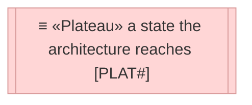
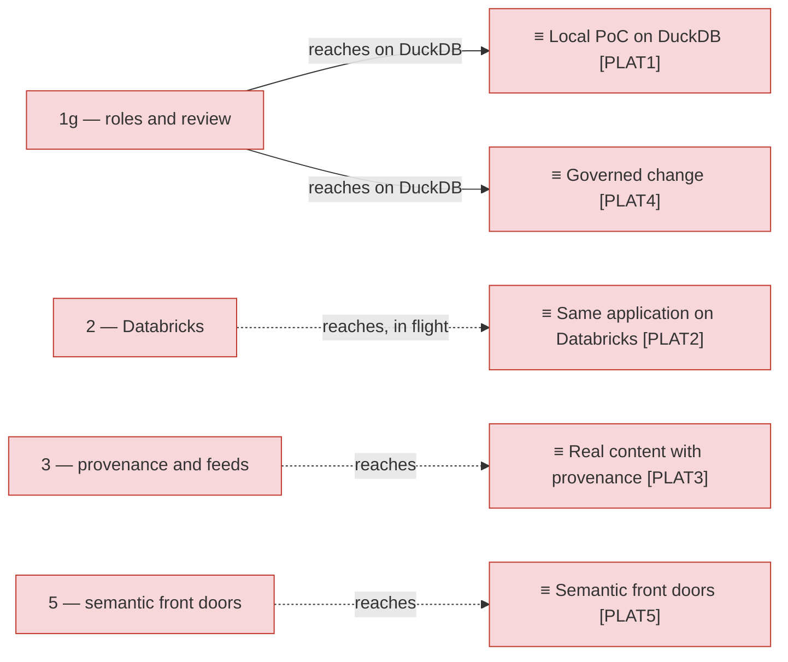

# Sequence

_[← Roadmap](./README.md) · [Target state](./1_target-state.md)_

**Status: `◐` draft catalogue** — the order in which the gaps of
[1_target-state.md](./1_target-state.md) are closed. Approved at the
**Direction** gate with the target state; every step still enters the change
process and stops at its own Understanding before it is built.

## How to read this document

## The order of the steps

```mermaid
flowchart LR
  s1["1 — the PoC"]:::implementation
  s1b["1b — generated views"]:::implementation
  s1c["1c — administration and arrangeable views"]:::implementation
  s1d["1d — branches and target state"]:::implementation
  s1e["1e — propose"]:::implementation
  s1f["1f — search, bulk edit, health"]:::implementation
  s1g["1g — roles and review"]:::implementation
  s2["2 — Databricks"]:::implementation
  s3["3 — provenance and feeds"]:::implementation
  s4["4 — governed change on the platform"]:::implementation
  s5["5 — semantic front doors"]:::implementation
  s6["6 — the current EA tool retired"]:::implementation
  s1 --> s1b --> s1c --> s1d --> s1e --> s1f --> s1g
  s1g --> s2
  s1g --> s3
  s2 --> s4
  s2 --> s5
  s3 --> s5
  s4 --> s6
  s5 --> s6

  classDef implementation fill:#f8d7da,stroke:#c0392b,color:#333
```

## What each step reaches

| Step | Closes | Reaches | Has to be true first | Demo moment |
| ---- | ------ | ------- | -------------------- | ----------- |
| 1 — the PoC (weeks 1–4, initiative 1) | `GAP3` | `PLAT1` | The curriculum export from the current EA tool (elements and relationships as CSV) and the information architect's definition of "curriculum" | Browse and edit the curriculum slice; edit the metamodel live; ask the three reference questions with cited identifiers |
| 1b — generated views (initiative 2) | `GAP9`, `GAP10` | `PLAT1`, extended | Step 1's view queries and agent; the notation per type of the institution's metamodel (question 9, resolved: the default mapping stands) | Ask a question and get a document with an architecture diagram; download the same view as a draft draw.io file |
| 1c — administration and arrangeable views (initiative 3) | `GAP11` | `PLAT1`, extended | Step 1b | An admin edits a type's stereotype and colour and sees the preview change; an architect drags shapes on an impact view and opens the exported draw.io file arranged the same way |
| 1d — branches and target state (initiative 4, built 2026-09-06) | `GAP5` (core), `GAP12` | `PLAT4`, its change-set core, on DuckDB | Step 1c | Two architects draft on their own branches, one merges item by item with a conflict resolved; the Target state page shows a work package's new, changed and decommissioned artefacts |
| 1e — propose (initiative 5, built 2026-09-06) | `GAP13` | `PLAT4`, intake | Step 1d | A design page in the template becomes a branch with linked and new elements after the architect reviews the merge log; an incomplete page is pushed back with the minimum to add |
| 1f — search, bulk edit, health (initiative 6, built 2026-09-06) | `GAP15` | `PLAT1`, extended | Step 1e | A steward searches descriptions for a wrong term, fixes twenty elements in one bulk edit, and the Health page shows which source is stale and which types lack descriptions |
| 1g — roles and review (initiative 7, built 2026-09-06) | `GAP14` | `PLAT4`, roles and review, on DuckDB | Step 1f | An architect requests a review; the information architect approves the information types and a steward the application types; the author merges; a reader cannot edit |
| 2 — Databricks (initiatives 13 and 14, built 2026-09-09 and 2026-09-11; the workspace run pending) | `GAP1`, `GAP2`, `GAP16` | `PLAT2` | A workspace with Apps enabled and Lakebase available; a service principal | The same app on Databricks Apps, the same data in a Lakebase database, the same tests green |
| 3 — provenance and feeds | `GAP4` | `PLAT3` | The per-type source-of-record table agreed with the IT division's enterprise architecture team (open question 5); read access to the extracts of the CMDB, the HR system, the project portfolio tool, the information asset register and the data platform's metadata catalogue (the last through its existing platform pipelines) | A CMDB change appears in the repository without anyone typing it |
| 4 — governed change on the platform | `GAP5` (the rest) | `PLAT4` | `PLAT2`: roles carried by workspace groups; sensitive attributes granted by role | The same review flow with workspace identities, and restricted attributes hidden from readers |
| 5 — semantic front doors | `GAP6`, `GAP7` | `PLAT5` | `PLAT2` and `PLAT3`; the glossary publishing target is Unity Catalog (question 6) | A Genie-based agent, or whichever agent framework the platform offers, traverses the projection and answers in Markdown, and an external agent answers the same question from the same projection; questions, answers and user feedback are logged |
| 6 — the current EA tool retired | `GAP8` | `PLAT6` | `PLAT4` and `PLAT5`; the retirement criteria met and the licence date known | The current tool read-only, then off |

Steps 1b to 1g ran inside the PoC month. Steps 2 and 3 are independent of each other
and can run in either order or in parallel; both need step 1. Step 5 needs both. The PoC is allowed to be
thrown away at any step (principle `P7`); the plateaus are not.
