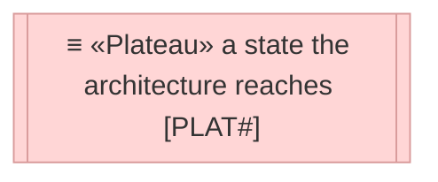
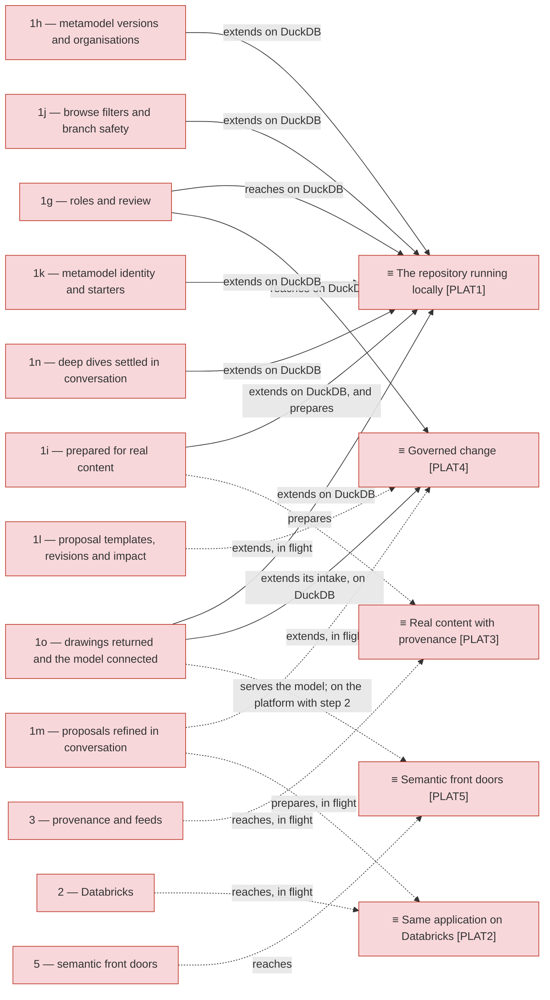

# Sequence

_[← Roadmap](./README.md) · [Target state](./1_target-state.md)_

**Status: `◐` draft catalogue** — the order in which the gaps of
[1_target-state.md](./1_target-state.md) are closed. Approved at the
**Direction** gate with the target state; every step still enters the change
process and stops at its own Understanding before it is built.

## How to read this document

## The order of the steps

```mermaid
flowchart LR
  s1["1 — the repository running locally"]:::implementation
  s1b["1b — generated views"]:::implementation
  s1c["1c — administration and arrangeable views"]:::implementation
  s1d["1d — branches and target state"]:::implementation
  s1e["1e — propose"]:::implementation
  s1f["1f — search, bulk edit, health"]:::implementation
  s1g["1g — roles and review"]:::implementation
  s1h["1h — metamodel versions and organisations"]:::implementation
  s1i["1i — prepared for real content"]:::implementation
  s1j["1j — browse filters and branch safety"]:::implementation
  s1k["1k — metamodel identity and starters"]:::implementation
  s1l["1l — proposal templates, revisions and impact"]:::implementation
  s1m["1m — proposals refined in conversation"]:::implementation
  s1n["1n — deep dives settled in conversation"]:::implementation
  s1o["1o — drawings returned and the model connected"]:::implementation
  s2["2 — Databricks"]:::implementation
  s3["3 — provenance and feeds"]:::implementation
  s3b["3b — sources reached over a protocol"]:::implementation
  s4["4 — governed change on the platform"]:::implementation
  s5["5 — semantic front doors"]:::implementation
  s6["6 — the current EA tool retired"]:::implementation
  s1 --> s1b --> s1c --> s1d --> s1e --> s1f --> s1g --> s1h --> s1i --> s1j --> s1k --> s1l --> s1m --> s1n --> s1o
  s1g --> s2
  s1g --> s3
  s3 --> s3b
  s2 --> s4
  s2 --> s5
  s3 --> s5
  s3b --> s5
  s4 --> s6
  s5 --> s6

  classDef implementation fill:#f8d7da,stroke:#c0392b,color:#333
```

## What each step reaches

| Step | Closes | Reaches | Has to be true first | Demo moment |
| ---- | ------ | ------- | -------------------- | ----------- |
| 1 — the repository running locally (initiative 1) | `GAP3` | `PLAT1` | An export from the current EA tool (elements and relationships as CSV) and the information architect's definition of the slice it covers | Browse and edit an enterprise's own content; edit the metamodel live; ask the three reference questions with cited identifiers |
| 1b — generated views (initiative 2) | `GAP9`, `GAP10` | `PLAT1`, extended | Step 1's view queries and agent; the notation per type of the enterprise's metamodel (question 9, resolved: the default mapping stands) | Ask a question and get a document with an architecture diagram; download the same view as a draft draw.io file |
| 1c — administration and arrangeable views (initiative 3) | `GAP11` | `PLAT1`, extended | Step 1b | An admin edits a type's stereotype and colour and sees the preview change; an architect drags shapes on an impact view and opens the exported draw.io file arranged the same way |
| 1d — branches and target state (initiative 4, built 2026-09-06) | `GAP5` (core), `GAP12` | `PLAT4`, its change-set core, on DuckDB | Step 1c | Two architects draft on their own branches, one merges item by item with a conflict resolved; the Target state page shows a work package's new, changed and decommissioned artefacts |
| 1e — propose (initiative 5, built 2026-09-06) | `GAP13` | `PLAT4`, intake | Step 1d | A design page in the template becomes a branch with linked and new elements after the architect reviews the merge log; an incomplete page is pushed back with the minimum to add |
| 1f — search, bulk edit, health (initiative 6, built 2026-09-06) | `GAP15` | `PLAT1`, extended | Step 1e | A steward searches descriptions for a wrong term, fixes twenty elements in one bulk edit, and the Health page shows which source is stale and which types lack descriptions |
| 1g — roles and review (initiative 7, built 2026-09-06) | `GAP14` | `PLAT4`, roles and review, on DuckDB | Step 1f | An architect requests a review; the information architect approves the information types and a steward the application types; the author merges; a reader cannot edit |
| 1h — metamodel versions and organisations (initiative 15, built 2026-09-19) | `GAP17` | `PLAT1`, extended | Step 1g | An architect copies the default organisation, drafts a version of the metamodel in the copy, reads in a compatibility check what the change would leave invalid, publishes it and applies it to the default organisation; a reader in the default organisation sees none of the trial |
| 1i — prepared for real content (initiative 16, built 2026-09-20) | `GAP18` | `PLAT1`, extended | Step 1h, and the store measured by decisions 0016 to 0018 | The Health page says how large the model is against the capacity the application is assessed for; a trace on a seeded hundred thousand elements answers from the store without building the graph; an attribute's group is picked from a list the metamodel declares, not typed; and a second pack, in a different framework, is loaded into an organisation of its own |
| 1j — browse filters and branch safety (initiative 20, built 2026-09-21) | `GAP21` | `PLAT1`, extended | Step 1i | An architect narrows the model by type, state, work package, source and an attribute at once, sends the address to a colleague and exports the result set; two architects edit different fields of one element and both changes survive the merge, because a conflict is a field both of them moved rather than a version that went up |
| 1k — metamodel identity and starters (initiative 21, built 2026-09-22) | `GAP22` | `PLAT1`, extended | Step 1j | An admin corrects the name of a published metamodel and every organisation applying it keeps working, because nothing ever keyed off the name; and a newcomer picks the ArchiMate Core from the starters on a screen and lands in a new, empty organisation typed against it, with the organisation they were in untouched |
| 1l — proposal templates, revisions and impact ([initiative 22](../scope/22_proposal-templates-revisions-and-impact.md), built 2026-09-24) | `GAP23` | `PLAT4`, its intake, on DuckDB | Step 1k | An architect fills in the ArchiMate reference template, hands it in, reads before Apply that the component it decommissions still serves two processes, applies it to a branch, revises the page twice onto the same branch, and a reviewer approves it reading the page, its revisions, its impact and a generated view of the change |
| 1m — proposals refined in conversation ([initiative 24](../scope/24_proposals-refined-in-conversation.md), built 2026-09-24; the served model's run on a workspace waits with step 2) | `GAP24`, `GAP25`, `GAP26` | `PLAT4`, its intake; prepares `PLAT2` | Step 1l; a Databricks Model Serving endpoint serving the model, for the served reader | An architect hands in a page whose component names match two systems; the assistant asks which one is meant and whether the forms server's other consumer should move with it, offering the choices; the architect picks one and answers the other in a sentence; the assistant offers to link a component's internal modules from the component rather than model them; the draft redraws, is saved, is picked up the next day and applied; the reviewer reads the conversation beside the merge log |
| 1n — deep dives settled in conversation ([initiative 25](../scope/25_deep-dives-settled-in-conversation.md), built 2026-09-25; its run on a workspace waits with step 2) | `GAP27` | `PLAT1`, extended | Step 1m | A reader asks what happens if the curriculum management system is replaced; the assistant settles the brief with them — impact, two steps, to decide whether to replace it — and lists the one earlier deep dive on it, rated four; the deep dive is written, kept and downloaded as a PDF that opens on the system in its enterprise and zooms in to its neighbourhood, with the same diagrams as draw.io files; the reader rates it, and the element's page lists it |
| 1o — drawings returned and the model connected ([initiative 26](../scope/26_drawings-returned-and-the-model-connected.md), built 2026-09-26; the platform half waits with step 2) | `GAP29`, `GAP7`, `GAP28` for systems reached over the Model Context Protocol | `PLAT1`, extended; `PLAT4`, its intake; `PLAT5`, its tool server | Step 1n; the draw.io stamp (built 2026-09-26); for a connected system, one that answers the protocol and a way for the reader's identity to reach it | An architect hands back an impact view they drew on in draw.io: the application knows which shapes were its own, asks whether the renamed one is a rename and whether the shape taken out leaves the model or only the picture, types the two new shapes from their stencils and applies what was ticked to a branch. The same architect asks about the system from their own agent in their editor, connected to the tool server, and gets the same identifiers the Ask page gives. A deep dive on it reads the design page the system links to on the connected wiki and says where the page and the model disagree |
| 2 — Databricks (initiatives 13 and 14, built 2026-09-09 and 2026-09-11; the workspace run pending) | `GAP1`, `GAP2`, `GAP16` | `PLAT2` | A workspace with Apps enabled and Lakebase available; a service principal | The same app on Databricks Apps, the same data in a Lakebase database, the same tests green |
| 3 — provenance and feeds (initiative 18, built 2026-09-21; in flight) | `GAP4`, and `GAP19` opened | `PLAT3` | The per-type source-of-record table agreed with the enterprise architecture team (open question 5); read access to the extracts of the CMDB, the HR system, the project portfolio tool, the information asset register and the data platform's metadata catalogue (the last through its existing platform pipelines); and, outside the application, whatever fires a schedule | A source leaves rows in the store's own staging schema and a configured feed loads them through the same validation, report, branch and role rules a file gets — on demand today, on its schedule once something outside fires it; every run is kept and readable afterwards. **Still to come:** a CMDB change appearing without anyone pressing anything, which needs the source-of-record table and a trigger; and a source reached over a protocol rather than through a table somebody else fills (`GAP20`) |
| 3b — sources reached over a protocol | `GAP20` | `PLAT3` | Step 3 (the pipeline a connected source is put through is the one step 3 built) and `PLAT2` (the platform is what reaches the source on a user's behalf); the source-of-record table, so a connected source knows which types it masters | A source is added by filling in where it lives and what it masters — no pipeline written for it — and its rows arrive validated, attributed to it, and on the branch its configuration names |
| 4 — governed change on the platform | `GAP5` (the rest) | `PLAT4` | `PLAT2`: roles carried by workspace groups; sensitive attributes granted by role | The same review flow with workspace identities, and restricted attributes hidden from readers |
| 5 — semantic front doors | `GAP6` (and `GAP7` on the platform, built by step 1o) | `PLAT5` | `PLAT2` and `PLAT3`; the glossary publishing target is Unity Catalog (question 6) | A Genie-based agent, or whichever agent framework the platform offers, traverses the projection and answers in Markdown; an external agent connected to the tool server over the Model Context Protocol answers the same question with the same identifiers; and a second solution joins the projection to its own data. Questions, answers and user feedback are logged |
| 6 — the current EA tool retired | `GAP8` | `PLAT6` | `PLAT4` and `PLAT5`; the retirement criteria met and the licence date known | The current tool read-only, then off |

Steps 1b to 1h all ran locally, on DuckDB. Step 1h needs no platform,
and step 2 does not wait for it. Steps 2 and 3 are independent of each other
and can run in either order or in parallel; both need step 1. Step 5 needs both.
A step's own implementation may be thrown away; what it was for is written down
as a gap and survives it (principle `P7`).

Step 1i is preparation, not a plateau: `ASM6` holds for the months the repository
takes to go from its first content to the whole model, and the step is what keeps
it from being re-assumed silently as the content grows. Step 1h leaves two things for later. Nothing per organisation reaches the
platform, so a catalogue, a row filter or a projection of its own is step 5's
work. An attribute's group is free text, so the metamodel holds no vocabulary
to catch a typo against.
