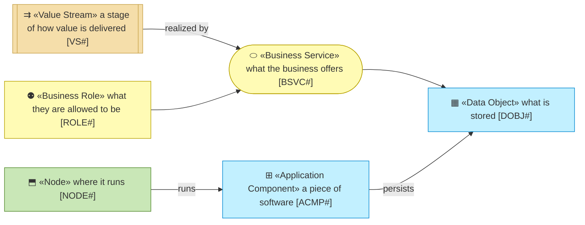
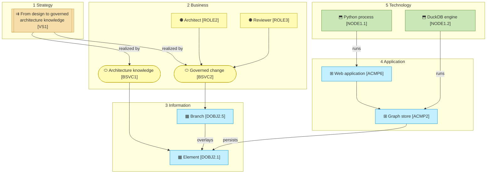

# Architecture — EA Repository

_The front door of this project's model._

**Federation ID:** `PRD_EAR`

**This folder is what this project knows about itself** — who it is for, what
it does, and which piece of software does each part. It is written in plain
Markdown so that the owner, the information architect and the coding agent all
read the same thing, and so a change to it shows up in a pull request like any
other change.

Nothing here is generated. Nothing here is a copy of something else. If a
document says a thing, that is what the project claims is true today. The one
place allowed to describe a future is [`6_transition/`](./6_transition/README.md).

The subject is the **EA Repository**: a generic, metamodel-driven enterprise
architecture repository that runs on DuckDB locally and on Databricks later,
configured first with a university's metamodel (the higher-education pack) and
loaded first with the curriculum slice of the institution's content. The
business case that started it and its review are held privately by the product
owner; [`reference/`](./reference/README.md) says what was derived from them.

## How to read this document

## The model at a glance

## What is modeled, and what is not

**One row per layer, and every row says something.** A layer with no file yet
is a stated fact — `Out of scope`, `External`, or a named `Gap` — not a silence.

| # | Layer | The question it answers | Status |
| - | ----- | ----------------------- | ------ |
| 0 | Business design | Who are the customers, and how does each offering pay? | `Out of scope` — this project models an application, not an organization |
| 1 | Strategy | Why does this exist, and what must it be able to do? | `Local` — [1_strategy/](./1_strategy/README.md): motivation, and the one value stream with the capability it realises; `◐` until the Understanding gate |
| 2 | Business | Who does what, and which services are offered? | `Local` — [2_business/](./2_business/README.md): the actors and the five roles the application enforces, the three business services and the processes that deliver them (the governed change process among them); `◐` |
| 3 | Information | What information exists, and where does it live? | `Local` — [3_information/](./3_information/README.md): the metamodel, the architecture graph, the exchange files and the audit trail; `◐` |
| 4 | Application | Which software realizes each business service? | `Local` — [4_application/](./4_application/README.md): services and components, every component pointing at its module; `◐` |
| 5 | Technology | What runs it all — runtimes, build, hosting? | `Local` — [5_technology/](./5_technology/README.md): one Python process, the embedded DuckDB engine, the browser, the artifacts; the Databricks runtime drawn dashed until it runs (plateau `PLAT2`); `◐` |
| — | Transition | Where is this going, and in what order? | `Local` — [6_transition/](./6_transition/README.md): six plateaus from the local PoC to the current EA tool retired |

## How deeply this project models itself

**Declared depth: 1 — Application.**

| Depth | The subject is | You get | Gates |
| ----- | -------------- | ------- | ----- |
| **1 — Application** | one app or tool | a light strategy layer — goals and principles, enough to judge a change against | Understanding |
| **2 — Organization** | a company, department, or service line | the canvases, and the operating model derived from them | Direction and Understanding |
| **3 — Enterprise** | several business lines | the above, plus each line modeled as a domain with its own charter | Both, plus each affected domain's owner on a contract change |

Depth is about the subject, not the effort. The repository *manages* an
enterprise model; it is itself one application, so it is modeled at Depth 1.
The content it holds (the institution's ~4,600 elements) is data inside the application,
not this model.

## How far a document has been validated

Every document that defines anything says so in its own preamble, with one of
three marks:

| | Status | What you may do with it |
| - | ------ | ----------------------- |
| `○` | **Not started** | Nothing. It exists so the gap is visible |
| `◐` | **Draft catalogue** | Read it as a list of things somebody said exist. Not approved, nothing here to build on |
| `●` | **Validated** | Rely on it. Confirmed on a named date, at a named gate |

**A draft catalogue is not an architecture draft.** Every layer document in this
model is `◐` today: it records what the owner decided in the conversations of
2026-09-05 and 2026-09-06 and what the code does, and it waits for the
information architect's Understanding gate (see
[scope/1_curriculum-poc.md](./scope/1_curriculum-poc.md)).

**Every layer document opens with its views.** One to three Mermaid diagrams
in the archreator notation come before the catalogue tables they are drawn
from, so a reader sees the shape before the rows; the tables stay the source
of every relationship (a diagram is a rendering, never the store).

## Conventions

The numbering, the element identifiers, and the notation the diagrams are
drawn in are all part of the method rather than of this project, so they are
not restated here. The coding agent reads them from the
`architecture-document-style` rulebook of the archreator plugin.

The one thing worth knowing before reading a diagram: **cyan is always an AI
actor**, so you never mistake one for a person, and **a dashed edge means not
true yet**.
