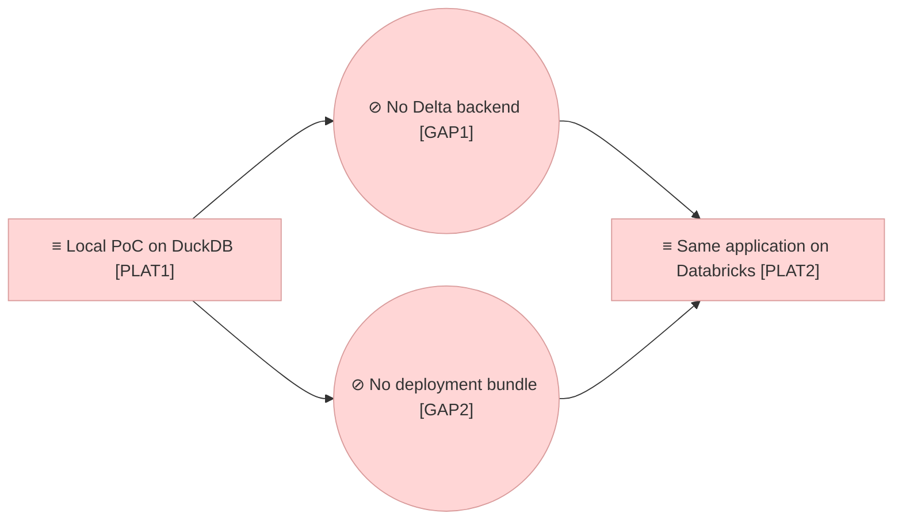

# Project Scope — Same Application on Databricks

_[← Scope index](./README.md) · [Model home](../README.md)_

**ArchiMate viewpoint:** Implementation & Migration.
**Delivered as:** branch `claude/repo-assessment-gaps-7wz42s`.
**Requester:** the product owner. **Agent:** the coding agent in this
repository. **Reviewer:** the product owner. **Baseline:** initiatives 1 to 12
on DuckDB. **Target plateau:** `PLAT2` Same application on Databricks.

The roadmap's step 2: the store gains its second engine, Delta tables in a
Unity Catalog schema reached through a SQL warehouse, and the application
gains the bundle that deploys it as a Databricks App with the workspace's
identity. Steps 2 and 3 of the sequence are what the roadmap names after the
PoC month; the Requester asked on 2026-09-09 for the next steps to be
implemented as the architecture intends, and step 3 waits on an agreement
outside the repository (see the gap notes), so this initiative is step 2.

## EA alignment (assessed top-down before implementing)

| Layer | Impact |
| ----- | ------ |
| 0_business-design | Not used — this is a Depth 1 application project. |
| 1_strategy | No new element. The change realises goal `G3` (one code base, local and Databricks) and serves `G1`; principle `P4` (SQL only in the store) is what makes a second engine one module, and `P7` (the PoC may be thrown away) still holds because nothing on the platform is hand-built. The "Measured by" cell of `G3` in [1_motivation.md](../1_strategy/1_motivation.md) now states what exists. |
| 2_business | No change. The same five roles and the same review before merge; what changes is how a user's group membership is read on the platform (decision [0012](../decisions/0012-workspace-groups-looked-up.md)), not who decides anything. |
| 3_information | No new data object. Every object of [1_data-objects.md](../3_information/1_data-objects.md) is persisted in the same tables on the second engine; the persistence section says where they live on the platform (a Unity Catalog schema the bundle creates). Classification and retention are unchanged; the two-year retention of the change log on the platform is not yet a job (gap note). |
| 4_application | The graph store `ACMP2` is now written once on SQL and an engine adds only its dialect (decision [0011](../decisions/0011-one-sql-store-two-engines.md)); `ACMP2.2` Databricks backend exists; `ACMP12` gains the workspace group lookup behind the forwarded identity; `ACMP6` is configured by the bundle instead of `app.yaml`. See [2_application-components.md](../4_application/2_application-components.md). |
| 5_technology | `NODE2` Databricks workspace stays **Pending** until a workspace runs it; it gains the services it will provide (`TSVC4` Warehouse SQL store, `TSVC5` Workspace identity) and the artifact that deploys it (`ART6` Deployment bundle). See [1_runtime.md](../5_technology/1_runtime.md). |
| Transition | `GAP1` No Delta backend and `GAP2` No deployment bundle are closed in code by this initiative; `PLAT2` is in flight and is reached when the same tests pass against a dev catalog. See [1_target-state.md](../6_transition/1_target-state.md). |

## Approvals

| Gate | Approved by | Date | What was approved |
| ---- | ----------- | ---- | ----------------- |

No gate has been granted yet. The Requester's instruction of 2026-09-09
("assess the repo, find the gaps, and implement the next steps as per the
intention defined in the architecture") opened the initiative while the
Requester was not in the session, so **Understanding** is presented on the pull
request, with these documents: [1_motivation.md](../1_strategy/1_motivation.md)
(no change but one measured-by cell), the business layer (no change),
[1_data-objects.md](../3_information/1_data-objects.md) (the persistence
section) and this document. Every layer document stays `◐`; the code sits on
the branch and nothing reaches `main` before the gate and the review.

## Plateaus

| Plateau | State |
| ------- | ----- |
| **Baseline** (before) | `PLAT1` as extended by initiatives 1 to 12: the store has one engine, a DuckDB file; `app.yaml` starts the app on Databricks Apps over an ephemeral DuckDB file in `/tmp`; the role derivation reads a groups header the platform never sends; no bundle, schema, warehouse or grants. |
| **Target** (delivered in code) | The store is one SQL implementation with two engines; the Databricks engine runs the whole unit suite on a warehouse played by DuckDB on every change and on a real warehouse on demand (`make test-live`); the bundle creates the Unity Catalog schema and the app with the warehouse it queries; the forwarded user's groups are read from the workspace. `PLAT2` is **reached** the day the same tests pass against a dev catalog and the bundle deploys — a workspace run this initiative could not make. |

## Design

**The store once, the engines thin.** Everything the repository asks of a SQL
store — the branch overlay, the optimistic concurrency, the change log, the
diff and the merge — moved unchanged from the DuckDB module into
`src/ea/backend/sql_backend.py`. An engine implements six hooks: connect, run
a statement, fetch, append rows, replace rows by key, and add a column that
shipped later. The DuckDB engine is sixty lines; the Databricks engine is the
dialect and the session. The unit suite's `backend` fixture runs every test on
both, the second over a warehouse played by DuckDB (`tests/fake_warehouse.py`)
that reads Delta's `ADD COLUMNS`, `SET TIME ZONE` and Spark's string escapes
the way the platform does, so the SQL the platform will receive is proved on
every change. `EA_LIVE_DATABRICKS=1` adds a third run on a real warehouse in a
schema named for the run and dropped at the end.

**What differs on a warehouse, and where it is handled.** A statement is a
round trip and the connector allows 255 parameter markers, so a bulk load is
one `MERGE INTO … USING (VALUES …)` per batch of 200 rows written as literals,
every `IN (…)` list is chunked at 200, and the pack is saved in five inserts
rather than three hundred. `VARCHAR` is spelt `STRING` and `INTEGER` `INT`; a
column added by a later version is found by `DESCRIBE` and added with
`ADD COLUMNS`. A string literal doubles the backslash, because Spark reads it
as an escape and a JSON attribute with a newline would otherwise come back
broken. Timestamps are written and read in UTC and come back naive, as they
do from DuckDB. A session the warehouse closed is reopened once. The recursive
trace query is tried first; a warehouse that refuses `WITH RECURSIVE` (the
open-source Spark 4.0 release does not carry it) is answered with the same
walk in process, over the same edges, and the engine remembers the answer.

**Identity from the workspace.** Databricks Apps forwards the signed-in user's
e-mail, username and — when the app declares the `iam.current-user:read`
scope — an access token; it forwards no groups. `src/ea/services/identity.py`
reads the user's groups from the workspace, with the forwarded token when there
is one (the user reading their own record) and otherwise as the app's service
principal, and keeps the answer for five minutes per user. A directory that
fails makes a Reader, never an error page. A proxy that does forward a groups
header is believed without a lookup, and the debug persona stays local.

**The bundle.** `databricks.yml` declares the Unity Catalog schema and the app
with the SQL warehouse it queries (`CAN USE`), and owns the app's configuration
— the command that installs the `databricks` extra from the lock, and the
environment that names the engine, the catalog, the schema, the warehouse and
the group-to-role mapping — so `app.yaml` is retired. The app's service
principal exists only once the app does, so the grants it needs on the schema
are a step after the first deploy (`make deploy-grants`, `deploy/grants.py`),
run by whoever manages the catalog.

## Work packages

| # | Work package | Delivers | State |
| - | ------------ | -------- | ----- |
| 1 | The store on SQL, once | `src/ea/backend/sql_backend.py`; `src/ea/backend/duckdb_backend.py` reduced to the engine; the trace query in `src/ea/backend/sql.py` portable (`INSTR`, the engine's string type); `tests/conftest.py` running the suite on both engines; `tests/fake_warehouse.py` | Built 2026-09-09 |
| 2 | The Databricks engine | `src/ea/backend/databricks_backend.py`, its registration in `src/ea/backend/factory.py`, `DATABRICKS_HTTP_PATH` in `src/ea/config.py`; `tests/test_databricks_backend.py`; `make test-live` | Built 2026-09-09; the live run waits for a workspace |
| 3 | Identity from the workspace | `src/ea/services/identity.py`; `user_from_headers()` in `src/ea/ui/context.py`; `tests/test_identity.py` | Built 2026-09-09 |
| 4 | The deployment bundle | `databricks.yml`, `deploy/grants.py`, `make deploy`, `make deploy-grants`; `app.yaml` retired; `tests/test_deploy.py` | Built 2026-09-09; the deploy waits for a workspace |
| 5 | The model kept true | The layer rows named above, the roadmap, decisions 0011 and 0012, the README and `AGENTS.md` | Done |

## In scope / out of scope

| In scope | Out of scope (gaps, candidate future work) |
| -------- | ------------------------------------------- |
| The Databricks engine on the same DDL, proved on DuckDB in CI and on a warehouse on demand | Running it on the Requester's workspace: `make test-live`, `make deploy`, `make deploy-grants` need a workspace with a SQL warehouse, a catalog, Apps enabled and a principal that manages the catalog (the sequence's "has to be true first") |
| The bundle: schema, app, warehouse permission, the grant step | The hosted model's key as an app secret resource (`EA_AGENT_PROVIDER` stays `auto`; the stub runs without it) |
| Groups read from the workspace for the forwarded user | Column-level grants for the restricted attributes (plateau `PLAT4`) |
| One in-process trace where the warehouse has no recursive queries | A two-year retention job for the change log on the platform |
| | Lakebase as the app's transactional store (decision 0002 keeps it as an option) |
| | Step 3 of the sequence, provenance and feeds (`GAP4`) |

## Gap notes

- **The workspace run.** Everything that needs a workspace is one command
  each and is documented in the README; what makes it hard is only what the
  roadmap already named: a workspace with a SQL warehouse, a dev catalog and
  Apps enabled, and a service principal. `PLAT2` is marked in flight, not
  reached, until `make test-live` is green there.
- **The hosted model's key.** Binding `ANTHROPIC_API_KEY` as a secret resource
  of the app is a three-line addition to `databricks.yml` once the secret
  scope exists; it is left out so the bundle deploys without one.
- **Retention.** The information layer promises the change log kept for two
  years on the platform; a scheduled `DELETE` older than that is a bundle job
  of a few lines, best written when the first real content is loaded (`GAP3`).
- **Column-level grants** wait for `PLAT4`, as decision 0008 says.
- **Step 3, provenance and feeds (`GAP4`).** Blocked on the per-type
  source-of-record table agreed with the IT division's enterprise
  architecture team and on read access to the source extracts; the generic
  half (per-type mirrored, authored or enriched semantics in the pack, and a
  scheduled import from a Volume through the existing CSV contract) can be
  built once that table exists.
- **The model has drifted, in rows this initiative did not touch.** The
  assessment that opened this initiative read every layer document against
  the code and found rows that were true when written and are not now: the
  command line's row omits `branch send-back` and `reviewers`; the browsing
  service still says a bulk edit sets the lifecycle; assessment `ASM3` still
  defers the change-set model past the PoC; the branch object lists three
  statuses of five; the attribute types listed are not the ones the code
  accepts; the motivation document's relationship table uses glyphs its legend
  does not; the technology relationship table types the workstation's nodes as
  system software; the settings module, the validators, the import template,
  three browser scripts and the component-id registry are named by no element;
  the front door describes the document shape initiative 8 undid. None of it
  is this initiative's to fix — restating the current state is its own
  initiative with its own Understanding — and the list is the backlog for it.
- **Recursive queries on the warehouse.** If the Requester's warehouse runs
  `WITH RECURSIVE`, the in-process fallback is never used; if it does not, the
  trace costs one edge query per call instead of one recursive query. Either
  way the answer is the same, and the engine logs which it used.

## Delivered

Built on 2026-09-09 on the branch: the shared SQL store and the two engines,
the Databricks engine tests and the suite running on both engines (`make
check`, unchanged in what it runs), the workspace identity, the bundle and the
grant step, and the documents. Not run on a workspace: the live tests and the
deploy are the Requester's first step once the workspace exists.
