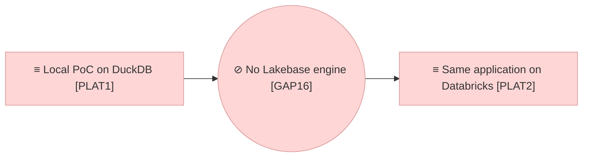

# Project Scope — The Store on Lakebase

_[← Scope index](./README.md) · [Model home](../README.md)_

**ArchiMate viewpoint:** Implementation & Migration.
**Delivered as:** branch `claude/databricks-lakebase-compat-2s5ljj`.
**Requester:** the product owner. **Agent:** the coding agent in this
repository. **Reviewer:** the product owner. **Baseline:** initiatives 1 to 13.
**Target plateau:** `PLAT2` Same application on Databricks, restated.

The Requester said on 2026-09-11 that the project runs on Lakebase, the
platform's Postgres database, and not on the lakehouse. Initiative 13 had built
the platform store on Delta tables reached through a SQL warehouse, as
decision 0002 planned; this initiative restates plateau `PLAT2` on Lakebase,
replaces the warehouse engine with a Lakebase engine on the same shared SQL
store, and rebuilds the deployment bundle around a Lakebase instance. The
application, the identity lookup and the DuckDB engine are untouched.

## EA alignment (assessed top-down before implementing)

| Layer | Impact |
| ----- | ------ |
| 0_business-design | Not used — this is a Depth 1 application project. |
| 1_strategy | No new stakeholder, driver, goal or principle. One assessment added: `ASM8` A warehouse is not an application store, the reading behind the Requester's instruction (adopted). Two rows re-worded to stay true: the goal `G3` (one code base, local and Databricks) names Lakebase where it named Delta, and principle `P4` (one schema, two engines) names Postgres as the second dialect. See [1_motivation.md](../1_strategy/1_motivation.md). |
| 2_business | No change. The same roles and the same review before merge; the workspace groups are still read from the workspace's directory (decision 0012). |
| 3_information | No new data object. Every object of [1_data-objects.md](../3_information/1_data-objects.md) is persisted in the same tables; the persistence section now says where they live on the platform: one schema of a Lakebase database, in an instance the bundle creates, read by the lakehouse through Unity Catalog once registered there (plateau `PLAT5`). Classification and retention are unchanged. |
| 4_application | The graph store `ACMP2` keeps its one SQL implementation and two engines (decision 0011). `ACMP2.2` Databricks backend, the engine on a SQL warehouse, is retired; `ACMP2.3` Lakebase backend replaces it. See [2_application-components.md](../4_application/2_application-components.md). |
| 5_technology | `NODE2` Databricks workspace hosts a Lakebase instance rather than a warehouse over Delta; `TSVC4` Warehouse SQL store is retired and `TSVC6` Lakebase SQL store replaces it; `ART6` Deployment bundle creates the instance and the app's database resource, and the grant step is gone. See [1_runtime.md](../5_technology/1_runtime.md). |
| Transition | `PLAT2` is restated: the store is a Lakebase database, not a Unity Catalog schema of Delta tables. `GAP16` No Lakebase engine is opened against the restated plateau and closed in code by this initiative; `GAP1` and `GAP2` keep their rows, the first superseded. See [1_target-state.md](../6_transition/1_target-state.md) and [2_sequence.md](../6_transition/2_sequence.md). |

## Approvals

| Gate | Approved by | Date | What was approved |
| ---- | ----------- | ---- | ----------------- |

No gate has been granted yet. The Requester's instruction of 2026-09-11 ("make
this project work on Lakebase and not the lakehouse") opened the initiative in
the session, and the work was built on the branch as initiative 13's was, so
the Requester sees the model and the code together. Two gates are presented,
in the session and on the pull request: **Direction**, for the restated
plateau in [1_target-state.md](../6_transition/1_target-state.md) and
[2_sequence.md](../6_transition/2_sequence.md), since the roadmap's own rule
is that a plateau found wrong is restated through its own gate; and
**Understanding**, for [1_motivation.md](../1_strategy/1_motivation.md) (one
assessment, two rows re-worded), [1_data-objects.md](../3_information/1_data-objects.md)
(the persistence section) and this document. Every layer document stays `◐`;
nothing reaches `main` before the gates and the review.

## Plateaus

| Plateau | State |
| ------- | ----- |
| **Baseline** (before) | `PLAT1` as extended by initiatives 1 to 12, and initiative 13's step towards `PLAT2` as first stated: the store's second engine spoke to a SQL warehouse over Delta tables and was proved on a warehouse played by DuckDB; the bundle created a Unity Catalog schema and granted the app's principal on it in a step of its own; nothing had run on a workspace. |
| **Target** (delivered in code) | `PLAT2` restated: the store's second engine speaks Postgres to a Lakebase database and is proved on a real Postgres in every test run — one the run starts for itself, or the one `EA_TEST_POSTGRES` names, a service container in CI — and on a Lakebase instance on demand (`make test-live`); the bundle creates the instance and the app with a database resource that grants its principal what the store needs; the warehouse engine, its stand-in and the grant step are gone. `PLAT2` is **reached** the day the same tests pass against an instance and the bundle deploys — a workspace run this initiative could not make either. |

## Design

**Nothing to translate.** Lakebase is Postgres, and Postgres reads the
portable DDL as written: `VARCHAR`, `INTEGER`, `BOOLEAN`, `TIMESTAMP`,
`CREATE TABLE IF NOT EXISTS`, `ADD COLUMN IF NOT EXISTS`, `ILIKE`,
`WITH RECURSIVE`. The one change to the shared SQL is the trace query, which
now casts every string column in both terms of its recursion (Postgres holds
the recursive term to the types of the first one, and a concatenation is
`text` where a column is `varchar`), finds the shortest path per node with a
window rather than `MIN_BY`, and tests membership with `POSITION` rather than
`INSTR`; DuckDB reads all three as it read the old ones, so the query stays one
query. The column migration for an older store moved into the shared store,
since both engines spell it the same way, and the in-process trace that stood
in for a warehouse without recursive queries is gone with the warehouse.

**What the engine adds, and where.** `src/ea/backend/lakebase_backend.py` is
the connection and the statements: `?` markers rewritten to the driver's `%s`
outside string literals, with a percent doubled when values are bound; rows
landed as multi-row inserts of five hundred, bound rather than written as
literals, since Postgres binds sixty-five thousand values a statement; a bulk
replace as a delete and an insert in one transaction, so a batch the server
refuses leaves the store as it was; a reader's own query run in a transaction
the server holds to reads, behind the word guard the shared store already
applies; the schema created where the principal may, then entered, with the
session in UTC, on every connection. Timestamps are written and read naive in
UTC, as on DuckDB.

**Signing in on the platform.** On Databricks Apps the app knows its instance
(`EA_LAKEBASE_INSTANCE`, set by the bundle from the instance it creates): the
engine looks the instance up through the SDK for its host, takes the app's
service principal as the user (`DATABRICKS_CLIENT_ID`, which the platform
sets), and generates an OAuth token for the instance as the password —
`generate_database_credential`, the way every Lakebase client signs in. A
token lives an hour; the engine does not count the minutes but treats a
connection the server or the network dropped as the platform's failure mode:
the statement is retried once on a new connection, signed in afresh, and the
reader never notices. Anywhere else — a test server, a workstation, CI — the
standard `PG*` variables or `EA_POSTGRES_DSN` reach any Postgres the way libpq
reads them, so the engine is the same object over a container in CI and over
the platform's instance.

**Proved on Postgres, every run.** A Postgres played by DuckDB would have been
the stand-in initiative 13 built for the warehouse, and a Postgres played by
anything is the copy that drifts. The suite starts a real one instead
(`tests/postgres_server.py`): `initdb` and `pg_ctl` from the PATH or the usual
install locations, on a unix socket in a temporary directory, as an
unprivileged user where the run is root, and stopped at the end; every test
gets a schema of its own and drops it. `EA_TEST_POSTGRES` names a running
server instead, which is what CI does with a service container. A workstation
with neither runs the store tests on DuckDB alone, and the run says so.
`EA_LIVE_LAKEBASE=1` adds a third run on a Lakebase instance, in a schema named
for the run and dropped at the end.

**The bundle.** `databricks.yml` declares the Lakebase instance (`CU_1`, the
smallest, holds the whole model) and the app with a database resource on it
(`CAN_CONNECT_AND_CREATE`: the app's service principal gets a Postgres role
that connects to the database and creates in it, which is what the store needs
to create its schema on the first start). The app's environment names the
engine, the instance by its deployed resource name, the database and the
schema; the host, the user and the password are never set, because the engine
looks up the first and generates the last. The grant step of initiative 13 is
gone: the platform grants what the resource declares.

## Work packages

| # | Work package | Delivers | State |
| - | ------------ | -------- | ----- |
| 1 | The shared SQL portable to Postgres | The trace query in `src/ea/backend/sql.py`; the column migration in `src/ea/backend/sql_backend.py`; `src/ea/backend/duckdb_backend.py` reduced further | Built 2026-09-11 |
| 2 | The Lakebase engine | `src/ea/backend/lakebase_backend.py`, its registration in `src/ea/backend/factory.py`, `EA_LAKEBASE_INSTANCE`, `EA_POSTGRES_DSN` and the `PG*` variables in `src/ea/config.py`; `psycopg` as a dependency | Built 2026-09-11; the live run waits for a workspace |
| 3 | The suite on a real Postgres | `tests/postgres_server.py`; `tests/conftest.py` running every store test on both engines, each test in a schema of its own; `tests/test_lakebase_backend.py`; the service container in `.github/workflows/checks.yml`; `make test-live` | Built 2026-09-11 |
| 4 | The warehouse engine retired, the bundle on Lakebase | `src/ea/backend/databricks_backend.py`, `tests/fake_warehouse.py`, `tests/test_databricks_backend.py` and `deploy/grants.py` removed; `databricks.yml` declaring the instance and the app's database resource; `tests/test_deploy.py`; `make deploy` without the grant step | Built 2026-09-11; the deploy waits for a workspace |
| 5 | The model kept true | The layer rows named above, the roadmap, decision 0013 and the status lines of 0002 and 0011, the README and `AGENTS.md` | Done |

## In scope / out of scope

| In scope | Out of scope (gaps, candidate future work) |
| -------- | ------------------------------------------- |
| The Lakebase engine on the same DDL, proved on a real Postgres in every run and on an instance on demand | Running it on the Requester's workspace: `make test-live` and `make deploy` need a workspace with Apps enabled and Lakebase available, and a principal that may create a database instance |
| The bundle: the instance, the app and its database resource | The database registered in Unity Catalog as a catalog (`database_catalogs`), so the lakehouse, Genie and the glossary of plateau `PLAT5` read it: four lines of bundle when `PLAT5` opens |
| The warehouse engine, its stand-in and the grant step retired | The hosted model's key as an app secret resource (`EA_AGENT_PROVIDER` stays `auto`; the stub runs without it) |
| The suite on a Postgres of the run's own, and a service container in CI | A two-year retention job for the change log on the instance |
| | Lakebase's autoscaling generation (projects, branches and endpoints in place of a provisioned instance): the engine speaks Postgres either way, so only the bundle's resource and the app's sign-in would change |
| | Column-level grants for the restricted attributes (plateau `PLAT4`) |
| | Step 3 of the sequence, provenance and feeds (`GAP4`) |

## Gap notes

- **The workspace run.** What needs a workspace is one command each and is
  documented in the README: `make deploy`, `make deploy-run`, `make test-live`.
  The platform's documentation could not be read from the session that built
  this, so three things are stated from the SDK the engine uses and are the
  first things a workspace run confirms: the app's database resource
  (`instance_name`, `database_name`, `permission: CAN_CONNECT_AND_CREATE`,
  the resource's only permission) gives the app's service principal a
  Postgres role that connects and creates; the instance's host is its
  `read_write_dns` and the token `generate_database_credential` returns is its
  password; and the bundle's `database_instances` resource takes the instance's
  name and capacity. `PLAT2` is marked in flight, not reached, until
  `make test-live` is green there.
- **A role for whoever runs the live tests.** The app's principal is granted
  by its resource; a person running `make test-live` from a workstation signs
  in as themselves and needs a Postgres role on the instance, which the
  instance's owner gives them in the workspace.
- **The database in Unity Catalog.** Registering the Lakebase database as a
  catalog is what lets the lakehouse read the store; it is the first step of
  plateau `PLAT5` and not of this one, so the store is reachable only over the
  Postgres protocol until then.
- **Retention.** The information layer promises the change log kept for two
  years on the platform; on Lakebase that is a scheduled `DELETE` older than
  that, best written when the first real content is loaded (`GAP3`).
- **Column-level grants** wait for `PLAT4`, as decision 0008 says.
- **Step 3, provenance and feeds (`GAP4`)** stays blocked on the
  source-of-record table agreed outside the repository, as initiative 13
  recorded.
- **The drift backlog of initiative 13** stands as written there; nothing in
  this initiative touched those rows.

## Delivered

Built on 2026-09-11 on the branch: the shared SQL portable to Postgres, the
Lakebase engine and its tests, the suite run on both engines over a Postgres
of the run's own and a service container in CI, the bundle on a Lakebase
instance, the warehouse engine retired, and the documents. Not run on a
workspace: the live tests and the deploy are the Requester's first step once
the workspace exists.
