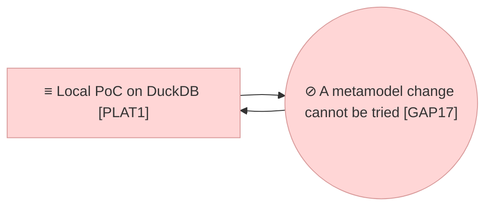

# Project Scope — Metamodel Versions and Organisations

_[← Scope index](./README.md) · [Model home](../README.md)_

**ArchiMate viewpoint:** Implementation & Migration.
**Delivered as:** branch `claude/metamodel-extensibility-versions-uubzua`.
**Requester:** the product owner. **Agent:** the coding agent in this
repository. **Reviewer:** the product owner. **Baseline:** initiatives 1 to 14.
**Target plateau:** `PLAT1` extended. No plateau moves; the gap `GAP17` closes.

The Requester said on 2026-09-19 that the metamodel module must be extensible
in every element and every attribute, that the repository must hold more than
one version or variant of a metamodel, and that a metamodel must be applied to
an organisation, one of which is the default. The reason given is the one that
decides the design: options are to be tried in another organisation before they
are moved to the default one, and **"we don't want a separate test environment
just to try different metamodel functions as it should be part of the
architecture work."** The same instruction asked for a usability pass on the
metamodel screen, with the management lists, the graph and the generated
architecture view in tabs of their own, and asked whether more than one
organisation is the right shape or whether something better is available.

Reading the first cut, the Requester added three more: a generated architecture
view must not group its shapes into layer boxes, which spread the diagram — the
layers belong above it instead, **shown in their colours rather than described
in words**; an element type, a relationship type and an attribute must be
deletable, not only deactivatable; and an element's attributes must be grouped,
and read in those groups.

## Is more than one organisation the right shape?

**Yes, and it is the only one of the four that answers the sentence above.**
The question was asked, so the reasoning is recorded here rather than left in
the code.

| Option | Why not |
| ------ | ------- |
| **A branch** (the overlay of decision 0006) | A branch is a change to the *content*, reviewed and merged back. A metamodel version is not content and is never merged: it is what content is validated against. A branch also shares the metamodel of the organisation it belongs to, so a trial on a branch would change the language every other branch reads. |
| **A second environment** | What the Requester ruled out, and rightly: a second database, a second deployment and a second copy of the content, none of it in the architect's hands, and a result that has to be carried back by hand. |
| **One metamodel, edited in place** | What the repository did until now. There is no way to say which definition a piece of content was validated against, no way to compare two, and no way to try one without changing what everybody reads. |
| **Organisations, a partition of the one store** (chosen) | The trial runs in the same repository, on a copy of the real content, under a version of its own, with the default organisation untouched. It is also the shape the model will need anyway: an EA repository that serves more than one enterprise — a faculty, a subsidiary, a merged institution — is the same partition (decision 0014). |

The cost is one column on every content table and one context variable that
every read and write must honour; the risk is a query that forgets it. The
design answers that in one place — the scoped sources the store builds
(`SqlBackend._el`, `_rel`, `_scope_ctes`) — and the tests hold two
organisations with the same identifiers apart to prove it.

## EA alignment (assessed top-down before implementing)

| Layer | Impact |
| ----- | ------ |
| 0_business-design | Not used — this is a Depth 1 application project. |
| 1_strategy | No new stakeholder, driver, goal or principle. One assessment added: `ASM9` A metamodel change cannot wait for an environment, the reading behind the Requester's instruction (adopted). See [1_motivation.md](../1_strategy/1_motivation.md). |
| 2_business | No change. The same roles and the same review before merge; managing organisations and applying a version are Admin actions, which needs no new role. |
| 3_information | Two data objects added: `DOBJ1.6` Metamodel version and `DOBJ2.8` Organisation. The metamodel objects gain a properties bag, an attribute gains its group and its rules, an element type may be abstract and a relationship type may carry attributes; the persistence section says that every content table carries `org_id` and that the metamodel tables are keyed by pack and version. See [1_data-objects.md](../3_information/1_data-objects.md). Two documents added beside it, defining no element: [2_conceptual-data-model.md](../3_information/2_conceptual-data-model.md) reads the same objects as entities with their cardinalities, and [3_logical-data-model.md](../3_information/3_logical-data-model.md) as the seventeen tables with their keys and references — the layer had the enterprise view of what it holds and not the application's own. |
| 4_application | One service added, `ASVC11` Organisation management, and the metamodel service extended with the version lifecycle, the difference between two versions and the compatibility check; one component added, `ACMP13` Metamodel lifecycle and organisation services. The store, the metamodel module, the screens, the command line and the views module keep their rows, re-worded where the change made them untrue. See [1_application-services.md](../4_application/1_application-services.md) and [2_application-components.md](../4_application/2_application-components.md). |
| 5_technology | No change. The same store, the same engines, the same deployment; an organisation is rows in the tables that already exist. |
| Transition | `GAP17` A metamodel change cannot be tried without changing what everybody reads is opened against `PLAT1` and closed in code by this initiative. See [1_target-state.md](../6_transition/1_target-state.md) and [2_sequence.md](../6_transition/2_sequence.md). |

## Approvals

| Gate | Approved by | Date | What was approved |
| ---- | ----------- | ---- | ----------------- |

No gate has been granted yet. The Requester's instruction of 2026-09-19 opened
the initiative while the Requester was not in the session, so **Understanding**
is presented on the pull request, with these documents:
[1_motivation.md](../1_strategy/1_motivation.md) (the assessment `ASM9`),
[1_data-objects.md](../3_information/1_data-objects.md) (`DOBJ1.6`, `DOBJ2.8`
and the rows the metamodel objects gained),
[1_application-services.md](../4_application/1_application-services.md) and
[2_application-components.md](../4_application/2_application-components.md)
(`ASVC11`, `ACMP13` and the re-worded rows),
[1_target-state.md](../6_transition/1_target-state.md) (`GAP17`), decisions
[0014](../decisions/0014-organisations-as-a-partition.md) and
[0015](../decisions/0015-metamodel-versions.md), and this document. Every layer
document stays `◐`; the code sits on the branch and nothing reaches `main`
before the gate and the review.

## Plateaus

| Plateau | State |
| ------- | ----- |
| **Baseline** (before) | `PLAT1` as extended by initiatives 1 to 12, with 13 and 14 waiting on a workspace run: one metamodel, edited in place, applied to whatever content the store held; a pack file loaded over the stored one; a type retired by deactivating it and never removed; an attribute a name, a label, a type, an enum and a sensitivity. |
| **Target** (delivered in code) | `PLAT1` extended: the store holds many versions of a pack, each draft, published or retired; it holds many organisations, one of them the default, each applying exactly one version and each holding content, branches and reviews of its own; a version is drafted from another, compared with another, checked against an organisation's content and applied to it; every part of a pack carries a properties bag; an attribute carries its rules and its group; a type may be abstract; a relationship type may carry attributes; the lists are edited and rows deleted from them; and the metamodel screen shows one version at a time under six tabs. |

## Design

**An organisation is a partition of the one store.** Every content table gained
an `org_id`; a new `organisation` table holds the name, the description, the
version applied, whether it is the default, and what it was copied from. The
organisation is a context variable (`src/ea/backend/organisations.py`) beside
the branch and the role, set from the session by the application, from `--org`
on the command line, and by `use_org()` in a service. Every read and write of
the store is built over a scoped source, so two organisations may hold the same
identifiers and never see each other's rows — including a reader's own SQL,
which runs with the tables shadowed by scoped CTEs. A sandbox is an
organisation created as a copy of the default's main content; deleting one
deletes everything in it except the change log, which keeps the record.
Decision [0014](../decisions/0014-organisations-as-a-partition.md).

**A metamodel is kept in versions.** A pack is stored per `(pack id, version)`
with a lifecycle: a **draft** is edited in place; a **published** version is
frozen, so what was validated against it stays validated; a **retired** one is
kept for the record and can no longer be applied. A version says what it was
derived from, what it is for, who published it and when. The difference between
two is read, not eyeballed (`src/ea/metamodel/diff.py`). Each organisation
applies exactly one version, and applying is preceded by a **compatibility
check**: every element and relationship of that organisation's main is
validated against the candidate and the findings are listed. The check refuses
on errors unless it is forced, and never refuses on warnings. Decision
[0015](../decisions/0015-metamodel-versions.md).

**Extensible in every element and every attribute.** A pack, a domain, an
element type, a relationship type and an attribute each carry a `properties`
bag: any JSON object a framework wants kept beside the row, which the engine
stores and never interprets. An attribute gained a default, several values,
a unit, a pattern, a minimum and a maximum, a help line and a group, and its
type may now be text, an integer, a number, a date, a URL or JSON as well as a
string or a boolean; the registry validates a value against all of it. An
element type may be **abstract** — a grouping type no element may be — and a
relationship type may declare **attributes of its own**, which the element page
reads and writes beside the relationship. None of this is framework-specific:
it is the pack format, and `packs/README.md` documents it.

**The metamodel screen, rebuilt around one version.** Six tabs over the version
the title's selector names: **Manage** (four lists — element types,
relationship types, attributes, domains — edited in grids and saved together),
**Graph** (the type graph), **Architecture view** (the metamodel drawn in the
notation it declares, downloadable), **Notation**, **Versions** (every stored
version, its state, who applies it, drafting, publishing, retiring, deleting
and the difference between two) and **Reviewers**. Saving edits made on a
published version opens a dialog that stores them as a new draft, so the
frozen version is never quietly changed. The whole tab is read-only for a role
that may not save the metamodel, rather than offering an edit nobody may store.

**Deleting a row.** Rows are ticked and deleted in each of the four lists. What
the metamodel could not hold without the row goes with it — a relationship type
whose end type is gone, an attribute whose owner is gone, a notation row — and
what can stand without it is kept with the reference cleared: a sub-type of a
deleted supertype, a type whose domain is deleted. So deleting one row never
quietly deletes a branch of the model nobody asked about, and what is left is a
version the metamodel accepts. Nothing is stored until the save, the page says
what went, and it warns when content in the organisation is of a type that was
deleted — the version still saves, and the compatibility check is what reports
it when the version is applied.

**Attributes in their groups.** An attribute's `group` is the section of the
source metamodel's own document it is listed under. The element page reads and
edits an element's attributes in those groups, in one table whose values line
up under one column, and the shipped pack declares six of them. An attribute
that carries no value is not listed, and a value the metamodel does not know is
kept and said to be unknown rather than dropped.

**A generated view is flat.** One subgraph per ArchiMate layer pushed the
shapes apart — Mermaid gives every box its own rank band and its own padding —
so a view of a dozen elements spread over a page and the relationships, which
are the point of it, ran half its width. The bands are gone, with the invisible
links that held them in order, and the layer is the fill colour. What the bands
were labelled stands above the diagram instead: on a screen a chip per layer, in
that layer's own colour, so a reader matches a chip to a shape rather than
translating a sentence; in the exported Markdown and in the diagram's own source,
a swatch and a name, which is as close as a text format comes to showing a
colour. The draw.io export still draws its layers as swimlanes: it
is a canvas to rework, where a group is easy to move and easy to delete.

## Work packages

| # | Work package | Delivers | State |
| - | ------------ | -------- | ----- |
| 1 | The pack format, extensible | `src/ea/models.py` (the properties bags, the attribute's rules and group, abstract types, relationship attributes, the version and its lifecycle), `src/ea/metamodel/loader.py`, `registry.py`, `diff.py`; `packs/README.md` | Built 2026-09-19 |
| 2 | The store partitioned and versioned | `org_id` on every content table and the `organisation` table in `src/ea/backend/sql.py`; `src/ea/backend/organisations.py`; the scoped sources, the pack per version and the migration of an older store in `src/ea/backend/sql_backend.py`; both engines | Built 2026-09-19 |
| 3 | The services, the roles and the command line | `src/ea/services/metamodel.py`, `src/ea/services/organisations.py`, the two new actions in `roles.py`, the defaults and coercion in `repository.py`; `--org` and the `org` and `metamodel` groups in `src/ea/cli.py` | Built 2026-09-19 |
| 4 | The screens | The Metamodel page rebuilt around one version with six tabs and row deletion; the new Organisations page; the header's organisation selector and version badge; the element page's attribute groups and relationship attributes | Built 2026-09-19 |
| 5 | The generated views, flat | `src/ea/views/mermaid.py` and, above every diagram in the application and in the exported Markdown, a chip per layer drawn in that layer's own colour; the arrange script without its cluster handling | Built 2026-09-19 |
| 6 | The suite and the round | `tests/test_organisations.py`, `tests/test_metamodel_versions.py`, `tests/test_metamodel_page.py`, `tests/test_element_page.py` and the additions to the existing tests; scenario groups J (rewritten, 25) and Q (new, 7), the command-line scenarios M65 to M70, the screen audit P30 | Built 2026-09-19 |
| 7 | The model kept true | The layer rows named above, the roadmap, decisions 0014 and 0015, this document, the README, `AGENTS.md` and `packs/README.md`; the information layer's conceptual and logical data models | Built 2026-09-19, the two data models 2026-09-20 |

## In scope / out of scope

| In scope | Out of scope (gaps, candidate future work) |
| -------- | ------------------------------------------- |
| Many organisations in one store, one of them the default, each with its own content, branches and reviews | Anything per-organisation on the platform: Unity Catalog, row filters or a catalogue per organisation (plateau `PLAT5`) |
| Many versions of a pack, drafted, published, retired, compared and applied | Migrating content from one version to another: the check reports what would be left invalid; it does not rewrite it |
| The compatibility check before a version is applied, forced only deliberately | A vocabulary for attribute groups: the group is free text, so a typo makes a new section |
| A properties bag on every part of a pack, and the attribute rules the registry validates | A screen for the properties bag beyond a JSON cell in the grid |
| Deleting a type, a relationship type, an attribute or a domain, with what depended on it | Deleting content when the type it uses is deleted: the content is left, and reported by the check |
| An element's attributes read and edited in their groups | Grouping the attributes of a relationship, the type detail pane, or `ea get`'s one JSON line |
| Generated views drawn flat with the colour legend stated | The draw.io export's swimlanes, which stay: a canvas is not a picture |
| More than one pack in one store (the version selector says the pack id when there is more than one) | A second worked pack: the higher-education one is still the only one shipped |

## Gap notes

- **The shipped pack changed under the same version.** The higher-education
  pack declares six attribute groups now, and its version is the date of the
  source metamodel's document (decision 0003), not a release number, so it was
  not moved. A store seeded from the older file and then handed the new one
  refuses it as frozen, which is the lifecycle working: load it under a version
  of its own, or seed a fresh store. `make seed` on a store from before
  organisations existed migrates it and keeps its pack a draft, which the new
  file replaces in place.
- **Reviewer assignments follow the organisation, not the version shown.** The
  Reviewers tab lists the types of the version the organisation applies,
  whichever version the tabs above are showing, because that is what a branch
  there can hold. The tab says so.
- **A deleted type's content is not touched.** The version saves; the check
  reports `unknown_type` when it is applied. That is deliberate — the
  metamodel and the content are separate, and a deletion is not an instruction
  to delete elements — but it means an architect who forces the apply can leave
  content invalid. The page warns before the save, and the check warns before
  the apply.
- **The organisation is a context variable.** A write path that forgets to set
  it writes to the default organisation. There is one place that sets it per
  request, per command and per test, and the tests prove the isolation; a new
  entry point has to do the same.
- **Nothing here has run on the platform.** The Lakebase engine carries the new
  columns and the tests run on a real Postgres, but the workspace run of
  initiatives 13 and 14 is still pending, and this initiative did not change
  that.

## Delivered

Built on 2026-09-19 on the branch: the pack format extended, the store
partitioned by organisation and keyed by version, the services and the command
line, the two screens, the flat generated views, the grouped attributes, the
unit suite and the browser round; on 2026-09-20 the information layer's
conceptual and logical data models, which the layer did not have. Presented for
**Understanding** on the pull request, with the layer documents and the two
decisions.
