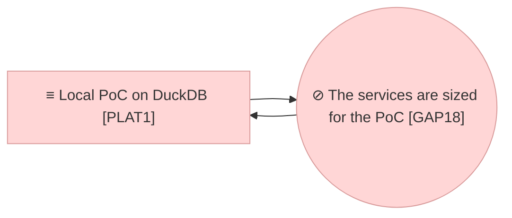

# Project Scope — Prepared for Real Content

_[← Scope index](./README.md) · [Model home](../README.md)_

**ArchiMate viewpoint:** Implementation & Migration.
**Delivered as:** branch `claude/metamodel-improvements-next-steps-aesadj`.
**Requester:** the product owner. **Agent:** the coding agent in this
repository. **Reviewer:** the product owner. **Baseline:** initiatives 1 to 15.
**Target plateau:** `PLAT1` extended. No plateau moves; the gap `GAP18` opens
and closes.

Three things stand between this repository and the day real content is loaded
into it, and none of them is the import itself. **The services are sized for the
PoC**: the store was measured at a hundred thousand elements (decisions 0016 to
0018) and the six services above it still read the whole model into one
request. **An attribute's group is free text**, so the first person to author a
metamodel makes a section nobody can see is a typo. And **one worked pack
cannot show that the engine is framework-agnostic** — whatever it assumes about
the higher-education metamodel simply looks like the engine working.

The Requester's instruction of 2026-09-20 opened the first and settled its
posture: `ASM6` holds while the repository moves from prototype to real work,
so the preparation is made now rather than when it is urgent. Reading the first
cut, the Requester corrected the figure — **the institution is not at a hundred
thousand elements; that is potential, and what the model should state is the
capacity that has been assessed** — and added the other two.

## Is `ASM6` wrong?

**No. It is true, and it had no horizon — which was the defect.**

| Reading | Verdict |
| ------- | ------- |
| **`ASM6` is wrong and must be corrected** | It is not wrong. The curriculum slice is about 4,600 elements, the sample is 47, and every answer `ASM6` justifies is sound at that size |
| **The institution's estate is a hundred thousand elements** | **What the first cut said, and it was wrong.** That figure is what the application was *measured to hold*, not what anybody has. Writing a capacity into the model as a forecast would have put a number in the Requester's mouth |
| **`ASM6` is right, so nothing changes** | It is right about today and silent about what happens next. An assessment read as permanent is how a PoC-sized answer survives into production unexamined |
| **`ASM6` states today's size and the capacity assessed above it** (chosen) | An assessment carries what is true *and how much room there is*. Restated, it keeps justifying the in-process graph now, names the figure the application has been measured to, and points at the one place that figure lives |

## EA alignment (assessed top-down before implementing)

**Depth 1 — Application**, as `AGENTS.md` declares. The change restates an
Assessment and adds one data object; it adds no Stakeholder, Driver, Goal or
Principle and reshapes no value stream, so it is an ordinary initiative at the
**Understanding** gate and not strategy discovery.

| Layer | Impact |
| ----- | ------ |
| 0_business-design | Not used — this is a Depth 1 application project. |
| 1_strategy | One assessment restated: `ASM6` **Content is small, and the assessed capacity is far above it**, with today's size, the measured figure, and the note that the figure is capacity and not a forecast. No stakeholder, driver, goal or principle changes. The second pack is evidence for `P5` and `G5`, which stand unchanged. See [1_motivation.md](../1_strategy/1_motivation.md). |
| 2_business | **No change.** The same roles, the same services, the same review before merge. What the application is sized for, and how an attribute is sectioned, are not business rules. |
| 3_information | One object added: `DOBJ1.7` **Attribute group**. `DOBJ1` now names it and says two packs ship; `DOBJ1.3` points at it; `DOBJ2`'s figure cell and the persistence note are made true. See [1_data-objects.md](../3_information/1_data-objects.md). |
| 4_application | `ASVC4` Graph query, `ASVC1` Metamodel management, `ASVC10` Model health and `ACMP3` Repository and graph services re-worded for what they now do. No service or component added: the declared capacity is a module the existing components read. See [1_application-services.md](../4_application/1_application-services.md) and [2_application-components.md](../4_application/2_application-components.md). |
| 5_technology | **No runtime changes.** One clause added to `NODE2`: the memory an app on the platform is given by default, which is what an in-process graph is measured against. See [1_runtime.md](../5_technology/1_runtime.md). |
| Transition | `GAP18` **The services are sized for the PoC, not for the assessed capacity**, derived from `ACMP3`, opened against `PLAT1` and `PLAT3` and closed by this initiative; roadmap step 1i. See [1_target-state.md](../6_transition/1_target-state.md) and [2_sequence.md](../6_transition/2_sequence.md). |

## Approvals

| Gate | Approved by | Date | What was approved |
| ---- | ----------- | ---- | ----------------- |
| **Understanding** | The product owner (the Requester), in the session | 2026-09-20 | The restated `ASM6` and the information-layer rows it holds up, presented with [1_motivation.md](../1_strategy/1_motivation.md), [1_data-objects.md](../3_information/1_data-objects.md), [1_application-services.md](../4_application/1_application-services.md), [2_application-components.md](../4_application/2_application-components.md), [1_target-state.md](../6_transition/1_target-state.md), decision [0019](../decisions/0019-the-size-the-application-declares.md) and this document. Granted with two corrections — the figure is assessed capacity and not the institution's estate — and with the attribute-group vocabulary and the second worked pack added to the scope |

## Plateaus

| Plateau | State |
| ------- | ----- |
| **Baseline** (before) | `PLAT1` as extended by initiatives 1 to 15. The store answers a traversal in milliseconds at a hundred thousand elements; above it, six call sites read every element and every relationship of the organisation into one request, and a trace the store answered in SQL still built the whole graph in memory first. Nothing declared what size the application was built for, so nothing could fail when it was exceeded. An attribute's group was free text. One pack shipped. |
| **Target** (delivered) | `PLAT1` extended: the capacity is declared in `src/ea/capacity.py`, read by every service that would otherwise read the model whole, shown on the Health page and on `ea health`, and held by the suite. No traversal builds the in-process graph, which is now built only below its own budget and refuses past it. An attribute names a group the version declares, edited from a list and read in the version's order. A second framework — the ArchiMate 3.2 core — ships as a pack and runs in an organisation of its own beside the first. |

## Design

**An assessment says what is true and how much room there is.** `ASM6` is
restated, not corrected: content *is* small today, and the store *has been
measured* at a hundred thousand elements and six hundred thousand
relationships. The row says both, and says in plain words that the second
figure is capacity and not a forecast of anybody's estate.

**The capacity is a number in one place.** `src/ea/capacity.py` holds two
figures, because they are not the same: what the **store** is assessed to hold
and answer, and the smaller size below which the **in-process graph** may be
built at all (20,000 elements — initiative 15 measured the whole graph at about
470 MB and seven seconds at the assessed capacity, against the 6 GB an app on
the platform is given, and a fifth of that is the most one request should spend
on a cache). Past it the graph is not built: `TooLargeToHold` is raised, and
every traversal answers from the store regardless. Decision
[0019](../decisions/0019-the-size-the-application-declares.md).

**The six whole-model reads, each with a verdict.**

| Where | Was | Now |
| ----- | --- | --- |
| `src/ea/services/graph.py` | the whole graph into networkx, forced by `_node()` on every traversal | Built only below its budget, and by nothing on a traversal path |
| `src/ea/services/metamodel.py` | every element and relationship, per compatibility check | Paged; the report keeps 2,000 issues and **counts** the rest, so `ok` and the summary stay true when it is cut |
| `src/ea/services/health.py` (freshness) | every element and relationship | Paged and folded into one row per source |
| `src/ea/services/health.py` (completeness) | every element | Paged and folded per type |
| `src/ea/services/target.py` | every element and relationship | Paged and filtered as the pages arrive; the listed rows capped at 5,000, and `summary()` counts every row rather than the capped list |
| `src/ea/agent/proposal.py` | every element, to match names against | **Declared deliberate**, and paged. A shortlist would change what it matches, and a proposal that silently misses one is worse than one that takes a moment |

**The traversal, unwrapped.** `GraphService._node()` built the whole in-process
graph, and `trace()` called it once for the centre and once per row — so the
walk decision 0016 put in the store was wrapped, before and after, by the
enumeration it replaced. Every answer now comes from the store: `_nodes()` reads
the elements a walk reached in one read per page, `edges_among()` reads the
relationships among them, and a neighbourhood is the same walk ignoring
direction (`TRACE_SQL_BOTH`, each edge read from both ends so the step still
joins on an indexed column). The graph cache is keyed by organisation **and**
branch: a copied organisation has the same counts as its source, so counts alone
could serve one organisation's graph to another.

**Attribute groups are a declared vocabulary.** A version declares its groups —
id, name, description, order — and an attribute names one by identifier. The
Metamodel screen has a fifth list to edit them and offers them in the attribute
grid's group cell rather than a text box, so a typo cannot be typed. What
arrives already written as a label (`group: Governance`, which is how the format
read before) resolves by name, and a group nothing declares is **added** to the
version rather than dropped — so a mistake is a visible, deletable row instead
of an invisible section. Deleting a group leaves its attributes ungrouped, the
same rule the other four lists follow.

**A second worked pack.** `packs/archimate_core/` is the ArchiMate 3.2 core:
six layers as domains, 28 element types, and the standard's eleven
relationships declared once against `ANY` rather than per pair of types. It
exists to test principle `P5` rather than to be used: a framework with different
layers, different types and a different relationship style, loaded by the same
engine, stored in the same tables, drawn by the same view generator, and applied
by an organisation of its own beside the default. The tests assert what a second
pack is for — that every type names a layer the view generator knows, that
identifiers mint, that content in the second framework is written and read by
the same services, and that neither organisation sees the other's rows.

## Work packages

| # | Work package | Delivers | State |
| - | ------------ | -------- | ----- |
| 1 | The model kept true | `ASM6`; `DOBJ1`, `DOBJ1.3`, `DOBJ1.7`, `DOBJ2` and the persistence note; `ASVC1`, `ASVC4`, `ASVC10`, `ACMP3`, `NODE2`; `GAP18` and roadmap step 1i; decision 0019; this document; `packs/README.md`, `AGENTS.md`, the front door | Built 2026-09-20 |
| 2 | The declared capacity | `src/ea/capacity.py`; the Health page's size panel; the size line on `ea health` | Built 2026-09-20 |
| 3 | The traversal unwrapped | `src/ea/services/graph.py`; `elements_by_ids` and `edges_among` on both engines; `TRACE_SQL_BOTH` in `src/ea/backend/sql.py`; the cache keyed by organisation | Built 2026-09-20 |
| 4 | The other five reads bounded | `src/ea/services/metamodel.py` (and `CompatibilityReport`'s counts), `health.py`, `target.py`, `src/ea/agent/proposal.py`; `offset` on `find_relationships` | Built 2026-09-20 |
| 5 | Attribute groups as a vocabulary | `AttributeGroup` in `src/ea/models.py`; `resolve_attribute_groups()` in the loader; `Registry.groups_in_order()`; `meta_attribute_group` in the store; the fifth list and the group select on the Metamodel page; the element page's order; the pack diff | Built 2026-09-20 |
| 6 | The second worked pack | `packs/archimate_core/metamodel.yaml`; `packs/README.md` | Built 2026-09-20 |
| 7 | The suite | `tests/test_capacity.py` (20), `tests/test_attribute_groups.py` (12), `tests/test_second_pack.py` (7); the updates to `test_element_page.py` and `test_metamodel_page.py` | Built 2026-09-20 |

## In scope / out of scope

| In scope | Out of scope (gaps, candidate future work) |
| -------- | ------------------------------------------- |
| `ASM6` restated with today's size and the assessed capacity | Changing any goal, principle, driver or stakeholder — none moves |
| One declared capacity the application reads, shows and tests | A configurable budget per deployment: one figure, in code, until a deployment needs otherwise |
| The six whole-model reads bounded or declared deliberate | Rewriting the graph layer: the in-process graph stays, below its budget |
| A traversal answered by the store without building the graph | Precomputing what each element reaches — decision 0016 already refused it |
| A declared vocabulary for attribute groups, edited and picked from a list | Grouping a **relationship's** attributes, which are still read as one list |
| A second worked pack in a different framework | A third, and any content in the second: `archimate_core` ships empty |
| The Health page showing the model's size against the capacity | Bounding what the Impact page *shows* once the answer is bounded |

## Gap notes

- **The graph's budget is adopted, not measured on this hardware.** 470 MB and
  seven seconds come from initiative 15's note; 20,000 elements is set below the
  platform's 6 GB default with room for the request. Nothing in the suite seeds
  a hundred thousand elements — the tests prove that no hot path *asks* for the
  whole model, which is the durable half; the figure itself still rests on one
  hand measurement.
- **The Impact page's tables stay unbounded.** Initiative 15 named this and it
  is still true: the diagram is capped at sixty nodes, the tables are not. This
  initiative bounds what is *asked* of the store, not what a page renders.
  Bounding the display raises its own usability question — how a reader is told
  an answer was cut — and belongs with the Requester.
- **The proposal matcher still reads every element.** Deliberately, and said so
  in the code: at the assessed capacity that is about 100,000 short strings, and
  bounding it by a candidate set would change what it finds.
- **The shipped pack changed under the same version, again.** The
  higher-education pack now declares its six attribute groups, and its version
  is the date of the source document (decision 0003), not a release number, so
  it was not moved. A store seeded from the older file refuses the new one as
  frozen, which is the lifecycle working: load it under a version of its own, or
  seed a fresh store. The same note stood for initiative 15.
- **A YAML comma was eating descriptions in both packs.** A `description:`
  inside a `{...}` flow mapping ends at the first comma, and the rest became a
  key the engine kept in `properties` without a word — the "keep what you do not
  understand" rule hiding a data defect. Five descriptions were affected across
  the two packs, one of them pre-existing in `higher_education`. All are quoted
  now and `tests/test_second_pack.py` fails a shipped pack that does it again.
  Nothing warns an **adopter** whose own pack does it; a loader warning would be
  its own small piece of work.
- **`ASM6`'s horizon is not a date.** "While this moves from prototype to real
  heavy work" is the Requester's phrase and is not something a validator can
  check. `GAP18` carried it; now that it is closed, the figures in
  `src/ea/capacity.py` and the tests around them are what a reader finds.
- **Nothing here has run on the platform.** As with initiatives 13, 14 and 15,
  the workspace run is still pending, and this initiative did not change that.
