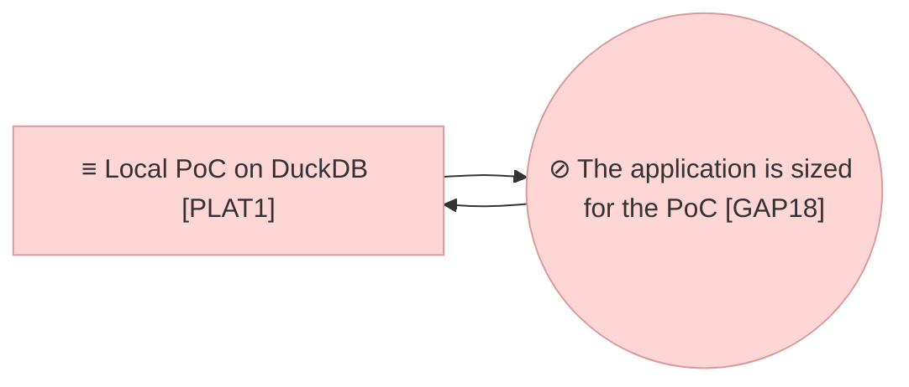

# Project Scope — The Size the Model Is Built For

_[← Scope index](./README.md) · [Model home](../README.md)_

**ArchiMate viewpoint:** Implementation & Migration.
**Delivered as:** branch `claude/metamodel-improvements-next-steps-aesadj`.
**Requester:** the product owner. **Agent:** the coding agent in this
repository. **Reviewer:** the product owner. **Baseline:** initiatives 1 to 15.
**Target plateau:** `PLAT1` extended. No plateau moves; the gap `GAP18` opens
and is closed in code by this initiative.

Initiative 15 left a note it could not act on: `ASM6` says content is small —
about 4,600 elements — and the answer it justifies is an in-process graph and
no traversal in the store. The Requester has since named a hundred thousand
elements and several hundred thousand relationships. The store was re-sized for
that figure on 2026-09-20 (decisions 0016, 0017 and 0018); **the services above
it were not**, and six of them still read the whole model into one request. The
Requester's instruction of 2026-09-20 settles the posture: `ASM6` stays true
for several months while the repository moves from prototype to real work, and
the preparation is made now rather than when it is urgent.

## Is `ASM6` wrong?

**No. It is true, and it has no horizon — which is the defect.** The question
decides what this initiative is, so the reasoning is recorded here rather than
left in the code.

| Reading | Verdict |
| ------- | ------- |
| **`ASM6` is wrong and must be corrected** | It is not wrong. The curriculum slice is about 4,600 elements, the sample is 47, and every answer `ASM6` justifies is sound at that size today |
| **`ASM6` is right, so nothing changes** | It is right about today and silent about the estate the Requester has named. An assessment read as permanent is how a PoC-sized answer survives into production unexamined |
| **`ASM6` is true until a stated size, after which it is not** (chosen) | An assessment carries what is true *and for how long*. Restated with a horizon, it keeps justifying the in-process graph now and names the figure at which it stops — so the answer is prepared against a number rather than rewritten under pressure |

The cost is one figure the code reads and a test that holds it; the risk is a
figure nobody revisits, which is the gap register's job to prevent.

## EA alignment (assessed top-down before implementing)

**Depth 1 — Application**, as `AGENTS.md` declares. The change restates an
Assessment; it adds no Stakeholder, Driver, Goal or Principle and reshapes no
value stream, so it is an ordinary initiative at the **Understanding** gate and
not strategy discovery.

| Layer | Impact |
| ----- | ------ |
| 0_business-design | Not used — this is a Depth 1 application project. |
| 1_strategy | One assessment restated: `ASM6` **Content is small today, and the estate is not**, with the horizon the Requester named and the answers it justifies until then. No stakeholder, driver, goal or principle changes; `ASM6` still influences `G3` and serves `G1`. See [1_motivation.md](../1_strategy/1_motivation.md). |
| 2_business | **No change.** The same roles, the same services, the same review before merge. What the application is sized for is not a business rule. |
| 3_information | **No object added or removed.** Two rows made true: `DOBJ2` carries the estate's figure beside the curriculum slice's, and the persistence note stops claiming that the whole institutional graph fits in memory. See [1_data-objects.md](../3_information/1_data-objects.md). |
| 4_application | `ASVC4` Graph query and `ACMP3` Repository and graph services re-worded: a traversal is answered by the store, and the in-process graph is built only below the declared size and named where it is still read whole. One component gains the declared budget it reads. See [1_application-services.md](../4_application/1_application-services.md) and [2_application-components.md](../4_application/2_application-components.md). |
| 5_technology | **No runtime changes.** One clause added to `NODE2`: the memory an app on the platform is given by default, which is what the in-process graph is measured against. See [1_runtime.md](../5_technology/1_runtime.md). |
| Transition | `GAP18` **The application is sized for the PoC, not for the estate** opened against `PLAT1`, derived from `ACMP3` — an element that exists and is right at 4,600 elements and wrong at the Requester's figure — and closed in code by this initiative. See [1_target-state.md](../6_transition/1_target-state.md) and [2_sequence.md](../6_transition/2_sequence.md). |

## Approvals

| Gate | Approved by | Date | What was approved |
| ---- | ----------- | ---- | ----------------- |

No gate has been granted yet. **Understanding** is presented with these
documents: [1_motivation.md](../1_strategy/1_motivation.md) (the restated
`ASM6`), [1_data-objects.md](../3_information/1_data-objects.md) (`DOBJ2` and
the persistence note),
[1_application-services.md](../4_application/1_application-services.md) and
[2_application-components.md](../4_application/2_application-components.md)
(`ASVC4`, `ACMP3`),
[1_target-state.md](../6_transition/1_target-state.md) (`GAP18`), decision
[0019](../decisions/0019-the-size-the-application-declares.md), and this
document. Every layer document stays `◐`; **no code is written before the
gate**.

## Plateaus

| Plateau | State |
| ------- | ----- |
| **Baseline** (before) | `PLAT1` as extended by initiatives 1 to 15. The store answers a traversal in milliseconds at a hundred thousand elements (decisions 0016 to 0018); above it, six call sites read every element and every relationship of the organisation into one request, and a trace that the store answered in SQL still builds the whole graph in memory first. Nothing declares what size the application is built for, so nothing can fail when it is exceeded. |
| **Target** (proposed) | `PLAT1` extended: the application declares the size it is built for, in one place, and reads it. Every whole-model read is either bounded or declared deliberate with its cost stated. A traversal no longer builds the in-process graph. The Health page shows the model's size against the declared figure, and the suite holds the figure with a seeded fixture, so the horizon is measured rather than remembered. |

## Design

**An assessment says what is true and for how long.** `ASM6` is restated, not
corrected: content *is* small today, and the estate the Requester named on
2026-09-20 — a hundred thousand elements and several hundred thousand
relationships — *is* the horizon. The row says both figures and which answers
the first one justifies until the second arrives. This is the whole point of
the initiative: everything below is what "until then" is made to mean.

**The size is a number in one place.** One declared figure the code reads, the
Health page shows and a test asserts, rather than a habit spread over six
modules. Two budgets, because they are not the same: what the **store** holds
and answers (the Requester's figure, already measured), and what the
**in-process graph** may be built for — smaller, because it is 470 MB and seven
seconds at the Requester's figure, against the 6 GB an app on the platform gets
by default. Above the graph's budget the application does not build it; it
answers from the store, or says what it cannot draw. Decision
[0019](../decisions/0019-the-size-the-application-declares.md).

**The whole-model reads are named, and each one gets a verdict.** Six call
sites read every element and relationship of the organisation into a request:

| Where | What it reads whole | Proposed |
| ----- | ------------------- | -------- |
| `src/ea/services/graph.py` | every element and every edge, into an in-process graph | Built only below the graph's budget; a traversal stops forcing it |
| `src/ea/services/metamodel.py` | every element and relationship, per compatibility check | Bounded: validated in batches, the report counting rather than keeping every issue |
| `src/ea/services/health.py` (freshness) | every element and relationship | Answered by the store as counts |
| `src/ea/services/health.py` (completeness) | every element | Answered by the store as counts |
| `src/ea/services/target.py` | every element and relationship | Bounded by work package, which is how the page already asks |
| `src/ea/agent/proposal.py` | every element, to match names against | Declared deliberate, bounded by the candidate set, and its cost stated |

**One of them is a plain defect.** `GraphService._node()` builds the whole
in-process graph, and `trace()` calls it once for the centre and once per row —
so the walk that decision 0016 put in the store is wrapped, before and after,
by the enumeration it replaced. At the PoC's size this costs milliseconds and
is invisible, which is why it survived. Fixing it is the single change that
makes decisions 0016 and 0017 true at the service layer.

**The horizon is measured, not asserted.** The figures behind decisions 0016 to
0018 were taken once by hand and are not in the repository, so nothing would
notice if a change undid them. A seeded scale fixture and a test that fails
when a hot path reads the model whole is what makes "prepared" still true in
six months.

## Work packages

| # | Work package | Delivers | State |
| - | ------------ | -------- | ----- |
| 1 | The assessment and the rows it holds up | `ASM6` restated; `DOBJ2` and the persistence note; `ASVC4`, `ACMP3`, `NODE2`; `GAP18` and its roadmap row; decision 0019; this document; the README's element count | Awaiting the gate |
| 2 | The declared size, in one place | The two budgets and the module that holds them; the Health page reading them | Awaiting the gate |
| 3 | The traversal unwrapped | `src/ea/services/graph.py`: `_node()` and `trace()` answered from the store, the in-process graph built only below its budget | Awaiting the gate |
| 4 | The other five reads bounded | `src/ea/services/metamodel.py`, `health.py`, `target.py`, `src/ea/agent/proposal.py` | Awaiting the gate |
| 5 | The horizon held by the suite | A seeded scale fixture; a test per bounded path; the scenarios | Awaiting the gate |

## In scope / out of scope

| In scope | Out of scope (gaps, candidate future work) |
| -------- | ------------------------------------------- |
| `ASM6` restated with the horizon the Requester named | Changing any goal, principle, driver or stakeholder — none of them moves |
| One declared size the application reads, shows and tests | A configurable budget per deployment: one figure, in code, until a deployment needs otherwise |
| The six whole-model reads bounded or declared deliberate | Rewriting the graph layer: the in-process graph stays, below its budget |
| A traversal answered by the store without building the graph | Precomputing what each element reaches — decision 0016 already refused it |
| A seeded scale fixture the suite runs | Running the fixture on every change: a scale run is on demand, like the browser round |
| The Health page showing the model's size against the budget | Bounding what the Impact page *shows* once the answer is bounded — the tables are still unbounded, and that is a screen change of its own |

## Gap notes

- **The graph's budget is a figure adopted, not measured on this hardware.**
  470 MB and seven seconds come from initiative 15's note; the budget is set
  below the platform's 6 GB default with room for the request. The scale
  fixture is what turns it into a measurement, and the figure moves when it
  does.
- **The Impact page's tables stay unbounded.** Initiative 15 named this and it
  is still true: the diagram is capped at sixty nodes, the tables are not. This
  initiative bounds what is *asked* of the store, not what a page renders.
  Bounding the display is a screen change with its own usability question — how
  a reader is told an answer was cut — and belongs with the Requester.
- **The proposal matcher stays a whole-model read.** Matching a proposed name
  against every element is what the service is for, and bounding it by a
  candidate set changes what it finds. It is declared deliberate with its cost
  stated rather than quietly capped.
- **`ASM6`'s horizon is a date nobody set.** "Several months" is the
  Requester's word and is not a trigger a validator can check. `GAP18` is what
  carries it: the roadmap is where a horizon is revisited, not a layer row.
- **Nothing here has run on the platform.** As with initiatives 13, 14 and 15,
  the workspace run is still pending, and this initiative does not change that.
