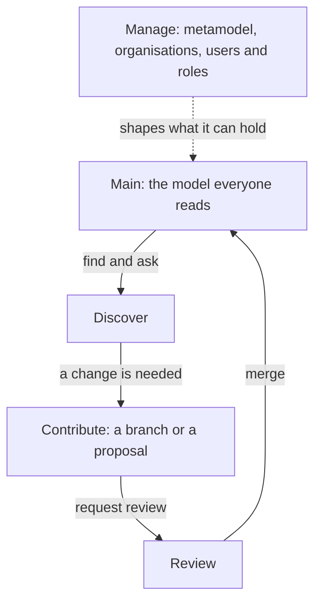

# Getting started

The repository holds the enterprise's architecture as a model: elements, such as
capabilities, processes, information and applications, and the relationships
between them. It answers questions at the level they are asked, from what
depends on a system to what a change touches. A change is made on a branch and
reviewed before it is merged into main, which is the model itself.

## The product in one picture

You read the model on main, and change it on a branch or through a proposal.
The change returns to main once reviewed, and Manage shapes what the model can hold.

## The navigation

| Group | Screens | For |
| ----- | ------- | --- |
| Home | **Home**, **Guide** | Where you start: what this organisation's model holds, and how to work in it |
| Discover | **Browse**, **Ask**, **Impact**, **Target state** | Finding elements, asking in words, seeing what depends on what, and what a work package changes |
| Contribute | **Branches**, **Import**, **Feeds**, **Propose** | Changing the model: on a branch, from files, from a source system's feed, or from a design handed in |
| Manage | **Metamodel**, **Organisations**, **Connected systems**, **Users and roles**, **Health** | Governing the model: what it can hold, the enterprises, what the assistant reads, who holds which role, and its health |

## Your first ten minutes

**Reader**

1. Open **Home** to see what the model holds, and click a type to list it in **Browse**.
2. Open an element from **Browse** to read what it relates to, both ways.
3. Ask a question in words on **Ask**, or see what depends on an element on **Impact**.

**Reviewer**

1. Read **Reviewer and steward** further down this Guide.
2. Open **Branches** and pick **In review** to see the branches waiting for a decision.
3. Press **Open** on a branch and read its changes. Press **Approve**, or write a comment and press **Send back**.

**Architect**

1. Press **New branch** on **Branches**, name it, and press **Create and switch**.
2. Change elements from **Browse** on your branch, or hand in a design on **Propose**.
3. Press **Request review** on **Branches** when the branch is ready.

**Admin**

1. Check which metamodel version this organisation applies, on **Metamodel** or **Organisations**.
2. Grant workspace groups their roles on **Users and roles**.
3. Assign reviewers to element types in the **Reviewers** tab of **Metamodel**.

## Help while you work

- The help button at the top right of every screen opens that screen's help in a
  side panel. The **?** key opens it too, unless you are typing in a box. **Escape**
  closes it.
- The first screen you open in a browser shows a short welcome under its title.
- After that, the first time you open a screen, one line under its title says
  what it is for. **Show me how** opens its help, **Got it** closes the line,
  and **Turn off tips** stops them all.
- The welcome and each tip show once, and this browser alone remembers them.
  **Show the welcome and tips again**, at the top of this Guide, brings them back.
- Every screen's help follows below, under **The screens**. **What belongs in the
  repository** and the pages for each role come after it.
