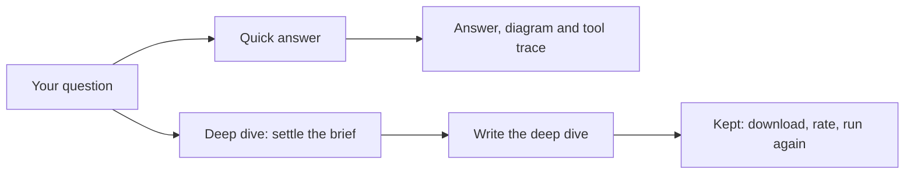

<!-- related: element impact browse -->
# Ask

> Ask a question in plain words, or have a deep dive written and kept for others to rate.

## Why

You often know the question but not which element to open or which relationship
to follow. Ask answers in plain words from the model, and shows how it found the
answer so you can check it. A deep dive goes further, with a written analysis
that colleagues can reuse and rate.

## What you see

- The **Quick answer** and **Deep dive** switch under the title, and a badge
  that says which provider answers.
- **Quick answer**: a question box with **Ask**, **Reset conversation** and the
  **Try:** examples. The answer is a document: diagrams, the **Answer**,
  **Elements in this answer** and **How this was answered**.
- The **Tool trace** under the answer, with each look-up and what it returned.
- **Deep dive**, on the **New deep dive** tab: **What do you need to know?** and
  **Start the brief**. Then **The brief** shows a card per question and
  **Write the deep dive**.
- **Deep dive**, on the **Kept deep dives** tab: filters, the list, and the deep
  dive you open. It shows its findings, **Download the pack**, **Run again** and its ratings.

## How

1. Pick **Quick answer** or **Deep dive** with the switch under the title.
2. For a quick answer, type your question or click an example, then press **Ask**.
3. Read the diagram, the **Answer** and **Elements in this answer**. Check the working under **How this was answered** and in the **Tool trace**.
4. Take the answer away with **Copy Markdown**, **Download Markdown** or **Download draw.io**.
5. For a deep dive, type what you need to know and press **Start the brief**. Answer each card with its **Answer** button, then press **Write the deep dive**.
6. On **Kept deep dives**, open one and press **Download the pack**. Give it one to five stars and a line of why, then press **Rate it**.

## The flow

A question becomes either a quick answer with its diagram and trace, or a brief
that becomes a kept deep dive.

## Tips

- Identifiers in the answer link to their elements. A yellow box lists any
  identifier that no look-up returned, so treat those as unverified.
- Unless the provider badge says stub, a follow-up question builds on the last
  answer. **Reset conversation** clears the answer and starts afresh.
- Answers and deep dives read the branch picked in the header. A kept deep dive
  is never edited: **Run again** keeps a new one from the same brief.
- Each person gives one rating, and **Clear my rating** takes yours back. Only
  its author or an admin may **Withdraw** a deep dive.
