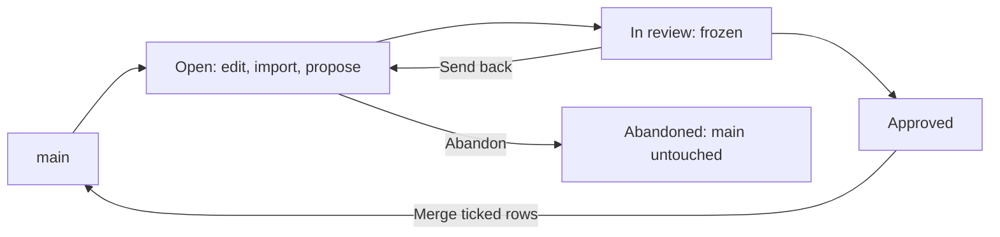

<!-- related: import propose target metamodel -->
# Branches

> Draft changes on a branch, have them reviewed, and merge them into main row by row.

## Why

Everyone reads main, the shared model, so nobody should change it by accident. A
branch is your own draft: you change it freely, reviewers approve it, and only a
merge moves it to main. Several people can work at once, each on their own
branch.

## What you see

- **New branch** beside the title, and a status filter: **Open**, **In
  review**, **Approved**, **Merged**, **Abandoned** and **All**.
- The list of branches, each with its status, rows, work package, author, date
  and an **Open** button.
- The chosen branch: its name, status and description, **Switch to this
  branch**, **Abandon**, and counts of rows added, changed, deleted and in conflict.
- **Review**: where the branch stands, each element type it touches with its
  reviewers and decision, and the buttons your role may use.
- The tabs **Changes**, **Proposals**, **What it touches** and **Drawn**.
  **Changes** holds the **Merge log** and **What each row changes**.

## How

1. Press **New branch**, give it a **Name**, say **What it is for**, and press **Create and switch**.
2. Make your changes on the branch: edit elements, load files on **Import**, or apply a proposal from **Propose**.
3. Open the branch here and press **Request review**. From then on nobody can edit the branch, unless a reviewer sends it back.
4. As a reviewer, read the tabs. Then check the types picked for you and press **Approve**, or type a comment and press **Send back**.
5. Once the branch is approved, tick rows in the **Merge log** and press **Merge ticked rows to main**.
6. To throw the work away instead, press **Abandon**. Main is not touched.

## The flow

You branch from main and edit; review freezes it, a send-back reopens it, and
once approved it merges into main, unless abandoned.

## Tips

- Rows without a conflict arrive ticked. A conflict arrives unticked, and you
  settle it in the **take** column or under **What each row changes**.
- Only ticked rows merge. The rest stay on the branch, and it closes once no
  rows are left.
- A reviewer approves only the element types assigned to them or their group,
  or types nobody is assigned to. Assignments live on the **Reviewers** tab of
  **Metamodel**. Nobody approves their own branch.
- **Send back** needs a comment and clears the approvals already given.
  **Abandon** acts at once, with no confirmation.
