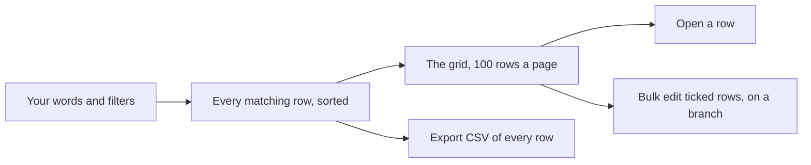

<!-- related: element health import branches -->
# Browse

> Find elements by words and filters, then open one, create one or change many at once.

## Why

A model soon holds more elements than fit on a screen. Browse narrows it to the
rows you meant, by words and by any field an element carries. The address keeps
the search, so you can send a colleague the same list.

## What you see

- **Export CSV**, **Bulk edit** and **New element** beside the title.
- The filter line: the element types (**All types**, each with its count), the
  **Search words…** box, **Any status** and **More filters**. The sort order
  (**Best match** at first), **Reverse** and a count of what matches follow.
- **Narrowed by**: a chip for every filter in force, and **clear all** to remove them.
- The **More filters** drawer holds **Current state**, **Target state**,
  **Work package**, **Source system**, **Lifecycle status**, **Attribute** and
  **is**, **Updated since** and **Columns**.
- The grid, 100 rows a page, with a pager beneath it. The **matched in** column
  shows the text your words matched, when they matched outside the name.

## How

1. Type words into **Search words…**. Every word has to match a name, identifier, key, description or attribute.
2. Narrow the list with the type and status choices, or open **More filters** for the rest.
3. Order the result with the sort order and **Reverse**, and use the pager to reach later pages.
4. Click a row to open that element's page.
5. To change the model, pick a branch in the header. Then press **New element**, or tick rows in the left-hand column and press **Bulk edit**.
6. Press **Export CSV** to download every row that matches, not only the page on screen.

## The flow

Your words and filters pick the rows, the grid shows 100 at a time, and you
open, bulk-edit or export them.

## Tips

- The address carries every filter, so a link or a bookmark reopens the same
  search. Your choice of **Columns** is not kept.
- The column headers do not sort or filter, because the grid holds one page.
  The sort order and the filters act on the whole result.
- **Export CSV** stops at the application's row limit, so a very large result
  may be cut short.
- In **Bulk edit**, a field left empty is not touched. Each ticked row still on
  screen is changed on its own, so one refusal does not stop the others.
