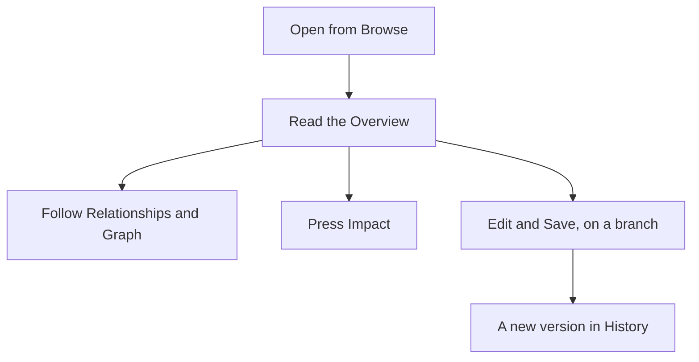

<!-- related: browse impact target ask -->
# Element

> Read everything the model holds about one element, and change it when you are on a branch.

## Why

An element is only useful when you can see it whole: what it is, its state and
what it connects to. This page gathers all of it in one place. On a branch, it
is also where you change the element and link it to others.

## What you see

- The header: the element's name, badges for its type, status and states, its
  identifier and version, and an **Impact** button.
- **Overview**: the **Description**, the **Attributes** with **Links** and
  **Type**, the **State** card and the **Deep dives** that cite the element.
- **Edit**: the name, key, status, description, links, state and the type's own
  attributes, with **Common attributes** folded away and **Save** at the foot.
- **Relationships**, with its count: **Add a relationship**, then the
  **Outgoing** and **Incoming** tables.
- **Graph**: a **Depth** slider, a network graph and a generated architecture
  view with **Download Markdown** and **Download draw.io**.
- **History**: the last 50 changes, with when, who, the operation and the version.

## How

1. Read the header and the **Overview** tab to learn what the element is and what state it is in.
2. Open **Relationships** to see what it points to (**Outgoing**) and what points to it (**Incoming**). Click a name to move to that element.
3. Open **Graph** and raise **Depth** to reach up to three steps out. Take the view away with **Download Markdown** or **Download draw.io**.
4. Press **Impact** to see what depends on the element, and what it depends on.
5. To change the element, pick a branch in the header, edit the **Edit** tab and press **Save**.
6. To link it, use **Add a relationship**: pick a direction, **The other element** and a **Relationship**, then press **Add**.

## The flow

You open an element and read it, then follow its relationships, check its
impact, or edit it on a branch to add a version.

## Tips

- If someone saved the element after you opened it, **Save** refuses. Reload
  the page and make your change again.
- Only web addresses starting http, https or mailto are kept as links. After
  **Save**, a warning names up to five lines that were not kept.
- **Relationship** offers only what the metamodel allows in that direction, and
  for that pair once you pick **The other element**. **Qualifier** stays off unless the chosen relationship declares qualifiers.
- On the generated view, Ctrl-drag (Command on a Mac) moves a shape. Nothing is
  saved, but **Download draw.io** follows your arrangement, and **Reset layout** undoes it.
