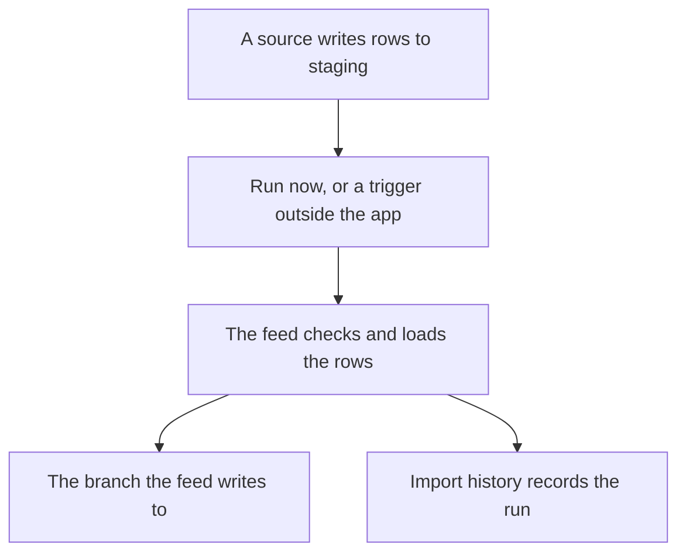

<!-- related: import branches health browse -->
# Feeds

> Load the rows another system leaves in staging tables, and see how every import went.

## Why

Some content arrives again and again from another system. Exporting and uploading a
file by hand each time is slow and easy to forget. A feed loads that system's rows with
the same checks as an uploaded file, and the history shows how every load went.

## What you see

- A note naming the time zone the page uses. It also says the page shows a schedule
  but does not fire one.
- **New feed**, and a card for each feed. A card shows the feed's name, a badge with
  the branch it writes to, the tables it reads, its schedule and its last run.
- **Run now**, **Edit** and **Delete** on every card. An architect may run a feed, but only an
  admin may set one up, change it or delete it.
- The **Configure a feed** dialog: **Name**, **Source system**, **Staging tables**,
  **Writes to**, **Schedule**, **Timezone** and **Mapping (YAML)**. Two tick boxes,
  **Empty the staging tables once they are loaded** and **Enabled**, sit above **Save**.
- **Import history**: every import, newest first, ten to a page, with **Newer** and
  **Older**. Open a run to see what it read, what it changed and its issues.

## How

1. Press **New feed**, then fill in **Name** and **Source system**.
2. Name at least one staging table: **Elements table**, **Relationships table** or **Links table**.
3. Type a branch id in **Writes to**, so the rows are reviewed before they reach main.
4. Pick the **Schedule** and **Timezone**, then press **Save**. Leave **Mapping (YAML)** empty unless the source uses its own column names, type names or identifiers.
5. Press **Run now** on the feed's card to load it straight away, and read the report that appears.
6. Open a run under **Import history** to see what it read, what it changed and any issues it raised.

## The flow

A source leaves rows in staging, a run loads them onto the feed's branch or main, and the
history records the run.

## Tips

- Saving a schedule runs nothing by itself. A trigger outside the application has to
  honour it, and **Run now** loads the feed straight away.
- A run always writes to the feed's own branch, whoever presses **Run now**. An orange
  badge marks main, where rows land without review. Only an admin may load onto main.
- The staging tables are emptied only when
  **Empty the staging tables once they are loaded** is ticked and the load had no
  errors. Rows left there are read again on the next run, and
  loading the same rows twice changes nothing new.
- The history also holds files uploaded on **Import** and loads from the command line.
  Deleting a feed keeps its runs and everything it loaded.
