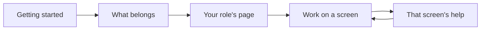

<!-- related: home propose metamodel -->
# Guide

> Learn what the repository is for, how each screen works, and how each role works in it.

## Why

A new tool is hard to trust until you know what it is for and how the work
flows. The Guide puts that in one place: what belongs in the model, how each
screen is used and how each role works. You learn the method before you need a
button.

## What you see

- **Getting started**: the product in one picture, the navigation's four
  groups, and a first ten minutes for each role.
- **The screens**: every screen's help, the same text the help button beside a
  screen's title opens.
- **What belongs in the repository**: the boundary of the model, how a change is
  settled, and the words the application uses.
- A card in it lists this organisation's element types, read from its metamodel:
  **At the enterprise level**, and **Below it: linked from the system, not modelled**.
- A page for each role: **Enterprise architect**, **Solution architect**,
  **Reviewer and steward**, **Reader** and **Metamodel owner**.
- A button that shows the welcome and the screens' tips again.

## How

1. Read **Getting started** first if the repository is new to you.
2. Read **What belongs in the repository** before you add anything to the model.
3. Go to the page for your role, and follow its steps when you start real work.
4. Look up a screen under **The screens** when you want its help in full.
5. Press the button to see the welcome and the tips again, if you turned them off.

## The flow

You start with Getting started, read what belongs and your role's page, then
open a screen's help whenever you work on that screen.

## Tips

- The card of element types is read from the organisation's metamodel as the
  page opens. It differs between organisations, and changes when another version
  is applied.
- **Propose** links straight to the boundary on this page, for when you are
  unsure that something belongs in the model.
- What you closed is remembered in this browser only. Another browser, or cleared
  site data, shows the welcome again.
