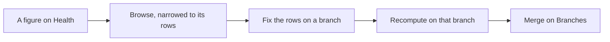

<!-- related: browse element branches feeds -->
# Health

> Find where the model is out of date or incomplete, and open the rows that need fixing.

## Why

People trust a model only while it stays current and filled in. Health shows where
content has gone stale or is missing something. Every number opens the rows behind it,
so you can go straight to fixing them.

## What you see

- **Recompute**, beside the title, works the figures out again without reloading the page.
- **Size**: two gauges, for elements and relationships, against the size the
  application has been assessed for.
- **Freshness**: a row per source system, with **first loaded**, **last updated**, the
  elements not updated for 30, 90 or 180 days, and those **never updated**.
  Content with no source system is counted as **(authored)**.
- **Change activity, last 12 weeks**: a bar for each week's changes on this branch.
- **Completeness**: for each element type, the share with a **Description**, a **Link**,
  a **Relationship**, its **Required attributes** filled and its **Target decided**.
- **Relationship types with no instance**: types the metamodel declares that no
  content uses yet.

## How

1. Glance at **Size** to see how close the model is to what the application is assessed for.
2. In **Freshness**, read each source's **last updated** date and its stale counts.
3. Click a count to open those elements in **Browse**.
4. In **Completeness**, look for yellow or red bars, and click the **missing** count under one.
5. Fix the elements on a branch, in **Browse** or on each element's page, then merge the branch on **Branches**.
6. Press **Recompute** to see the figures change.

## The flow

A figure opens its rows in **Browse**; you fix them on a branch, check the figure with
**Recompute**, and merge the branch.

## Tips

- The figures follow the branch and the organisation in the header. Switch to main
  to see the model everyone reads.
- The link behind each number carries its filter in the address, so you can bookmark
  or share the rows it opens.
- A completeness bar is green from 90%, yellow from 60% and red below that.
- Fix what a source system feeds at the source, or its next feed undoes your correction.
