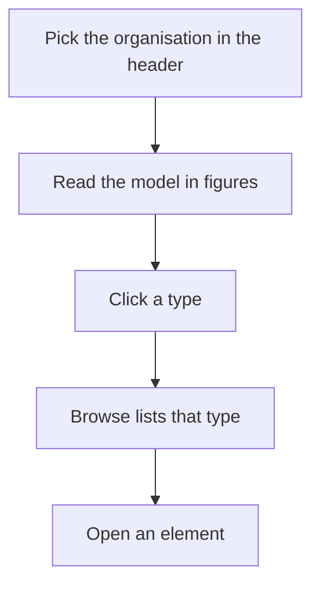

<!-- related: browse target branches guide -->
# Home

> See what this organisation's model holds, by type and by relationship, before you search it.

## Why

Before you search, you need to know what the model holds and how big it is. Home
answers that at a glance for the organisation you are in. You see which kinds of
things it describes and how they connect, so you know where to start.

## What you see

- The title is the organisation's name. The line under it names the metamodel
  version it applies, and that version's status.
- Six figures: **elements**, **relationships**, **element types with content**,
  **relationship types with content**, **open branches** and **elements that change**.
- **Elements by type**: each type with its domain and its count. A type the
  metamodel has switched off carries an **inactive** badge.
- **Most used relationships**: the relationship types used most, at most 15,
  with the types each runs from and to.

## How

1. Check the title and the line under it to confirm the organisation and its metamodel version.
2. Read the six figures for the model's size, its open branches and the elements set to change.
3. Scan **Elements by type** to see which kinds of things the model describes.
4. Click a type's name to open **Browse** with every element of that type.
5. Read **Most used relationships** to see how the types usually connect.

## The flow

You pick the organisation, read what its model holds, click a type to list it in
Browse, and open an element from there.

## Tips

- The figures follow the organisation and the branch chosen in the header. On a
  branch, they count the model as that branch has it.
- **elements that change** counts elements whose target state is new, change,
  decommission or merge.
- Types with nothing in them are left out of both tables. An empty organisation
  says so, and points you to **Import**.
- Nothing on Home changes the model, and every role sees the same page.
