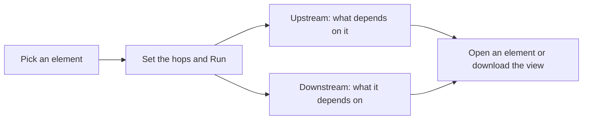

<!-- related: element browse target branches -->
# Impact

> Trace what depends on an element and what it depends on, before anyone changes it.

## Why

Changing, replacing or retiring something can break whatever relies on it.
Impact follows the model's relationships both ways from one element, so you see
the knock-on effects first. It also says how complete that picture is, so a
short list is not mistaken for a safe change.

## What you see

- The **Search an element…** box, a number box for how many hops to follow (1
  to 6, 3 at first) and **Run**.
- A summary: the element's name and type, an **open** link to its page, the
  counts by type, and **How complete is this answer?**.
- Two tables, **Depends on this (upstream)** and **This depends on
  (downstream)**, with the columns hops, element, type and via.
- A network graph of the neighbours up to two hops away, grouped by layer at
  first. Controls set the grouping and the layout, with **Fit**, zoom and full
  screen.
- **Architecture view**: the result drawn as a generated diagram, with
  **Download Markdown** and **Download draw.io**.

## How

1. Type at least two letters in **Search an element…** and pick the element. The analysis runs straight away.
2. Change the number of hops, from 1 to 6, and press **Run** to follow the relationships that far.
3. Read **How complete is this answer?**, then the two tables. The via column names the relationship types along the path to each row.
4. In the graph, change the grouping or the layout, and tap a node to open that element's page.
5. Take the diagram away with **Download Markdown** or **Download draw.io** under **Architecture view**.

## The flow

You pick an element and a depth, the page follows relationships into it and out
of it, and you open or download what it finds.

## Tips

- The **Impact** button on an element's page opens this screen with that
  element already traced to three hops.
- Each element appears once in a table, at its shortest distance, with one
  path rather than every path. Retired relationships are not followed.
- A yellow **How complete is this answer?** box names relationship types with
  nothing in them yet. An empty table may then mean missing content, not no
  dependents.
- The page reads the branch chosen in the header, so you can trace a change
  drafted on a branch before it is merged.
