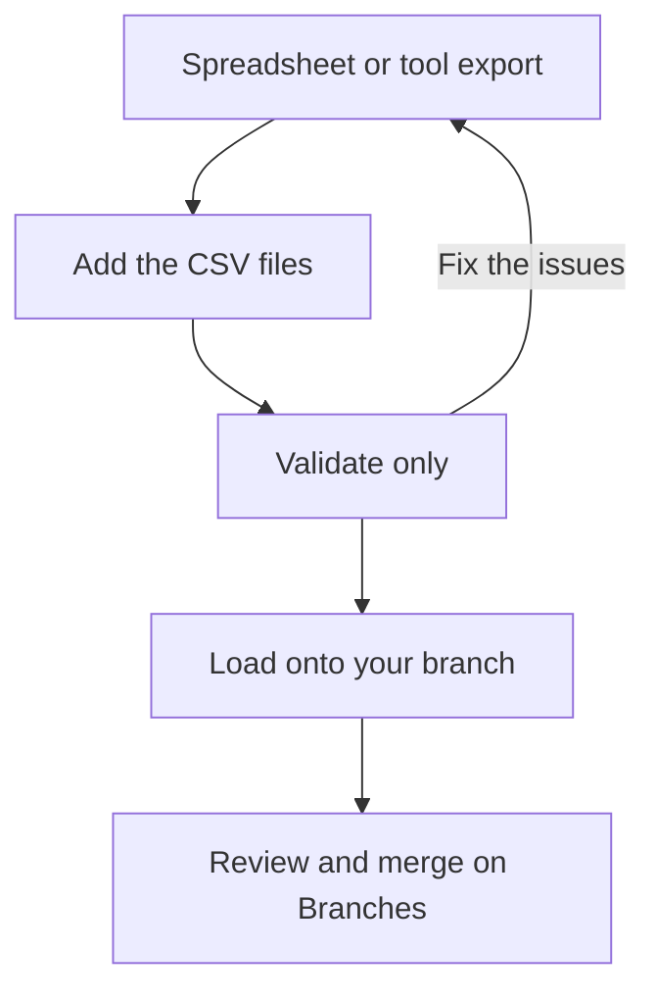

<!-- related: branches feeds browse metamodel -->
# Import

> Load CSV files onto a branch, after checking every row against the metamodel.

## Why

Most architecture content already sits in a spreadsheet or another tool's
export. Import brings it in as CSV files and checks every row against the
metamodel before anything is written. It loads onto a branch, so the change can
be reviewed before it reaches main.

## What you see

- A note naming the branch you are on. On main, it asks you to switch to a
  branch first.
- **1 · Set up the import**: **Source system**, the **Mapping** list, the
  **…or upload your own mapping YAML** link, **Download template** and
  **Download current content**.
- **2 · Add the files**: a drop zone, the files added with their row counts
  and a bin for each, **Validate only** and **Load**.
- The report after each run: a summary of the rows read, loaded and skipped.
  Then **Issues**, each with its level, code, message, file, row and entity.

## How

1. Pick a branch in the header, or create one. **Load** is off on main.
2. Set **Source system** to where the files come from, and choose a **Mapping**. Choose **No mapping (CSV contract)** for files made from the template.
3. Press **Download template** for example files, or **Download current content** to edit what is already there.
4. Drop your CSV files on the drop zone, or click it to choose them.
5. Press **Validate only**, read the **Issues**, fix your files and validate again.
6. Press **Load**, then have the branch reviewed and merged on **Branches**.

## The flow

You add files from a spreadsheet or tool, validate and fix them, load them onto
your branch, and merge it after review.

## Tips

- Without a mapping, a file's name must end in .csv and contain element,
  relationship or link. Any other file is ignored.
- Loading the same rows again updates them rather than adding copies. So you can
  edit **Download current content** in a spreadsheet and load it back.
- Anyone may press **Validate only**, which writes nothing. Only an architect or
  an admin may **Load**, and each load is kept as a run on **Feeds**.
- The files you add are held by this page only, and leaving it clears them.
