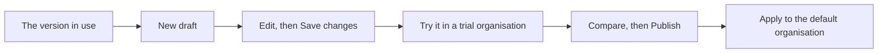

<!-- related: organisations branches propose -->
# Metamodel

> Read which types, relationships and attributes the model may hold, and change them safely in versions.

## Why

The metamodel says which kinds of element you may record, how they may connect and
which fields each carries. Every import, edit and proposal is checked against it.
It changes in versions, so a change never quietly breaks content that was already valid.

## What you see

- **Showing version**, at the top right, picks the version the page shows. The line
  under the title gives its state, whether your organisation applies it, and its counts.
- **Manage**: the five lists a version is made of, as **Domains**, **Element types**,
  **Relationship types**, **Attributes** and **Attribute groups**. Each is a grid with
  its own add and delete buttons.
- Under the lists: **Save changes**, which reads **Save as a new draft…** when the version
  is not a draft, then **Export YAML** and **Load YAML file…**.
- **Graph** draws the types as a network. **Architecture view** draws them in the
  metamodel's own notation, with **Download Markdown**, **Download draw.io** and
  **Shape library (draw.io)**.
- **Notation**: how each domain and element type is drawn, with a **Preview** that
  follows every edit.
- **Versions** lists every stored version, its state and who applies it, with
  **Compare two versions** below. **Reviewers** says who reviews a branch that touches each type.

## How

1. On **Versions**, press **New draft** on the version your organisation applies. The draft opens on **Manage**.
2. Pick a list, and double-click a cell to edit it. Add a row with **Add type** or the list's own add button.
3. Tick rows and press the list's delete button to take them out, then press **Save changes**.
4. On **Versions**, press **Apply a version to an organisation…**. It opens **Organisations** with the draft picked, to try on a copy.
5. Use **Compare two versions** to read what the draft changes, then press **Publish** to freeze it.
6. Apply the published version to the default organisation on **Organisations**. Press **Retire** on the old version once nobody applies it.

## The flow

You copy the version in use into a draft, edit and try it, then publish it and apply it
to the default organisation.

## Tips

- Nothing on **Manage** or **Notation** is stored until you press **Save changes** or
  **Save as a new draft…**. Leaving the page without saving puts deleted rows back.
- Deleting a type also takes out the relationship types that end at it, and its
  attributes. To keep existing content readable, set the type's active cell to false instead.
- **Load YAML file…** stores the file as the version it names. It also applies that
  version to your organisation when the check finds no errors.
- **Reviewers** always lists the active types of the version your organisation applies,
  whatever version the other tabs show. A type with nobody assigned may be approved by any reviewer.
