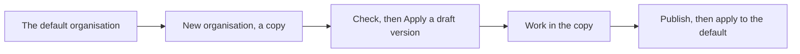

<!-- related: metamodel branches import -->
# Organisations

> Switch between the enterprises this store holds, and try a metamodel version on a copy first.

## Why

One store can hold several enterprises, each with its own content, branches and
metamodel version. This screen shows which is which and lets you move between them.
It also lets an admin try a new metamodel version on a copy of the content before
everyone gets it.

## What you see

- A table of organisations. A **default** badge marks the one the application opens,
  and **you are here** marks the one you are in.
- For each organisation: the metamodel version it **applies**, its elements,
  relationships and open branches, and what it is about.
- **Switch to**, **Make default** and **Delete** on every row.
- **New organisation**: **Name**, **What it is for**, **Metamodel version it applies**,
  **Copy the content of** and a **Create** button.
- **Start from a metamodel that ships**: a **Metamodel** picker,
  **Name the new organisation** and a **Start** button, which makes a new, empty organisation.
- **Apply a metamodel version**: **Organisation**, **Version**,
  **Apply even when the check finds errors**, and the **Check** and **Apply** buttons.

## How

1. Under **New organisation**, type a **Name** and say **What it is for**.
2. Leave **Copy the content of** on the default organisation, and press **Create**.
3. Under **Apply a metamodel version**, pick the new **Organisation** and the draft **Version**, then press **Check**.
4. Read what the version would leave invalid, then press **Apply**.
5. Press **Switch to** on the new row, and work there on its main.
6. Once the draft is published on **Metamodel**, check and apply it to the default organisation too.

## The flow

You copy the default organisation, apply a draft version to the copy and work there,
then publish the version and apply it to the default.

## Tips

- Switching organisation puts you on its main, because a branch belongs to the
  organisation it was opened in.
- A copy takes the elements, relationships and links on main, the reviewer
  assignments and the proposal templates. Branches, reviews and proposals stay behind.
- **Check** changes nothing, and anyone may press it. Errors stop **Apply** unless you
  tick **Apply even when the check finds errors**; warnings never do.
- **Delete** is turned off for the default organisation and the one you are in. It
  removes that organisation's content, branches, reviews and proposals for good.
