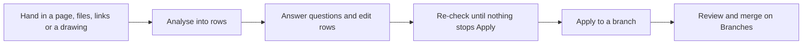

<!-- related: branches target metamodel guide -->
# Propose

> Turn a design page, files, links or a drawing into rows you check and apply to a branch.

## Why

Architects describe a change in a design document or a drawing, not one element at a
time. Propose reads what you hand in into a draft of elements and relationships. It asks
about what it cannot settle, and nothing is written until you apply it to a branch.

## What you see

- A badge beside the title names the reader. **reader: stub** reads template tables by
  rules alone; a hosted model also reads free text.
- **Your drafts, kept between sittings**, with **Resume** and **Discard**, once you have a draft.
- **1 · Where it lands**: **Branch**, **Work package**, **Template**,
  **Download template** and **Load example**.
- **2 · The proposal**: the **Paste the proposal** editor, a drop zone for files or a
  draw.io drawing, **Links (one per line)** and **Analyse**.
- After **Analyse**: counts of new and linked elements, a list of what stops Apply, and
  the **Conversation** with its open questions.
- Three tabs: **Rows**, with editable Elements and Relationships grids;
  **What it touches**, the impact on main; and **Drawn**, the change as a diagram.

## How

1. Pick a **Branch** and a **Work package** under **1 · Where it lands**. Leave **Branch** empty to create one named after the proposal.
2. Paste your page into **Paste the proposal**, drop files or a drawing, or list **Links (one per line)**. Then press **Analyse**.
3. Answer each question in the **Conversation**: pick a choice and press **Answer**, or type in **Tell the assistant** and press **Send**.
4. Correct any cell in the **Rows** tab, and untick a row to leave it out.
5. Press **Re-check rows** until the alert turns green, and read **What it touches** and **Drawn**.
6. Press **Apply to branch**, then follow **Review and merge on the Branches page**.

## The flow

You hand in a design, analyse it into rows, settle what is unclear, re-check, apply it to
a branch and have it reviewed on **Branches**.

## Tips

- With **reader: stub**, no model is configured, so **Tell the assistant** is turned off.
  Template tables still work, and **Load example** shows the shape they take.
- Your draft is kept each time you press **Analyse**, answer a question or press
  **Re-check rows**. **Resume** brings back the draft and its conversation.
- **What it touches** is read from main and never stops Apply. Its tab label warns
  when the change leaves relationships pointing at an element being retired.
- In a draw.io drawing, moving or resizing a shape changes nothing. A drawing
  exported from another organisation is refused.
