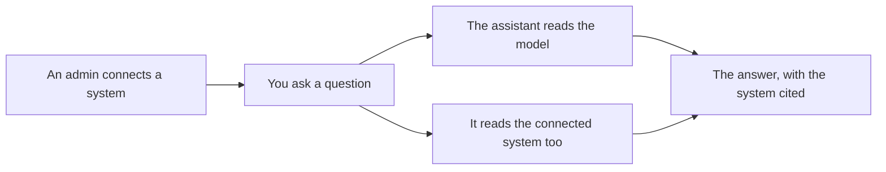

<!-- related: ask propose organisations -->
# Connected systems

> See which other systems the assistant may read when it answers, and as whom it reads them.

## Why

The model is not the only place the enterprise writes things down. Other systems
hold facts the assistant can cite when it answers. This screen shows which systems
it may read, so you know what an answer may have consulted.

## What you see

- A card for each connected system, with its name and an **on** or **off** badge.
  A system that is **off** is kept but not read for any answer.
- On each card: **Where** it answers, how it is **Read**, the
  **Tools the assistant may call**, what it **Speaks for** and the **Pages it reads**.
- For an admin, a **Disconnect** button on each card.
- For an admin, **Connect a system**: a form for the system's name, address, tools,
  element types and how it is read, with a **Connect** button.
- For anyone else, a note that connecting a system is an admin's decision.

## How

1. Read the cards to see which systems an answer may consult, and how each is read.
2. As an admin, pick one under **A connection registered in the workspace** to fill **Name** and **Where it answers the protocol**, or type them.
3. List the **Tools the assistant may call**, separated by commas, and pick the **Element types it masters**.
4. If elements link to this system's pages, fill **Pages it answers for** and **The tool that reads a page**.
5. Choose how it is **Read**. For a credential or the application's identity, name the roles under **Read with the credential or as the application for**.
6. Press **Connect**. The assistant may read the system from the next answer.

## The flow

Once an admin connects a system, the assistant may read it beside the model, and the
answer names the system for what it said.

## Tips

- List only tools that read, because the assistant is given exactly the tools you list.
  Nothing a system says is ever written into the model.
- Never put a secret into **What the page tool is given**. A value that looks like
  one is refused; read the system with the organisation's credential instead.
- **Disconnect** acts at once, without asking you to confirm.
- One answer makes at most eight calls to connected systems. A read that takes
  longer than 20 seconds is left out, and the answer goes on without it.
