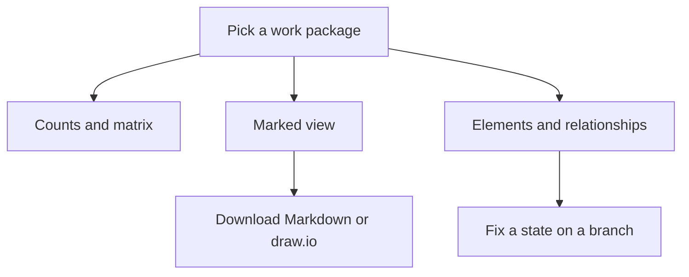

<!-- related: element browse branches propose -->
# Target state

> Compare what is true today with what is intended, for one work package or for all of them.

## Why

Architecture work moves the model from what exists today to what is intended.
This screen sets the two side by side for every element and relationship, per
work package, the piece of work that delivers a change. You see at a glance what
it adds, changes, decommissions or merges, and what is still undecided.

## What you see

- **Branches** beside the title, the work package picker (**All work packages**
  or one package) and the **Only what changes** switch.
- A badge counting the elements in each target state, and a line counting the
  elements, the relationships and the elements that change.
- **Current state by target state**: how many elements sit in each pair of what
  is true today and what is intended.
- **Architecture view, marked**: the scope drawn with a marker on each change,
  with **Download Markdown** and **Download draw.io**.
- **Elements** and **Relationships**: each row's current and target state and
  its note. With all work packages shown, each row names its work package too.

## How

1. Pick a work package, or leave **All work packages** to see every planned change.
2. Turn **Only what changes** on to hide the rows whose target is Keep or Undecided.
3. Read the count badges and the **Current state by target state** matrix for the size of the change.
4. Read the markers on **Architecture view, marked**: + new, Δ change, × decommission, ⇒ merge and ◌ not yet real.
5. Check the **Elements** and **Relationships** tables, and click a name to open that element.
6. To correct a state, pick a branch in the header, open the element and change it on its **Edit** tab.

## The flow

You pick a work package, read its counts, marked view and tables, then download
the view or fix a state on a branch.

## Tips

- The address follows the picker, so a link or a bookmark reopens the same work
  package.
- Picking one work package turns **Only what changes** off, so you see
  everything it touches. **All work packages** turns it on again.
- The counts and the matrix cover every row. The tables stop at 5,000 rows, and
  the diagram at 60 shapes.
- The page reads the branch chosen in the header, so a state changed on a branch
  shows here before it is merged.
