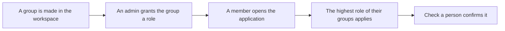

<!-- related: metamodel branches organisations -->
# Users and roles

> Give workspace groups a role in the application, and see why a person holds the role they have.

## Why

A person's role decides what they may do here: read, review, draft or
administer. This screen lets an admin give a team its role in a minute, without
redeploying the application. Everyone else sees their own role and where it
comes from.

## What you see

- **Grant a role**, for an admin: a picker that searches the workspace's groups
  as you type. It also holds the role, **Reviewer**, **Architect** or **Admin**, a
  **Why** line and a **Grant** button.
- **Grants**: the deployment's own grants first, read-only. The grants made here
  follow, with who granted each, when and why, and a **Remove** button.
- **Check a person**: an e-mail and a **Check** button, which show the role that
  person gets and the group that gives it.
- **Recent changes**: who granted or removed which role, and when.
- A link to the **Reviewers** tab of **Metamodel**, where reviewers are assigned
  to element types.
- If you are not an admin: your own role, the group that gives it, and whom to
  ask for another.

## How

1. Type part of a group's name under **Grant a role**, and pick the group from the list.
2. Choose **Reviewer**, **Architect** or **Admin**, and say why in **Why**.
3. Press **Grant**. The grant joins the grants made here, under **Grants**.
4. Press **Remove** on a grant that no longer holds.
5. Type a person's e-mail under **Check a person** and press **Check** to confirm their role.

## The flow

A group is made in the workspace and granted a role here; each member gets the
highest role their groups give.

## Tips

- A person's role is the highest that any of their groups gives. A person in no
  granted group is a Reader. Granting a group again replaces its role.
- A grant is felt within a minute. A change to who is in a group can take five
  minutes.
- You cannot remove or lower your own Admin, nor remove the last admin grant.
  The workspace's all-users group cannot be granted Admin.
- Creating groups and changing who is in them happens in Databricks. When the
  groups cannot be searched, you can type an exact name, marked *not checked*.
