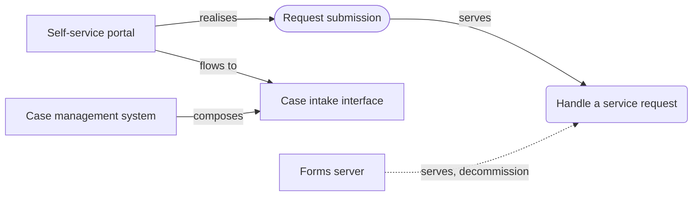

---
proposal_template:
  name: ArchiMate change proposal
  # The metamodel this template is typed in, by its identifier: the ArchiMate Core.
  metamodel: mm_j20ftrptcdf8h0za
  description: >-
    A change to the architecture, layer by layer in ArchiMate 3.2 core terms: why it is made,
    what it adds, changes and retires in the business, application and technology layers,
    how it is delivered, and how the pieces relate.
  # Headings and column headers are read against the metamodel's own names. A table under
  # "Application components" holds application components; a column headed "Owner" fills the
  # owner attribute. Declare below only what this template names differently, for example:
  # sections:
  #   Systems: Application component
  # columns:
  #   Business owner: owner
---

# Proposal: <title of the change>

> **How to use this template.** Fill in the tables that apply and delete the
> sections that do not. Keep one row per element and one row per relationship:
> the tables are what the repository reads, and the heading a table sits under
> says what type its rows are. Where an element already exists, put its
> identifier in *Existing id* and keep the description short; where it is new,
> describe it in at least one full sentence. *Current state* is one of
> `proposed`, `planned`, `in_implementation`, `live`, `retired`,
> `non_existent`; *Target state* is one of `keep`, `new`, `change`,
> `decommission`, `merge`, `undecided`. The rows below are a worked example;
> replace them. Delete this note before sharing.

| | |
| --- | --- |
| **Work package** | `WP-…` (an existing work package id) or the name of a new one |
| **Proposed by** | name, role |
| **Date** | YYYY-MM-DD |
| **Status of this proposal** | draft · for review · approved |
| **Branch** | leave blank; the repository names it when the proposal is applied |

## Summary

Two to five sentences: what changes, for whom, and why now. Name the goals the
change serves and the capabilities it affects.

## Motivation

Why the change is made. Keep to what a reviewer needs to judge it.

### Drivers

| Name | Existing id | Description | Current state | Target state | Note |
| ---- | ----------- | ----------- | ------------- | ------------ | ---- |
| Paper requests are slow | | Service requests arrive on paper forms and take about ten working days to reach a case handler. | live | change | |

### Goals

| Name | Existing id | Description | Current state | Target state | Note |
| ---- | ----------- | ----------- | ------------- | ------------ | ---- |
| Requests handled in two days | | A service request reaches a case handler within two working days of being made. | proposed | new | |

### Requirements

| Name | Existing id | Description | Current state | Target state | Note |
| ---- | ----------- | ----------- | ------------- | ------------ | ---- |
| Requests are made and tracked online | | A customer can submit a service request online and see where it has got to without calling. | proposed | new | |

## Business

### Business processes

| Name | Existing id | Description | Owner | Current state | Target state | Note |
| ---- | ----------- | ----------- | ----- | ------------- | ------------ | ---- |
| Handle a service request | | Receiving a customer's request, assigning it to a case handler and resolving it. | Head of customer operations | live | change | intake moves online |

### Business services

| Name | Existing id | Description | Owner | Current state | Target state | Note |
| ---- | ----------- | ----------- | ----- | ------------- | ------------ | ---- |

## Application

### Application components

| Name | Existing id | Description | Owner | Criticality | Current state | Target state | Note |
| ---- | ----------- | ----------- | ----- | ----------- | ------------- | ------------ | ---- |
| Self-service portal | | The web application in which customers submit service requests and follow their progress. | Digital channels manager | high | proposed | new | |
| Case management system | | The system case handlers resolve service requests in. | Customer operations systems lead | high | live | change | gains an intake interface |

### Application services

| Name | Existing id | Description | Owner | Current state | Target state | Note |
| ---- | ----------- | ----------- | ----- | ------------- | ------------ | ---- |
| Request submission | | Accepting a completed service request from a customer and handing it to case management. | Digital channels manager | proposed | new | |

### Application interfaces

| Name | Existing id | Description | Owner | Current state | Target state | Note |
| ---- | ----------- | ----------- | ----- | ------------- | ------------ | ---- |
| Case intake interface | | The interface through which new requests are created in the case management system. | Customer operations systems lead | proposed | new | |

### Data objects

| Name | Existing id | Description | Owner | Current state | Target state | Note |
| ---- | ----------- | ----------- | ----- | ------------- | ------------ | ---- |
| Service request | | A customer's request as submitted: who made it, what for, what was attached and where it stands. | Head of customer operations | proposed | new | |

## Technology

### Nodes

| Name | Existing id | Description | Owner | Current state | Target state | Note |
| ---- | ----------- | ----------- | ----- | ------------- | ------------ | ---- |
| Forms server | | The on-premises server that hosts the printable request forms. | Infrastructure manager | live | decommission | retired once the portal is live |

### Technology services

| Name | Existing id | Description | Owner | Current state | Target state | Note |
| ---- | ----------- | ----------- | ----- | ------------- | ------------ | ---- |
| Container hosting | | The managed platform web applications are deployed on. | Infrastructure manager | live | keep | |

## Implementation and migration

### Deliverables

| Name | Existing id | Description | Current state | Target state | Note |
| ---- | ----------- | ----------- | ------------- | ------------ | ---- |
| Self-service portal, first release | | Online submission and tracking of service requests, integrated with case management. | proposed | new | |

### Plateaus

| Name | Existing id | Description | Current state | Target state | Note |
| ---- | ----------- | ----------- | ------------- | ------------ | ---- |

### Gaps

| Name | Existing id | Description | Current state | Target state | Note |
| ---- | ----------- | ----------- | ------------- | ------------ | ---- |

## Relationships

One row per relationship, in the relationship names of the metamodel —
`composes`, `aggregates`, `is assigned to`, `realises`, `serves`, `accesses`,
`influences`, `triggers`, `flows to`, `specialises`, `is associated with`.
Refer to an element by its name as written above or by its identifier.
*Qualifier* is `read`, `write` or `read/write` on `accesses` and `+`, `-` or
`0` on `influences`. *Target state* says what the change does to the
relationship itself: `new` for one the change adds, `decommission` for one it
removes, `keep` for one it relies on.

| Source | Relationship | Target | Qualifier | Target state | Note |
| ------ | ------------ | ------ | --------- | ------------ | ---- |
| Paper requests are slow | influences | Requests handled in two days | + | new | |
| Requests are made and tracked online | realises | Requests handled in two days | | new | |
| Self-service portal | realises | Requests are made and tracked online | | new | |
| Self-service portal | realises | Request submission | | new | |
| Request submission | serves | Handle a service request | | new | |
| Self-service portal | accesses | Service request | write | new | |
| Case management system | composes | Case intake interface | | new | |
| Self-service portal | flows to | Case intake interface | | new | submitted requests |
| Container hosting | serves | Self-service portal | | new | |
| Forms server | serves | Handle a service request | | decommission | replaced by the portal |
| Self-service portal, first release | realises | Self-service portal | | new | |

## Views (optional)

A Mermaid diagram of the change, using the element names from the tables so
the repository can match them. The repository draws its own view of the change
once the proposal is read; this one is the architect's.

## Decisions and assumptions

- Decision: the forms server is retired once the portal's first release has run
  for one full month; there is no parallel run beyond that.
- Assumption: case handlers keep working in the case management system; only
  intake changes.

## Open points

- Who is the data owner of the service request once it reaches case management?
- Do attachments need a retention period of their own?
