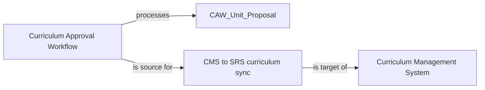

---
proposal_template:
  name: Higher education change proposal
  # The metamodel this template is typed in, by its identifier: the Higher Education EA Metamodel.
  metamodel: mm_9mqjcx2s4h8y5cx0
  description: >-
    A change described in the higher-education metamodel's own types: one Elements table with a
    Type column, one Relationships table, a diagram, decisions and open points.
---

# Proposal: <title of the change>

> **How to use this template.** Fill in every section. Keep one row per
> element and one row per relationship; the tables are what the repository
> reads. Where an element already exists, put its identifier in the
> *Existing id* column and leave the description short; where it is new,
> describe it in at least one full sentence. Delete this note before sharing.

| | |
| --- | --- |
| **Work package** | `WP-…` (an existing work package id) or the name of a new one |
| **Proposed by** | name, role |
| **Date** | YYYY-MM-DD |
| **Status of this proposal** | draft · for review · approved |
| **Branch** | leave blank; the repository names it when the proposal is applied |

## Summary

Two to five sentences: what changes, for whom, and why now. Name the
capabilities or business outcomes served.

## Elements

One row per element the change touches, the context first: the capability,
goal or driver the change serves, then the business it changes, then the
applications, data and technology. *Type* is a type of the metamodel (for
example Capability, Data Entity, Physical Application Component, Integration,
Position). Leave the states blank on an element the change only relies on. *Current state* is one of `proposed`, `planned`,
`in_implementation`, `live`, `retired`, `non_existent`. *Target state* is one
of `keep`, `new`, `change`, `decommission`, `merge`, `undecided`.

| Type | Name | Existing id | Description | Current state | Target state |
| ---- | ---- | ----------- | ----------- | ------------- | ------------ |
| Capability | Curriculum Development | CAP-CURR-DEV | | | |
| Physical Application Component | Curriculum Approval Workflow | | A workflow application in which academic staff draft, review and approve new units and courses before they are published. | proposed | new |
| Data Entity | CAW_Unit_Proposal | | The record of a proposed unit as it moves through approval, with its outline, learning outcomes and assessment plan. | proposed | new |
| Physical Application Component | Curriculum Management System | PAC-CMS | | live | change |
| Integration | CMS to SRS curriculum sync | INT-CMS-SRS | | live | keep |
| Physical Technology Component | Legacy forms server | | The on-premises forms server that hosts the current paper-like approval forms. | live | decommission |

## Relationships

One row per relationship. *Relationship* is a relationship name of the
metamodel (for example `processes`, `realises`, `is source for`,
`is target of`, `owns`, `stores`). Refer to elements by name as written above
or by identifier.

| Source | Relationship | Target | Note |
| ------ | ------------ | ------ | ---- |
| Curriculum Approval Workflow | processes | CAW_Unit_Proposal | |
| Curriculum Approval Workflow | is source for | CMS to SRS curriculum sync | approved units flow into the existing sync |
| Curriculum Management System | is target of | CMS to SRS curriculum sync | unchanged |
| Curriculum Approval Workflow | realises | Curriculum Development | |
| Manager, Curriculum Systems | owns | Curriculum Approval Workflow | POS-CURR-MGR |
| Lakehouse Platform | stores | CAW_Unit_Proposal | reporting copy |

## Diagram (optional)

A Mermaid diagram of the change. Use the element names from the table so the
repository can match them.

## Decisions and assumptions

- Decision: the workflow replaces the forms server; no parallel run beyond one
  teaching period.
- Assumption: unit proposals remain the system of record in the workflow until
  approval, then in the curriculum management system.

## Open points

- Who is the data steward of CAW_Unit_Proposal?
- Does the reporting copy in the lakehouse need a retention rule?
